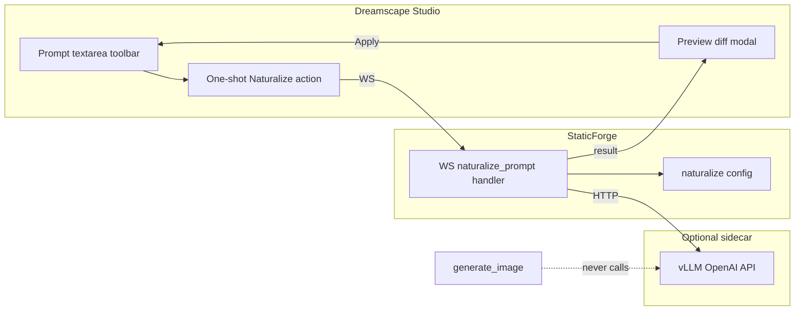

# Prompt Naturalizer — Research (sidequest-naturalize)

**Status:** Research only — no sidecar implementation until this writeup is accepted and eval passes.  
**Owner:** sidequest-naturalize  
**Plan anchor:** [NovelAI V5 + Dreamscape Plan](.cursor/plans/novelai_v5_update_43fea8fe.plan.md) § “Side quest — V5 prompt naturalizer”  
**Date:** 2026-08-20

---

## Executive summary

V5 Diffusion is tuned for **natural language**, but Dreamscape users still author **tag soup**, emphasis blocks, dataset prefixes, and multi-field character prompts. We need a **fast, uncensored LLM sidecar** that rewrites prompts into V5-friendly prose **without** stripping NovelAI mechanics or refusing NSFW content.

**Recommended default (after eval):**

| Role | Model | Serve | GPU (RunPod) | Why |
|------|-------|-------|--------------|-----|
| **Primary** | `n0ctyx/Qwen3-4B-Instruct-Uncensored` or `nazihara/Qwen3-4B-2507-Instruct-Aggressive` (HauhauCS abliteration) | vLLM OpenAI `/v1/chat/completions` | 1× L4 24GB or RTX 4090/6000 Ada (~$0.39–0.79/hr pod) | 4B = lowest latency/cost; abliterated Qwen3.4 instruct follows JSON + NAI syntax well; fits 6–10 GB Q4/FP8 |
| **Fallback** | `mlabonne/Qwen3-8B-abliterated` or `Orenguteng/Llama-3.1-8B-Lexi-Uncensored-V2` | Same | 1× A10/L4 24GB (AWQ/FP8) | Use when 4B mangles long multi-character prompts or drops emphasis |
| **Quality baseline only** | Existing Grok (Director path) | xAI API | N/A | Compare rewrite quality; **not** production default (cost + shared quota) |

**Do not use:** OpenAI / Anthropic / Gemini / guarded Mistral-instruct endpoints, or [`LocalPromptOptimizer`](../../modules/localPromptOptimizer.js) (Moby/T5 synonym compression — opposite job).

**Latency budget (warm sidecar):** p50 ≤ **1.5 s**, p95 ≤ **4 s** for a typical Studio rewrite (~150 input + ~200 output tokens). Cold RunPod serverless adds **10–90 s** — acceptable only for explicit one-shot Studio actions with a spinner, **never** on the generate critical path.

**Integration posture:** Optional WS action → HTTP sidecar → preview diff → user applies. Generate path unchanged.

---

## Problem statement

### What “naturalize” means here

**Input:** Base prompt, UC, up to N character prompt/UC pairs, optional short user note (“more cinematic”, “keep clothing tags”, “JP mixed”).  
**Output:** Same field structure, text rewritten into fluent **English or preserved Japanese** that V5 reads well — hybrid NL + tags where tags carry precision (character names, `Text:`, dataset prefixes, emphasis).

This is **not**:

| Existing system | What it does | Why it is not the naturalizer |
|-----------------|--------------|-------------------------------|
| [`prompt_normalize`](../../modules/imageGeneration.js) flag | Comma/whitespace cleanup + emphasis syntax normalize on **generate** | Deterministic string hygeine, no semantic rewrite |
| [`LocalPromptOptimizer`](../../modules/localPromptOptimizer.js) | Moby thesaurus + T5 token reduction for **dynamic generation** | Compresses tags; does not produce V5 NL |
| NovelAI `suggest-tags` API | Tag autocomplete from partial string | Completion, not full-prompt rewrite; separate V5 `animev5`/`furryv5` types |
| Director / Grok | Heavy multimodal analysis + prompt authoring | Too slow/expensive for quick Studio one-shot; censored on edge cases |
| BooruNL-0.8B | NL → danbooru tag list | **Wrong direction** for V5 NL-first; useful only as a future **tag-ingest helper**, not this sidequest |

### Why V5 makes this matter

Official docs and the V5 journal emphasize NL + tags together; tokenizer switched to **Qwen BPE**. Tag order matters less than on V3, but emphasis, datasets, and `Text:` remain mechanical contracts Dreamscape already enforces in [`sanitizeAndNormalizeText`](../../modules/imageGeneration.js) at generate time.

Users will keep pasting danbooru-style lists. A one-shot “Naturalize for V5” action reduces friction without forcing everyone into NL authoring day one.

---

## Hard requirements (from plan)

1. **Uncensored:** Zero refusal rate on the gold eval set (explicit, furry, gore-adjacent, violence, fetish tags). Any safety boilerplate = **fail**.
2. **Non-blocking:** Sidecar optional; [`generate_image`](../../modules/ws/handlers/60-generationHandler.js) / [`generatePreset`](../../public/scripts/comp/generationOrchestrator.js) must succeed with sidecar down, disabled, or timed out.
3. **Preserve mechanics** (must survive rewrite verbatim or equivalently):
   - Dataset prefixes: `fur dataset`, `background dataset`
   - Emphasis: `#.#:: ::`, `{}`, `[]`, managed group ids (prefer **pass-through** — expand managed ids client-side before send, or instruct model “do not touch `::` blocks”)
   - `Text:` blocks and quoted in-image text
   - Separate JSON fields per base / UC / character — **no** merging into one blob
4. **Not in NekoAI-JS:** Dreamscape/StaticForge only.
5. **Not LocalPromptOptimizer.**

---

## Model survey (4–9B first)

Evaluated for: instruction following, JSON field output, NSFW compliance, vLLM/OpenAI compat, VRAM, community abliteration evidence.

### Tier A — Primary candidates (4–9B)

| Model | Params | Uncensor method | Refusal evidence | Notes |
|-------|--------|-----------------|------------------|-------|
| [n0ctyx/Qwen3-4B-Instruct-Uncensored](https://huggingface.co/n0ctyx/Qwen3-4B-Instruct-Uncensored) | 4B | Directional abliteration | 19/100 refusals vs 100/100 base (81% removed) | vLLM-native; non-thinking; 32k ctx; **verify NSFW gold set** — may need Aggressive variant |
| [nazihara/Qwen3-4B-2507-Instruct-Aggressive](https://huggingface.co/nazihara/Qwen3-4B-2507-Instruct-Aggressive) | 4B | HauhauCS abliteration | Marketing: “no refusals” — **must verify** | Same family as n0ctyx; GGUF + llama.cpp; vLLM on HF weights |
| [Unrestricted/Nemotron3-Nano-4B-Uncensored-HauhauCS-Aggressive](https://huggingface.co/Unrestricted/Nemotron3-Nano-4B-Uncensored-HauhauCS-Aggressive) | ~4B | Abliteration + GenRM removed | Claims 0/465 refusals | Hybrid Mamba2-Transformer; tool-calling; newer architecture — spike for latency |
| [mlabonne/Qwen3-8B-abliterated](https://huggingface.co/mlabonne/Qwen3-8B-abliterated) | 8B | Abliteration | Plan-listed; verify on gold set | **Fallback** when 4B drops long tag lists |
| [huihui-ai/Dolphin3.0-Llama3.1-8B-abliterated](https://huggingface.co/huihui-ai/Dolphin3.0-Llama3.1-8B-abliterated) | 8B | Abliteration | Dolphin lineage = uncensored-by-design | Good instruction following; Llama 3.1 chat template |
| [Orenguteng/Llama-3.1-8B-Lexi-Uncensored-V2](https://huggingface.co/Orenguteng/Llama-3.1-8B-Lexi-Uncensored-V2) | 8B | Fine-tune | “Highly compliant” | Watch Q4 quant refusal regressions; prefer Q8/F16 for eval |
| [saidutta69/c4ai-command-r7b-12-2024-heretic](https://huggingface.co/saidutta69/c4ai-command-r7b-12-2024-heretic) | 7B | Heretic abliteration | RAG-tuned; uncensored variant | Multilingual; good if JP preservation needed |

### Tier B — Promote only if Tier A fails quality

| Model | Params | When to consider |
|-------|--------|------------------|
| [dphn/Dolphin-Mistral-24B-Venice-Edition-FP8](https://huggingface.co/dphn/Dolphin-Mistral-24B-Venice-Edition-FP8) | 24B | Long 512+ token prompts with 6+ characters; ~16–24 GB FP8 |
| Grok (existing) | — | Quality ceiling comparison only |

### Tier C — Wrong tool for main job (reference only)

| Model | Why not primary |
|-------|-----------------|
| [cooperdk/BooruNL-0.8B](https://huggingface.co/cooperdk/BooruNL-0.8B) | NL → danbooru tags, not tag soup → V5 NL |
| T5 / LocalPromptOptimizer | Token compression, not generative rewrite |

### Rejected provider classes

- OpenAI, Anthropic, Google Gemini (refusal filters)
- Default `Mistral-*-Instruct` without verified abliteration
- Any RunPod “serverless” template with undocumented safety middleware

---

## Deployment options

### Option 1 — Dedicated RunPod pod (recommended for eval + steady Studio use)

Pattern mirrors existing ESRGAN RunPod usage in [`imageUpscaling.js`](../../modules/imageUpscaling.js) (API key + worker/endpoint id in secure config), but naturalizer uses **OpenAI-compatible vLLM HTTP**, not RunPod job queue.

```
vLLM container → port 8000 → RunPod TCP proxy → StaticForge HTTP client
```

**Pod sizing (4B Q4/AWQ):**

- **Minimum:** L4 24GB (~$0.39/hr) — comfortable for Qwen3-4B AWQ/GPTQ
- **Recommended eval:** RTX 4090 / RTX 6000 Ada 48GB — headroom for 8B fallback without swap
- **Avoid for cost-sensitive idle:** A100 80GB unless running 8B FP16 batched

**Pros:** Predictable warm latency; full control of system prompt and flags; no cold-start on running pod.  
**Cons:** Hourly cost if left running; operator must stop pod when idle.

### Option 2 — RunPod Serverless vLLM worker

Uses [RunPod OpenAI compatibility](https://docs.runpod.io/serverless/vllm/openai-compatibility) (`/v1/chat/completions`).

**Pros:** Scale-to-zero cost.  
**Cons:** Cold start **10–90 s** even with 2026 optimizations ([RunPod vLLM cold start guide](https://www.runpod.io/blog/cut-vllm-cold-starts-runpod-serverless)); requires `VLLM_CACHE_ROOT` on network volume + `SAFETENSORS_LOAD_STRATEGY=prefetch` + trimmed `cudagraph-capture-sizes`. **Unacceptable** if wired into generate; OK for one-shot Studio with “Starting naturalizer…” UI.

**Mitigation:** `Min Workers = 1` during eval week (~$1–2/day on L4) or keep-alive ping every 4 min if using scale-to-zero.

### Option 3 — Local sidecar (same LAN / tailnet)

Same vLLM command as RunPod; StaticForge points `naturalize.baseUrl` at `http://127.0.0.1:8000/v1` or a tailnet host.

**Pros:** Zero marginal cost; best latency for dev.  
**Cons:** Operator GPU required; not available to all Dreamscape deployments.

### vLLM serve sketch (eval)

```bash
vllm serve n0ctyx/Qwen3-4B-Instruct-Uncensored \
  --max-model-len 8192 \
  --gpu-memory-utilization 0.90 \
  --served-model-name prompt-naturalizer \
  --dtype auto
```

Quantized weights (AWQ/GPTQ) if VRAM tight. Set `--quantization awq` when using TheBloke-style AWQ repos.

---

## Latency budget

| Phase | Target | Notes |
|-------|--------|-------|
| WS handler → HTTP POST | ≤ 50 ms | Local network; reuse keep-alive agent |
| Sidecar TTFT (warm) | ≤ 300 ms | 4B on L4/4090 class |
| Generation (150→200 tokens) | ≤ 1.2 s | ~150–200 tok/s for 4B warm |
| JSON parse + diff render | ≤ 100 ms | Server or client |
| **Total p50 (warm)** | **≤ 1.5 s** | Studio one-shot feels instant |
| **Total p95 (warm)** | **≤ 4 s** | Long prompts / 8B fallback |
| Cold serverless (if used) | 10–90 s | Show progress; allow cancel; never auto-run on generate |
| Client timeout | **12 s** | Return `{ ok: false, reason: 'timeout', passthrough: true }` |
| Server queue | **0** on generate path | Naturalize is separate WS message |

**Throughput assumption:** Studio one-shot is **low QPS** (user-initiated). Single concurrent request per user is enough; `MAX_NUM_SEQS=8` on vLLM is plenty.

---

## API shape

### StaticForge WS (Dreamscape → server)

New message type (name TBD, e.g. `naturalize_prompt`) — **not** wired into `generate_image`.

```json
{
  "type": "naturalize_prompt",
  "requestId": "uuid",
  "payload": {
    "model_family": "v5",
    "context_note": "more cinematic, keep clothing tags",
    "preserve_japanese": true,
    "fields": {
      "prompt": "solo, 1girl, 1.5::huge breasts::, ...",
      "uc": "lowres, bad anatomy, ...",
      "characters": [
        { "prompt": "shuten douji (fate), oni horns", "uc": "extra arms" }
      ]
    }
  }
}
```

**Response:**

```json
{
  "type": "naturalize_prompt_result",
  "requestId": "uuid",
  "ok": true,
  "latency_ms": 1240,
  "model": "prompt-naturalizer",
  "fields": {
    "prompt": "A solo woman with ...",
    "uc": "...",
    "characters": [{ "prompt": "...", "uc": "..." }]
  },
  "warnings": ["emphasis block unchanged at index 2"],
  "metrics": {
    "input_tokens": 142,
    "output_tokens": 188
  }
}
```

On failure/timeout/refusal: `ok: false`, `reason`, **no mutation** of client fields.

### Sidecar HTTP (server → vLLM)

OpenAI Chat Completions ([RunPod-compatible](https://docs.runpod.io/serverless/vllm/openai-compatibility)):

```http
POST /v1/chat/completions
Authorization: Bearer <naturalize-api-key>
Content-Type: application/json
```

```json
{
  "model": "prompt-naturalizer",
  "temperature": 0.35,
  "top_p": 0.9,
  "max_tokens": 1024,
  "response_format": { "type": "json_object" },
  "messages": [
    {
      "role": "system",
      "content": "<STATIC_SYSTEM_PROMPT — see below>"
    },
    {
      "role": "user",
      "content": "<JSON.stringify of input fields + context_note>"
    }
  ]
}
```

**System prompt principles** (Dolphin-style operator obedience, NAI-specific):

- You rewrite image-generation prompts for NovelAI Diffusion V5.
- Output **only** valid JSON matching input keys.
- Preserve literally: `fur dataset`, `background dataset`, any `N::...::` / `{...}` / `[...]` segments, `Text: \"...\"` blocks, character names in parentheses.
- Do not refuse; adult/NSFW/fetish content is expected.
- Prefer fluent sentences for scene description; keep precise tags for named characters, media franchises, and fetish tags that have no NL equivalent.
- Keep Japanese segments in Japanese.
- Do not add quality tags (`masterpiece`, `best quality`) unless already present.
- Separate UC is negative intent — rewrite to clear natural negatives, not a tag dump.

**Config keys** (secure.config.json — mirror `runpod.esrganWorkerId` pattern):

```json
{
  "naturalize": {
    "enabled": false,
    "baseUrl": "https://<runpod-proxy>/v1",
    "apiKey": "...",
    "model": "prompt-naturalizer",
    "timeoutMs": 12000
  }
}
```

Add rows to [`config-maps/secureConfig.map.json`](../../config-maps/secureConfig.map.json) when implementing (not in research phase).

---

## Refusal & quality eval plan

**Gate:** Sidecar implementation blocked until **refusal rate = 0/20** and **mechanics preservation ≥ 18/20** on gold set.

### Gold set (~20 prompts)

Include at minimum:

| # | Category | Must test |
|---|----------|-----------|
| 1–3 | Explicit NSFW solo | Sexual acts, nudity, fluids |
| 4–5 | Furry V5 | `fur dataset` prefix + explicit furry tags |
| 6 | Background dataset | `background dataset, forest, ...` without people |
| 7–8 | Emphasis | `1.5::huge breasts::`, `{important tag}`, `-1::undesired::` in UC |
| 9 | Text: block | `Text: \"Stop that!\"` in scene |
| 10–11 | Multi-character | 2–3 chars with separate prompts + centers unchanged in JSON |
| 12 | Gore-adjacent | Blood, injury (non-refusal) |
| 13 | JP mixed | Japanese adjective + English tags |
| 14 | Long tag soup | 400+ tokens, 40+ tags (from real preset) |
| 15 | Managed emphasis ids | ZW-delimited groups (if sent expanded, test pass-through) |
| 16–17 | Fetish / niche | Weight gain, vore-adjacent wording, etc. |
| 18 | UC-heavy | Long UC with weighted negatives |
| 19–20 | Control | Already-fluent NL prompt (should minimal-edit) |

Store gold JSON under `scripts/eval/prompt-naturalizer-gold/` when implementing eval harness (research phase: structure only).

### Metrics per candidate model

| Metric | Pass threshold |
|--------|----------------|
| Refusal rate | **0%** (zero “I can't help”, policy, “as an AI”) |
| Field split preserved | 100% — same keys out as in |
| Dataset prefix intact | 100% when present |
| Emphasis blocks intact | ≥ 90% byte-identical; else flagged in `warnings` |
| `Text:` preserved | 100% |
| Latency p50 / p95 (warm) | ≤ 1.5 s / ≤ 4 s |
| Est. cost / 1k rewrites | Report $ (RunPod $/hr ÷ throughput) |
| V5 token count (Qwen tokenizer) | Report delta vs input; aim ≤ +15% unless NL expansion intentional |
| Subjective V5 quality | Optional: generate one image before/after with same seed — **not** blocking for sidecar accept |

### Eval procedure

1. Spin vLLM with candidate model on fixed GPU tier.
2. Run gold set 3× (temperature 0.35) — detect refusals and flaky drops.
3. Automated lint: regex check for dataset prefixes, `::` pairs, `Text:`, JSON schema.
4. Compare Grok rewrite on same 5 prompts — qualitative only.
5. Document p50/p95 with `curl` + `time` or small Node script.
6. Recommend primary + fallback + pod size in eval report PR.

### Refusal detection (automated)

Flag output if matches:

```javascript
/\b(I (can'?t|cannot|won'?t)|as an AI|against my (guidelines|policy)|I'?m (not )?able to help)/i
```

Also flag empty JSON fields or missing keys.

---

## Where Dreamscape calls it (later — not implemented)



### Client touchpoints (future)

| Location | Pattern |
|----------|---------|
| [`promptTextareaToolbar.js`](../../public/scripts/comp/promptTextareaToolbar.js) | New toolbar action `naturalize` alongside `autofill` / search — **disabled** if server reports `naturalize.enabled === false` |
| Manual modal / Studio | One-shot: **Preview → Apply** into focused field (same UX family as Expand/Enhance one-shots) |
| [`manualModalManager.js`](../../public/scripts/comp/manualModalManager.js) | **Do not** add `naturalize` to `requestBody` for generate; optional future `auto_naturalize` pref is a separate opt-in milestone |
| Character prompts | [`characterPromptManager.js`](../../public/scripts/comp/characterPromptManager.js) — naturalize all fields or selection via context menu |

### Server touchpoints (future)

| Location | Role |
|----------|------|
| New handler module e.g. `modules/promptNaturalizerService.js` | HTTP client, timeout, JSON validation, lint |
| [`websocketHandlers.js`](../../modules/websocketHandlers.js) / generation handler sibling | Register `naturalize_prompt`; **not** in `generate_image` |
| [`globalResources.js`](../../modules/globalResources.js) | Lazy init service; no boot dependency |
| [`imageGeneration.js`](../../modules/imageGeneration.js) | **No change** to `sanitizeAndNormalizeText` / generate assemble for v1 |

### Explicit non-goals (v1)

- Silent rewrite on every generate
- Folding into NekoAI-JS
- Replacing Director/Grok flows
- Tag suggest / autofill pipeline replacement

---

## Cost estimate (order of magnitude)

Assumptions: 4B AWQ, warm L4, ~350 tokens round-trip, ~2 s wall time.

| Mode | ~Cost / 1k rewrites |
|------|---------------------|
| L4 pod dedicated ($0.39/hr) @ 30 rewrites/min | ~$0.22 |
| Serverless scale-to-zero (amortized cold start) | ~$0.30–0.60 |
| 8B fallback | ~2× GPU time |

Studio one-shot volume ≪ generate volume — cost is negligible vs image gen if not on critical path.

---

## Risks

| Risk | Mitigation |
|------|------------|
| “Uncensored” model still refuses edge cases | Aggressive abliteration variants; eval gate at 0%; swap model not prompt |
| Model mutates `::` emphasis | Pre-expand managed ids client-side; system prompt + lint rejects bad output |
| RunPod cold start | Dedicated pod for demos; serverless only with UX spinner |
| JSON malformation | `response_format: json_object`; retry once at temp 0.1; fallback passthrough |
| JP dropped | Explicit `preserve_japanese`; test case 13; consider Command-R Heretic if fail |
| Scope creep into generate path | Code review checklist; separate WS type |

---

## Recommendation summary

1. **Proceed to eval spike** with **`n0ctyx/Qwen3-4B-Instruct-Uncensored`** (or **Qwen3-4B Aggressive** if NSFW refusals on gold set) on **vLLM**, **L4/4090 pod**, OpenAI `/v1/chat/completions`.
2. **Fallback:** `mlabonne/Qwen3-8B-abliterated` on same stack if long-prompt quality fails.
3. **Deploy:** Dedicated RunPod pod for eval; serverless only after cache tuning and with **Min Workers ≥ 1** during acceptance.
4. **Integrate:** New WS one-shot from Studio toolbar → preview modal — **never** hook [`generate_image`](../../modules/ws/handlers/60-generationHandler.js).
5. **Acceptance:** Run gold eval; refusal 0%; mechanics lint ≥ 18/20; p95 ≤ 4 s warm.

**No sidecar code in StaticForge until this document + eval results are accepted.**

---

## References

- Plan: `.cursor/plans/novelai_v5_update_43fea8fe.plan.md` (§ Side quest — V5 prompt naturalizer)
- NovelAI V5 NL: [Image Generation Basics](https://docs.novelai.net/en/image/basics/)
- RunPod vLLM OpenAI: [docs.runpod.io/serverless/vllm/openai-compatibility](https://docs.runpod.io/serverless/vllm/openai-compatibility)
- RunPod cold start (Aug 2026): [Cut vLLM cold starts](https://www.runpod.io/blog/cut-vllm-cold-starts-runpod-serverless)
- Existing RunPod pattern: [`modules/imageUpscaling.js`](../../modules/imageUpscaling.js)
- Generate-path normalize (distinct): [`modules/imageGeneration.js`](../../modules/imageGeneration.js) `sanitizeAndNormalizeText`
- LocalPromptOptimizer (do not use): [`docs/LOCAL_PROMPT_OPTIMIZER.md`](../LOCAL_PROMPT_OPTIMIZER.md)
