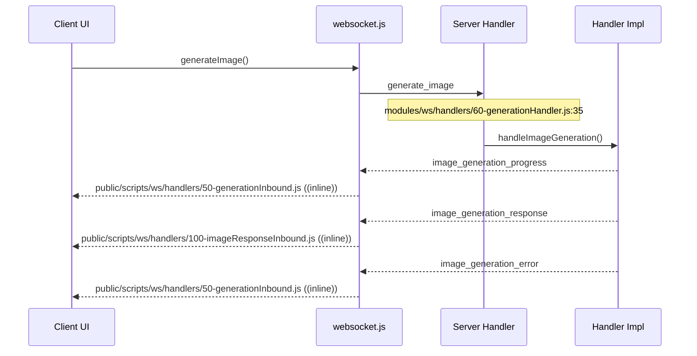
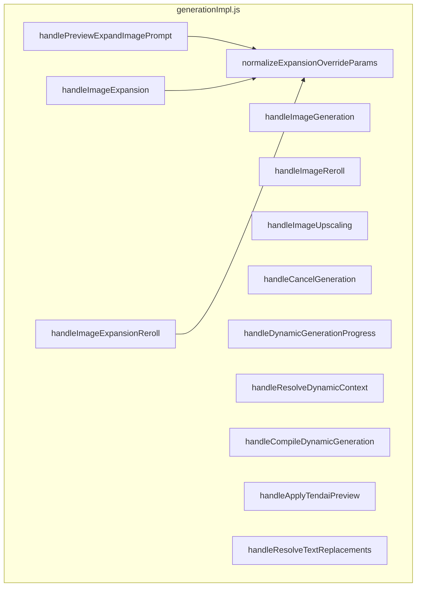

# Flow Map: Image Generation

> Auto-generated by `node scripts/tools/flow-map.js pipeline generate_image`
> Scanned: static analysis (regex/heuristic) — not runtime traced.

## WebSocket Round-Trip

## Server Handler

| Field | Value |
| --- | --- |
| Packet | `generate_image` |
| Owner | `generation` |
| File | `modules/ws/handlers/60-generationHandler.js:35` |
| Function | `handleImageGeneration` |
| Impl | `modules/ws/handlers/generationImpl.js` |

## Client Callers

| File | Function | Line |
| --- | --- | --- |
| `public/scripts/websocket.js` | `generateImage` | 5009 |

## Client Inbound Handlers

| Type | File | Handler | Phase |
| --- | --- | --- | --- |
| `image_generation_response` | `public/scripts/ws/handlers/100-imageResponseInbound.js` | `(inline)` | only |
| `image_generation_progress` | `public/scripts/ws/handlers/50-generationInbound.js` | `(inline)` | only |
| `image_generation_error` | `public/scripts/ws/handlers/50-generationInbound.js` | `(inline)` | only |

## Server Impl Call Graph

## Limitations

- Static scan only; dynamic `sendMessage(type)` and runtime-registered handlers may be missed.
- Cross-file JavaScript calls are not fully resolved.
- Re-run `pnpm flow-map pipeline <name>` after handler changes.
