# Deep Flow Map: generateImage

> `public/scripts/comp/generationOrchestrator.js:162` (client)
> Generated: `2026-06-28T00:27:22.548Z`

## Summary

| Metric | Value |
| --- | --- |
| Total nodes | 11021 |
| Max depth | 24 |
| Leaves | 86 |
| External | 7260 |
| WS boundaries | 33 |
| Callback boundaries | 30 |

## Call Tree

```mermaid
flowchart TD
    classDef leafNode fill:#2d5016,stroke:#6abf4b,color:#fff
    classDef extNode fill:#4a3728,stroke:#c9a66b,color:#fff
    classDef wsNode fill:#1a3a5c,stroke:#5ba3d9,color:#fff
    classDef cbNode fill:#3d2a5c,stroke:#a67bd9,color:#fff
    classDef cycleNode fill:#5c2a2a,stroke:#d97b7b,color:#fff
    classDef refNode fill:#3a3a3a,stroke:#888,color:#fff
    classDef depthNode fill:#5c4a2a,stroke:#d9b67b,color:#fff
    n0["generateImage<br/><small>generationOrchestrator.js:162</small>"]
    n1["closeSubMenu [external]"]
    class n1 extNode
    n0 --> n1
    n2["showGlassToast [external]"]
    class n2 extNode
    n0 --> n2
    n3["updateManualGenerateBtnState [external]"]
    class n3 extNode
    n0 --> n3
    n4["showError [external]"]
    class n4 extNode
    n0 --> n4
    n5["selectedValue.startsWith [external]"]
    class n5 extNode
    n0 --> n5
    n6["showError [external]"]
    class n6 extNode
    n0 --> n6
    n7["replace<br/><small>configManager.js:179 — selectedValue.replace</small>"]
    n0 --> n7
    n8["_getValueByPath<br/><small>configManager.js:2010 — this.configManager._getValueByPath</small>"]
    n7 --> n8
    n9["Array.isArray [external]"]
    class n9 extNode
    n8 --> n9
    n10["keyPath.split [external]"]
    class n10 extNode
    n8 --> n10
    n11["Array.isArray [external]"]
    class n11 extNode
    n7 --> n11
    n12["Error [external]"]
    class n12 extNode
    n7 --> n12
    n13["array.findIndex [external]"]
    class n13 extNode
    n7 --> n13
    n14["Number.isInteger [external]"]
    class n14 extNode
    n7 --> n14
    n15["Error [external]"]
    class n15 extNode
    n7 --> n15
    n16["this.configManager.modifyConfig [external]"]
    class n16 extNode
    n7 --> n16
    n17["document.getElementById [external]"]
    class n17 extNode
    n0 --> n17
    n18["parseInt [external]"]
    class n18 extNode
    n0 --> n18
    n19["showCreditCostDialog [external]"]
    class n19 extNode
    n0 --> n19
    n20["document.getElementById [external]"]
    class n20 extNode
    n0 --> n20
    n21["(expr).classList.contains [external]"]
    class n21 extNode
    n0 --> n21
    n22["showGlassToast [external]"]
    class n22 extNode
    n0 --> n22
    n23["updateGlassToastProgress [external]"]
    class n23 extNode
    n0 --> n23
    n24["setInterval [external]"]
    class n24 extNode
    n0 --> n24
    n25["showManualLoading [external]"]
    class n25 extNode
    n0 --> n25
    n26["generatePreset<br/><small>websocket.js:5286 — window.wsClient.generatePreset</small>"]
    n0 --> n26
    n27["generateRequestId<br/><small>websocket.js:6351 — this.generateRequestId</small>"]
    n26 --> n27
    n28["Date.now [external]"]
    class n28 extNode
    n27 --> n28
    n29["Math.random [external]"]
    class n29 extNode
    n27 --> n29
    n30["(expr).toString [external]"]
    class n30 extNode
    n27 --> n30
    n31["(expr).substr [external]"]
    class n31 extNode
    n27 --> n31
    n32["_attachStepPreviewDimensions<br/><small>websocket.js:4175 — this._attachStepPreviewDimensions</small>"]
    n26 --> n32
    n33["getSpellbookStepPreviewDimensions [external]"]
    class n33 extNode
    n32 --> n33
    n34["getManualModalStepPreviewDimensions [external]"]
    class n34 extNode
    n32 --> n34
    n35["Math.round [external]"]
    class n35 extNode
    n32 --> n35
    n36["Math.round [external]"]
    class n36 extNode
    n32 --> n36
    n37["beginStreamingStepSession<br/><small>websocket.js:4145 — this.beginStreamingStepSession</small>"]
    n26 --> n37
    n38["endStreamingStepSession<br/><small>websocket.js:4434 — this.endStreamingStepSession</small>"]
    n37 --> n38
    n39["_disposeStreamingStepSession<br/><small>websocket.js:4123 — this._disposeStreamingStepSession</small>"]
    n38 --> n39
    n40["session.displayDelayWake [external]"]
    class n40 extNode
    n39 --> n40
    n41["releaseDataImageSrc<br/><small>websocket.js:3971 — this.releaseDataImageSrc</small>"]
    n39 --> n41
    n42["img.src.startsWith [external]"]
    class n42 extNode
    n41 --> n42
    n43["img.removeAttribute [external]"]
    class n43 extNode
    n41 --> n43
    n44["remove<br/><small>dataPlumbing.js:462 — session.crossfadeOverlay.remove</small>"]
    n39 --> n44
    n45["delete<br/><small>configManager.js:30 — this.data.delete</small>"]
    n44 --> n45
    n8["_getValueByPath [ref]<br/><small>configManager.js:2010 — this.configManager._getValueByPath</small>"]
    class n8 refNode
    n45 --> n8
    n46["Array.isArray [external]"]
    class n46 extNode
    n45 --> n46
    n47["Error [external]"]
    class n47 extNode
    n45 --> n47
    n48["predicateOrIndex [external]"]
    class n48 extNode
    n45 --> n48
    n49["array.filter [external]"]
    class n49 extNode
    n45 --> n49
    n50["_setValueByPath<br/><small>configManager.js:2028 — this.configManager._setValueByPath</small>"]
    n45 --> n50
    n9["Array.isArray [external]"]
    class n9 extNode
    n50 --> n9
    n10["keyPath.split [external]"]
    class n10 extNode
    n50 --> n10
    n51["Number.isInteger [external]"]
    class n51 extNode
    n45 --> n51
    n52["array.splice [external]"]
    class n52 extNode
    n45 --> n52
    n53["Error [external]"]
    class n53 extNode
    n45 --> n53
    n54["Array.isArray [external]"]
    class n54 extNode
    n45 --> n54
    n55["keyPath.split [external]"]
    class n55 extNode
    n45 --> n55
    n16["this.configManager.modifyConfig [external]"]
    class n16 extNode
    n45 --> n16
    n45["delete [ref]<br/><small>configManager.js:30 — this.metadata.delete</small>"]
    class n45 refNode
    n44 --> n45
    n45["delete [ref]<br/><small>configManager.js:30 — this.usageCounts.delete</small>"]
    class n45 refNode
    n44 --> n45
    n56["releaseStreamingStepPrefetch<br/><small>websocket.js:4423 — this.releaseStreamingStepPrefetch</small>"]
    n39 --> n56
    n57["prefetch.blobUrl.startsWith [external]"]
    class n57 extNode
    n56 --> n57
    n58["URL.revokeObjectURL [external]"]
    class n58 extNode
    n56 --> n58
    n59["Array.isArray [external]"]
    class n59 extNode
    n39 --> n59
    n60["endOne<br/><small>websocket.js:4437 — endOne</small>"]
    n38 --> n60
    n39["_disposeStreamingStepSession [ref]<br/><small>websocket.js:4123 — this._disposeStreamingStepSession</small>"]
    class n39 refNode
    n60 --> n39
    n61["Object.keys [external]"]
    class n61 extNode
    n38 --> n61
    n62["(expr).forEach [external]"]
    class n62 extNode
    n38 --> n62
    n63["releaseStreamingPreviewDataUrls<br/><small>websocket.js:4048 — this.releaseStreamingPreviewDataUrls</small>"]
    n38 --> n63
    n64["document.getElementById [external]"]
    class n64 extNode
    n63 --> n64
    n41["releaseDataImageSrc [ref]<br/><small>websocket.js:3971 — this.releaseDataImageSrc</small>"]
    class n41 refNode
    n63 --> n41
    n41["releaseDataImageSrc [ref]<br/><small>websocket.js:3971 — this.releaseDataImageSrc</small>"]
    class n41 refNode
    n63 --> n41
    n65["_createEmptyStreamingStepSession [leaf]<br/><small>websocket.js:4105 — this._createEmptyStreamingStepSession</small>"]
    class n65 leafNode
    n37 --> n65
    n66["WS → generate_preset [ws_boundary]"]
    class n66 wsNode
    n26 --> n66
    n67["handleGeneratePreset<br/><small>80-presetHandler.js:499 — server:handleGeneratePreset</small>"]
    n66 --> n67
    n68["handlers.sendError [external]"]
    class n68 extNode
    n67 --> n68
    n69["handlers.globalResources.getPromptConfig [external]"]
    class n69 extNode
    n67 --> n69
    n70["handlers.sendError [external]"]
    class n70 extNode
    n67 --> n70
    n71["handlers.registerActiveGeneration [external]"]
    class n71 extNode
    n67 --> n71
    n72["handlers.globalResources.getWorkspaceManager [external]"]
    class n72 extNode
    n67 --> n72
    n73["getActiveWorkspace<br/><small>workspace.js:663 — (expr).getActiveWorkspace</small>"]
    n67 --> n73
    n74["Error [external]"]
    class n74 extNode
    n73 --> n74
    n75["this.sessionActiveWorkspaces.get [external]"]
    class n75 extNode
    n73 --> n75
    n76["console.log [external]"]
    class n76 extNode
    n67 --> n76
    n77["generateImageWebSocket<br/><small>imageGeneration.js:4525 — generateImageWebSocket</small>"]
    n67 --> n77
    n78["bindRuntimeGlobalResources [leaf]<br/><small>imageGeneration.js:9 — bindRuntimeGlobalResources</small>"]
    class n78 leafNode
    n77 --> n78
    n79["Error [external]"]
    class n79 extNode
    n77 --> n79
    n80["Error [external]"]
    class n80 extNode
    n77 --> n80
    n81["Error [external]"]
    class n81 extNode
    n77 --> n81
    n82["Date.now [external]"]
    class n82 extNode
    n77 --> n82
    n83["getTracing [leaf]<br/><small>globalResources.js:3849 — __runtimeGr.getTracing</small>"]
    class n83 leafNode
    n77 --> n83
    n84["(expr).startTrace [external]"]
    class n84 extNode
    n77 --> n84
    n83["getTracing [ref]<br/><small>globalResources.js:3849 — __runtimeGr.getTracing</small>"]
    class n83 refNode
    n77 --> n83
    n85["(expr).addEvent [external]"]
    class n85 extNode
    n77 --> n85
    n86["getNekoAiService<br/><small>globalResources.js:2659 — __runtimeGr.getNekoAiService</small>"]
    n77 --> n86
    n87["Object.prototype.hasOwnProperty.call [external]"]
    class n87 extNode
    n86 --> n87
    n88["getNovelAiClient<br/><small>globalResources.js:2824 — this.getNovelAiClient</small>"]
    n86 --> n88
    n89["createNovelAiClient<br/><small>globalResources.js:2837 — this.createNovelAiClient</small>"]
    n88 --> n89
    n90["getActiveApiKey<br/><small>apiKeyManager.js:94 — this.apiKeyManager.getActiveApiKey</small>"]
    n89 --> n90
    n91["getServiceKeys<br/><small>apiKeyManager.js:72 — this.getServiceKeys</small>"]
    n90 --> n91
    n92["getSecureConfig<br/><small>globalResources.js:408 — this.globalResources.getSecureConfig</small>"]
    n91 --> n92
    n74["Error [external]"]
    class n74 extNode
    n92 --> n74
    n93["_getReactiveConfig<br/><small>configManager.js:1284 — this.configManager._getReactiveConfig</small>"]
    n92 --> n93
    n94["Error [external]"]
    class n94 extNode
    n93 --> n94
    n95["fs.existsSync [external]"]
    class n95 extNode
    n93 --> n95
    n96["fs.statSync [external]"]
    class n96 extNode
    n93 --> n96
    n97["stats.mtime.getTime [external]"]
    class n97 extNode
    n93 --> n97
    n98["fs.readFileSync [external]"]
    class n98 extNode
    n93 --> n98
    n99["JSON.parse [external]"]
    class n99 extNode
    n93 --> n99
    n100["console.error [external]"]
    class n100 extNode
    n93 --> n100
    n8["_getValueByPath [ref]<br/><small>configManager.js:2010 — this._getValueByPath</small>"]
    class n8 refNode
    n93 --> n8
    n101["JSON.stringify [external]"]
    class n101 extNode
    n93 --> n101
    n102["JSON.parse [external]"]
    class n102 extNode
    n93 --> n102
    n103["JSON.stringify [external]"]
    class n103 extNode
    n93 --> n103
    n104["JSON.parse [external]"]
    class n104 extNode
    n93 --> n104
    n105["refreshConfig<br/><small>configManager.js:1721 — this.refreshConfig</small>"]
    n93 --> n105
    n106["_refreshError<br/><small>configManager.js:1770 — this._refreshError</small>"]
    n105 --> n106
    n107["console.error [external]"]
    class n107 extNode
    n106 --> n107
    n108["getWebSocketServer<br/><small>globalResources.js:2558 — this.globalResources.getWebSocketServer</small>"]
    n106 --> n108
    n74["Error [external]"]
    class n74 extNode
    n108 --> n74
    n109["Date.now [external]"]
    class n109 extNode
    n106 --> n109
    n110["Date [external]"]
    class n110 extNode
    n106 --> n110
    n111["(expr).toISOString [external]"]
    class n111 extNode
    n106 --> n111
    n112["wsServer.broadcast [external]"]
    class n112 extNode
    n106 --> n112
    n113["console.warn [external]"]
    class n113 extNode
    n106 --> n113
    n114["fs.existsSync [external]"]
    class n114 extNode
    n105 --> n114
    n106["_refreshError [ref]<br/><small>configManager.js:1770 — this._refreshError</small>"]
    class n106 refNode
    n105 --> n106
    n115["fs.readFileSync [external]"]
    class n115 extNode
    n105 --> n115
    n116["JSON.parse [external]"]
    class n116 extNode
    n105 --> n116
    n106["_refreshError [ref]<br/><small>configManager.js:1770 — this._refreshError</small>"]
    class n106 refNode
    n105 --> n106
    n117["_validateConfig<br/><small>configManager.js:673 — this._validateConfig</small>"]
    n105 --> n117
    n118["_getDefaultConfig [leaf]<br/><small>configManager.js:515 — this._getDefaultConfig</small>"]
    class n118 leafNode
    n117 --> n118
    n119["Object.entries [external]"]
    class n119 extNode
    n117 --> n119
    n120["push<br/><small>t5-tokenizer-standalone.js:77 — errors.push</small>"]
    n117 --> n120
    n121["has<br/><small>dataPlumbing.js:216 — node.children.has</small>"]
    n120 --> n121
    n121["has [cycle]<br/><small>dataPlumbing.js:216 — this.data.has</small>"]
    class n121 cycleNode
    n121 --> n121
    n122["TrieNode [external]"]
    class n122 extNode
    n120 --> n122
    n123["node.children.set [external]"]
    class n123 extNode
    n120 --> n123
    n124["node.children.get [external]"]
    class n124 extNode
    n120 --> n124
    n125["Array.isArray [external]"]
    class n125 extNode
    n117 --> n125
    n126["_validateNestedStructure<br/><small>configManager.js:879 — this._validateNestedStructure</small>"]
    n117 --> n126
    n127["Array.isArray [external]"]
    class n127 extNode
    n126 --> n127
    n120["push [ref]<br/><small>t5-tokenizer-standalone.js:77 — errors.push</small>"]
    class n120 refNode
    n126 --> n120
    n128["Object.entries [external]"]
    class n128 extNode
    n126 --> n128
    n120["push [ref]<br/><small>t5-tokenizer-standalone.js:77 — errors.push</small>"]
    class n120 refNode
    n126 --> n120
    n125["Array.isArray [external]"]
    class n125 extNode
    n126 --> n125
    n126["_validateNestedStructure [cycle]<br/><small>configManager.js:879 — this._validateNestedStructure</small>"]
    class n126 cycleNode
    n126 --> n126
    n120["push [ref]<br/><small>t5-tokenizer-standalone.js:77 — errors.push</small>"]
    class n120 refNode
    n126 --> n120
    n120["push [ref]<br/><small>t5-tokenizer-standalone.js:77 — errors.push</small>"]
    class n120 refNode
    n117 --> n120
    n129["Array.isArray [external]"]
    class n129 extNode
    n117 --> n129
    n120["push [ref]<br/><small>t5-tokenizer-standalone.js:77 — errors.push</small>"]
    class n120 refNode
    n117 --> n120
    n130["Array.isArray [external]"]
    class n130 extNode
    n117 --> n130
    n120["push [ref]<br/><small>t5-tokenizer-standalone.js:77 — errors.push</small>"]
    class n120 refNode
    n117 --> n120
    n131["Array.isArray [external]"]
    class n131 extNode
    n117 --> n131
    n120["push [ref]<br/><small>t5-tokenizer-standalone.js:77 — errors.push</small>"]
    class n120 refNode
    n117 --> n120
    n132["Array.isArray [external]"]
    class n132 extNode
    n117 --> n132
    n120["push [ref]<br/><small>t5-tokenizer-standalone.js:77 — errors.push</small>"]
    class n120 refNode
    n117 --> n120
    n133["Array.isArray [external]"]
    class n133 extNode
    n117 --> n133
    n120["push [ref]<br/><small>t5-tokenizer-standalone.js:77 — errors.push</small>"]
    class n120 refNode
    n117 --> n120
    n120["push [ref]<br/><small>t5-tokenizer-standalone.js:77 — errors.push</small>"]
    class n120 refNode
    n117 --> n120
    n120["push [ref]<br/><small>t5-tokenizer-standalone.js:77 — errors.push</small>"]
    class n120 refNode
    n117 --> n120
    n120["push [ref]<br/><small>t5-tokenizer-standalone.js:77 — errors.push</small>"]
    class n120 refNode
    n117 --> n120
    n134["Array.isArray [external]"]
    class n134 extNode
    n117 --> n134
    n120["push [ref]<br/><small>t5-tokenizer-standalone.js:77 — errors.push</small>"]
    class n120 refNode
    n117 --> n120
    n135["Array.isArray [external]"]
    class n135 extNode
    n117 --> n135
    n120["push [ref]<br/><small>t5-tokenizer-standalone.js:77 — errors.push</small>"]
    class n120 refNode
    n117 --> n120
    n120["push [ref]<br/><small>t5-tokenizer-standalone.js:77 — errors.push</small>"]
    class n120 refNode
    n117 --> n120
    n136["Array.isArray [external]"]
    class n136 extNode
    n117 --> n136
    n120["push [ref]<br/><small>t5-tokenizer-standalone.js:77 — errors.push</small>"]
    class n120 refNode
    n117 --> n120
    n137["Array.isArray [external]"]
    class n137 extNode
    n117 --> n137
    n120["push [ref]<br/><small>t5-tokenizer-standalone.js:77 — errors.push</small>"]
    class n120 refNode
    n117 --> n120
    n138["Array.isArray [external]"]
    class n138 extNode
    n117 --> n138
    n120["push [ref]<br/><small>t5-tokenizer-standalone.js:77 — errors.push</small>"]
    class n120 refNode
    n117 --> n120
    n120["push [ref]<br/><small>t5-tokenizer-standalone.js:77 — errors.push</small>"]
    class n120 refNode
    n117 --> n120
    n120["push [ref]<br/><small>t5-tokenizer-standalone.js:77 — errors.push</small>"]
    class n120 refNode
    n117 --> n120
    n139["Array.isArray [external]"]
    class n139 extNode
    n117 --> n139
    n120["push [ref]<br/><small>t5-tokenizer-standalone.js:77 — errors.push</small>"]
    class n120 refNode
    n117 --> n120
    n140["Array.isArray [external]"]
    class n140 extNode
    n117 --> n140
    n120["push [ref]<br/><small>t5-tokenizer-standalone.js:77 — errors.push</small>"]
    class n120 refNode
    n117 --> n120
    n141["Array.isArray [external]"]
    class n141 extNode
    n117 --> n141
    n120["push [ref]<br/><small>t5-tokenizer-standalone.js:77 — errors.push</small>"]
    class n120 refNode
    n117 --> n120
    n142["Array.isArray [external]"]
    class n142 extNode
    n117 --> n142
    n120["push [ref]<br/><small>t5-tokenizer-standalone.js:77 — errors.push</small>"]
    class n120 refNode
    n117 --> n120
    n143["Array.isArray [external]"]
    class n143 extNode
    n117 --> n143
    n120["push [ref]<br/><small>t5-tokenizer-standalone.js:77 — errors.push</small>"]
    class n120 refNode
    n117 --> n120
    n144["Array.isArray [external]"]
    class n144 extNode
    n117 --> n144
    n120["push [ref]<br/><small>t5-tokenizer-standalone.js:77 — errors.push</small>"]
    class n120 refNode
    n117 --> n120
    n145["Object.entries [external]"]
    class n145 extNode
    n117 --> n145
    n146["Array.isArray [external]"]
    class n146 extNode
    n117 --> n146
    n120["push [ref]<br/><small>t5-tokenizer-standalone.js:77 — errors.push</small>"]
    class n120 refNode
    n117 --> n120
    n147["Array.isArray [external]"]
    class n147 extNode
    n117 --> n147
    n120["push [ref]<br/><small>t5-tokenizer-standalone.js:77 — errors.push</small>"]
    class n120 refNode
    n117 --> n120
    n120["push [ref]<br/><small>t5-tokenizer-standalone.js:77 — errors.push</small>"]
    class n120 refNode
    n117 --> n120
    n120["push [ref]<br/><small>t5-tokenizer-standalone.js:77 — errors.push</small>"]
    class n120 refNode
    n117 --> n120
    n120["push [ref]<br/><small>t5-tokenizer-standalone.js:77 — errors.push</small>"]
    class n120 refNode
    n117 --> n120
    n148["value.shortcuts.forEach [external]"]
    class n148 extNode
    n117 --> n148
    n149["(expr).forEach [external]"]
    class n149 extNode
    n117 --> n149
    n150["Array.isArray [external]"]
    class n150 extNode
    n117 --> n150
    n120["push [ref]<br/><small>t5-tokenizer-standalone.js:77 — errors.push</small>"]
    class n120 refNode
    n117 --> n120
    n151["Object.entries [external]"]
    class n151 extNode
    n117 --> n151
    n152["Array.isArray [external]"]
    class n152 extNode
    n117 --> n152
    n120["push [ref]<br/><small>t5-tokenizer-standalone.js:77 — errors.push</small>"]
    class n120 refNode
    n117 --> n120
    n120["push [ref]<br/><small>t5-tokenizer-standalone.js:77 — errors.push</small>"]
    class n120 refNode
    n117 --> n120
    n120["push [ref]<br/><small>t5-tokenizer-standalone.js:77 — errors.push</small>"]
    class n120 refNode
    n117 --> n120
    n120["push [ref]<br/><small>t5-tokenizer-standalone.js:77 — errors.push</small>"]
    class n120 refNode
    n117 --> n120
    n120["push [ref]<br/><small>t5-tokenizer-standalone.js:77 — errors.push</small>"]
    class n120 refNode
    n117 --> n120
    n120["push [ref]<br/><small>t5-tokenizer-standalone.js:77 — errors.push</small>"]
    class n120 refNode
    n117 --> n120
    n120["push [ref]<br/><small>t5-tokenizer-standalone.js:77 — errors.push</small>"]
    class n120 refNode
    n117 --> n120
    n120["push [ref]<br/><small>t5-tokenizer-standalone.js:77 — errors.push</small>"]
    class n120 refNode
    n117 --> n120
    n120["push [ref]<br/><small>t5-tokenizer-standalone.js:77 — errors.push</small>"]
    class n120 refNode
    n117 --> n120
    n153["(expr).forEach [external]"]
    class n153 extNode
    n117 --> n153
    n154["validationResult.errors.join [external]"]
    class n154 extNode
    n105 --> n154
    n106["_refreshError [ref]<br/><small>configManager.js:1770 — this._refreshError</small>"]
    class n106 refNode
    n105 --> n106
    n155["fs.statSync [external]"]
    class n155 extNode
    n105 --> n155
    n156["stats.mtime.getTime [external]"]
    class n156 extNode
    n105 --> n156
    n106["_refreshError [ref]<br/><small>configManager.js:1770 — this._refreshError</small>"]
    class n106 refNode
    n105 --> n106
    n8["_getValueByPath [ref]<br/><small>configManager.js:2010 — this._getValueByPath</small>"]
    class n8 refNode
    n93 --> n8
    n157["JSON.stringify [external]"]
    class n157 extNode
    n93 --> n157
    n158["JSON.parse [external]"]
    class n158 extNode
    n93 --> n158
    n159["JSON.stringify [external]"]
    class n159 extNode
    n93 --> n159
    n160["JSON.parse [external]"]
    class n160 extNode
    n93 --> n160
    n93["_getReactiveConfig [ref]<br/><small>configManager.js:1284 — this.configManager._getReactiveConfig</small>"]
    class n93 refNode
    n92 --> n93
    n161["Array.isArray [external]"]
    class n161 extNode
    n91 --> n161
    n162["getSelectedIndex<br/><small>apiKeyManager.js:85 — this.getSelectedIndex</small>"]
    n90 --> n162
    n163["getConfig<br/><small>globalResources.js:388 — this.globalResources.getConfig</small>"]
    n162 --> n163
    n74["Error [external]"]
    class n74 extNode
    n163 --> n74
    n93["_getReactiveConfig [ref]<br/><small>configManager.js:1284 — this.configManager._getReactiveConfig</small>"]
    class n93 refNode
    n163 --> n93
    n93["_getReactiveConfig [ref]<br/><small>configManager.js:1284 — this.configManager._getReactiveConfig</small>"]
    class n93 refNode
    n163 --> n93
    n164["Number.isInteger [external]"]
    class n164 extNode
    n162 --> n164
    n165["console.warn [external]"]
    class n165 extNode
    n89 --> n165
    n163["getConfig [ref]<br/><small>globalResources.js:388 — this.getConfig</small>"]
    class n163 refNode
    n89 --> n163
    n166["nekoaijs.NovelAI [external]"]
    class n166 extNode
    n89 --> n166
    n167["setClient<br/><small>globalResources.js:2570 — this.setClient</small>"]
    n89 --> n167
    n168["this.clients.set [external]"]
    class n168 extNode
    n167 --> n168
    n45["delete [ref]<br/><small>configManager.js:30 — this.clients.delete</small>"]
    class n45 refNode
    n167 --> n45
    n169["console.error [external]"]
    class n169 extNode
    n89 --> n169
    n45["delete [ref]<br/><small>configManager.js:30 — this.clients.delete</small>"]
    class n45 refNode
    n89 --> n45
    n170["getExpandedResolution<br/><small>globalResources.js:2682 — this.getExpandedResolution</small>"]
    n86 --> n170
    n171["assign<br/><small>configManager.js:103 — Object.assign</small>"]
    n170 --> n171
    n172["this.configManager.updateConfigValue [external]"]
    class n172 extNode
    n171 --> n172
    n173["this.customResolutions.forEach [external]"]
    class n173 extNode
    n170 --> n173
    n174["body.model.toUpperCase [external]"]
    class n174 extNode
    n77 --> n174
    n175["Error [external]"]
    class n175 extNode
    n77 --> n175
    n132["Array.isArray [external]"]
    class n132 extNode
    n77 --> n132
    n176["console.log [external]"]
    class n176 extNode
    n77 --> n176
    n177["handleStagedGeneration<br/><small>imageGeneration.js:4621 — handleStagedGeneration</small>"]
    n77 --> n177
    n78["bindRuntimeGlobalResources [ref]<br/><small>imageGeneration.js:9 — bindRuntimeGlobalResources</small>"]
    class n78 refNode
    n177 --> n78
    n178["Date.now [external]"]
    class n178 extNode
    n177 --> n178
    n83["getTracing [ref]<br/><small>globalResources.js:3849 — __runtimeGr.getTracing</small>"]
    class n83 refNode
    n177 --> n83
    n179["Array.isArray [external]"]
    class n179 extNode
    n177 --> n179
    n180["(expr).startTrace [external]"]
    class n180 extNode
    n177 --> n180
    n83["getTracing [ref]<br/><small>globalResources.js:3849 — __runtimeGr.getTracing</small>"]
    class n83 refNode
    n177 --> n83
    n181["(expr).addEvent [external]"]
    class n181 extNode
    n177 --> n181
    n182["Array.isArray [external]"]
    class n182 extNode
    n177 --> n182
    n183["console.log [external]"]
    class n183 extNode
    n177 --> n183
    n184["console.log [external]"]
    class n184 extNode
    n177 --> n184
    n185["JSON.stringify [external]"]
    class n185 extNode
    n177 --> n185
    n186["JSON.parse [external]"]
    class n186 extNode
    n177 --> n186
    n187["calculateStageHexIdsFromData<br/><small>imageGeneration.js:96 — calculateStageHexIdsFromData</small>"]
    n177 --> n187
    n9["Array.isArray [external]"]
    class n9 extNode
    n187 --> n9
    n188["currentChainCounter.toString [external]"]
    class n188 extNode
    n187 --> n188
    n189["(expr).toUpperCase [external]"]
    class n189 extNode
    n187 --> n189
    n190["stagesData.map [external]"]
    class n190 extNode
    n187 --> n190
    n191["console.log [external]"]
    class n191 extNode
    n177 --> n191
    n192["stageHexIds.join [external]"]
    class n192 extNode
    n177 --> n192
    n193["console.log [external]"]
    class n193 extNode
    n177 --> n193
    n194["console.log [external]"]
    class n194 extNode
    n177 --> n194
    n195["sendGenerationProgress<br/><small>websocketHandlers.js:1121 — handler.sendGenerationProgress</small>"]
    n177 --> n195
    n127["Array.isArray [external]"]
    class n127 extNode
    n195 --> n127
    n196["Date [external]"]
    class n196 extNode
    n195 --> n196
    n197["(expr).toISOString [external]"]
    class n197 extNode
    n195 --> n197
    n198["WS ← image_generation_progress [ws_boundary]"]
    class n198 wsNode
    n195 --> n198
    n199["inbound:image_generation_progress [callback_boundary]<br/><small>50-generationInbound.js:84</small>"]
    class n199 cbNode
    n198 --> n199
    trunc["… truncated at 200 nodes"]
```

## Files Touched

```mermaid
flowchart LR
    subgraph client ["client"]
        public_scripts_comp_generationOrchestrator_js["generationOrchestrator.js<br/><small>generateImage</small>"]
        public_scripts_websocket_js["websocket.js<br/><small>generatePreset, generateRequestId, _attachStepPreviewDimensions, beginStreamingStepSession, endStreamingStepSession, _disposeStreamingStepSession, releaseDataImageSrc, releaseStreamingStepPrefetch +42</small>"]
        public_scripts_ws_handlers_50_generationInbound_js["50-generationInbound.js<br/><small>inbound:image_generation_progress, handleGenerationQuipsStatusMessage, inbound:dynamic_generation_progress_update, inbound:image_generation_error</small>"]
        public_scripts_comp_pinModal_js["pinModal.js<br/><small>resolve</small>"]
        public_scripts_ws_handlers_100_imageResponseInbound_js["100-imageResponseInbound.js<br/><small>inbound:image_generation_response</small>"]
        public_scripts_comp_vfsVirtualGrid_js["vfsVirtualGrid.js<br/><small>resize, _refreshViewLayout, _releaseAllMounted, _releaseIndex, _updateSpacer, _getMode, _getRowCount, _getColumnCount +26</small>"]
        public_scripts_comp_runApplet_js["runApplet.js<br/><small>toggle, close, closeActionPanel, _notifyRunKeyboardOverlayContextChanged, open, init, enableMouseNav, handleInput +21</small>"]
        public_scripts_comp_contextMenu_js["contextMenu.js<br/><small>attachToElement</small>"]
        public_scripts_comp_explorerApplet_js["explorerApplet.js<br/><small>onSelectionChange, updateToolbarState, _isUserFileLinkItem, _isLiveDesktopShortcutItem, _isStoredShortcutItem, _isVirtualSurfaceItem, set, renderStatusText +2</small>"]
        public_scripts_ws_handlers_120_infrastructureInbound_js["120-infrastructureInbound.js<br/><small>inbound:request_keep_alive</small>"]
        public_scripts_comp_imageViewer_js["imageViewer.js<br/><small>loadImage, adjustModalSizeForImage, updateZoomDisplay, fitToScreen, updateImageTransform, updateCursor, getBlurPreviewUrl, getBaseName</small>"]
    end
    subgraph server ["server"]
        modules_configManager_js["configManager.js<br/><small>replace, _getValueByPath, delete, _setValueByPath, _getReactiveConfig, refreshConfig, _refreshError, _validateConfig +4</small>"]
        modules_dataPlumbing_js["dataPlumbing.js<br/><small>remove, has, publish, createMailbox, _ensureMailbox, _getOwnerInfo, _detectContext, createLetter +6</small>"]
        modules_ws_handlers_80_presetHandler_js["80-presetHandler.js<br/><small>handleGeneratePreset</small>"]
        modules_workspace_js["workspace.js<br/><small>getActiveWorkspace, addToWorkspaceArray, bumpAllGalleryDestructiveTimestamps</small>"]
        modules_imageGeneration_js["imageGeneration.js<br/><small>generateImageWebSocket, bindRuntimeGlobalResources, handleStagedGeneration, calculateStageHexIdsFromData, buildOptions, getCurrentPeriodKey, normalizePeriodKey, getCharacterInputPromptNegative +43</small>"]
        modules_globalResources_js["globalResources.js<br/><small>getTracing, getNekoAiService, getNovelAiClient, createNovelAiClient, getSecureConfig, getWebSocketServer, getConfig, setClient +38</small>"]
        modules_apiKeyManager_js["apiKeyManager.js<br/><small>getActiveApiKey, getServiceKeys, getSelectedIndex</small>"]
        modules_t5_tokenizer_standalone_js["t5-tokenizer-standalone.js<br/><small>push, clone</small>"]
        modules_websocketHandlers_js["websocketHandlers.js<br/><small>sendGenerationProgress, createStepPreviewBatcher, clearInitialWaitTimer, flushNow, scheduleInitialWaitFlush, isSendBufferHigh, scheduleFlush, isGenerationCancelled +1</small>"]
        modules_textReplacements_js["textReplacements.js<br/><small>applyTextReplacements, normalizePeriodKey, shouldApplyReplacement, getIncrementingIndex, getArrayLengthForKey, getReplacementValue, ensureStickyTildePickKey, takeTildePoolLock</small>"]
        modules_promptStageBlocks_js["promptStageBlocks.js<br/><small>applyStageConditionalPromptBlocks, stripPromptBlocksForEffectivePrompt, stripDisabledPromptBlocks</small>"]
        modules_sqliteAsyncWrapper_js["sqliteAsyncWrapper.js<br/><small>exec, open, waitForCheckpoint, updateAccessTime, startIdleTimer, handleIdleTimeout, createCheckpointIfDirty, markClean +5</small>"]
        modules_databaseCheckpoint_js["databaseCheckpoint.js<br/><small>needsCheckpoint, getDatabaseSignature, getFileSignature, hasDatabaseChanged, signaturesEqual</small>"]
        modules_dynamicGenerationHandlers_js["dynamicGenerationHandlers.js<br/><small>expandShorthandTags, generatePromptHash, generateRequestHash, generateDirectiveHash, formatContextForCarousel, normalizePeriodKey, compileContext, bindRuntimeGlobalResources +99</small>"]
        modules_dynamicGenerationHandlers_timeCalc_js["dynamicGenerationHandlers.timeCalc.js<br/><small>getSunriseSunset, getHourFromParts, determineTimePeriod, getRelativeWindDirection, isInRange, logPeriodRangesTable, formatHour, formatSunPosition +2</small>"]
        modules_clothingDatabase_js["clothingDatabase.js<br/><small>getAllClothingData, getClothingOptions, getTemperatureCategory, getWeatherCategory, getClothingRecommendations, getRandomOption, getRandomOptions, generateClothingSuggestions +6</small>"]
        modules_lruCache_js["lruCache.js<br/><small>clear</small>"]
        modules_localPromptOptimizer_js["localPromptOptimizer.js<br/><small>parseEmphasis</small>"]
        modules_promptApplicationContext_js["promptApplicationContext.js<br/><small>buildPromptApplicationContext, buildStreamContext, buildExpanderSegments, findAllPositions, rangesOverlap, buildPresetSegments</small>"]
        modules_imageTools_js["imageTools.js<br/><small>dimensionsMaxUnderArea, getDimensionsFromResolution, getImageDimensions, processDynamicImage, getImageDimensionsWithCanvas, resizeMaskWithCanvas, processDynamicImageLetterbox</small>"]
        modules_ws_handlers_generationImpl_js["generationImpl.js<br/><small>handleImageGeneration, streamingCallback</small>"]
        modules_websocket_js["websocket.js<br/><small>broadcastGalleryUpdate, broadcast, sendToClient, getConnectionCount</small>"]
        modules_pngMetadata_js["pngMetadata.js<br/><small>stripPngTextChunks, insertTextChunk, readUint32, calculateCRC, updateMetadata, readMetadata, extractChunks, isValidPngHeader +1</small>"]
        modules_previewUtils_js["previewUtils.js<br/><small>generateMobilePreviews</small>"]
        modules_imageUpscaling_js["imageUpscaling.js<br/><small>upscaleImageCore, bindRuntimeGlobalResources, upscaleWithESRGAN, makeRequest, upscaleWithNovelAI</small>"]
        modules_systemMessageBuilder_js["systemMessageBuilder.js<br/><small>buildSystemMessage, buildPhase1_Orientation, buildToolsReference, buildKnowledgeResourcesSection, buildTaskOverviewSection, buildPhase2_Understanding, buildPipelineStageSection, buildStateManagementSection +37</small>"]
        modules_tag_lookup_js["tag-lookup.js<br/><small>getDatasetCategoryHierarchy, getStatements, buildTree, handleSearchTagsBatch, searchTagsTokenBased, normalizeTagName, getTagNameLookupVariants, addMatch +82</small>"]
        modules_aiServices_grokService_js["grokService.js<br/><small>getDefaultGrokModel, callDirectorAIWithStructuredOutput, determineWorkflowStep, getBuildOptions, getAllToolDefinitions, filterToolsByWorkflowStep, getRequestId, shouldExtractKey +35</small>"]
        modules_searchService_js["searchService.js<br/><small>setGlobalResources, cleanupOldSessionRateLimiters, performTagSearch, ensureServicesInitialized, _getTagSearchDatabaseModule, generateQueryHash, makeTagRequests, _lookupNovelAiTagCache +15</small>"]
        modules_tagAutofillSearch_js["tagAutofillSearch.js<br/><small>getAnimeLocalServiceName, getFurryLocalServiceName, formatWebSocketResult, splitLocalServices, formatLocalServiceTag</small>"]
        modules_promptSegments_js["promptSegments.js<br/><small>parsePromptSegments, buildSegmentMeta, detectWeightGroupStartGeneric, extractInnerItemsFromSegment, pushSegment, detectWeightGroupStart, annotateSegmentPositions, hydrateTextReplacements +17</small>"]
        modules_promptLogitAnalyzer_js["promptLogitAnalyzer.js<br/><small>analyzePrompt, parseStructure, analyzeSegmentGreedy, parseBrackets, createAnalysisObject, getsuggestions, groupSegmentsByWeight</small>"]
        modules_dynamicGenerationSchema_js["dynamicGenerationSchema.js<br/><small>createDynamicGenerationResponseSchema, hasPlaceholderCharacterNames, createCaseInsensitiveEnum, getZodSchemaKeyCount</small>"]
        modules_polymoduleManager_js["polymoduleManager.js<br/><small>sendRequest, startModule, handleResponse, processQueue, _sendRequestInternal, retryFailedWork, getModuleStatus, stopModule +1</small>"]
        modules_referenceMetadataDatabase_js["referenceMetadataDatabase.js<br/><small>getVibeEncoding</small>"]
    end
```



## Flat Trace

```
generateImage (public/scripts/comp/generationOrchestrator.js:162)
  closeSubMenu ((external):2) [external]
  showGlassToast ((external):6) [external]
  updateManualGenerateBtnState ((external):12) [external]
  showError ((external):16) [external]
  selectedValue.startsWith ((external):20) [external]
  showError ((external):21) [external]
  replace (modules/configManager.js:179)
    _getValueByPath (modules/configManager.js:2010)
      Array.isArray ((external):2) [external]
      keyPath.split ((external):2) [external]
    Array.isArray ((external):5) [external]
    Error ((external):6) [external]
    array.findIndex ((external):10) [external]
    Number.isInteger ((external):14) [external]
    Error ((external):19) [external]
    this.configManager.modifyConfig ((external):2) [external]
  document.getElementById ((external):32) [external]
  parseInt ((external):32) [external]
  showCreditCostDialog ((external):34) [external]
  document.getElementById ((external):42) [external]
  (expr).classList.contains ((external):42) [external]
  showGlassToast ((external):50) [external]
  updateGlassToastProgress ((external):57) [external]
  setInterval ((external):55) [external]
  showManualLoading ((external):61) [external]
  generatePreset (public/scripts/websocket.js:5286)
    generateRequestId (public/scripts/websocket.js:6351)
      Date.now ((external):2) [external]
      Math.random ((external):2) [external]
      (expr).toString ((external):2) [external]
      (expr).substr ((external):2) [external]
    _attachStepPreviewDimensions (public/scripts/websocket.js:4175)
      getSpellbookStepPreviewDimensions ((external):7) [external]
      getManualModalStepPreviewDimensions ((external):12) [external]
      Math.round ((external):16) [external]
      Math.round ((external):17) [external]
    beginStreamingStepSession (public/scripts/websocket.js:4145)
      endStreamingStepSession (public/scripts/websocket.js:4434)
        _disposeStreamingStepSession (public/scripts/websocket.js:4123)
          session.displayDelayWake ((external):5) [external]
          releaseDataImageSrc (public/scripts/websocket.js:3971)
            img.src.startsWith ((external):2) [external]
            img.removeAttribute ((external):5) [external]
          remove (modules/dataPlumbing.js:462)
            delete (modules/configManager.js:30)
              _getValueByPath (modules/configManager.js:2010) [ref]
              Array.isArray ((external):6) [external]
              Error ((external):7) [external]
              predicateOrIndex ((external):11) [external]
              array.filter ((external):11) [external]
              _setValueByPath (modules/configManager.js:2028)
                Array.isArray ((external):2) [external]
                keyPath.split ((external):2) [external]
              Number.isInteger ((external):13) [external]
              array.splice ((external):14) [external]
              Error ((external):16) [external]
              Array.isArray ((external):20) [external]
              keyPath.split ((external):20) [external]
              this.configManager.modifyConfig ((external):2) [external]
            delete (modules/configManager.js:30) [ref]
            delete (modules/configManager.js:30) [ref]
          releaseStreamingStepPrefetch (public/scripts/websocket.js:4423)
            prefetch.blobUrl.startsWith ((external):4) [external]
            URL.revokeObjectURL ((external):6) [external]
          Array.isArray ((external):14) [external]
        endOne (public/scripts/websocket.js:4437)
          _disposeStreamingStepSession (public/scripts/websocket.js:4123) [ref]
        Object.keys ((external):17) [external]
        (expr).forEach ((external):17) [external]
        releaseStreamingPreviewDataUrls (public/scripts/websocket.js:4048)
          document.getElementById ((external):3) [external]
          releaseDataImageSrc (public/scripts/websocket.js:3971) [ref]
          releaseDataImageSrc (public/scripts/websocket.js:3971) [ref]
      _createEmptyStreamingStepSession (public/scripts/websocket.js:4105) [leaf]
    WS → generate_preset ((websocket):12) [ws_boundary]
      handleGeneratePreset (modules/ws/handlers/80-presetHandler.js:499)
        handlers.sendError ((external):6) [external]
        handlers.globalResources.getPromptConfig ((external):11) [external]
        handlers.sendError ((external):14) [external]
        handlers.registerActiveGeneration ((external):18) [external]
        handlers.globalResources.getWorkspaceManager ((external):20) [external]
        getActiveWorkspace (modules/workspace.js:663)
          Error ((external):3) [external]
          this.sessionActiveWorkspaces.get ((external):6) [external]
        console.log ((external):24) [external]
        generateImageWebSocket (modules/imageGeneration.js:4525)
          bindRuntimeGlobalResources (modules/imageGeneration.js:9) [leaf]
          Error ((external):5) [external]
          Error ((external):10) [external]
          Error ((external):14) [external]
          Date.now ((external):19) [external]
          getTracing (modules/globalResources.js:3849) [leaf]
          (expr).startTrace ((external):22) [external]
          getTracing (modules/globalResources.js:3849) [ref]
          (expr).addEvent ((external):23) [external]
          getNekoAiService (modules/globalResources.js:2659)
            Object.prototype.hasOwnProperty.call ((external):3) [external]
            getNovelAiClient (modules/globalResources.js:2824)
              createNovelAiClient (modules/globalResources.js:2837)
                getActiveApiKey (modules/apiKeyManager.js:94)
                  getServiceKeys (modules/apiKeyManager.js:72)
                    getSecureConfig (modules/globalResources.js:408)
                      Error ((external):3) [external]
                      _getReactiveConfig (modules/configManager.js:1284)
                        Error ((external):4) [external]
                        fs.existsSync ((external):8) [external]
                        fs.statSync ((external):9) [external]
                        stats.mtime.getTime ((external):10) [external]
                        fs.readFileSync ((external):15) [external]
                        JSON.parse ((external):16) [external]
                        console.error ((external):22) [external]
                        _getValueByPath (modules/configManager.js:2010) [ref]
                        JSON.stringify ((external):27) [external]
                        JSON.parse ((external):27) [external]
                        JSON.stringify ((external):29) [external]
                        JSON.parse ((external):29) [external]
                        refreshConfig (modules/configManager.js:1721)
                          _refreshError (modules/configManager.js:1770)
                            console.error ((external):2) [external]
                            getWebSocketServer (modules/globalResources.js:2558)
                              Error ((external):3) [external]
                            Date.now ((external):13) [external]
                            Date ((external):15) [external]
                            (expr).toISOString ((external):15) [external]
                            wsServer.broadcast ((external):7) [external]
                            console.warn ((external):20) [external]
                          fs.existsSync ((external):12) [external]
                          _refreshError (modules/configManager.js:1770) [ref]
                          fs.readFileSync ((external):19) [external]
                          JSON.parse ((external):19) [external]
                          _refreshError (modules/configManager.js:1770) [ref]
                          _validateConfig (modules/configManager.js:673)
                            _getDefaultConfig (modules/configManager.js:515) [leaf]
                            Object.entries ((external):10) [external]
                            push (modules/t5-tokenizer-standalone.js:77)
                              has (modules/dataPlumbing.js:216)
                                has (modules/dataPlumbing.js:216) [cycle]
                              TrieNode ((external):5) [external]
                              node.children.set ((external):5) [external]
                              node.children.get ((external):7) [external]
                            Array.isArray ((external):13) [external]
                            _validateNestedStructure (modules/configManager.js:879)
                              Array.isArray ((external):4) [external]
                              push (modules/t5-tokenizer-standalone.js:77) [ref]
                              Object.entries ((external):9) [external]
                              push (modules/t5-tokenizer-standalone.js:77) [ref]
                              Array.isArray ((external):13) [external]
                              _validateNestedStructure (modules/configManager.js:879) [cycle]
                              push (modules/t5-tokenizer-standalone.js:77) [ref]
                            push (modules/t5-tokenizer-standalone.js:77) [ref]
                            Array.isArray ((external):23) [external]
                            push (modules/t5-tokenizer-standalone.js:77) [ref]
                            Array.isArray ((external):26) [external]
                            push (modules/t5-tokenizer-standalone.js:77) [ref]
                            Array.isArray ((external):32) [external]
                            push (modules/t5-tokenizer-standalone.js:77) [ref]
                            Array.isArray ((external):35) [external]
                            push (modules/t5-tokenizer-standalone.js:77) [ref]
                            Array.isArray ((external):38) [external]
                            push (modules/t5-tokenizer-standalone.js:77) [ref]
                            push (modules/t5-tokenizer-standalone.js:77) [ref]
                            push (modules/t5-tokenizer-standalone.js:77) [ref]
                            push (modules/t5-tokenizer-standalone.js:77) [ref]
                            Array.isArray ((external):57) [external]
                            push (modules/t5-tokenizer-standalone.js:77) [ref]
                            Array.isArray ((external):60) [external]
                            push (modules/t5-tokenizer-standalone.js:77) [ref]
                            push (modules/t5-tokenizer-standalone.js:77) [ref]
                            Array.isArray ((external):74) [external]
                            push (modules/t5-tokenizer-standalone.js:77) [ref]
                            Array.isArray ((external):77) [external]
                            push (modules/t5-tokenizer-standalone.js:77) [ref]
                            Array.isArray ((external):83) [external]
                            push (modules/t5-tokenizer-standalone.js:77) [ref]
                            push (modules/t5-tokenizer-standalone.js:77) [ref]
                            push (modules/t5-tokenizer-standalone.js:77) [ref]
                            Array.isArray ((external):98) [external]
                            push (modules/t5-tokenizer-standalone.js:77) [ref]
                            Array.isArray ((external):99) [external]
                            push (modules/t5-tokenizer-standalone.js:77) [ref]
                            Array.isArray ((external):100) [external]
                            push (modules/t5-tokenizer-standalone.js:77) [ref]
                            Array.isArray ((external):101) [external]
                            push (modules/t5-tokenizer-standalone.js:77) [ref]
                            Array.isArray ((external):102) [external]
                            push (modules/t5-tokenizer-standalone.js:77) [ref]
                            Array.isArray ((external):110) [external]
                            push (modules/t5-tokenizer-standalone.js:77) [ref]
                            Object.entries ((external):114) [external]
                            Array.isArray ((external):121) [external]
                            push (modules/t5-tokenizer-standalone.js:77) [ref]
                            Array.isArray ((external):127) [external]
                            push (modules/t5-tokenizer-standalone.js:77) [ref]
                            push (modules/t5-tokenizer-standalone.js:77) [ref]
                            push (modules/t5-tokenizer-standalone.js:77) [ref]
                            push (modules/t5-tokenizer-standalone.js:77) [ref]
                            value.shortcuts.forEach ((external):130) [external]
                            (expr).forEach ((external):114) [external]
                            Array.isArray ((external):149) [external]
                            push (modules/t5-tokenizer-standalone.js:77) [ref]
                            Object.entries ((external):153) [external]
                            Array.isArray ((external):154) [external]
                            push (modules/t5-tokenizer-standalone.js:77) [ref]
                            push (modules/t5-tokenizer-standalone.js:77) [ref]
                            push (modules/t5-tokenizer-standalone.js:77) [ref]
                            push (modules/t5-tokenizer-standalone.js:77) [ref]
                            push (modules/t5-tokenizer-standalone.js:77) [ref]
                            push (modules/t5-tokenizer-standalone.js:77) [ref]
                            push (modules/t5-tokenizer-standalone.js:77) [ref]
                            push (modules/t5-tokenizer-standalone.js:77) [ref]
                            push (modules/t5-tokenizer-standalone.js:77) [ref]
                            (expr).forEach ((external):153) [external]
                          validationResult.errors.join ((external):29) [external]
                          _refreshError (modules/configManager.js:1770) [ref]
                          fs.statSync ((external):34) [external]
                          stats.mtime.getTime ((external):36) [external]
                          _refreshError (modules/configManager.js:1770) [ref]
                        _getValueByPath (modules/configManager.js:2010) [ref]
                        JSON.stringify ((external):44) [external]
                        JSON.parse ((external):44) [external]
                        JSON.stringify ((external):47) [external]
                        JSON.parse ((external):47) [external]
                      _getReactiveConfig (modules/configManager.js:1284) [ref]
                    Array.isArray ((external):7) [external]
                  getSelectedIndex (modules/apiKeyManager.js:85)
                    getConfig (modules/globalResources.js:388)
                      Error ((external):3) [external]
                      _getReactiveConfig (modules/configManager.js:1284) [ref]
                      _getReactiveConfig (modules/configManager.js:1284) [ref]
                    Number.isInteger ((external):4) [external]
                console.warn ((external):5) [external]
                getConfig (modules/globalResources.js:388) [ref]
                nekoaijs.NovelAI ((external):8) [external]
                setClient (modules/globalResources.js:2570)
                  this.clients.set ((external):6) [external]
                  delete (modules/configManager.js:30) [ref]
                console.error ((external):17) [external]
                delete (modules/configManager.js:30) [ref]
            getExpandedResolution (modules/globalResources.js:2682)
              assign (modules/configManager.js:103)
                this.configManager.updateConfigValue ((external):2) [external]
              this.customResolutions.forEach ((external):14) [external]
          body.model.toUpperCase ((external):26) [external]
          Error ((external):28) [external]
          Array.isArray ((external):35) [external]
          console.log ((external):36) [external]
          handleStagedGeneration (modules/imageGeneration.js:4621)
            bindRuntimeGlobalResources (modules/imageGeneration.js:9) [ref]
            Date.now ((external):4) [external]
            getTracing (modules/globalResources.js:3849) [ref]
            Array.isArray ((external):8) [external]
            (expr).startTrace ((external):6) [external]
            getTracing (modules/globalResources.js:3849) [ref]
            (expr).addEvent ((external):12) [external]
            Array.isArray ((external):24) [external]
            console.log ((external):25) [external]
            console.log ((external):45) [external]
            JSON.stringify ((external):48) [external]
            JSON.parse ((external):48) [external]
            calculateStageHexIdsFromData (modules/imageGeneration.js:96)
              Array.isArray ((external):2) [external]
              currentChainCounter.toString ((external):39) [external]
              (expr).toUpperCase ((external):39) [external]
              stagesData.map ((external):11) [external]
            console.log ((external):64) [external]
            stageHexIds.join ((external):65) [external]
            console.log ((external):65) [external]
            console.log ((external):73) [external]
            sendGenerationProgress (modules/websocketHandlers.js:1121)
              Array.isArray ((external):4) [external]
              Date ((external):36) [external]
              (expr).toISOString ((external):36) [external]
              WS ← image_generation_progress ((websocket):11) [ws_boundary]
                inbound:image_generation_progress (public/scripts/ws/handlers/50-generationInbound.js:84) [callback_boundary]
                  handleGenerationQuipsStatusMessage (public/scripts/ws/handlers/50-generationInbound.js:66)
                    handleGenerationQuipsStatusBroadcast ((external):5) [external]
                    triggerEvent (public/scripts/websocket.js:7388)
                      this.messageHandlers.get ((external):2) [external]
                      handler ((external):6) [external]
                      console.error ((external):8) [external]
                      handlers.forEach ((external):4) [external]
            buildOptions (modules/imageGeneration.js:1528)
              bindRuntimeGlobalResources (modules/imageGeneration.js:9) [ref]
              getReferenceMetadataDatabase (modules/globalResources.js:2225)
                Error ((external):4) [external]
              getPromptConfig (modules/globalResources.js:435)
                Error ((external):3) [external]
                _getReactiveConfig (modules/configManager.js:1284) [ref]
                _getReactiveConfig (modules/configManager.js:1284) [ref]
              Object.keys ((external):7) [external]
              (expr).find ((external):7) [external]
              parseFloat ((external):20) [external]
              isNaN ((external):21) [external]
              Error ((external):24) [external]
              parseInt ((external):30) [external]
              parseFloat ((external):31) [external]
              parseFloat ((external):32) [external]
              getNekoAiService (modules/globalResources.js:2659) [ref]
              queryParams.resolution.toUpperCase ((external):33) [external]
              parseInt ((external):34) [external]
              Boolean ((external):35) [external]
              getCurrentPeriodKey (modules/imageGeneration.js:144)
                Date ((external):2) [external]
                now.getHours ((external):3) [external]
                now.getMinutes ((external):3) [external]
              normalizePeriodKey (modules/imageGeneration.js:66)
                periodKey.toLowerCase ((external):6) [external]
                (expr).trim ((external):6) [external]
              Array.isArray ((external):47) [external]
              getLogger (modules/globalResources.js:2499)
                initializeLogger (modules/globalResources.js:2008)
                  console.log ((external):7) [external]
                  console.error ((external):11) [external]
                Error ((external):8) [external]
              (expr).detailed ((external):49) [external]
              Array.isArray ((external):50) [external]
              getLogger (modules/globalResources.js:2499) [ref]
              (expr).detailed ((external):52) [external]
              Array.isArray ((external):61) [external]
              getTextReplacements (modules/globalResources.js:2421)
                Error ((external):3) [external]
              applyTextReplacements (modules/textReplacements.js:194)
                getPromptConfig (modules/globalResources.js:435) [ref]
                normalizePeriodKey (modules/textReplacements.js:14)
                  periodKey.toLowerCase ((external):6) [external]
                  (expr).trim ((external):6) [external]
                lockedReplacements.slice ((external):15) [external]
                matchingKeys.includes ((external):22) [external]
                lockPool.findIndex ((external):21) [external]
                lockPool.splice ((external):25) [external]
                applyStageConditionalPromptBlocks (modules/promptStageBlocks.js:17)
                  parseInt ((external):13) [external]
                  replace (modules/configManager.js:179) [ref]
                  parseInt ((external):17) [external]
                  replace (modules/configManager.js:179) [ref]
                  parseInt ((external):21) [external]
                  replace (modules/configManager.js:179) [ref]
                replace (modules/configManager.js:179) [ref]
                replace (modules/configManager.js:179) [ref]
                getNaxTagsDatabase (modules/globalResources.js:2195)
                  Error ((external):3) [external]
                String ((external):47) [external]
                (expr).trim ((external):47) [external]
                (expr).toUpperCase ((external):47) [external]
                lockPool.findIndex ((external):58) [external]
                lockPool.splice ((external):59) [external]
                naxDb.formatLockedNaxExpander ((external):70) [external]
                naxDb.resolveNaxInternalExpander ((external):77) [external]
                naxDb.canResolveNaxInternalExpander ((external):84) [external]
                push (modules/t5-tokenizer-standalone.js:77) [ref]
                replace (modules/configManager.js:179) [ref]
                Map ((external):110) [external]
                Array.isArray ((external):113) [external]
                shouldApplyReplacement (modules/textReplacements.js:165)
                  Array.isArray ((external):7) [external]
                  replacement.stages.includes ((external):9) [external]
                stageData.text_replacements.filter ((external):115) [external]
                has (modules/dataPlumbing.js:216) [ref]
                currentStageBodyReplacements.set ((external):122) [external]
                currentStageBodyReplacements.get ((external):124) [external]
                push (modules/t5-tokenizer-standalone.js:77) [ref]
                filteredReplacements.forEach ((external):120) [external]
                push (modules/t5-tokenizer-standalone.js:77) [ref]
                filteredReplacements.forEach ((external):137) [external]
                Object.entries ((external):145) [external]
                Array.isArray ((external):152) [external]
                Array.isArray ((external):153) [external]
                Array.isArray ((external):155) [external]
                Array.isArray ((external):171) [external]
                push (modules/t5-tokenizer-standalone.js:77) [ref]
                push (modules/t5-tokenizer-standalone.js:77) [ref]
                replacements.forEach ((external):170) [external]
                replacements.some ((external):180) [external]
                Array.isArray ((external):182) [external]
                allValues.unshift ((external):184) [external]
                allValues.unshift ((external):186) [external]
                allValues.join ((external):196) [external]
                (expr).forEach ((external):145) [external]
                lockedReplacements.find ((external):208) [external]
                getIncrementingIndex (modules/textReplacements.js:76)
                  getPromptConfig (modules/globalResources.js:435) [ref]
                  getArrayLengthForKey (modules/textReplacements.js:156)
                    Array.isArray ((external):3) [external]
                  this.globalResources.modifyConfig ((external):21) [external]
                  assign (modules/configManager.js:103) [ref]
                  getArrayLengthForKey (modules/textReplacements.js:156) [ref]
                Error ((external):223) [external]
                Array.isArray ((external):229) [external]
                push (modules/t5-tokenizer-standalone.js:77) [ref]
                replace (modules/configManager.js:179) [ref]
                bracketContent.trim ((external):258) [external]
                (expr).split ((external):258) [external]
                (expr).filter ((external):258) [external]
                Error ((external):260) [external]
                replace (modules/configManager.js:179) [ref]
                subKeys.map ((external):265) [external]
                lockedReplacements.some ((external):274) [external]
                lockedReplacements.find ((external):275) [external]
                Object.keys ((external):285) [external]
                k.startsWith ((external):286) [external]
                (expr).filter ((external):285) [external]
                Array.isArray ((external):291) [external]
                push (modules/t5-tokenizer-standalone.js:77) [ref]
                push (modules/t5-tokenizer-standalone.js:77) [ref]
                matchingKeys.forEach ((external):289) [external]
                expandedKeys.forEach ((external):284) [external]
                getIncrementingIndex (modules/textReplacements.js:76) [ref]
                Object.keys ((external):304) [external]
                k.startsWith ((external):305) [external]
                (expr).filter ((external):304) [external]
                Array.isArray ((external):310) [external]
                push (modules/t5-tokenizer-standalone.js:77) [ref]
                push (modules/t5-tokenizer-standalone.js:77) [ref]
                matchingKeys.forEach ((external):308) [external]
                expandedKeys.forEach ((external):303) [external]
                Error ((external):319) [external]
                push (modules/t5-tokenizer-standalone.js:77) [ref]
                Math.random ((external):342) [external]
                Math.floor ((external):342) [external]
                Object.keys ((external):343) [external]
                k.startsWith ((external):344) [external]
                (expr).filter ((external):343) [external]
                Error ((external):348) [external]
                Math.random ((external):351) [external]
                Math.floor ((external):351) [external]
                getReplacementValue (modules/textReplacements.js:41)
                  Array.isArray ((external):2) [external]
                  Math.random ((external):2) [external]
                  Math.floor ((external):2) [external]
                Array.isArray ((external):359) [external]
                replacementValue.indexOf ((external):359) [external]
                push (modules/t5-tokenizer-standalone.js:77) [ref]
                Math.random ((external):370) [external]
                Math.floor ((external):370) [external]
                Object.keys ((external):371) [external]
                k.startsWith ((external):372) [external]
                (expr).filter ((external):371) [external]
                Error ((external):376) [external]
                Math.random ((external):379) [external]
                Math.floor ((external):379) [external]
                getReplacementValue (modules/textReplacements.js:41) [ref]
                Array.isArray ((external):387) [external]
                replacementValue.indexOf ((external):387) [external]
                push (modules/t5-tokenizer-standalone.js:77) [ref]
                Object.keys ((external):401) [external]
                k.startsWith ((external):402) [external]
                (expr).filter ((external):401) [external]
                Array.isArray ((external):407) [external]
                push (modules/t5-tokenizer-standalone.js:77) [ref]
                replacementValue.forEach ((external):408) [external]
                push (modules/t5-tokenizer-standalone.js:77) [ref]
                matchingKeys.forEach ((external):405) [external]
                expandedKeys.forEach ((external):400) [external]
                Error ((external):428) [external]
                lockPool.findIndex ((external):437) [external]
                lockPool.splice ((external):439) [external]
                Math.random ((external):448) [external]
                Math.floor ((external):448) [external]
                push (modules/t5-tokenizer-standalone.js:77) [ref]
                replace (modules/configManager.js:179) [ref]
                Object.keys ((external):472) [external]
                key.startsWith ((external):473) [external]
                (expr).filter ((external):472) [external]
                Error ((external):475) [external]
                Array.isArray ((external):480) [external]
                push (modules/t5-tokenizer-standalone.js:77) [ref]
                replacementValue.forEach ((external):481) [external]
                push (modules/t5-tokenizer-standalone.js:77) [ref]
                matchingKeys.forEach ((external):478) [external]
                Error ((external):489) [external]
                lockedReplacements.some ((external):492) [external]
                combinedPool.find ((external):491) [external]
                lockedReplacements.find ((external):494) [external]
                combinedPool.indexOf ((external):502) [external]
                getIncrementingIndex (modules/textReplacements.js:76) [ref]
                push (modules/t5-tokenizer-standalone.js:77) [ref]
                replace (modules/configManager.js:179) [ref]
                Object.keys ((external):539) [external]
                key.startsWith ((external):540) [external]
                (expr).filter ((external):539) [external]
                Error ((external):542) [external]
                lockedReplacements.find ((external):547) [external]
                matchingKeys.includes ((external):550) [external]
                lockedReplacements.find ((external):550) [external]
                matchingKeys.includes ((external):551) [external]
                Array.isArray ((external):555) [external]
                ensureStickyTildePickKey (modules/textReplacements.js:127)
                  Error ((external):2) [external]
                  getPromptConfig (modules/globalResources.js:435) [ref]
                  matchingKeys.includes ((external):12) [external]
                  Math.random ((external):13) [external]
                  Math.floor ((external):13) [external]
                  this.globalResources.modifyConfig ((external):15) [external]
                  assign (modules/configManager.js:103) [ref]
                Array.isArray ((external):569) [external]
                getIncrementingIndex (modules/textReplacements.js:76) [ref]
                Array.isArray ((external):576) [external]
                Array.isArray ((external):585) [external]
                lockedReplacements.some ((external):590) [external]
                push (modules/t5-tokenizer-standalone.js:77) [ref]
                replace (modules/configManager.js:179) [ref]
                Object.keys ((external):611) [external]
                key.startsWith ((external):612) [external]
                (expr).filter ((external):611) [external]
                Error ((external):614) [external]
                Array.isArray ((external):621) [external]
                push (modules/t5-tokenizer-standalone.js:77) [ref]
                replacementValue.forEach ((external):622) [external]
                push (modules/t5-tokenizer-standalone.js:77) [ref]
                matchingKeys.forEach ((external):619) [external]
                Error ((external):638) [external]
                lockPool.findIndex ((external):646) [external]
                lockPool.splice ((external):648) [external]
                Math.random ((external):658) [external]
                Math.floor ((external):658) [external]
                push (modules/t5-tokenizer-standalone.js:77) [ref]
                takeTildePoolLock (modules/textReplacements.js:211)
                  matchingKeys.includes ((external):5) [external]
                  lockPool.findIndex ((external):4) [external]
                  lockPool.splice ((external):8) [external]
                Array.isArray ((external):684) [external]
                console.log ((external):691) [external]
                Math.random ((external):697) [external]
                Math.floor ((external):697) [external]
                getReplacementValue (modules/textReplacements.js:41) [ref]
                Array.isArray ((external):703) [external]
                getReplacementValue (modules/textReplacements.js:41) [ref]
                replacementValue.indexOf ((external):706) [external]
                push (modules/t5-tokenizer-standalone.js:77) [ref]
                replace (modules/configManager.js:179) [ref]
                Set ((external):729) [external]
                exec (modules/sqliteAsyncWrapper.js:404)
                  open (modules/sqliteAsyncWrapper.js:67)
                    waitForCheckpoint (modules/sqliteAsyncWrapper.js:110)
                      push (modules/t5-tokenizer-standalone.js:77) [ref]
                      Promise ((external):2) [external]
                    updateAccessTime (modules/sqliteAsyncWrapper.js:197)
                      Date.now ((external):2) [external]
                      startIdleTimer (modules/sqliteAsyncWrapper.js:206)
                        clearTimeout ((external):3) [external]
                        handleIdleTimeout (modules/sqliteAsyncWrapper.js:222)
                          path.basename ((external):8) [external]
                          console.log ((external):8) [external]
                          startIdleTimer (modules/sqliteAsyncWrapper.js:206) [cycle]
                          path.basename ((external):16) [external]
                          console.log ((external):16) [external]
                          createCheckpointIfDirty (modules/sqliteAsyncWrapper.js:565)
                            needsCheckpoint (modules/databaseCheckpoint.js:118)
                              getDatabaseSignature (modules/databaseCheckpoint.js:74)
                                getFileSignature (modules/databaseCheckpoint.js:34)
                                  fs.existsSync ((external):12) [external]
                                  fs.statSync ((external):13) [external]
                                  fs.existsSync ((external):19) [external]
                                  fs.statSync ((external):20) [external]
                                  fs.existsSync ((external):26) [external]
                                  fs.statSync ((external):27) [external]
                                  console.warn ((external):32) [external]
                              hasDatabaseChanged (modules/databaseCheckpoint.js:104)
                                signaturesEqual (modules/databaseCheckpoint.js:83)
                                  keys.every ((external):15) [external]
                            markClean (modules/sqliteAsyncWrapper.js:265) [leaf]
                            waitForCheckpoint (modules/sqliteAsyncWrapper.js:110) [ref]
                            open (modules/sqliteAsyncWrapper.js:67) [cycle]
                            exec (modules/sqliteAsyncWrapper.js:404) [cycle]
                            console.warn ((external):31) [external]
                            this.checkpointManager.generateCheckpointFilename ((external):35) [external]
                            path.join ((external):37) [external]
                            fs.existsSync ((external):39) [external]
                            fs.mkdirSync ((external):40) [external]
                            fs.existsSync ((external):46) [external]
                            Error ((external):47) [external]
                            fs.copyFileSync ((external):51) [external]
                            fs.existsSync ((external):59) [external]
                            fs.copyFileSync ((external):61) [external]
                            console.warn ((external):64) [external]
                            fs.existsSync ((external):68) [external]
                            fs.copyFileSync ((external):70) [external]
                            console.warn ((external):73) [external]
                            getDatabaseSignature (modules/databaseCheckpoint.js:74) [ref]
                            this.checkpointManager.cleanupOldCheckpoints ((external):80) [external]
                            markClean (modules/sqliteAsyncWrapper.js:265) [ref]
                            console.log ((external):83) [external]
                            path.basename ((external):86) [external]
                            console.error ((external):86) [external]
                            notifyCheckpointComplete (modules/sqliteAsyncWrapper.js:120)
                              resolve (public/scripts/comp/pinModal.js:210)
                                closeModal ((external):2) [external]
                                this.resolveFn ((external):4) [external]
                              queue.forEach ((external):4) [external]
                          console.error ((external):20) [external]
                          path.basename ((external):26) [external]
                          console.log ((external):26) [external]
                          close (modules/sqliteAsyncWrapper.js:162)
                            clearTimeout ((external):3) [external]
                            this.db.close ((external):9) [external]
                            error.message.includes ((external):12) [external]
                            path.basename ((external):13) [external]
                            console.warn ((external):13) [external]
                            setTimeout ((external):15) [external]
                            Promise ((external):15) [external]
                            this.db.close ((external):17) [external]
                            path.basename ((external):19) [external]
                            console.warn ((external):19) [external]
                            path.basename ((external):22) [external]
                            console.warn ((external):22) [external]
                        setTimeout ((external):7) [external]
                    open (modules/sqliteAsyncWrapper.js:67) [cycle]
                    applyPragmaSettings (modules/sqliteAsyncWrapper.js:130)
                      Object.entries ((external):11) [external]
                      exec (modules/sqliteAsyncWrapper.js:404) [cycle]
                      console.warn ((external):15) [external]
                    updateAccessTime (modules/sqliteAsyncWrapper.js:197) [ref]
                    startIdleTimer (modules/sqliteAsyncWrapper.js:206) [ref]
                    path.basename ((external):28) [external]
                    console.log ((external):28) [external]
                    Error ((external):36) [external]
                  getDatabaseSignature (modules/databaseCheckpoint.js:74) [ref]
                  exec (modules/sqliteAsyncWrapper.js:404) [cycle]
                  getDatabaseSignature (modules/databaseCheckpoint.js:74) [ref]
                  signaturesEqual (modules/databaseCheckpoint.js:83) [ref]
                  markDirty (modules/sqliteAsyncWrapper.js:256)
                    updateAccessTime (modules/sqliteAsyncWrapper.js:197) [ref]
                  error.message.includes ((external):19) [external]
                  error.message.includes ((external):19) [external]
                  path.basename ((external):20) [external]
                  console.warn ((external):20) [external]
                  open (modules/sqliteAsyncWrapper.js:67) [ref]
                  getDatabaseSignature (modules/databaseCheckpoint.js:74) [ref]
                  exec (modules/sqliteAsyncWrapper.js:404) [cycle]
                  getDatabaseSignature (modules/databaseCheckpoint.js:74) [ref]
                  signaturesEqual (modules/databaseCheckpoint.js:83) [ref]
                  markDirty (modules/sqliteAsyncWrapper.js:256) [ref]
                  Error ((external):38) [external]
                foundKeys.add ((external):733) [external]
                replace (modules/configManager.js:179) [ref]
                RegExp ((external):738) [external]
                periodKey.toUpperCase ((external):743) [external]
                model.toUpperCase ((external):743) [external]
                periodKey.toUpperCase ((external):744) [external]
                model.toUpperCase ((external):744) [external]
                periodKey.toUpperCase ((external):745) [external]
                model.toUpperCase ((external):745) [external]
                periodKey.toUpperCase ((external):748) [external]
                periodKey.toUpperCase ((external):749) [external]
                periodKey.toUpperCase ((external):750) [external]
                model.toUpperCase ((external):753) [external]
                model.toUpperCase ((external):754) [external]
                model.toUpperCase ((external):755) [external]
                lockedReplacements.find ((external):770) [external]
                Array.isArray ((external):771) [external]
                Array.isArray ((external):776) [external]
                getReplacementValue (modules/textReplacements.js:41) [ref]
                Array.isArray ((external):787) [external]
                replacementValue.indexOf ((external):789) [external]
                push (modules/t5-tokenizer-standalone.js:77) [ref]
                replace (modules/configManager.js:179) [ref]
                replace (modules/configManager.js:179) [ref]
                result.match ((external):812) [external]
                remainingReplacements.join ((external):814) [external]
                Error ((external):814) [external]
                currentStageBodyReplacements.get ((external):819) [external]
                replacements.map ((external):818) [external]
              getTextReplacements (modules/globalResources.js:2421) [ref]
              applyTextReplacements (modules/textReplacements.js:194) [ref]
              getTextReplacements (modules/globalResources.js:2421) [ref]
              applyTextReplacements (modules/textReplacements.js:194) [ref]
              processedPrompt.includes ((external):85) [external]
              processedPrompt.indexOf ((external):86) [external]
              processedPrompt.substring ((external):87) [external]
              (expr).trim ((external):87) [external]
              processedPrompt.substring ((external):88) [external]
              processedPrompt.split ((external):92) [external]
              group.trim ((external):92) [external]
              (expr).map ((external):92) [external]
              groups.join ((external):95) [external]
              Array.isArray ((external):105) [external]
              processedCharacterPrompts.map ((external):106) [external]
              processedNegativePrompt.startsWith ((external):114) [external]
              processedNegativePrompt.slice ((external):115) [external]
              j.startsWith ((external):117) [external]
              j.slice ((external):118) [external]
              processedPromptResult.replacements.map ((external):128) [external]
              processedNegativePromptResult.replacements.map ((external):129) [external]
              processedPromptNegativeFragmentResult.replacements.map ((external):130) [external]
              allTextReplacementSeeds.map ((external):134) [external]
              (expr).join ((external):134) [external]
              console.log ((external):134) [external]
              Array.isArray ((external):139) [external]
              getTextReplacements (modules/globalResources.js:2421) [ref]
              applyTextReplacements (modules/textReplacements.js:194) [ref]
              getTextReplacements (modules/globalResources.js:2421) [ref]
              applyTextReplacements (modules/textReplacements.js:194) [ref]
              getTextReplacements (modules/globalResources.js:2421) [ref]
              getCharacterInputPromptNegative (modules/imageGeneration.js:522) [leaf]
              applyTextReplacements (modules/textReplacements.js:194) [ref]
              processedPromptResult.replacements.map ((external):155) [external]
              processedUCResult.replacements.map ((external):156) [external]
              processedCharPromptNegativeResult.replacements.map ((external):157) [external]
              push (modules/t5-tokenizer-standalone.js:77) [ref]
              processedCharacterPrompts.map ((external):140) [external]
              push (modules/t5-tokenizer-standalone.js:77) [ref]
              characterTextReplacementSeeds.map ((external):172) [external]
              (expr).join ((external):172) [external]
              console.log ((external):172) [external]
              expandShorthandTags (modules/dynamicGenerationHandlers.js:3715)
                Object.entries ((external):18) [external]
                RegExp ((external):19) [external]
                replace (modules/configManager.js:179) [ref]
                (expr).forEach ((external):18) [external]
              expandShorthandTags (modules/dynamicGenerationHandlers.js:3715) [ref]
              expandShorthandTags (modules/dynamicGenerationHandlers.js:3715) [ref]
              Array.isArray ((external):181) [external]
              expandShorthandTags (modules/dynamicGenerationHandlers.js:3715) [ref]
              expandShorthandTags (modules/dynamicGenerationHandlers.js:3715) [ref]
              expandShorthandTags (modules/dynamicGenerationHandlers.js:3715) [ref]
              processedCharacterPrompts.map ((external):182) [external]
              Array.isArray ((external):196) [external]
              referenceMetadataDb.getMetadata ((external):205) [external]
              vibeMetadata.vibe_append_prompt.trim ((external):212) [external]
              vibeMetadata.vibe_append_prompt.trim ((external):213) [external]
              processedPrompt.includes ((external):215) [external]
              processedPrompt.indexOf ((external):217) [external]
              processedPrompt.substring ((external):218) [external]
              (expr).trim ((external):218) [external]
              processedPrompt.substring ((external):219) [external]
              console.log ((external):220) [external]
              console.log ((external):225) [external]
              console.log ((external):228) [external]
              push (modules/t5-tokenizer-standalone.js:77) [ref]
              vibeMetadata.vibe_append_uc.trim ((external):240) [external]
              vibeMetadata.vibe_append_uc.trim ((external):241) [external]
              console.log ((external):246) [external]
              console.log ((external):249) [external]
              push (modules/t5-tokenizer-standalone.js:77) [ref]
              console.warn ((external):260) [external]
              applyNsfwProcessing (modules/imageGeneration.js:173)
                console.log ((external):2) [external]
                text.split ((external):17) [external]
                textParts.slice ((external):21) [external]
                (expr).join ((external):21) [external]
                Array.isArray ((external):36) [external]
                replace (modules/configManager.js:179) [ref]
                RegExp ((external):47) [external]
                RegExp ((external):49) [external]
                RegExp ((external):51) [external]
                RegExp ((external):53) [external]
                RegExp ((external):55) [external]
                RegExp ((external):56) [external]
                RegExp ((external):57) [external]
                RegExp ((external):58) [external]
                replace (modules/configManager.js:179) [ref]
                patterns.forEach ((external):62) [external]
                itemsToRemove.forEach ((external):38) [external]
                replace (modules/configManager.js:179) [ref]
                replace (modules/configManager.js:179) [ref]
                replace (modules/configManager.js:179) [ref]
                replace (modules/configManager.js:179) [ref]
                (expr).trim ((external):69) [external]
                nsfwValue.toString ((external):80) [external]
                console.log ((external):83) [external]
                Array.isArray ((external):87) [external]
                removeFromText (modules/imageGeneration.js:204)
                  Array.isArray ((external):5) [external]
                  replace (modules/configManager.js:179) [ref]
                  RegExp ((external):16) [external]
                  RegExp ((external):18) [external]
                  RegExp ((external):20) [external]
                  RegExp ((external):22) [external]
                  RegExp ((external):24) [external]
                  RegExp ((external):25) [external]
                  RegExp ((external):26) [external]
                  RegExp ((external):27) [external]
                  replace (modules/configManager.js:179) [ref]
                  patterns.forEach ((external):31) [external]
                  itemsToRemove.forEach ((external):7) [external]
                  replace (modules/configManager.js:179) [ref]
                  replace (modules/configManager.js:179) [ref]
                  replace (modules/configManager.js:179) [ref]
                  replace (modules/configManager.js:179) [ref]
                  (expr).trim ((external):38) [external]
                removeFromText (modules/imageGeneration.js:204) [ref]
                removeFromText (modules/imageGeneration.js:204) [ref]
                removeFromText (modules/imageGeneration.js:204) [ref]
                processedCharacterPrompts.map ((external):91) [external]
                removeFromText (modules/imageGeneration.js:204) [ref]
                removeFromText (modules/imageGeneration.js:204) [ref]
                removeFromText (modules/imageGeneration.js:204) [ref]
                processedCharacterPrompts.map ((external):105) [external]
                removeFromText (modules/imageGeneration.js:204) [ref]
                processedCharacterPrompts.map ((external):111) [external]
                applyBiasToText (modules/imageGeneration.js:422)
                  (expr).test ((external):7) [external]
                  (expr).test ((external):10) [external]
                  parseFloat ((external):15) [external]
                  Math.round ((external):33) [external]
                  rounded.toFixed ((external):34) [external]
                  replace (modules/configManager.js:179) [ref]
                  parseFloat ((external):41) [external]
                  Math.round ((external):43) [external]
                  rounded.toFixed ((external):45) [external]
                  replace (modules/configManager.js:179) [ref]
                addToPrompt (modules/imageGeneration.js:184)
                  text.split ((external):6) [external]
                  textParts.slice ((external):10) [external]
                  (expr).join ((external):10) [external]
                push (modules/t5-tokenizer-standalone.js:77) [ref]
                applyBiasToText (modules/imageGeneration.js:422) [ref]
                addToPrompt (modules/imageGeneration.js:184) [ref]
                push (modules/t5-tokenizer-standalone.js:77) [ref]
                applyBiasToText (modules/imageGeneration.js:422) [ref]
                addToPrompt (modules/imageGeneration.js:184) [ref]
                processedCharacterPrompts.map ((external):133) [external]
                push (modules/t5-tokenizer-standalone.js:77) [ref]
                applyBiasToText (modules/imageGeneration.js:422) [ref]
                addToPrompt (modules/imageGeneration.js:184) [ref]
                processedCharacterPrompts.map ((external):141) [external]
                push (modules/t5-tokenizer-standalone.js:77) [ref]
                console.log ((external):150) [external]
                removeFromText (modules/imageGeneration.js:204) [ref]
                removeFromText (modules/imageGeneration.js:204) [ref]
                removeFromText (modules/imageGeneration.js:204) [ref]
                removeFromText (modules/imageGeneration.js:204) [ref]
                processedCharacterPrompts.map ((external):157) [external]
                applyBiasToText (modules/imageGeneration.js:422) [ref]
                addToPrompt (modules/imageGeneration.js:184) [ref]
                push (modules/t5-tokenizer-standalone.js:77) [ref]
                removeFromText (modules/imageGeneration.js:204) [ref]
                removeFromText (modules/imageGeneration.js:204) [ref]
                removeFromText (modules/imageGeneration.js:204) [ref]
                removeFromText (modules/imageGeneration.js:204) [ref]
                processedCharacterPrompts.map ((external):172) [external]
                applyBiasToText (modules/imageGeneration.js:422) [ref]
                addToPrompt (modules/imageGeneration.js:184) [ref]
                push (modules/t5-tokenizer-standalone.js:77) [ref]
                removeFromText (modules/imageGeneration.js:204) [ref]
                removeFromText (modules/imageGeneration.js:204) [ref]
                removeFromText (modules/imageGeneration.js:204) [ref]
                removeFromText (modules/imageGeneration.js:204) [ref]
                processedCharacterPrompts.map ((external):187) [external]
                applyBiasToText (modules/imageGeneration.js:422) [ref]
                addToPrompt (modules/imageGeneration.js:184) [ref]
                push (modules/t5-tokenizer-standalone.js:77) [ref]
                removeFromText (modules/imageGeneration.js:204) [ref]
                removeFromText (modules/imageGeneration.js:204) [ref]
                removeFromText (modules/imageGeneration.js:204) [ref]
                removeFromText (modules/imageGeneration.js:204) [ref]
                processedCharacterPrompts.map ((external):202) [external]
                applyBiasToText (modules/imageGeneration.js:422) [ref]
                addToPrompt (modules/imageGeneration.js:184) [ref]
                push (modules/t5-tokenizer-standalone.js:77) [ref]
                removeFromText (modules/imageGeneration.js:204) [ref]
                removeFromText (modules/imageGeneration.js:204) [ref]
                removeFromText (modules/imageGeneration.js:204) [ref]
                removeFromText (modules/imageGeneration.js:204) [ref]
                processedCharacterPrompts.map ((external):217) [external]
                applyBiasToText (modules/imageGeneration.js:422) [ref]
                addToPrompt (modules/imageGeneration.js:184) [ref]
                push (modules/t5-tokenizer-standalone.js:77) [ref]
                removeFromText (modules/imageGeneration.js:204) [ref]
                removeFromText (modules/imageGeneration.js:204) [ref]
                removeFromText (modules/imageGeneration.js:204) [ref]
                removeFromText (modules/imageGeneration.js:204) [ref]
                processedCharacterPrompts.map ((external):232) [external]
              nsfwModifications.prompt.join ((external):285) [external]
              push (modules/t5-tokenizer-standalone.js:77) [ref]
              nsfwModifications.uc.join ((external):292) [external]
              push (modules/t5-tokenizer-standalone.js:77) [ref]
              nsfwModifications.character_prompts.join ((external):299) [external]
              push (modules/t5-tokenizer-standalone.js:77) [ref]
              nsfwModifications.character_uc.join ((external):306) [external]
              push (modules/t5-tokenizer-standalone.js:77) [ref]
              Array.isArray ((external):313) [external]
              currentPromptConfig.datasets.forEach ((external):318) [external]
              applyBiasToText (modules/imageGeneration.js:422) [ref]
              push (modules/t5-tokenizer-standalone.js:77) [ref]
              push (modules/t5-tokenizer-standalone.js:77) [ref]
              subTogglesConfig.forEach ((external):364) [external]
              Object.keys ((external):368) [external]
              applyBiasToText (modules/imageGeneration.js:422) [ref]
              push (modules/t5-tokenizer-standalone.js:77) [ref]
              push (modules/t5-tokenizer-standalone.js:77) [ref]
              (expr).forEach ((external):368) [external]
              body.dataset_config.include.forEach ((external):327) [external]
              datasetPrepends.join ((external):402) [external]
              console.log ((external):404) [external]
              push (modules/t5-tokenizer-standalone.js:77) [ref]
              datasetAppends.join ((external):415) [external]
              processedPrompt.includes ((external):418) [external]
              processedPrompt.indexOf ((external):420) [external]
              processedPrompt.substring ((external):421) [external]
              (expr).trim ((external):421) [external]
              processedPrompt.substring ((external):422) [external]
              processedPrompt.split ((external):434) [external]
              group.trim ((external):434) [external]
              (expr).map ((external):434) [external]
              groups.join ((external):437) [external]
              getLogger (modules/globalResources.js:2499) [ref]
              datasetAppendString.substring ((external):443) [external]
              (expr).detailed ((external):443) [external]
              push (modules/t5-tokenizer-standalone.js:77) [ref]
              body.model.toLowerCase ((external):459) [external]
              processedCharacterPrompts.map ((external):460) [external]
              (expr).join ((external):460) [external]
              selectPresetItem (modules/imageGeneration.js:882)
                Array.isArray ((external):9) [external]
                Math.max ((external):13) [external]
                Math.min ((external):13) [external]
                Array.isArray ((external):19) [external]
                modelPresets.find ((external):22) [external]
                combinedPrompt.toLowerCase ((external):29) [external]
                Array.isArray ((external):32) [external]
                matchTag.toLowerCase ((external):34) [external]
                lowerCombinedPrompt.includes ((external):34) [external]
              applyBiasToText (modules/imageGeneration.js:422) [ref]
              processedPrompt.includes ((external):471) [external]
              processedPrompt.indexOf ((external):473) [external]
              processedPrompt.substring ((external):474) [external]
              (expr).trim ((external):474) [external]
              processedPrompt.substring ((external):475) [external]
              processedPrompt.split ((external):487) [external]
              group.trim ((external):487) [external]
              (expr).map ((external):487) [external]
              groups.join ((external):490) [external]
              getLogger (modules/globalResources.js:2499) [ref]
              qualityText.substring ((external):496) [external]
              (expr).detailed ((external):496) [external]
              push (modules/t5-tokenizer-standalone.js:77) [ref]
              applyAllInputPromptNegativeMerges (modules/imageGeneration.js:535)
                buildPromptNegativeBlock (modules/imageGeneration.js:500)
                  (expr).trim ((external):2) [external]
                  splitUCPhrases (modules/imageGeneration.js:1213)
                    currentPhrase.trim ((external):34) [external]
                    currentPhrase.trim ((external):35) [external]
                    push (modules/t5-tokenizer-standalone.js:77) [ref]
                    currentPhrase.trim ((external):44) [external]
                    currentPhrase.trim ((external):45) [external]
                    push (modules/t5-tokenizer-standalone.js:77) [ref]
                  phrase.trim ((external):10) [external]
                  isCompleteWeightGroupPhrase (modules/imageGeneration.js:492)
                    (expr).trim ((external):2) [external]
                    (expr).test ((external):2) [external]
                  ensureNegativeEmphasisPrefixes (modules/imageGeneration.js:479)
                    parseFloat ((external):4) [external]
                    Math.round ((external):5) [external]
                    Math.abs ((external):5) [external]
                    abs.toFixed ((external):7) [external]
                    replace (modules/configManager.js:179) [ref]
                  push (modules/t5-tokenizer-standalone.js:77) [ref]
                  ensureNegativeEmphasisPrefixes (modules/imageGeneration.js:479) [ref]
                  push (modules/t5-tokenizer-standalone.js:77) [ref]
                  blocks.join ((external):20) [external]
                ensurePromptNegativeBlockMerged (modules/imageGeneration.js:527)
                  base.includes ((external):4) [external]
                  mergePromptNegativeFragmentIntoPrompt (modules/imageGeneration.js:560)
                    (expr).trim ((external):2) [external]
                    processedPrompt.includes ((external):5) [external]
                    processedPrompt.indexOf ((external):6) [external]
                    processedPrompt.substring ((external):7) [external]
                    (expr).trim ((external):7) [external]
                    processedPrompt.substring ((external):8) [external]
                    processedPrompt.split ((external):14) [external]
                    group.trim ((external):14) [external]
                    (expr).map ((external):14) [external]
                    groups.join ((external):17) [external]
                Array.isArray ((external):9) [external]
                getCharacterInputPromptNegative (modules/imageGeneration.js:522) [ref]
                buildPromptNegativeBlock (modules/imageGeneration.js:500) [ref]
                ensurePromptNegativeBlockMerged (modules/imageGeneration.js:527) [ref]
                chars.map ((external):10) [external]
              buildPromptNegativeBlock (modules/imageGeneration.js:500) [ref]
              push (modules/t5-tokenizer-standalone.js:77) [ref]
              body.model.toLowerCase ((external):523) [external]
              processedCharacterPrompts.map ((external):524) [external]
              (expr).join ((external):524) [external]
              selectPresetItem (modules/imageGeneration.js:882) [ref]
              getLogger (modules/globalResources.js:2499) [ref]
              selectedUc.value.substring ((external):531) [external]
              (expr).detailed ((external):531) [external]
              push (modules/t5-tokenizer-standalone.js:77) [ref]
              Array.isArray ((external):542) [external]
              console.log ((external):553) [external]
              overlay.stage.toString ((external):559) [external]
              overlayStages.includes ((external):567) [external]
              overlayStages.includes ((external):568) [external]
              overlayStages.includes ((external):578) [external]
              getLogger (modules/globalResources.js:2499) [ref]
              text.substring ((external):593) [external]
              (expr).detailed ((external):593) [external]
              getLogger (modules/globalResources.js:2499) [ref]
              text.substring ((external):595) [external]
              overlayStages.join ((external):595) [external]
              (expr).detailed ((external):595) [external]
              text.trim ((external):597) [external]
              type.toUpperCase ((external):601) [external]
              console.log ((external):602) [external]
              Math.round ((external):628) [external]
              applyBiasToText (modules/imageGeneration.js:422) [ref]
              getLogger (modules/globalResources.js:2499) [ref]
              textAppend.substring ((external):636) [external]
              (expr).verbose ((external):636) [external]
              getLogger (modules/globalResources.js:2499) [ref]
              text.substring ((external):646) [external]
              (expr).detailed ((external):646) [external]
              console.log ((external):658) [external]
              body.text_overlays.forEach ((external):550) [external]
              console.log ((external):670) [external]
              console.log ((external):672) [external]
              console.log ((external):678) [external]
              generatePromptHash (modules/dynamicGenerationHandlers.js:194)
                crypto.createHash ((external):2) [external]
                JSON.stringify ((external):3) [external]
                (expr).update ((external):2) [external]
                (expr).digest ((external):2) [external]
              generateRequestHash (modules/dynamicGenerationHandlers.js:213)
                crypto.createHash ((external):3) [external]
                JSON.stringify ((external):4) [external]
                (expr).update ((external):3) [external]
                (expr).digest ((external):3) [external]
              generateDirectiveHash (modules/dynamicGenerationHandlers.js:243)
                crypto.createHash ((external):2) [external]
                (expr).update ((external):2) [external]
                (expr).digest ((external):2) [external]
              console.log ((external):713) [external]
              console.log ((external):729) [external]
              console.log ((external):731) [external]
              console.log ((external):733) [external]
              console.log ((external):735) [external]
              console.log ((external):737) [external]
              console.log ((external):744) [external]
              console.log ((external):749) [external]
              console.log ((external):752) [external]
              console.log ((external):774) [external]
              formatContextForCarousel (modules/dynamicGenerationHandlers.js:12625)
                Date ((external):5) [external]
                Date ((external):6) [external]
                contextDate.toDateString ((external):7) [external]
                today.toDateString ((external):7) [external]
                contextDate.toLocaleDateString ((external):14) [external]
                String ((external):23) [external]
                (expr).padStart ((external):23) [external]
                String ((external):23) [external]
                (expr).padStart ((external):23) [external]
                normalizePeriodKey (modules/dynamicGenerationHandlers.js:39)
                  periodKey.toLowerCase ((external):6) [external]
                  (expr).trim ((external):6) [external]
              String ((external):789) [external]
              (expr).padStart ((external):789) [external]
              String ((external):789) [external]
              (expr).padStart ((external):789) [external]
              Date ((external):789) [external]
              (expr).toTimeString ((external):789) [external]
              (expr).split ((external):789) [external]
              Date ((external):796) [external]
              (expr).toISOString ((external):796) [external]
              WS ← dynamic_generation_progress_update ((websocket):780) [ws_boundary]
                inbound:dynamic_generation_progress_update (public/scripts/ws/handlers/50-generationInbound.js:75) [callback_boundary]
                  handleGenerationQuipsStatusMessage (public/scripts/ws/handlers/50-generationInbound.js:66) [ref]
              console.log ((external):801) [external]
              formatContextForCarousel (modules/dynamicGenerationHandlers.js:12625) [ref]
              String ((external):816) [external]
              (expr).padStart ((external):816) [external]
              String ((external):816) [external]
              (expr).padStart ((external):816) [external]
              Date ((external):816) [external]
              (expr).toTimeString ((external):816) [external]
              (expr).split ((external):816) [external]
              Date ((external):823) [external]
              (expr).toISOString ((external):823) [external]
              WS ← dynamic_generation_progress_update ((websocket):807) [ws_boundary]
                inbound:dynamic_generation_progress_update (public/scripts/ws/handlers/50-generationInbound.js:75) [callback_boundary]
                  handleGenerationQuipsStatusMessage (public/scripts/ws/handlers/50-generationInbound.js:66) [ref]
              wsServer.clients.get ((external):828) [external]
              compileContext (modules/dynamicGenerationHandlers.js:7872)
                bindRuntimeGlobalResources (modules/dynamicGenerationHandlers.js:19) [leaf]
                console.log ((external):24) [external]
                console.log ((external):27) [external]
                getClientIPLocation (modules/dynamicGenerationHandlers.js:7735)
                  console.log ((external):3) [external]
                  getConfig (modules/globalResources.js:388) [ref]
                  fetch ((external):6) [external]
                  Error ((external):13) [external]
                  response.json ((external):16) [external]
                  Error ((external):19) [external]
                  data.lat.toFixed ((external):32) [external]
                  data.lon.toFixed ((external):32) [external]
                  console.log ((external):32) [external]
                  console.error ((external):37) [external]
                  console.log ((external):39) [external]
                  getCurrentLocation (modules/dynamicGenerationHandlers.js:5441)
                    getSecureConfig (modules/globalResources.js:408) [ref]
                    parseFloat ((external):6) [external]
                    parseFloat ((external):7) [external]
                    getTimezoneByCoordinates (modules/dynamicGenerationHandlers.js:367)
                      console.warn ((external):6) [external]
                      tzLookup ((external):11) [external]
                      console.warn ((external):14) [external]
                    console.log ((external):9) [external]
                    console.warn ((external):20) [external]
                    response.loc.split ((external):30) [external]
                    parseFloat ((external):32) [external]
                    parseFloat ((external):33) [external]
                    console.log ((external):66) [external]
                    makeHttpsRequest (modules/dynamicGenerationHandlers.js:5291)
                      getConfig (modules/globalResources.js:388) [ref]
                      on (public/scripts/websocket.js:7370)
                        has (modules/dataPlumbing.js:216) [ref]
                        this.messageHandlers.set ((external):3) [external]
                        this.messageHandlers.get ((external):5) [external]
                        push (modules/t5-tokenizer-standalone.js:77) [ref]
                      JSON.parse ((external):25) [external]
                      resolve (public/scripts/comp/pinModal.js:210) [ref]
                      Error ((external):28) [external]
                      reject ((external):28) [external]
                      Error ((external):31) [external]
                      reject ((external):31) [external]
                      Error ((external):34) [external]
                      reject ((external):34) [external]
                      on (public/scripts/websocket.js:7370) [ref]
                      https.get ((external):15) [external]
                      reject ((external):40) [external]
                      on (public/scripts/websocket.js:7370) [ref]
                      req.destroy ((external):45) [external]
                      Error ((external):46) [external]
                      reject ((external):46) [external]
                      on (public/scripts/websocket.js:7370) [ref]
                      Promise ((external):6) [external]
                      error.message.includes ((external):56) [external]
                      Math.pow ((external):61) [external]
                      Math.random ((external):61) [external]
                      Math.round ((external):62) [external]
                      console.warn ((external):62) [external]
                      setTimeout ((external):64) [external]
                      Promise ((external):64) [external]
                      console.error ((external):69) [external]
                    service.parse ((external):71) [external]
                    getTimezoneByCoordinates (modules/dynamicGenerationHandlers.js:367) [ref]
                    console.log ((external):76) [external]
                    console.warn ((external):81) [external]
                    console.warn ((external):86) [external]
                    getTimezoneByCoordinates (modules/dynamicGenerationHandlers.js:367) [ref]
                    getCachedLocation (modules/dynamicGenerationHandlers.js:5368)
                      getLocationCache (modules/globalResources.js:1615)
                        Error ((external):3) [external]
                      getConfig (modules/globalResources.js:388) [ref]
                      locationCache.get ((external):6) [external]
                      Date.now ((external):8) [external]
                      console.log ((external):9) [external]
                      console.log ((external):13) [external]
                      fetchFunction ((external):14) [external]
                      Date.now ((external):17) [external]
                      locationCache.set ((external):15) [external]
                console.log ((external):30) [external]
                console.warn ((external):32) [external]
                getCurrentLocation (modules/dynamicGenerationHandlers.js:5441) [ref]
                console.log ((external):37) [external]
                location.split ((external):38) [external]
                (expr).map ((external):38) [external]
                console.log ((external):39) [external]
                isNaN ((external):40) [external]
                isNaN ((external):40) [external]
                getTimezoneByCoordinates (modules/dynamicGenerationHandlers.js:367) [ref]
                console.log ((external):46) [external]
                console.warn ((external):48) [external]
                getCurrentLocation (modules/dynamicGenerationHandlers.js:5441) [ref]
                console.log ((external):53) [external]
                getCurrentLocation (modules/dynamicGenerationHandlers.js:5441) [ref]
                Object.values ((external):66) [external]
                h.name.toLowerCase ((external):66) [external]
                (expr).map ((external):66) [external]
                season.toLowerCase ((external):67) [external]
                holidayNames.includes ((external):67) [external]
                console.log ((external):68) [external]
                season.toLowerCase ((external):70) [external]
                getCurrentTime (modules/dynamicGenerationHandlers.js:6069)
                  Date ((external):2) [external]
                  (expr).toLocaleString ((external):2) [external]
                  Date ((external):2) [external]
                  Date ((external):2) [external]
                  Date ((external):7) [external]
                  customDateTime.setHours ((external):8) [external]
                  customDateTime.getDay ((external):15) [external]
                  customDateTime.getDay ((external):16) [external]
                  customDateTime.getDate ((external):17) [external]
                  customDateTime.getMonth ((external):18) [external]
                  customDateTime.getMonth ((external):19) [external]
                  customDateTime.getFullYear ((external):20) [external]
                  customDateTime.getTime ((external):21) [external]
                  customDateTime.toISOString ((external):23) [external]
                  now.getHours ((external):29) [external]
                  now.getHours ((external):30) [external]
                  now.getMinutes ((external):31) [external]
                  now.getSeconds ((external):32) [external]
                  now.getDay ((external):33) [external]
                  now.getDay ((external):34) [external]
                  now.getDate ((external):35) [external]
                  now.getMonth ((external):36) [external]
                  now.getMonth ((external):37) [external]
                  now.getFullYear ((external):38) [external]
                  now.getTime ((external):39) [external]
                  now.toISOString ((external):41) [external]
                getCurrentTime (modules/dynamicGenerationHandlers.js:6069) [ref]
                tod.toString ((external):87) [external]
                (expr).split ((external):87) [external]
                console.log ((external):92) [external]
                Date ((external):97) [external]
                findClosestHoliday (modules/dynamicGenerationHandlers.js:5165)
                  Object.entries ((external):6) [external]
                  getDaysUntil (modules/dynamicGenerationHandlers.js:2861)
                    Date ((external):4) [external]
                    now.getMonth ((external):5) [external]
                    now.getDate ((external):6) [external]
                    now.getFullYear ((external):7) [external]
                    Date ((external):10) [external]
                    Date ((external):11) [external]
                    targetDate.getTime ((external):12) [external]
                    currentDate.getTime ((external):12) [external]
                    Math.ceil ((external):13) [external]
                  Math.abs ((external):18) [external]
                  parseInt ((external):21) [external]
                  (expr).forEach ((external):6) [external]
                Date ((external):100) [external]
                getSunriseSunset (modules/dynamicGenerationHandlers.timeCalc.js:49)
                  isNaN ((external):6) [external]
                  isNaN ((external):6) [external]
                  console.error ((external):7) [external]
                  date.getFullYear ((external):27) [external]
                  date.getMonth ((external):27) [external]
                  date.getDate ((external):27) [external]
                  Date.UTC ((external):27) [external]
                  Date ((external):27) [external]
                  getSunriseSunsetLib.getSunrise ((external):28) [external]
                  getSunriseSunsetLib.getSunset ((external):29) [external]
                  sunrise.getTime ((external):33) [external]
                  sunset.getTime ((external):33) [external]
                  date.getFullYear ((external):35) [external]
                  Date ((external):35) [external]
                  Math.floor ((external):35) [external]
                  Math.sin ((external):36) [external]
                  Intl.DateTimeFormat ((external):60) [external]
                  Intl.DateTimeFormat ((external):61) [external]
                  sunriseFormatter.formatToParts ((external):64) [external]
                  sunsetFormatter.formatToParts ((external):65) [external]
                  parts.find ((external):68) [external]
                  parseInt ((external):68) [external]
                  parts.find ((external):69) [external]
                  parseInt ((external):69) [external]
                  parts.find ((external):70) [external]
                  parseInt ((external):70) [external]
                  getHourFromParts (modules/dynamicGenerationHandlers.timeCalc.js:115)
                    parts.find ((external):2) [external]
                    parseInt ((external):2) [external]
                    parts.find ((external):3) [external]
                    parseInt ((external):3) [external]
                    parts.find ((external):4) [external]
                    parseInt ((external):4) [external]
                  getHourFromParts (modules/dynamicGenerationHandlers.timeCalc.js:115) [ref]
                  sunrise.getTime ((external):78) [external]
                  sunset.getTime ((external):79) [external]
                  console.warn ((external):87) [external]
                  date.getFullYear ((external):89) [external]
                  Date ((external):89) [external]
                  Math.floor ((external):89) [external]
                  Math.sin ((external):90) [external]
                  Math.sin ((external):93) [external]
                  Math.sin ((external):93) [external]
                  Math.sin ((external):93) [external]
                  Math.cos ((external):94) [external]
                  Math.cos ((external):94) [external]
                  isNaN ((external):96) [external]
                  Math.acos ((external):112) [external]
                  Date ((external):116) [external]
                  Math.floor ((external):117) [external]
                  sunrise.setHours ((external):117) [external]
                  Date ((external):119) [external]
                  Math.floor ((external):120) [external]
                  sunset.setHours ((external):120) [external]
                  date.getHours ((external):127) [external]
                  date.getMinutes ((external):127) [external]
                  Math.abs ((external):172) [external]
                  sunrise.getTime ((external):181) [external]
                  sunset.getTime ((external):182) [external]
                now.getHours ((external):108) [external]
                now.getMinutes ((external):108) [external]
                getLogger (modules/globalResources.js:2499) [ref]
                sunriseHour.toFixed ((external):112) [external]
                (expr).verbose ((external):112) [external]
                Date ((external):113) [external]
                getLogger (modules/globalResources.js:2499) [ref]
                sunriseHour.toFixed ((external):116) [external]
                (expr).verbose ((external):116) [external]
                Date ((external):117) [external]
                tomorrow.getDate ((external):118) [external]
                tomorrow.setDate ((external):118) [external]
                console.warn ((external):121) [external]
                Date ((external):122) [external]
                tomorrow.getDate ((external):123) [external]
                tomorrow.setDate ((external):123) [external]
                Date ((external):127) [external]
                tomorrow.getDate ((external):128) [external]
                tomorrow.setDate ((external):128) [external]
                (expr).test ((external):132) [external]
                dateOverride.substring ((external):134) [external]
                parseInt ((external):134) [external]
                dateOverride.substring ((external):135) [external]
                parseInt ((external):135) [external]
                Date ((external):136) [external]
                dateObj.setMonth ((external):137) [external]
                getCurrentTime (modules/dynamicGenerationHandlers.js:6069) [ref]
                dateOverride.toLowerCase ((external):147) [external]
                replace (modules/configManager.js:179) [ref]
                Object.keys ((external):148) [external]
                HOLIDAY_NAMES.key.toLowerCase ((external):149) [external]
                replace (modules/configManager.js:179) [ref]
                (expr).includes ((external):149) [external]
                HOLIDAY_NAMES.key.toLowerCase ((external):150) [external]
                replace (modules/configManager.js:179) [ref]
                normalizedName.includes ((external):150) [external]
                (expr).find ((external):148) [external]
                getHolidayDate (modules/dynamicGenerationHandlers.js:5197)
                  Date ((external):2) [external]
                  now.getFullYear ((external):3) [external]
                  Object.entries ((external):6) [external]
                  (expr).find ((external):6) [external]
                  Date ((external):13) [external]
                  holidayDate.getTime ((external):20) [external]
                  now.getTime ((external):20) [external]
                  Math.ceil ((external):20) [external]
                  holidayDate.getFullYear ((external):24) [external]
                  holidayDate.getMonth ((external):24) [external]
                  holidayDate.getDate ((external):24) [external]
                  Date ((external):24) [external]
                getCurrentTime (modules/dynamicGenerationHandlers.js:6069) [ref]
                (expr).startsWith ((external):162) [external]
                timeStr.startsWith ((external):164) [external]
                timeStr.substring ((external):164) [external]
                (expr).test ((external):165) [external]
                cleanTimeStr.substring ((external):167) [external]
                parseInt ((external):167) [external]
                cleanTimeStr.substring ((external):168) [external]
                parseInt ((external):168) [external]
                Date ((external):170) [external]
                getCurrentTime (modules/dynamicGenerationHandlers.js:6069) [ref]
                console.warn ((external):173) [external]
                tod.startsWith ((external):186) [external]
                tod.substring ((external):186) [external]
                tod.startsWith ((external):187) [external]
                (expr).test ((external):187) [external]
                cleanTimeStr.substring ((external):189) [external]
                parseInt ((external):189) [external]
                cleanTimeStr.substring ((external):190) [external]
                parseInt ((external):190) [external]
                getCurrentTime (modules/dynamicGenerationHandlers.js:6069) [ref]
                console.warn ((external):195) [external]
                Date ((external):206) [external]
                getSunriseSunset (modules/dynamicGenerationHandlers.timeCalc.js:49) [ref]
                console.warn ((external):214) [external]
                Math.floor ((external):220) [external]
                Math.round ((external):220) [external]
                Math.floor ((external):221) [external]
                Math.round ((external):221) [external]
                Math.floor ((external):222) [external]
                Math.floor ((external):223) [external]
                Math.floor ((external):224) [external]
                Math.floor ((external):225) [external]
                Math.floor ((external):226) [external]
                Math.floor ((external):227) [external]
                Math.floor ((external):228) [external]
                Math.floor ((external):229) [external]
                Math.round ((external):229) [external]
                Math.floor ((external):230) [external]
                Math.round ((external):230) [external]
                Math.floor ((external):231) [external]
                normalizePeriodKey (modules/dynamicGenerationHandlers.js:39) [ref]
                Date ((external):246) [external]
                Date ((external):247) [external]
                requestedTimeToday.setHours ((external):248) [external]
                Date ((external):253) [external]
                targetDateTime.getDate ((external):254) [external]
                targetDateTime.setDate ((external):254) [external]
                getLogger (modules/globalResources.js:2499) [ref]
                targetDateTime.getHours ((external):255) [external]
                targetDateTime.getMinutes ((external):255) [external]
                (expr).toString ((external):255) [external]
                (expr).padStart ((external):255) [external]
                (expr).verbose ((external):255) [external]
                targetDateTime.getHours ((external):262) [external]
                targetDateTime.getMinutes ((external):262) [external]
                getCurrentTime (modules/dynamicGenerationHandlers.js:6069) [ref]
                getCurrentTime (modules/dynamicGenerationHandlers.js:6069) [ref]
                targetDateTime.getHours ((external):271) [external]
                targetDateTime.getMinutes ((external):271) [external]
                (expr).toString ((external):271) [external]
                (expr).padStart ((external):271) [external]
                astronomicalTimes.sunrise.toFixed ((external):271) [external]
                astronomicalTimes.sunset.toFixed ((external):271) [external]
                console.log ((external):271) [external]
                customMinute.toString ((external):273) [external]
                (expr).padStart ((external):273) [external]
                console.log ((external):273) [external]
                getCurrentTime (modules/dynamicGenerationHandlers.js:6069) [ref]
                getSeasonalConfig (modules/dynamicGenerationHandlers.js:5098)
                  mapDateToSeason (modules/dynamicGenerationHandlers.js:5006)
                    getCurrentSeason (modules/dynamicGenerationHandlers.js:6119)
                      Number.isInteger ((external):3) [external]
                      console.warn ((external):4) [external]
                    console.warn ((external):18) [external]
                    Date ((external):23) [external]
                    Date ((external):24) [external]
                    Math.floor ((external):25) [external]
                    Date ((external):28) [external]
                    Date ((external):29) [external]
                    seasonStartDate.setFullYear ((external):33) [external]
                    seasonEndDate.setFullYear ((external):36) [external]
                    Math.floor ((external):39) [external]
                    Math.floor ((external):40) [external]
                    Math.min ((external):51) [external]
                    Math.max ((external):51) [external]
                    Date ((external):54) [external]
                    Date ((external):55) [external]
                    targetEndDate.setFullYear ((external):59) [external]
                    Math.floor ((external):62) [external]
                    Math.floor ((external):63) [external]
                    Math.round ((external):70) [external]
                    Date ((external):73) [external]
                    mappedDate.getMonth ((external):74) [external]
                    mappedDate.getDate ((external):75) [external]
                    (expr).toFixed ((external):77) [external]
                    console.log ((external):77) [external]
                  console.log ((external):38) [external]
                  detectSeasonalHolidays (modules/dynamicGenerationHandlers.js:5575)
                    Object.entries ((external):6) [external]
                    holidayData.dateLogic ((external):12) [external]
                    getDaysUntil (modules/dynamicGenerationHandlers.js:2861) [ref]
                    calculateHolidayIntensity (modules/dynamicGenerationHandlers.js:4962)
                      Math.abs ((external):2) [external]
                      Math.floor ((external):10) [external]
                      Math.floor ((external):13) [external]
                      Math.floor ((external):16) [external]
                    parseInt ((external):31) [external]
                    push (modules/t5-tokenizer-standalone.js:77) [ref]
                    (expr).forEach ((external):6) [external]
                    Math.abs ((external):40) [external]
                    Math.abs ((external):40) [external]
                    holidays.sort ((external):39) [external]
                    (expr).slice ((external):39) [external]
                    h.decorations.split ((external):50) [external]
                    sortedHolidays.flatMap ((external):50) [external]
                    h.atmosphere.split ((external):51) [external]
                    sortedHolidays.flatMap ((external):51) [external]
                    h.colors.split ((external):52) [external]
                    sortedHolidays.flatMap ((external):52) [external]
                    generateProgressiveHolidayElements (modules/dynamicGenerationHandlers.js:5637)
                      decorations.split ((external):6) [external]
                      atmosphere.split ((external):7) [external]
                      colors.split ((external):8) [external]
                      activities.split ((external):9) [external]
                      Math.ceil ((external):12) [external]
                      Math.max ((external):12) [external]
                      Math.ceil ((external):13) [external]
                      Math.max ((external):13) [external]
                      Math.ceil ((external):14) [external]
                      Math.max ((external):14) [external]
                      Math.ceil ((external):15) [external]
                      Math.max ((external):15) [external]
                      allDecorations.slice ((external):18) [external]
                      allAtmosphere.slice ((external):19) [external]
                      allColors.slice ((external):20) [external]
                      allActivities.slice ((external):21) [external]
                  console.log ((external):48) [external]
                  getCurrentSeason (modules/dynamicGenerationHandlers.js:6119) [ref]
                console.log ((external):289) [external]
                getWeeklyWeatherForecast (modules/dynamicGenerationHandlers.js:1908)
                  (expr).join ((external):11) [external]
                  (expr).join ((external):41) [external]
                  URLSearchParams ((external):6) [external]
                  params.toString ((external):51) [external]
                  makeHttpsRequest (modules/dynamicGenerationHandlers.js:5291) [ref]
                  Date.now ((external):57) [external]
                  timestamp.split ((external):71) [external]
                  push (modules/t5-tokenizer-standalone.js:77) [ref]
                  push (modules/t5-tokenizer-standalone.js:77) [ref]
                  push (modules/t5-tokenizer-standalone.js:77) [ref]
                  data.hourly.time.forEach ((external):70) [external]
                  Object.keys ((external):91) [external]
                  dayData.dewPoints.reduce ((external):94) [external]
                  dayData.pressures.reduce ((external):95) [external]
                  dayData.visibilities.filter ((external):97) [external]
                  dayData.visibilities.filter ((external):98) [external]
                  (expr).reduce ((external):98) [external]
                  dayData.visibilities.filter ((external):98) [external]
                  (expr).forEach ((external):91) [external]
                  Math.round ((external):109) [external]
                  Math.round ((external):110) [external]
                  Math.round ((external):111) [external]
                  Math.round ((external):114) [external]
                  Math.round ((external):115) [external]
                  Math.round ((external):116) [external]
                  Math.round ((external):119) [external]
                  Math.round ((external):120) [external]
                  Math.round ((external):121) [external]
                  Math.round ((external):122) [external]
                  Math.round ((external):128) [external]
                  Math.round ((external):129) [external]
                  mapOpenMeteoCondition (modules/dynamicGenerationHandlers.js:390) [leaf]
                  Math.round ((external):132) [external]
                  Math.round ((external):133) [external]
                  Math.round ((external):138) [external]
                  Math.round ((external):139) [external]
                  Math.round ((external):140) [external]
                  Math.round ((external):141) [external]
                  Math.round ((external):142) [external]
                  Math.round ((external):143) [external]
                  Math.round ((external):145) [external]
                  Math.round ((external):146) [external]
                  Math.round ((external):147) [external]
                  data.daily.time.map ((external):106) [external]
                  console.error ((external):155) [external]
                  getCachedWeatherData (modules/dynamicGenerationHandlers.js:5396)
                    getWeatherCache (modules/globalResources.js:1604)
                      Error ((external):3) [external]
                    getConfig (modules/globalResources.js:388) [ref]
                    weatherCache.get ((external):7) [external]
                    Date.now ((external):10) [external]
                    console.log ((external):14) [external]
                    Math.round ((external):20) [external]
                    console.log ((external):20) [external]
                    console.log ((external):25) [external]
                    fetchFunction ((external):26) [external]
                    Date.now ((external):31) [external]
                    weatherCache.set ((external):29) [external]
                    Math.round ((external):36) [external]
                    console.log ((external):36) [external]
                Date ((external):296) [external]
                (expr).toISOString ((external):296) [external]
                (expr).split ((external):296) [external]
                console.log ((external):297) [external]
                weeklyData.weekly.map ((external):298) [external]
                (expr).join ((external):298) [external]
                console.log ((external):298) [external]
                weeklyData.weekly.find ((external):301) [external]
                console.log ((external):304) [external]
                console.log ((external):307) [external]
                Math.round ((external):313) [external]
                console.log ((external):315) [external]
                Date ((external):318) [external]
                estimateUVIndex (modules/dynamicGenerationHandlers.js:1212)
                  dateTime.getHours ((external):3) [external]
                  dateTime.getMinutes ((external):3) [external]
                  dateTime.getFullYear ((external):4) [external]
                  Date ((external):4) [external]
                  Math.floor ((external):4) [external]
                  Math.sin ((external):7) [external]
                  Math.sin ((external):16) [external]
                  Math.sin ((external):16) [external]
                  Math.cos ((external):17) [external]
                  Math.cos ((external):17) [external]
                  Math.cos ((external):17) [external]
                  Math.asin ((external):19) [external]
                  Math.max ((external):19) [external]
                  Math.min ((external):26) [external]
                  Math.round ((external):33) [external]
                  Math.max ((external):33) [external]
                  console.warn ((external):35) [external]
                calculateHeatIndex (modules/dynamicGenerationHandlers.js:5959)
                  Math.round ((external):3) [external]
                  Math.min ((external):7) [external]
                  Math.max ((external):7) [external]
                  Math.abs ((external):18) [external]
                  Math.sqrt ((external):18) [external]
                  Math.round ((external):37) [external]
                calculateWindChill (modules/dynamicGenerationHandlers.js:6004)
                  Math.pow ((external):9) [external]
                  Math.pow ((external):10) [external]
                  Math.round ((external):14) [external]
                analyzePrecipitationType (modules/dynamicGenerationHandlers.js:553) [leaf]
                getUVWarnings (modules/dynamicGenerationHandlers.js:6025) [leaf]
                Math.round ((external):342) [external]
                Math.round ((external):357) [external]
                mapOpenMeteoIcon (modules/dynamicGenerationHandlers.js:487) [leaf]
                getComfortLevel (modules/dynamicGenerationHandlers.js:5870)
                  Math.min ((external):9) [external]
                  Math.max ((external):9) [external]
                  Math.abs ((external):21) [external]
                  Math.sqrt ((external):21) [external]
                  Math.pow ((external):55) [external]
                  Math.pow ((external):56) [external]
                validateWeatherData (modules/dynamicGenerationHandlers.js:6499)
                  push (modules/t5-tokenizer-standalone.js:77) [ref]
                  Math.abs ((external):12) [external]
                  push (modules/t5-tokenizer-standalone.js:77) [ref]
                  push (modules/t5-tokenizer-standalone.js:77) [ref]
                  push (modules/t5-tokenizer-standalone.js:77) [ref]
                  push (modules/t5-tokenizer-standalone.js:77) [ref]
                  push (modules/t5-tokenizer-standalone.js:77) [ref]
                  push (modules/t5-tokenizer-standalone.js:77) [ref]
                  push (modules/t5-tokenizer-standalone.js:77) [ref]
                  Date.now ((external):55) [external]
                  Math.round ((external):57) [external]
                  push (modules/t5-tokenizer-standalone.js:77) [ref]
                  Math.round ((external):58) [external]
                  Math.min ((external):58) [external]
                  Math.max ((external):64) [external]
                console.log ((external):379) [external]
                console.log ((external):380) [external]
                console.log ((external):382) [external]
                analyzeWeatherPatterns (modules/dynamicGenerationHandlers.js:1664)
                  past.reduce ((external):32) [external]
                  future.reduce ((external):33) [external]
                  getPrecipitationType (modules/dynamicGenerationHandlers.js:1710) [leaf]
                  past.filter ((external):68) [external]
                  getPrecipitationType (modules/dynamicGenerationHandlers.js:1710) [ref]
                  (expr).map ((external):68) [external]
                  getPrecipitationType (modules/dynamicGenerationHandlers.js:1710) [ref]
                  future.filter ((external):72) [external]
                  getPrecipitationType (modules/dynamicGenerationHandlers.js:1710) [ref]
                  (expr).map ((external):72) [external]
                  Set ((external):77) [external]
                  Set ((external):78) [external]
                  futurePrecipTypes.reduce ((external):82) [external]
                  Object.entries ((external):86) [external]
                  (expr).sort ((external):86) [external]
                  past.map ((external):91) [external]
                  future.map ((external):92) [external]
                  pastTemps.reduce ((external):93) [external]
                  futureTemps.reduce ((external):94) [external]
                  Math.pow ((external):105) [external]
                  allTemps.reduce ((external):105) [external]
                  past.map ((external):113) [external]
                  future.map ((external):114) [external]
                  pastWind.reduce ((external):115) [external]
                  futureWind.reduce ((external):116) [external]
                  future.map ((external):121) [external]
                  (expr).filter ((external):121) [external]
                  Math.floor ((external):123) [external]
                  generateEnvironmentalDescription (modules/dynamicGenerationHandlers.js:1801)
                    getWindConditionDescription (modules/dynamicGenerationHandlers.js:5546) [leaf]
                    analysis.precipitation.recentTypes.join ((external):21) [external]
                    push (modules/t5-tokenizer-standalone.js:77) [ref]
                    analysis.precipitation.recentTypes.includes ((external):26) [external]
                    analysis.precipitation.recentTypes.includes ((external):29) [external]
                    push (modules/t5-tokenizer-standalone.js:77) [ref]
                    push (modules/t5-tokenizer-standalone.js:77) [ref]
                    push (modules/t5-tokenizer-standalone.js:77) [ref]
                    push (modules/t5-tokenizer-standalone.js:77) [ref]
                    analysis.precipitation.recentTypes.join ((external):67) [external]
                    analysis.precipitation.upcomingTypes.join ((external):68) [external]
                    push (modules/t5-tokenizer-standalone.js:77) [ref]
                    push (modules/t5-tokenizer-standalone.js:77) [ref]
                    push (modules/t5-tokenizer-standalone.js:77) [ref]
                    push (modules/t5-tokenizer-standalone.js:77) [ref]
                    push (modules/t5-tokenizer-standalone.js:77) [ref]
                console.log ((external):388) [external]
                console.log ((external):391) [external]
                console.log ((external):393) [external]
                console.log ((external):403) [external]
                generateAccurateWeatherConditions (modules/dynamicGenerationHandlers.js:2957)
                  condition.toLowerCase ((external):2) [external]
                  replace (modules/configManager.js:179) [ref]
                  getVividWeatherDescription (modules/dynamicGenerationHandlers.js:2882)
                    Math.round ((external):10) [external]
                    condition.toLowerCase ((external):64) [external]
                    replace (modules/configManager.js:179) [ref]
                  Math.max ((external):705) [external]
                  Math.min ((external):706) [external]
                  Math.random ((external):707) [external]
                  Math.round ((external):707) [external]
                  randomizeInRange (modules/dynamicGenerationHandlers.js:3657)
                    Math.max ((external):5) [external]
                    Math.min ((external):6) [external]
                    Math.random ((external):7) [external]
                    Math.round ((external):7) [external]
                  randomizeInRange (modules/dynamicGenerationHandlers.js:3657) [ref]
                  Math.round ((external):712) [external]
                  randomizeInRange (modules/dynamicGenerationHandlers.js:3657) [ref]
                  randomizeInRange (modules/dynamicGenerationHandlers.js:3657) [ref]
                  Math.round ((external):714) [external]
                  randomizeInRange (modules/dynamicGenerationHandlers.js:3657) [ref]
                  Math.round ((external):715) [external]
                  randomizeInRange (modules/dynamicGenerationHandlers.js:3657) [ref]
                  randomizeInRange (modules/dynamicGenerationHandlers.js:3657) [ref]
                  randomizeInRange (modules/dynamicGenerationHandlers.js:3657) [ref]
                  Math.round ((external):718) [external]
                  randomizeInRange (modules/dynamicGenerationHandlers.js:3657) [ref]
                  Math.round ((external):719) [external]
                  randomizeInRange (modules/dynamicGenerationHandlers.js:3657) [ref]
                  randomizeInRange (modules/dynamicGenerationHandlers.js:3657) [ref]
                  getVividWeatherDescription (modules/dynamicGenerationHandlers.js:2882) [ref]
                calculateHeatIndex (modules/dynamicGenerationHandlers.js:5959) [ref]
                calculateWindChill (modules/dynamicGenerationHandlers.js:6004) [ref]
                Math.round ((external):416) [external]
                analyzePrecipitationType (modules/dynamicGenerationHandlers.js:553) [ref]
                getUVWarnings (modules/dynamicGenerationHandlers.js:6025) [ref]
                Math.round ((external):432) [external]
                Math.round ((external):434) [external]
                Math.round ((external):442) [external]
                Math.round ((external):446) [external]
                getComfortLevel (modules/dynamicGenerationHandlers.js:5870) [ref]
                Date.now ((external):455) [external]
                JSON.stringify ((external):464) [external]
                console.log ((external):464) [external]
                Date ((external):468) [external]
                Date ((external):469) [external]
                now.toISOString ((external):471) [external]
                requestedTime.toISOString ((external):471) [external]
                console.log ((external):471) [external]
                Math.round ((external):478) [external]
                console.log ((external):480) [external]
                Math.min ((external):485) [external]
                Date ((external):486) [external]
                startDate.getHours ((external):487) [external]
                startDate.setHours ((external):487) [external]
                requestedTime.toISOString ((external):488) [external]
                (expr).split ((external):488) [external]
                startDate.toISOString ((external):489) [external]
                (expr).split ((external):489) [external]
                getWeatherFromBestProvider (modules/dynamicGenerationHandlers.js:658)
                  JSON.stringify ((external):14) [external]
                  (expr).join ((external):20) [external]
                  URLSearchParams ((external):17) [external]
                  (expr).join ((external):51) [external]
                  params.set ((external):51) [external]
                  params.set ((external):65) [external]
                  params.set ((external):66) [external]
                  (expr).join ((external):67) [external]
                  params.set ((external):67) [external]
                  (expr).join ((external):94) [external]
                  params.set ((external):94) [external]
                  Date ((external):123) [external]
                  Date.now ((external):123) [external]
                  Date ((external):123) [external]
                  params.toString ((external):126) [external]
                  makeHttpsRequest (modules/dynamicGenerationHandlers.js:5291) [ref]
                  Date.now ((external):132) [external]
                  times.i.split ((external):153) [external]
                  push (modules/t5-tokenizer-standalone.js:77) [ref]
                  push (modules/t5-tokenizer-standalone.js:77) [ref]
                  push (modules/t5-tokenizer-standalone.js:77) [ref]
                  push (modules/t5-tokenizer-standalone.js:77) [ref]
                  push (modules/t5-tokenizer-standalone.js:77) [ref]
                  push (modules/t5-tokenizer-standalone.js:77) [ref]
                  push (modules/t5-tokenizer-standalone.js:77) [ref]
                  push (modules/t5-tokenizer-standalone.js:77) [ref]
                  push (modules/t5-tokenizer-standalone.js:77) [ref]
                  push (modules/t5-tokenizer-standalone.js:77) [ref]
                  push (modules/t5-tokenizer-standalone.js:77) [ref]
                  push (modules/t5-tokenizer-standalone.js:77) [ref]
                  push (modules/t5-tokenizer-standalone.js:77) [ref]
                  push (modules/t5-tokenizer-standalone.js:77) [ref]
                  push (modules/t5-tokenizer-standalone.js:77) [ref]
                  push (modules/t5-tokenizer-standalone.js:77) [ref]
                  push (modules/t5-tokenizer-standalone.js:77) [ref]
                  push (modules/t5-tokenizer-standalone.js:77) [ref]
                  push (modules/t5-tokenizer-standalone.js:77) [ref]
                  push (modules/t5-tokenizer-standalone.js:77) [ref]
                  push (modules/t5-tokenizer-standalone.js:77) [ref]
                  push (modules/t5-tokenizer-standalone.js:77) [ref]
                  push (modules/t5-tokenizer-standalone.js:77) [ref]
                  push (modules/t5-tokenizer-standalone.js:77) [ref]
                  mapOpenMeteoCondition (modules/dynamicGenerationHandlers.js:390) [ref]
                  push (modules/t5-tokenizer-standalone.js:77) [ref]
                  push (modules/t5-tokenizer-standalone.js:77) [ref]
                  Object.values ((external):215) [external]
                  Math.min ((external):218) [external]
                  Math.max ((external):219) [external]
                  day.temperatures.reduce ((external):220) [external]
                  Math.min ((external):223) [external]
                  Math.max ((external):224) [external]
                  day.humidities.reduce ((external):225) [external]
                  Math.min ((external):228) [external]
                  Math.max ((external):229) [external]
                  day.dewPoints.reduce ((external):230) [external]
                  Math.min ((external):233) [external]
                  Math.max ((external):234) [external]
                  day.apparentTemperatures.reduce ((external):235) [external]
                  Math.min ((external):238) [external]
                  Math.max ((external):239) [external]
                  day.pressures.reduce ((external):240) [external]
                  Math.min ((external):243) [external]
                  Math.max ((external):244) [external]
                  day.surfacePressures.reduce ((external):245) [external]
                  Math.min ((external):248) [external]
                  Math.max ((external):249) [external]
                  day.cloudCovers.reduce ((external):250) [external]
                  day.cloudCovers.reduce ((external):252) [external]
                  day.cloudCoverLows.reduce ((external):253) [external]
                  day.cloudCoverMids.reduce ((external):254) [external]
                  day.cloudCoverHighs.reduce ((external):255) [external]
                  Math.min ((external):257) [external]
                  Math.max ((external):258) [external]
                  day.visibilities.reduce ((external):259) [external]
                  day.evaporations.reduce ((external):261) [external]
                  day.et0s.reduce ((external):262) [external]
                  day.vapourDeficits.reduce ((external):263) [external]
                  calculateVectorAverage (modules/dynamicGenerationHandlers.js:340)
                    Math.cos ((external):10) [external]
                    Math.sin ((external):11) [external]
                    Math.atan2 ((external):15) [external]
                  Math.round ((external):265) [external]
                  Math.max ((external):268) [external]
                  day.windGusts.reduce ((external):269) [external]
                  day.precipitations.reduce ((external):272) [external]
                  Math.max ((external):273) [external]
                  day.rains.reduce ((external):274) [external]
                  day.showers.reduce ((external):275) [external]
                  day.snowfalls.reduce ((external):276) [external]
                  Math.max ((external):279) [external]
                  day.snowDepths.reduce ((external):280) [external]
                  Math.max ((external):283) [external]
                  day.windSpeeds.reduce ((external):284) [external]
                  day.soilTemperatures.reduce ((external):286) [external]
                  day.soilMoistures.reduce ((external):287) [external]
                  mapOpenMeteoCondition (modules/dynamicGenerationHandlers.js:390) [ref]
                  Math.floor ((external):289) [external]
                  Math.floor ((external):290) [external]
                  Math.floor ((external):291) [external]
                  Set ((external):292) [external]
                  Set ((external):293) [external]
                  (expr).map ((external):215) [external]
                  calculateHistoricalStatistics (modules/dynamicGenerationHandlers.js:1104)
                    Math.min ((external):37) [external]
                    Math.max ((external):41) [external]
                    Object.entries ((external):77) [external]
                    Math.round ((external):80) [external]
                  console.error ((external):303) [external]
                  Date.now ((external):305) [external]
                  (expr).join ((external):316) [external]
                  params.set ((external):316) [external]
                  (expr).join ((external):346) [external]
                  params.set ((external):346) [external]
                  (expr).join ((external):358) [external]
                  params.set ((external):358) [external]
                  (expr).join ((external):388) [external]
                  params.set ((external):388) [external]
                  Math.ceil ((external):407) [external]
                  Math.max ((external):407) [external]
                  params.set ((external):409) [external]
                  params.set ((external):414) [external]
                  params.set ((external):419) [external]
                  params.set ((external):422) [external]
                  params.toString ((external):425) [external]
                  makeHttpsRequest (modules/dynamicGenerationHandlers.js:5291) [ref]
                  transformOpenMeteoData (modules/dynamicGenerationHandlers.js:1347)
                    console.error ((external):11) [external]
                    console.error ((external):19) [external]
                    getTimezoneByCoordinates (modules/dynamicGenerationHandlers.js:367) [ref]
                    finalTimezone.includes ((external):28) [external]
                    console.log ((external):31) [external]
                    Date.now ((external):35) [external]
                    getLogger (modules/globalResources.js:2499) [ref]
                    rawData.latitude.toFixed ((external):47) [external]
                    rawData.longitude.toFixed ((external):47) [external]
                    (expr).verbose ((external):47) [external]
                    Math.round ((external):51) [external]
                    analyzePrecipitationType (modules/dynamicGenerationHandlers.js:553) [ref]
                    Date ((external):65) [external]
                    estimateUVIndex (modules/dynamicGenerationHandlers.js:1212) [ref]
                    console.log ((external):72) [external]
                    Date ((external):77) [external]
                    Date ((external):77) [external]
                    currentDate.getHours ((external):78) [external]
                    mapOpenMeteoCondition (modules/dynamicGenerationHandlers.js:390) [ref]
                    reconcileConditionWithCloudCover (modules/dynamicGenerationHandlers.js:432)
                      weatherPhenomenaConditions.includes ((external):14) [external]
                    Math.round ((external):86) [external]
                    getComfortLevel (modules/dynamicGenerationHandlers.js:5870) [ref]
                    calculateHeatIndex (modules/dynamicGenerationHandlers.js:5959) [ref]
                    calculateWindChill (modules/dynamicGenerationHandlers.js:6004) [ref]
                    getUVWarnings (modules/dynamicGenerationHandlers.js:6025) [ref]
                    Math.round ((external):99) [external]
                    Math.round ((external):100) [external]
                    Math.round ((external):109) [external]
                    Math.round ((external):110) [external]
                    Math.round ((external):114) [external]
                    Math.round ((external):117) [external]
                    Array.isArray ((external):131) [external]
                    Array.isArray ((external):140) [external]
                    console.error ((external):142) [external]
                    Date ((external):148) [external]
                    (expr).getTime ((external):148) [external]
                    Math.round ((external):149) [external]
                    analyzePrecipitationType (modules/dynamicGenerationHandlers.js:553) [ref]
                    Date ((external):163) [external]
                    hourlyDate.getHours ((external):164) [external]
                    mapOpenMeteoCondition (modules/dynamicGenerationHandlers.js:390) [ref]
                    reconcileConditionWithCloudCover (modules/dynamicGenerationHandlers.js:432) [ref]
                    Math.round ((external):174) [external]
                    Math.round ((external):175) [external]
                    Math.round ((external):185) [external]
                    Math.round ((external):186) [external]
                    Math.round ((external):195) [external]
                    Math.round ((external):197) [external]
                    Math.round ((external):198) [external]
                    Date ((external):201) [external]
                    estimateUVIndex (modules/dynamicGenerationHandlers.js:1212) [ref]
                    Date ((external):203) [external]
                    estimateUVIndex (modules/dynamicGenerationHandlers.js:1212) [ref]
                    Math.round ((external):204) [external]
                    Math.round ((external):207) [external]
                    getComfortLevel (modules/dynamicGenerationHandlers.js:5870) [ref]
                    push (modules/t5-tokenizer-standalone.js:77) [ref]
                    Array.isArray ((external):216) [external]
                    Date ((external):227) [external]
                    (expr).getTime ((external):227) [external]
                    Math.round ((external):228) [external]
                    Math.round ((external):235) [external]
                    mapOpenMeteoCondition (modules/dynamicGenerationHandlers.js:390) [ref]
                    Math.round ((external):239) [external]
                    push (modules/t5-tokenizer-standalone.js:77) [ref]
                    console.warn ((external):251) [external]
                    Date.now ((external):257) [external]
                    hourlyData.filter ((external):260) [external]
                    (expr).sort ((external):260) [external]
                    Math.min ((external):263) [external]
                    (expr).slice ((external):260) [external]
                    hourlyData.filter ((external):271) [external]
                    (expr).sort ((external):271) [external]
                    Math.min ((external):274) [external]
                    (expr).slice ((external):271) [external]
                    result.minutely.filter ((external):279) [external]
                    (expr).sort ((external):279) [external]
                    Math.min ((external):285) [external]
                    minutelyFuture.slice ((external):285) [external]
                    hourlyData.filter ((external):291) [external]
                    (expr).sort ((external):291) [external]
                    (expr).slice ((external):291) [external]
                    pastData.reverse ((external):299) [external]
                    analyzeWeatherPatterns (modules/dynamicGenerationHandlers.js:1664) [ref]
                  console.error ((external):434) [external]
                  createFallbackWeatherData (modules/dynamicGenerationHandlers.js:1258)
                    Date.now ((external):2) [external]
                    Math.sin ((external):64) [external]
                    Math.cos ((external):65) [external]
                    push (modules/t5-tokenizer-standalone.js:77) [ref]
                    Math.sin ((external):75) [external]
                    Math.cos ((external):76) [external]
                    push (modules/t5-tokenizer-standalone.js:77) [ref]
                  getCachedWeatherData (modules/dynamicGenerationHandlers.js:5396) [ref]
                Math.round ((external):504) [external]
                Math.round ((external):505) [external]
                Math.round ((external):506) [external]
                calculateHeatIndex (modules/dynamicGenerationHandlers.js:5959) [ref]
                calculateWindChill (modules/dynamicGenerationHandlers.js:6004) [ref]
                analyzePrecipitationType (modules/dynamicGenerationHandlers.js:553) [ref]
                getUVWarnings (modules/dynamicGenerationHandlers.js:6025) [ref]
                Math.round ((external):526) [external]
                Math.round ((external):527) [external]
                Math.round ((external):534) [external]
                Math.round ((external):535) [external]
                Math.round ((external):536) [external]
                Math.round ((external):542) [external]
                mapOpenMeteoIcon (modules/dynamicGenerationHandlers.js:487) [ref]
                getComfortLevel (modules/dynamicGenerationHandlers.js:5870) [ref]
                requestedTime.getTime ((external):552) [external]
                console.log ((external):557) [external]
                console.log ((external):562) [external]
                console.log ((external):567) [external]
                getComprehensiveWeatherAnalysis (modules/dynamicGenerationHandlers.js:2075)
                  getLogger (modules/globalResources.js:2499) [ref]
                  (expr).detailed ((external):12) [external]
                  Date.now ((external):15) [external]
                  getLogger (modules/globalResources.js:2499) [ref]
                  (expr).verbose ((external):31) [external]
                  getEnhancedWeatherData (modules/dynamicGenerationHandlers.js:1198)
                    JSON.stringify ((external):2) [external]
                    getWeatherFromBestProvider (modules/dynamicGenerationHandlers.js:658) [ref]
                    getCachedWeatherData (modules/dynamicGenerationHandlers.js:5396) [ref]
                  console.log ((external):40) [external]
                  getEnhancedWeatherData (modules/dynamicGenerationHandlers.js:1198) [ref]
                  console.log ((external):46) [external]
                  getEnhancedWeatherData (modules/dynamicGenerationHandlers.js:1198) [ref]
                  console.log ((external):55) [external]
                  getWeeklyWeatherForecast (modules/dynamicGenerationHandlers.js:1908) [ref]
                  console.log ((external):61) [external]
                  Date ((external):62) [external]
                  (expr).toISOString ((external):62) [external]
                  (expr).split ((external):62) [external]
                  Date.now ((external):63) [external]
                  Date ((external):63) [external]
                  (expr).toISOString ((external):63) [external]
                  (expr).split ((external):63) [external]
                  getWeatherFromBestProvider (modules/dynamicGenerationHandlers.js:658) [ref]
                  getLogger (modules/globalResources.js:2499) [ref]
                  (expr).verbose ((external):72) [external]
                  generateComprehensiveAnalysis (modules/dynamicGenerationHandlers.js:2164)
                    (expr).filter ((external):30) [external]
                    analyzeWeeklyTemperatureTrend (modules/dynamicGenerationHandlers.js:2276)
                      weeklyData.map ((external):6) [external]
                      Math.floor ((external):7) [external]
                      temps.slice ((external):7) [external]
                      Math.floor ((external):8) [external]
                      temps.slice ((external):8) [external]
                      firstHalf.reduce ((external):10) [external]
                      secondHalf.reduce ((external):11) [external]
                      Math.abs ((external):16) [external]
                      Math.round ((external):18) [external]
                    analyzeWeeklyPrecipitationPattern (modules/dynamicGenerationHandlers.js:2302)
                      weeklyData.filter ((external):2) [external]
                      weeklyData.reduce ((external):3) [external]
                      push (modules/t5-tokenizer-standalone.js:77) [ref]
                      push (modules/t5-tokenizer-standalone.js:77) [ref]
                      push (modules/t5-tokenizer-standalone.js:77) [ref]
                      push (modules/t5-tokenizer-standalone.js:77) [ref]
                      weeklyData.forEach ((external):15) [external]
                      precipTypes.reduce ((external):31) [external]
                      Object.entries ((external):35) [external]
                      (expr).sort ((external):35) [external]
                      Math.round ((external):59) [external]
                      Set ((external):62) [external]
                    analyzeWeeklyWindPattern (modules/dynamicGenerationHandlers.js:2372)
                      weeklyData.map ((external):2) [external]
                      windSpeeds.reduce ((external):3) [external]
                      Math.max ((external):4) [external]
                      Math.round ((external):22) [external]
                      Math.round ((external):23) [external]
                    push (modules/t5-tokenizer-standalone.js:77) [ref]
                    push (modules/t5-tokenizer-standalone.js:77) [ref]
                    push (modules/t5-tokenizer-standalone.js:77) [ref]
                    hist.temperature.averageMin.toFixed ((external):71) [external]
                    hist.temperature.averageMax.toFixed ((external):71) [external]
                    hist.temperature.absoluteMin.toFixed ((external):72) [external]
                    hist.temperature.absoluteMax.toFixed ((external):72) [external]
                    hist.precipitation.averageDaily.toFixed ((external):75) [external]
                    Object.entries ((external):78) [external]
                    (expr).sort ((external):78) [external]
                    (expr).slice ((external):78) [external]
                    (expr).map ((external):78) [external]
                    Math.abs ((external):89) [external]
                    push (modules/t5-tokenizer-standalone.js:77) [ref]
                    generateAIPromptingRecommendations (modules/dynamicGenerationHandlers.js:2404)
                      push (modules/t5-tokenizer-standalone.js:77) [ref]
                      analysis.environmental.temporalChanges.join ((external):11) [external]
                      push (modules/t5-tokenizer-standalone.js:77) [ref]
                      analysis.environmental.characterImplications.join ((external):16) [external]
                      push (modules/t5-tokenizer-standalone.js:77) [ref]
                      push (modules/t5-tokenizer-standalone.js:77) [ref]
                      analysis.patterns.anomalies.join ((external):26) [external]
                      push (modules/t5-tokenizer-standalone.js:77) [ref]
                    generateEnvironmentalDetailRecommendations (modules/dynamicGenerationHandlers.js:2441)
                      push (modules/t5-tokenizer-standalone.js:77) [ref]
                      push (modules/t5-tokenizer-standalone.js:77) [ref]
                      push (modules/t5-tokenizer-standalone.js:77) [ref]
                      push (modules/t5-tokenizer-standalone.js:77) [ref]
                      push (modules/t5-tokenizer-standalone.js:77) [ref]
                      push (modules/t5-tokenizer-standalone.js:77) [ref]
                      push (modules/t5-tokenizer-standalone.js:77) [ref]
                      push (modules/t5-tokenizer-standalone.js:77) [ref]
                    generateNarrativeSuggestions (modules/dynamicGenerationHandlers.js:2484)
                      change.includes ((external):5) [external]
                      change.includes ((external):5) [external]
                      change.includes ((external):5) [external]
                      analysis.environmental.temporalChanges.some ((external):5) [external]
                      push (modules/t5-tokenizer-standalone.js:77) [ref]
                      push (modules/t5-tokenizer-standalone.js:77) [ref]
                      push (modules/t5-tokenizer-standalone.js:77) [ref]
                      push (modules/t5-tokenizer-standalone.js:77) [ref]
                      push (modules/t5-tokenizer-standalone.js:77) [ref]
                      push (modules/t5-tokenizer-standalone.js:77) [ref]
                      push (modules/t5-tokenizer-standalone.js:77) [ref]
                      push (modules/t5-tokenizer-standalone.js:77) [ref]
                      push (modules/t5-tokenizer-standalone.js:77) [ref]
                      push (modules/t5-tokenizer-standalone.js:77) [ref]
                      push (modules/t5-tokenizer-standalone.js:77) [ref]
                      push (modules/t5-tokenizer-standalone.js:77) [ref]
                  getLogger (modules/globalResources.js:2499) [ref]
                  (expr).verbose ((external):75) [external]
                  console.error ((external):79) [external]
                Math.round ((external):587) [external]
                requestedTime.toISOString ((external):589) [external]
                now.toISOString ((external):589) [external]
                console.log ((external):589) [external]
                console.log ((external):593) [external]
                Math.max ((external):598) [external]
                getComprehensiveWeatherAnalysis (modules/dynamicGenerationHandlers.js:2075) [ref]
                requestedTime.getTime ((external):607) [external]
                Math.abs ((external):613) [external]
                Date ((external):622) [external]
                Math.round ((external):623) [external]
                requestedTime.toISOString ((external):625) [external]
                console.log ((external):625) [external]
                dataTime.toISOString ((external):626) [external]
                console.log ((external):626) [external]
                console.log ((external):636) [external]
                console.error ((external):646) [external]
                Date ((external):655) [external]
                historicalDate.getFullYear ((external):656) [external]
                historicalDate.setFullYear ((external):656) [external]
                Math.floor ((external):658) [external]
                historicalDate.toISOString ((external):659) [external]
                console.log ((external):659) [external]
                Date ((external):663) [external]
                startDate.getHours ((external):664) [external]
                startDate.setHours ((external):664) [external]
                historicalDate.toISOString ((external):665) [external]
                (expr).split ((external):665) [external]
                startDate.toISOString ((external):666) [external]
                (expr).split ((external):666) [external]
                console.log ((external):668) [external]
                getWeatherFromBestProvider (modules/dynamicGenerationHandlers.js:658) [ref]
                Math.round ((external):684) [external]
                Math.round ((external):685) [external]
                Math.round ((external):686) [external]
                calculateHeatIndex (modules/dynamicGenerationHandlers.js:5959) [ref]
                calculateWindChill (modules/dynamicGenerationHandlers.js:6004) [ref]
                analyzePrecipitationType (modules/dynamicGenerationHandlers.js:553) [ref]
                getUVWarnings (modules/dynamicGenerationHandlers.js:6025) [ref]
                Math.round ((external):706) [external]
                Math.round ((external):707) [external]
                Math.round ((external):714) [external]
                Math.round ((external):715) [external]
                Math.round ((external):716) [external]
                Math.round ((external):722) [external]
                mapOpenMeteoIcon (modules/dynamicGenerationHandlers.js:487) [ref]
                requestedTime.toISOString ((external):725) [external]
                (expr).split ((external):725) [external]
                getComfortLevel (modules/dynamicGenerationHandlers.js:5870) [ref]
                requestedTime.getTime ((external):732) [external]
                historicalDate.getFullYear ((external):738) [external]
                console.log ((external):739) [external]
                console.log ((external):743) [external]
                console.log ((external):748) [external]
                console.log ((external):753) [external]
                getComprehensiveWeatherAnalysis (modules/dynamicGenerationHandlers.js:2075) [ref]
                Math.floor ((external):762) [external]
                Math.min ((external):762) [external]
                Math.round ((external):767) [external]
                calculateHeatIndex (modules/dynamicGenerationHandlers.js:5959) [ref]
                Math.round ((external):768) [external]
                calculateWindChill (modules/dynamicGenerationHandlers.js:6004) [ref]
                Math.round ((external):775) [external]
                analyzePrecipitationType (modules/dynamicGenerationHandlers.js:553) [ref]
                getUVWarnings (modules/dynamicGenerationHandlers.js:6025) [ref]
                Math.round ((external):783) [external]
                Math.round ((external):787) [external]
                Math.round ((external):802) [external]
                mapOpenMeteoIcon (modules/dynamicGenerationHandlers.js:487) [ref]
                Math.round ((external):807) [external]
                getComfortLevel (modules/dynamicGenerationHandlers.js:5870) [ref]
                requestedTime.getTime ((external):815) [external]
                requestedTime.toISOString ((external):817) [external]
                Date.now ((external):818) [external]
                Math.floor ((external):819) [external]
                getComprehensiveWeatherAnalysis (modules/dynamicGenerationHandlers.js:2075) [ref]
                Date ((external):852) [external]
                yesterday.getDate ((external):853) [external]
                yesterday.setDate ((external):853) [external]
                yesterday.toISOString ((external):854) [external]
                (expr).split ((external):854) [external]
                console.log ((external):856) [external]
                getWeatherFromBestProvider (modules/dynamicGenerationHandlers.js:658) [ref]
                Math.round ((external):864) [external]
                console.log ((external):864) [external]
                console.log ((external):867) [external]
                console.log ((external):884) [external]
                Date ((external):888) [external]
                getCurrentTime (modules/dynamicGenerationHandlers.js:6069) [ref]
                Date ((external):891) [external]
                getCurrentTime (modules/dynamicGenerationHandlers.js:6069) [ref]
                getLogger (modules/globalResources.js:2499) [ref]
                String ((external):894) [external]
                (expr).padStart ((external):894) [external]
                (expr).detailed ((external):894) [external]
                determineTimePeriod (modules/dynamicGenerationHandlers.timeCalc.js:1114)
                  Error ((external):9) [external]
                  Error ((external):14) [external]
                  Error ((external):19) [external]
                  Error ((external):23) [external]
                  Date ((external):37) [external]
                  Date ((external):40) [external]
                  (expr).getFullYear ((external):40) [external]
                  Date ((external):41) [external]
                  (expr).getMonth ((external):41) [external]
                  Date ((external):42) [external]
                  getSunriseSunset (modules/dynamicGenerationHandlers.timeCalc.js:49) [ref]
                  Error ((external):49) [external]
                  Math.round ((external):123) [external]
                  Math.round ((external):127) [external]
                  Math.abs ((external):129) [external]
                  Math.round ((external):134) [external]
                  getRelativeWindDirection (modules/dynamicGenerationHandlers.timeCalc.js:652)
                    isNaN ((external):2) [external]
                  Math.round ((external):174) [external]
                  (expr).toLowerCase ((external):179) [external]
                  push (modules/t5-tokenizer-standalone.js:77) [ref]
                  push (modules/t5-tokenizer-standalone.js:77) [ref]
                  push (modules/t5-tokenizer-standalone.js:77) [ref]
                  push (modules/t5-tokenizer-standalone.js:77) [ref]
                  push (modules/t5-tokenizer-standalone.js:77) [ref]
                  push (modules/t5-tokenizer-standalone.js:77) [ref]
                  push (modules/t5-tokenizer-standalone.js:77) [ref]
                  push (modules/t5-tokenizer-standalone.js:77) [ref]
                  push (modules/t5-tokenizer-standalone.js:77) [ref]
                  push (modules/t5-tokenizer-standalone.js:77) [ref]
                  push (modules/t5-tokenizer-standalone.js:77) [ref]
                  push (modules/t5-tokenizer-standalone.js:77) [ref]
                  push (modules/t5-tokenizer-standalone.js:77) [ref]
                  push (modules/t5-tokenizer-standalone.js:77) [ref]
                  push (modules/t5-tokenizer-standalone.js:77) [ref]
                  push (modules/t5-tokenizer-standalone.js:77) [ref]
                  push (modules/t5-tokenizer-standalone.js:77) [ref]
                  Math.max ((external):241) [external]
                  Math.max ((external):242) [external]
                  Math.abs ((external):243) [external]
                  Math.abs ((external):247) [external]
                  Math.max ((external):247) [external]
                  Math.abs ((external):252) [external]
                  Math.max ((external):252) [external]
                  Math.max ((external):258) [external]
                  Math.max ((external):264) [external]
                  Math.max ((external):269) [external]
                  Math.min ((external):276) [external]
                  Math.min ((external):282) [external]
                  Math.abs ((external):287) [external]
                  Math.abs ((external):287) [external]
                  Math.min ((external):287) [external]
                  Math.min ((external):310) [external]
                  Math.max ((external):323) [external]
                  push (modules/t5-tokenizer-standalone.js:77) [ref]
                  push (modules/t5-tokenizer-standalone.js:77) [ref]
                  push (modules/t5-tokenizer-standalone.js:77) [ref]
                  push (modules/t5-tokenizer-standalone.js:77) [ref]
                  push (modules/t5-tokenizer-standalone.js:77) [ref]
                  push (modules/t5-tokenizer-standalone.js:77) [ref]
                  push (modules/t5-tokenizer-standalone.js:77) [ref]
                  push (modules/t5-tokenizer-standalone.js:77) [ref]
                  push (modules/t5-tokenizer-standalone.js:77) [ref]
                  push (modules/t5-tokenizer-standalone.js:77) [ref]
                  push (modules/t5-tokenizer-standalone.js:77) [ref]
                  push (modules/t5-tokenizer-standalone.js:77) [ref]
                  push (modules/t5-tokenizer-standalone.js:77) [ref]
                  push (modules/t5-tokenizer-standalone.js:77) [ref]
                  push (modules/t5-tokenizer-standalone.js:77) [ref]
                  push (modules/t5-tokenizer-standalone.js:77) [ref]
                  push (modules/t5-tokenizer-standalone.js:77) [ref]
                  push (modules/t5-tokenizer-standalone.js:77) [ref]
                  push (modules/t5-tokenizer-standalone.js:77) [ref]
                  push (modules/t5-tokenizer-standalone.js:77) [ref]
                  push (modules/t5-tokenizer-standalone.js:77) [ref]
                  push (modules/t5-tokenizer-standalone.js:77) [ref]
                  push (modules/t5-tokenizer-standalone.js:77) [ref]
                  push (modules/t5-tokenizer-standalone.js:77) [ref]
                  push (modules/t5-tokenizer-standalone.js:77) [ref]
                  push (modules/t5-tokenizer-standalone.js:77) [ref]
                  push (modules/t5-tokenizer-standalone.js:77) [ref]
                  push (modules/t5-tokenizer-standalone.js:77) [ref]
                  push (modules/t5-tokenizer-standalone.js:77) [ref]
                  push (modules/t5-tokenizer-standalone.js:77) [ref]
                  push (modules/t5-tokenizer-standalone.js:77) [ref]
                  push (modules/t5-tokenizer-standalone.js:77) [ref]
                  push (modules/t5-tokenizer-standalone.js:77) [ref]
                  push (modules/t5-tokenizer-standalone.js:77) [ref]
                  push (modules/t5-tokenizer-standalone.js:77) [ref]
                  push (modules/t5-tokenizer-standalone.js:77) [ref]
                  push (modules/t5-tokenizer-standalone.js:77) [ref]
                  push (modules/t5-tokenizer-standalone.js:77) [ref]
                  push (modules/t5-tokenizer-standalone.js:77) [ref]
                  push (modules/t5-tokenizer-standalone.js:77) [ref]
                  push (modules/t5-tokenizer-standalone.js:77) [ref]
                  lightingElements.every ((external):498) [external]
                  push (modules/t5-tokenizer-standalone.js:77) [ref]
                  push (modules/t5-tokenizer-standalone.js:77) [ref]
                  push (modules/t5-tokenizer-standalone.js:77) [ref]
                  push (modules/t5-tokenizer-standalone.js:77) [ref]
                  push (modules/t5-tokenizer-standalone.js:77) [ref]
                  push (modules/t5-tokenizer-standalone.js:77) [ref]
                  push (modules/t5-tokenizer-standalone.js:77) [ref]
                  Math.max ((external):536) [external]
                  Math.max ((external):536) [external]
                  Math.max ((external):537) [external]
                  push (modules/t5-tokenizer-standalone.js:77) [ref]
                  push (modules/t5-tokenizer-standalone.js:77) [ref]
                  push (modules/t5-tokenizer-standalone.js:77) [ref]
                  push (modules/t5-tokenizer-standalone.js:77) [ref]
                  Math.min ((external):551) [external]
                  push (modules/t5-tokenizer-standalone.js:77) [ref]
                  push (modules/t5-tokenizer-standalone.js:77) [ref]
                  Math.min ((external):562) [external]
                  precipType.includes ((external):564) [external]
                  push (modules/t5-tokenizer-standalone.js:77) [ref]
                  push (modules/t5-tokenizer-standalone.js:77) [ref]
                  precipType.includes ((external):567) [external]
                  push (modules/t5-tokenizer-standalone.js:77) [ref]
                  push (modules/t5-tokenizer-standalone.js:77) [ref]
                  push (modules/t5-tokenizer-standalone.js:77) [ref]
                  push (modules/t5-tokenizer-standalone.js:77) [ref]
                  push (modules/t5-tokenizer-standalone.js:77) [ref]
                  push (modules/t5-tokenizer-standalone.js:77) [ref]
                  push (modules/t5-tokenizer-standalone.js:77) [ref]
                  push (modules/t5-tokenizer-standalone.js:77) [ref]
                  push (modules/t5-tokenizer-standalone.js:77) [ref]
                  push (modules/t5-tokenizer-standalone.js:77) [ref]
                  push (modules/t5-tokenizer-standalone.js:77) [ref]
                  push (modules/t5-tokenizer-standalone.js:77) [ref]
                  period.condition ((external):744) [external]
                  isInRange (modules/dynamicGenerationHandlers.timeCalc.js:314) [leaf]
                  periodRanges.filter ((external):741) [external]
                  (expr).sort ((external):741) [external]
                  periodDescription.toLowerCase ((external):757) [external]
                  replace (modules/configManager.js:179) [ref]
                  Date ((external):766) [external]
                  push (modules/t5-tokenizer-standalone.js:77) [ref]
                  push (modules/t5-tokenizer-standalone.js:77) [ref]
                  periodRanges.forEach ((external):770) [external]
                  Set ((external):790) [external]
                  has (modules/dataPlumbing.js:216) [ref]
                  seenHours.add ((external):795) [external]
                  push (modules/t5-tokenizer-standalone.js:77) [ref]
                  transitions.forEach ((external):792) [external]
                  Date ((external):806) [external]
                  Math.floor ((external):807) [external]
                  todayDate.setHours ((external):807) [external]
                  todayDate.getTime ((external):808) [external]
                  push (modules/t5-tokenizer-standalone.js:77) [ref]
                  Date ((external):821) [external]
                  tomorrowDate.getDate ((external):822) [external]
                  tomorrowDate.setDate ((external):822) [external]
                  tomorrowDate.getTime ((external):824) [external]
                  push (modules/t5-tokenizer-standalone.js:77) [ref]
                  uniqueTransitions.flatMap ((external):801) [external]
                  (expr).filter ((external):801) [external]
                  (expr).sort ((external):801) [external]
                  logPeriodRangesTable (modules/dynamicGenerationHandlers.timeCalc.js:289)
                    (expr).repeat ((external):45) [external]
                    logger.detailed ((external):45) [external]
                    logger.detailed ((external):46) [external]
                    (expr).repeat ((external):47) [external]
                    logger.detailed ((external):47) [external]
                    formatHour (modules/dynamicGenerationHandlers.timeCalc.js:251)
                      Math.floor ((external):3) [external]
                      Math.round ((external):4) [external]
                      String ((external):7) [external]
                      (expr).padStart ((external):7) [external]
                    currentHour.toFixed ((external):48) [external]
                    logger.detailed ((external):48) [external]
                    formatSunPosition (modules/dynamicGenerationHandlers.timeCalc.js:267)
                      Math.round ((external):5) [external]
                      Math.round ((external):8) [external]
                      Math.round ((external):15) [external]
                    logger.detailed ((external):49) [external]
                    periodDescription.toUpperCase ((external):50) [external]
                    logger.detailed ((external):50) [external]
                    logger.detailed ((external):51) [external]
                    formatHour (modules/dynamicGenerationHandlers.timeCalc.js:251) [ref]
                    formatHour (modules/dynamicGenerationHandlers.timeCalc.js:251) [ref]
                    isInRange (modules/dynamicGenerationHandlers.timeCalc.js:314) [ref]
                    push (modules/t5-tokenizer-standalone.js:77) [ref]
                    formatHour (modules/dynamicGenerationHandlers.timeCalc.js:251) [ref]
                    formatHour (modules/dynamicGenerationHandlers.timeCalc.js:251) [ref]
                    isInRange (modules/dynamicGenerationHandlers.timeCalc.js:314) [ref]
                    push (modules/t5-tokenizer-standalone.js:77) [ref]
                    formatHour (modules/dynamicGenerationHandlers.timeCalc.js:251) [ref]
                    formatHour (modules/dynamicGenerationHandlers.timeCalc.js:251) [ref]
                    isInRange (modules/dynamicGenerationHandlers.timeCalc.js:314) [ref]
                    push (modules/t5-tokenizer-standalone.js:77) [ref]
                    formatHour (modules/dynamicGenerationHandlers.timeCalc.js:251) [ref]
                    formatHour (modules/dynamicGenerationHandlers.timeCalc.js:251) [ref]
                    isInRange (modules/dynamicGenerationHandlers.timeCalc.js:314) [ref]
                    push (modules/t5-tokenizer-standalone.js:77) [ref]
                    formatHour (modules/dynamicGenerationHandlers.timeCalc.js:251) [ref]
                    formatHour (modules/dynamicGenerationHandlers.timeCalc.js:251) [ref]
                    isInRange (modules/dynamicGenerationHandlers.timeCalc.js:314) [ref]
                    push (modules/t5-tokenizer-standalone.js:77) [ref]
                    formatHour (modules/dynamicGenerationHandlers.timeCalc.js:251) [ref]
                    formatHour (modules/dynamicGenerationHandlers.timeCalc.js:251) [ref]
                    push (modules/t5-tokenizer-standalone.js:77) [ref]
                    formatHour (modules/dynamicGenerationHandlers.timeCalc.js:251) [ref]
                    formatHour (modules/dynamicGenerationHandlers.timeCalc.js:251) [ref]
                    push (modules/t5-tokenizer-standalone.js:77) [ref]
                    formatHour (modules/dynamicGenerationHandlers.timeCalc.js:251) [ref]
                    formatHour (modules/dynamicGenerationHandlers.timeCalc.js:251) [ref]
                    isInRange (modules/dynamicGenerationHandlers.timeCalc.js:314) [ref]
                    push (modules/t5-tokenizer-standalone.js:77) [ref]
                    formatHour (modules/dynamicGenerationHandlers.timeCalc.js:251) [ref]
                    formatHour (modules/dynamicGenerationHandlers.timeCalc.js:251) [ref]
                    isInRange (modules/dynamicGenerationHandlers.timeCalc.js:314) [ref]
                    push (modules/t5-tokenizer-standalone.js:77) [ref]
                    isInRange (modules/dynamicGenerationHandlers.timeCalc.js:314) [ref]
                    push (modules/t5-tokenizer-standalone.js:77) [ref]
                    formatHour (modules/dynamicGenerationHandlers.timeCalc.js:251) [ref]
                    formatHour (modules/dynamicGenerationHandlers.timeCalc.js:251) [ref]
                    isInRange (modules/dynamicGenerationHandlers.timeCalc.js:314) [ref]
                    push (modules/t5-tokenizer-standalone.js:77) [ref]
                    periods.sort ((external):238) [external]
                    logger.detailed ((external):255) [external]
                    (expr).repeat ((external):256) [external]
                    logger.detailed ((external):256) [external]
                    (expr).padEnd ((external):258) [external]
                    (expr).padEnd ((external):259) [external]
                    (expr).padEnd ((external):260) [external]
                    (expr).padEnd ((external):261) [external]
                    (expr).padEnd ((external):262) [external]
                    logger.detailed ((external):257) [external]
                    logger.detailed ((external):265) [external]
                    (expr).repeat ((external):266) [external]
                    logger.detailed ((external):266) [external]
                    periodDescription.toLowerCase ((external):269) [external]
                    replace (modules/configManager.js:179) [ref]
                    period.name.toLowerCase ((external):273) [external]
                    replace (modules/configManager.js:179) [ref]
                    replace (modules/configManager.js:179) [ref]
                    normalizedPeriodName.includes ((external):281) [external]
                    normalizedPeriodName.includes ((external):283) [external]
                    normalizedPeriodName.includes ((external):285) [external]
                    period.intensity.toFixed ((external):298) [external]
                    (expr).padEnd ((external):305) [external]
                    period.start.padEnd ((external):306) [external]
                    period.end.padEnd ((external):307) [external]
                    intensityStr.padEnd ((external):308) [external]
                    period.sunPos.padEnd ((external):309) [external]
                    logger.detailed ((external):304) [external]
                    periods.forEach ((external):271) [external]
                    (expr).repeat ((external):314) [external]
                    logger.detailed ((external):314) [external]
                    formatHour (modules/dynamicGenerationHandlers.timeCalc.js:251) [ref]
                    formatHour (modules/dynamicGenerationHandlers.timeCalc.js:251) [ref]
                    (expr).toFixed ((external):341) [external]
                    push (modules/t5-tokenizer-standalone.js:77) [ref]
                    logger.detailed ((external):347) [external]
                    logger.detailed ((external):348) [external]
                    logger.detailed ((external):350) [external]
                    gaps.forEach ((external):349) [external]
                    logger.detailed ((external):354) [external]
                  normalizePeriodKey (modules/dynamicGenerationHandlers.timeCalc.js:10)
                    periodKey.toLowerCase ((external):6) [external]
                    (expr).trim ((external):6) [external]
                  getTransitionType (modules/dynamicGenerationHandlers.timeCalc.js:684)
                    Math.abs ((external):7) [external]
                    Math.abs ((external):8) [external]
                getCurrentTime (modules/dynamicGenerationHandlers.js:6069) [ref]
                generateSeasonalGuidelines (modules/dynamicGenerationHandlers.js:5711)
                  time.period.includes ((external):6) [external]
                  time.period.includes ((external):7) [external]
                  time.period.includes ((external):8) [external]
                  push (modules/t5-tokenizer-standalone.js:77) [ref]
                  push (modules/t5-tokenizer-standalone.js:77) [ref]
                  weather.condition.toLowerCase ((external):53) [external]
                  (expr).includes ((external):53) [external]
                  push (modules/t5-tokenizer-standalone.js:77) [ref]
                  weather.condition.toLowerCase ((external):55) [external]
                  (expr).includes ((external):55) [external]
                  push (modules/t5-tokenizer-standalone.js:77) [ref]
                  push (modules/t5-tokenizer-standalone.js:77) [ref]
                  push (modules/t5-tokenizer-standalone.js:77) [ref]
                  push (modules/t5-tokenizer-standalone.js:77) [ref]
                  push (modules/t5-tokenizer-standalone.js:77) [ref]
                  push (modules/t5-tokenizer-standalone.js:77) [ref]
                  push (modules/t5-tokenizer-standalone.js:77) [ref]
                  push (modules/t5-tokenizer-standalone.js:77) [ref]
                  push (modules/t5-tokenizer-standalone.js:77) [ref]
                  push (modules/t5-tokenizer-standalone.js:77) [ref]
                  push (modules/t5-tokenizer-standalone.js:77) [ref]
                  push (modules/t5-tokenizer-standalone.js:77) [ref]
                  push (modules/t5-tokenizer-standalone.js:77) [ref]
                  push (modules/t5-tokenizer-standalone.js:77) [ref]
                  push (modules/t5-tokenizer-standalone.js:77) [ref]
                  push (modules/t5-tokenizer-standalone.js:77) [ref]
                  push (modules/t5-tokenizer-standalone.js:77) [ref]
                  push (modules/t5-tokenizer-standalone.js:77) [ref]
                  push (modules/t5-tokenizer-standalone.js:77) [ref]
                  weather.condition.toLowerCase ((external):125) [external]
                  (expr).includes ((external):125) [external]
                  push (modules/t5-tokenizer-standalone.js:77) [ref]
                  push (modules/t5-tokenizer-standalone.js:77) [ref]
                  push (modules/t5-tokenizer-standalone.js:77) [ref]
                  push (modules/t5-tokenizer-standalone.js:77) [ref]
                  push (modules/t5-tokenizer-standalone.js:77) [ref]
                geo2city.reverse ((external):927) [external]
                console.warn ((external):934) [external]
                requiredFields.every ((external):941) [external]
                Date.now ((external):951) [external]
                Array.isArray ((external):958) [external]
                Array.isArray ((external):960) [external]
                isMajorWeatherChange (modules/dynamicGenerationHandlers.js:7804)
                  weatherPhenomena.includes ((external):11) [external]
                  weatherPhenomena.includes ((external):12) [external]
                  getCloudLevel (modules/dynamicGenerationHandlers.js:7830) [leaf]
                  getCloudLevel (modules/dynamicGenerationHandlers.js:7830) [ref]
                  Math.abs ((external):42) [external]
                  Math.abs ((external):50) [external]
                console.log ((external):988) [external]
                console.log ((external):999) [external]
                console.log ((external):1010) [external]
                console.warn ((external):1012) [external]
                requiredFields.filter ((external):1013) [external]
                console.warn ((external):1016) [external]
                generateDynamicClothingContext (modules/dynamicGenerationHandlers.js:6573)
                  ClothingDatabase ((external):2) [external]
                  getAllClothingData (modules/clothingDatabase.js:701)
                    getClothingOptions (modules/clothingDatabase.js:293)
                      getTemperatureCategory (modules/clothingDatabase.js:426) [leaf]
                      push (modules/t5-tokenizer-standalone.js:77) [ref]
                      push (modules/t5-tokenizer-standalone.js:77) [ref]
                      push (modules/t5-tokenizer-standalone.js:77) [ref]
                      push (modules/t5-tokenizer-standalone.js:77) [ref]
                      push (modules/t5-tokenizer-standalone.js:77) [ref]
                      getWeatherCategory (modules/clothingDatabase.js:433)
                        weather.condition.toLowerCase ((external):2) [external]
                        condition.includes ((external):7) [external]
                        condition.includes ((external):8) [external]
                        condition.includes ((external):8) [external]
                        condition.includes ((external):10) [external]
                      push (modules/t5-tokenizer-standalone.js:77) [ref]
                      push (modules/t5-tokenizer-standalone.js:77) [ref]
                      push (modules/t5-tokenizer-standalone.js:77) [ref]
                      push (modules/t5-tokenizer-standalone.js:77) [ref]
                      push (modules/t5-tokenizer-standalone.js:77) [ref]
                      ctx.season.toLowerCase ((external):48) [external]
                      push (modules/t5-tokenizer-standalone.js:77) [ref]
                      push (modules/t5-tokenizer-standalone.js:77) [ref]
                      push (modules/t5-tokenizer-standalone.js:77) [ref]
                      push (modules/t5-tokenizer-standalone.js:77) [ref]
                      push (modules/t5-tokenizer-standalone.js:77) [ref]
                      holidayName.toLowerCase ((external):85) [external]
                      (expr).toLowerCase ((external):85) [external]
                      push (modules/t5-tokenizer-standalone.js:77) [ref]
                      push (modules/t5-tokenizer-standalone.js:77) [ref]
                      push (modules/t5-tokenizer-standalone.js:77) [ref]
                      push (modules/t5-tokenizer-standalone.js:77) [ref]
                      push (modules/t5-tokenizer-standalone.js:77) [ref]
                      ctx.timeOfDay.toLowerCase ((external):99) [external]
                      push (modules/t5-tokenizer-standalone.js:77) [ref]
                      push (modules/t5-tokenizer-standalone.js:77) [ref]
                      push (modules/t5-tokenizer-standalone.js:77) [ref]
                      push (modules/t5-tokenizer-standalone.js:77) [ref]
                      push (modules/t5-tokenizer-standalone.js:77) [ref]
                      ctx.activity.toLowerCase ((external):112) [external]
                      push (modules/t5-tokenizer-standalone.js:77) [ref]
                      push (modules/t5-tokenizer-standalone.js:77) [ref]
                      push (modules/t5-tokenizer-standalone.js:77) [ref]
                      push (modules/t5-tokenizer-standalone.js:77) [ref]
                      push (modules/t5-tokenizer-standalone.js:77) [ref]
                      Set ((external):125) [external]
                      Set ((external):126) [external]
                      Set ((external):127) [external]
                      Set ((external):128) [external]
                      Set ((external):129) [external]
                    getClothingRecommendations (modules/clothingDatabase.js:530)
                      getClothingOptions (modules/clothingDatabase.js:293) [ref]
                      getRandomOption (modules/clothingDatabase.js:448)
                        usedOptions.includes ((external):5) [external]
                        options.category.filter ((external):5) [external]
                        Math.random ((external):8) [external]
                        Math.floor ((external):8) [external]
                      getRandomOption (modules/clothingDatabase.js:448) [ref]
                      getRandomOption (modules/clothingDatabase.js:448) [ref]
                      getRandomOption (modules/clothingDatabase.js:448) [ref]
                      getRandomOption (modules/clothingDatabase.js:448) [ref]
                      getRandomOption (modules/clothingDatabase.js:448) [ref]
                      getRandomOptions (modules/clothingDatabase.js:460)
                        usedOptions.includes ((external):5) [external]
                        options.category.filter ((external):5) [external]
                        Math.random ((external):8) [external]
                        (expr).sort ((external):8) [external]
                        Math.min ((external):9) [external]
                        shuffled.slice ((external):9) [external]
                      getRandomOptions (modules/clothingDatabase.js:460) [ref]
                    generateClothingSuggestions (modules/clothingDatabase.js:472)
                      getClothingOptions (modules/clothingDatabase.js:293) [ref]
                      getDiverseOptions (modules/clothingDatabase.js:690)
                        Array.from ((external):2) [external]
                        getRandomOptions (modules/clothingDatabase.js:460) [ref]
                        addToUsedOptions (modules/clothingDatabase.js:679)
                          this.usedOptions.add ((external):2) [external]
                          resetUsedOptions (modules/clothingDatabase.js:673)
                            clear (modules/lruCache.js:59)
                              clear (modules/lruCache.js:59) [cycle]
                              clear (modules/lruCache.js:59) [cycle]
                        diverseOptions.forEach ((external):6) [external]
                      push (modules/t5-tokenizer-standalone.js:77) [ref]
                      fabricOptions.forEach ((external):7) [external]
                      getDiverseOptions (modules/clothingDatabase.js:690) [ref]
                      push (modules/t5-tokenizer-standalone.js:77) [ref]
                      layerOptions.forEach ((external):17) [external]
                      getDiverseOptions (modules/clothingDatabase.js:690) [ref]
                      push (modules/t5-tokenizer-standalone.js:77) [ref]
                      accessoryOptions.forEach ((external):27) [external]
                      getDiverseOptions (modules/clothingDatabase.js:690) [ref]
                      push (modules/t5-tokenizer-standalone.js:77) [ref]
                      colorOptions.forEach ((external):37) [external]
                      getDiverseOptions (modules/clothingDatabase.js:690) [ref]
                      push (modules/t5-tokenizer-standalone.js:77) [ref]
                      effectOptions.forEach ((external):47) [external]
                    generateContextualExamples (modules/clothingDatabase.js:551)
                      getClothingOptions (modules/clothingDatabase.js:293) [ref]
                      getRandomOptions (modules/clothingDatabase.js:460) [ref]
                      push (modules/t5-tokenizer-standalone.js:77) [ref]
                      fabricOptions.forEach ((external):7) [external]
                      getRandomOptions (modules/clothingDatabase.js:460) [ref]
                      push (modules/t5-tokenizer-standalone.js:77) [ref]
                      layerOptions.forEach ((external):18) [external]
                      getRandomOptions (modules/clothingDatabase.js:460) [ref]
                      push (modules/t5-tokenizer-standalone.js:77) [ref]
                      accessoryOptions.forEach ((external):29) [external]
                      getRandomOptions (modules/clothingDatabase.js:460) [ref]
                      push (modules/t5-tokenizer-standalone.js:77) [ref]
                      colorOptions.forEach ((external):40) [external]
                      getRandomOptions (modules/clothingDatabase.js:460) [ref]
                      push (modules/t5-tokenizer-standalone.js:77) [ref]
                      effectOptions.forEach ((external):51) [external]
                    getIntelligentCombinations (modules/clothingDatabase.js:614)
                      getClothingOptions (modules/clothingDatabase.js:293) [ref]
                      getRandomOption (modules/clothingDatabase.js:448) [ref]
                      getRandomOption (modules/clothingDatabase.js:448) [ref]
                      getRandomOption (modules/clothingDatabase.js:448) [ref]
                      getRandomOption (modules/clothingDatabase.js:448) [ref]
                      getRandomOption (modules/clothingDatabase.js:448) [ref]
                      getContextualDescription (modules/clothingDatabase.js:636)
                        push (modules/t5-tokenizer-standalone.js:77) [ref]
                        push (modules/t5-tokenizer-standalone.js:77) [ref]
                        push (modules/t5-tokenizer-standalone.js:77) [ref]
                        weather.condition.toLowerCase ((external):17) [external]
                        condition.includes ((external):18) [external]
                        push (modules/t5-tokenizer-standalone.js:77) [ref]
                        condition.includes ((external):19) [external]
                        push (modules/t5-tokenizer-standalone.js:77) [ref]
                        condition.includes ((external):20) [external]
                        push (modules/t5-tokenizer-standalone.js:77) [ref]
                        condition.includes ((external):21) [external]
                        push (modules/t5-tokenizer-standalone.js:77) [ref]
                        push (modules/t5-tokenizer-standalone.js:77) [ref]
                        push (modules/t5-tokenizer-standalone.js:77) [ref]
                        push (modules/t5-tokenizer-standalone.js:77) [ref]
                        push (modules/t5-tokenizer-standalone.js:77) [ref]
                        descriptions.join ((external):34) [external]
                      push (modules/t5-tokenizer-standalone.js:77) [ref]
                console.log ((external):1024) [external]
                console.warn ((external):1026) [external]
                compileWeatherHistoryReport (modules/dynamicGenerationHandlers.js:6847)
                  Date.now ((external):7) [external]
                  Date ((external):11) [external]
                  (expr).getTime ((external):11) [external]
                  hourlyData.filter ((external):10) [external]
                  (expr).slice ((external):10) [external]
                  temporalWindow.filter ((external):21) [external]
                  temporalWindow.filter ((external):22) [external]
                  Date ((external):26) [external]
                  hourDate.getHours ((external):27) [external]
                  (expr).toString ((external):27) [external]
                  (expr).padStart ((external):27) [external]
                  hourDate.getMinutes ((external):27) [external]
                  (expr).toString ((external):27) [external]
                  (expr).padStart ((external):27) [external]
                  Math.abs ((external):31) [external]
                  Math.abs ((external):34) [external]
                  Math.round ((external):34) [external]
                  Math.round ((external):36) [external]
                  (expr).map ((external):25) [external]
                  pastHours.slice ((external):69) [external]
                  (expr).some ((external):69) [external]
                  pastHours.slice ((external):70) [external]
                  (expr).some ((external):70) [external]
                  Math.abs ((external):76) [external]
                  pastHours.find ((external):82) [external]
                  Math.abs ((external):86) [external]
                  Math.abs ((external):90) [external]
                  Math.abs ((external):94) [external]
                  Math.abs ((external):97) [external]
                  Math.abs ((external):97) [external]
                  Math.round ((external):109) [external]
                  Math.round ((external):110) [external]
                  Math.round ((external):111) [external]
                  Math.round ((external):112) [external]
                  Math.round ((external):114) [external]
                  Math.round ((external):115) [external]
                  Math.round ((external):116) [external]
                  time.minute.toString ((external):122) [external]
                  (expr).padStart ((external):122) [external]
                console.log ((external):1043) [external]
                console.log ((external):1049) [external]
                Date.now ((external):1053) [external]
                Math.round ((external):1055) [external]
                Math.round ((external):1056) [external]
                Date ((external):1057) [external]
                transitionDate.toLocaleTimeString ((external):1058) [external]
                console.log ((external):1058) [external]
                console.log ((external):1060) [external]
                Date.now ((external):1065) [external]
                Math.round ((external):1067) [external]
                Math.round ((external):1068) [external]
                Date ((external):1069) [external]
                changeDate.toLocaleTimeString ((external):1070) [external]
                console.log ((external):1070) [external]
                console.log ((external):1072) [external]
                isWeatherPhenomenon (modules/dynamicGenerationHandlers.js:7783)
                  weatherPhenomena.includes ((external):8) [external]
                Date.now ((external):1083) [external]
              formatContextForCarousel (modules/dynamicGenerationHandlers.js:12625) [ref]
              String ((external):844) [external]
              (expr).padStart ((external):844) [external]
              String ((external):844) [external]
              (expr).padStart ((external):844) [external]
              Date ((external):844) [external]
              (expr).toTimeString ((external):844) [external]
              (expr).split ((external):844) [external]
              Date ((external):851) [external]
              (expr).toISOString ((external):851) [external]
              WS ← dynamic_generation_progress_update ((websocket):835) [ws_boundary]
                inbound:dynamic_generation_progress_update (public/scripts/ws/handlers/50-generationInbound.js:75) [callback_boundary]
                  handleGenerationQuipsStatusMessage (public/scripts/ws/handlers/50-generationInbound.js:66) [ref]
              Date.now ((external):861) [external]
              console.log ((external):869) [external]
              stashPromptApplicationBaseline (modules/imageGeneration.js:1466)
                RegExp ((external):2) [external]
                replace (modules/configManager.js:179) [ref]
                replace (modules/configManager.js:179) [ref]
                replace (modules/configManager.js:179) [ref]
                replace (modules/configManager.js:179) [ref]
                (expr).trim ((external):5) [external]
                applyAllInputPromptNegativeMerges (modules/imageGeneration.js:535) [ref]
                stripAppendMarker (modules/imageGeneration.js:1468)
                  replace (modules/configManager.js:179) [ref]
                  replace (modules/configManager.js:179) [ref]
                  replace (modules/configManager.js:179) [ref]
                  replace (modules/configManager.js:179) [ref]
                  (expr).trim ((external):3) [external]
                stripAppendMarker (modules/imageGeneration.js:1468) [ref]
                Array.isArray ((external):35) [external]
                stripAppendMarker (modules/imageGeneration.js:1468) [ref]
                stripAppendMarker (modules/imageGeneration.js:1468) [ref]
                charsMerged.map ((external):36) [external]
                (expr).map ((external):47) [external]
                characterPromptsForAI.map ((external):54) [external]
              console.log ((external):888) [external]
              console.log ((external):894) [external]
              console.log ((external):899) [external]
              applyCachedTextReplacements (modules/imageGeneration.js:1404)
                processedCharacterPrompts.map ((external):6) [external]
                applyDynamicReplacements (modules/dynamicGenerationHandlers.js:3929)
                  bindRuntimeGlobalResources (modules/dynamicGenerationHandlers.js:19) [ref]
                  RegExp ((external):7) [external]
                  replace (modules/configManager.js:179) [ref]
                  replace (modules/configManager.js:179) [ref]
                  replace (modules/configManager.js:179) [ref]
                  replace (modules/configManager.js:179) [ref]
                  (expr).trim ((external):10) [external]
                  targetReplacements.map ((external):34) [external]
                  (expr).toLowerCase ((external):44) [external]
                  push (modules/t5-tokenizer-standalone.js:77) [ref]
                  push (modules/t5-tokenizer-standalone.js:77) [ref]
                  allReplacements.forEach ((external):43) [external]
                  Set ((external):53) [external]
                  Map ((external):55) [external]
                  rawAction.toLowerCase ((external):62) [external]
                  replace (modules/configManager.js:179) [ref]
                  extractBiasFromText (modules/dynamicGenerationHandlers.js:3860)
                    (expr).test ((external):5) [external]
                    text.match ((external):14) [external]
                    parseFloat ((external):18) [external]
                    text.match ((external):23) [external]
                    parseFloat ((external):26) [external]
                    getLocalPromptOptimizer (modules/globalResources.js:2448)
                      Error ((external):3) [external]
                    parseEmphasis (modules/localPromptOptimizer.js:86)
                      text.match ((external):8) [external]
                      parseFloat ((external):11) [external]
                      autoTerminatingMatch.2.trim ((external):12) [external]
                      text.match ((external):17) [external]
                      parseFloat ((external):20) [external]
                      numericMatch.2.trim ((external):21) [external]
                      tempText.startsWith ((external):30) [external]
                      tempText.endsWith ((external):30) [external]
                      tempText.substring ((external):32) [external]
                      (expr).trim ((external):32) [external]
                      Math.pow ((external):36) [external]
                      tempText.startsWith ((external):44) [external]
                      tempText.endsWith ((external):44) [external]
                      tempText.substring ((external):46) [external]
                      (expr).trim ((external):46) [external]
                      Math.pow ((external):50) [external]
                  hasEmphasisGroup (modules/dynamicGenerationHandlers.js:3898)
                    completeGroupPattern.test ((external):6) [external]
                    autoTerminatingPattern.test ((external):10) [external]
                  applyBiasToText (modules/dynamicGenerationHandlers.js:117)
                    (expr).test ((external):7) [external]
                    (expr).test ((external):10) [external]
                    parseFloat ((external):15) [external]
                    Math.round ((external):33) [external]
                    rounded.toFixed ((external):34) [external]
                    replace (modules/configManager.js:179) [ref]
                    parseFloat ((external):41) [external]
                    Math.round ((external):43) [external]
                    rounded.toFixed ((external):45) [external]
                    replace (modules/configManager.js:179) [ref]
                  replace_text.substring ((external):88) [external]
                  console.log ((external):88) [external]
                  select_text.trim ((external):100) [external]
                  has (modules/dataPlumbing.js:216) [ref]
                  incorrectAppendPatterns.includes ((external):111) [external]
                  console.warn ((external):112) [external]
                  console.warn ((external):113) [external]
                  console.warn ((external):114) [external]
                  replace_text.trim ((external):123) [external]
                  console.warn ((external):124) [external]
                  trimmedSelectText.toLowerCase ((external):130) [external]
                  (expr).includes ((external):130) [external]
                  console.warn ((external):131) [external]
                  exec (modules/sqliteAsyncWrapper.js:404) [ref]
                  protectedMatch.1.trim ((external):145) [external]
                  push (modules/t5-tokenizer-standalone.js:77) [ref]
                  result.indexOf ((external):153) [external]
                  block.fullMatch.includes ((external):158) [external]
                  trimmedSelectText.includes ((external):159) [external]
                  console.warn ((external):160) [external]
                  trimmedSelectText.includes ((external):170) [external]
                  insertionKeywords.some ((external):170) [external]
                  console.warn ((external):171) [external]
                  result.indexOf ((external):178) [external]
                  result.substring ((external):188) [external]
                  result.substring ((external):189) [external]
                  workingContent.indexOf ((external):196) [external]
                  workingContent.substring ((external):199) [external]
                  textToRemove.toLowerCase ((external):200) [external]
                  (expr).includes ((external):200) [external]
                  console.warn ((external):201) [external]
                  console.log ((external):210) [external]
                  replace_text.trim ((external):211) [external]
                  workingContent.trimEnd ((external):214) [external]
                  trimmedWorkingContent.endsWith ((external):215) [external]
                  trimmedWorkingContent.endsWith ((external):215) [external]
                  appliedReplacements.add ((external):221) [external]
                  has (modules/dataPlumbing.js:216) [ref]
                  console.log ((external):229) [external]
                  console.log ((external):233) [external]
                  tempResult.indexOf ((external):243) [external]
                  tempResult.substring ((external):249) [external]
                  tempResult.substring ((external):249) [external]
                  fallback_select_text.trim ((external):258) [external]
                  console.log ((external):259) [external]
                  tempResult.indexOf ((external):266) [external]
                  tempResult.substring ((external):271) [external]
                  tempResult.substring ((external):271) [external]
                  console.log ((external):279) [external]
                  deconflictOverlappingReplacement (modules/dynamicGenerationHandlers.js:3798)
                    workingContent.indexOf ((external):3) [external]
                    tryReconstructSelectText (modules/dynamicGenerationHandlers.js:3748)
                      originalContent.includes ((external):3) [external]
                      replacementHistory.entries ((external):13) [external]
                      selectText.indexOf ((external):14) [external]
                      push (modules/t5-tokenizer-standalone.js:77) [ref]
                      applicableReplacements.sort ((external):21) [external]
                      reconstructed.substring ((external):26) [external]
                      reconstructed.substring ((external):28) [external]
                    workingContent.indexOf ((external):17) [external]
                    console.log ((external):19) [external]
                    replacementHistory.entries ((external):31) [external]
                    selectText.includes ((external):32) [external]
                    replace (modules/configManager.js:179) [ref]
                    workingContent.indexOf ((external):36) [external]
                    console.log ((external):38) [external]
                  console.log ((external):288) [external]
                  tempResult.indexOf ((external):294) [external]
                  tempResult.substring ((external):299) [external]
                  tempResult.substring ((external):299) [external]
                  console.log ((external):321) [external]
                  appliedReplacements.add ((external):324) [external]
                  appliedReplacements.add ((external):325) [external]
                  console.error ((external):341) [external]
                  push (modules/t5-tokenizer-standalone.js:77) [ref]
                  console.warn ((external):344) [external]
                  getLogger (modules/globalResources.js:2499) [ref]
                  (expr).verbose ((external):348) [external]
                  workingContent.indexOf ((external):360) [external]
                  workingContent.substring ((external):364) [external]
                  searchText.indexOf ((external):365) [external]
                  workingContent.substring ((external):372) [external]
                  workingContent.substring ((external):374) [external]
                  replacementHistory.set ((external):380) [external]
                  appliedReplacements.add ((external):381) [external]
                  console.log ((external):384) [external]
                  tagKeywords.includes ((external):394) [external]
                  RegExp ((external):396) [external]
                  exec (modules/sqliteAsyncWrapper.js:404) [ref]
                  console.log ((external):403) [external]
                  console.log ((external):406) [external]
                  workingContent.indexOf ((external):407) [external]
                  workingContent.indexOf ((external):411) [external]
                  has (modules/dataPlumbing.js:216) [ref]
                  replacementHistory.get ((external):416) [external]
                  console.log ((external):417) [external]
                  workingContent.indexOf ((external):418) [external]
                  console.log ((external):422) [external]
                  workingContent.substring ((external):423) [external]
                  finalReplaceText.endsWith ((external):428) [external]
                  textAfter.trim ((external):429) [external]
                  afterTrimmed.match ((external):430) [external]
                  finalReplaceText.slice ((external):432) [external]
                  console.log ((external):433) [external]
                  workingContent.substring ((external):437) [external]
                  workingContent.substring ((external):439) [external]
                  replacementHistory.set ((external):442) [external]
                  appliedReplacements.add ((external):443) [external]
                  workingContent.substring ((external):450) [external]
                  finalReplaceText.endsWith ((external):455) [external]
                  textAfter.trim ((external):456) [external]
                  afterTrimmed.match ((external):457) [external]
                  finalReplaceText.slice ((external):460) [external]
                  console.log ((external):461) [external]
                  workingContent.substring ((external):465) [external]
                  workingContent.substring ((external):467) [external]
                  replacementHistory.set ((external):470) [external]
                  appliedReplacements.add ((external):471) [external]
                  fallback_select_text.trim ((external):479) [external]
                  console.log ((external):480) [external]
                  workingContent.indexOf ((external):481) [external]
                  console.log ((external):484) [external]
                  workingContent.substring ((external):485) [external]
                  finalReplaceText.endsWith ((external):490) [external]
                  textAfter.trim ((external):491) [external]
                  afterTrimmed.match ((external):492) [external]
                  finalReplaceText.slice ((external):494) [external]
                  console.log ((external):495) [external]
                  workingContent.substring ((external):499) [external]
                  workingContent.substring ((external):501) [external]
                  replacementHistory.set ((external):503) [external]
                  appliedReplacements.add ((external):504) [external]
                  console.log ((external):522) [external]
                  deconflictOverlappingReplacement (modules/dynamicGenerationHandlers.js:3798) [ref]
                  console.log ((external):531) [external]
                  workingContent.substring ((external):532) [external]
                  finalReplaceText.endsWith ((external):537) [external]
                  textAfter.trim ((external):538) [external]
                  afterTrimmed.match ((external):539) [external]
                  finalReplaceText.slice ((external):541) [external]
                  console.log ((external):542) [external]
                  workingContent.substring ((external):546) [external]
                  workingContent.substring ((external):548) [external]
                  replacementHistory.set ((external):551) [external]
                  appliedReplacements.add ((external):552) [external]
                  console.log ((external):571) [external]
                  workingContent.trimEnd ((external):572) [external]
                  trimmedWorkingContent.endsWith ((external):573) [external]
                  trimmedWorkingContent.endsWith ((external):573) [external]
                  appliedReplacements.add ((external):577) [external]
                  getLogger (modules/globalResources.js:2499) [ref]
                  (expr).verbose ((external):578) [external]
                  console.error ((external):588) [external]
                  push (modules/t5-tokenizer-standalone.js:77) [ref]
                  console.warn ((external):592) [external]
                  console.log ((external):595) [external]
                  push (modules/t5-tokenizer-standalone.js:77) [ref]
                  Map ((external):608) [external]
                  select_text.trim ((external):617) [external]
                  has (modules/dataPlumbing.js:216) [ref]
                  replacementHistory.get ((external):621) [external]
                  has (modules/dataPlumbing.js:216) [ref]
                  appendGroups.set ((external):625) [external]
                  appendGroups.get ((external):627) [external]
                  push (modules/t5-tokenizer-standalone.js:77) [ref]
                  Set ((external):632) [external]
                  appendGroups.entries ((external):634) [external]
                  appendList.map ((external):637) [external]
                  t.trim ((external):639) [external]
                  (expr).filter ((external):637) [external]
                  mergedReplaceTexts.join ((external):642) [external]
                  push (modules/t5-tokenizer-standalone.js:77) [ref]
                  appendIndicesToSkip.add ((external):651) [external]
                  console.log ((external):654) [external]
                  push (modules/t5-tokenizer-standalone.js:77) [ref]
                  push (modules/t5-tokenizer-standalone.js:77) [ref]
                  has (modules/dataPlumbing.js:216) [ref]
                  push (modules/t5-tokenizer-standalone.js:77) [ref]
                  mergedAppends.sort ((external):673) [external]
                  rawAction.toLowerCase ((external):679) [external]
                  replace (modules/configManager.js:179) [ref]
                  extractBiasFromText (modules/dynamicGenerationHandlers.js:3860) [ref]
                  hasEmphasisGroup (modules/dynamicGenerationHandlers.js:3898) [ref]
                  applyBiasToText (modules/dynamicGenerationHandlers.js:117) [ref]
                  replace_text.substring ((external):705) [external]
                  console.log ((external):705) [external]
                  select_text.trim ((external):717) [external]
                  has (modules/dataPlumbing.js:216) [ref]
                  incorrectAppendPatterns.includes ((external):728) [external]
                  console.warn ((external):729) [external]
                  console.warn ((external):730) [external]
                  console.warn ((external):731) [external]
                  replace_text.trim ((external):740) [external]
                  console.warn ((external):741) [external]
                  trimmedSelectText.toLowerCase ((external):747) [external]
                  (expr).includes ((external):747) [external]
                  console.warn ((external):748) [external]
                  exec (modules/sqliteAsyncWrapper.js:404) [ref]
                  protectedMatch.1.trim ((external):762) [external]
                  push (modules/t5-tokenizer-standalone.js:77) [ref]
                  result.indexOf ((external):770) [external]
                  block.fullMatch.includes ((external):775) [external]
                  trimmedSelectText.includes ((external):776) [external]
                  console.warn ((external):777) [external]
                  trimmedSelectText.includes ((external):787) [external]
                  insertionKeywords.some ((external):787) [external]
                  console.warn ((external):788) [external]
                  result.indexOf ((external):795) [external]
                  result.substring ((external):805) [external]
                  result.substring ((external):806) [external]
                  workingContent.indexOf ((external):813) [external]
                  workingContent.substring ((external):816) [external]
                  textToRemove.toLowerCase ((external):817) [external]
                  (expr).includes ((external):817) [external]
                  console.warn ((external):818) [external]
                  console.log ((external):827) [external]
                  replace_text.trim ((external):828) [external]
                  workingContent.trimEnd ((external):831) [external]
                  trimmedWorkingContent.endsWith ((external):832) [external]
                  trimmedWorkingContent.endsWith ((external):832) [external]
                  appliedReplacements.add ((external):838) [external]
                  console.warn ((external):844) [external]
                  getLogger (modules/globalResources.js:2499) [ref]
                  replace_text.substring ((external):849) [external]
                  trimmedSelectText.substring ((external):849) [external]
                  (expr).verbose ((external):849) [external]
                  workingContent.indexOf ((external):863) [external]
                  anchorText.substring ((external):867) [external]
                  console.log ((external):867) [external]
                  replacement.mitigations.some ((external):872) [external]
                  console.log ((external):873) [external]
                  select_text.trim ((external):879) [external]
                  workingContent.indexOf ((external):881) [external]
                  has (modules/dataPlumbing.js:216) [ref]
                  replacementHistory.get ((external):885) [external]
                  console.log ((external):886) [external]
                  workingContent.indexOf ((external):887) [external]
                  console.log ((external):891) [external]
                  console.log ((external):896) [external]
                  fallback_select_text.trim ((external):902) [external]
                  console.log ((external):903) [external]
                  workingContent.indexOf ((external):904) [external]
                  console.log ((external):908) [external]
                  console.log ((external):924) [external]
                  deconflictOverlappingReplacement (modules/dynamicGenerationHandlers.js:3798) [ref]
                  console.log ((external):933) [external]
                  console.log ((external):949) [external]
                  console.log ((external):954) [external]
                  workingContent.indexOf ((external):969) [external]
                  workingContent.substring ((external):974) [external]
                  getLogger (modules/globalResources.js:2499) [ref]
                  (expr).verbose ((external):977) [external]
                  workingContent.substring ((external):987) [external]
                  workingContent.substring ((external):989) [external]
                  appliedReplacements.add ((external):994) [external]
                  getLogger (modules/globalResources.js:2499) [ref]
                  textToAppend.substring ((external):995) [external]
                  trimmedSelectText.substring ((external):995) [external]
                  (expr).verbose ((external):995) [external]
                  push (modules/t5-tokenizer-standalone.js:77) [ref]
                  stripAppendMarker (modules/dynamicGenerationHandlers.js:3936)
                    replace (modules/configManager.js:179) [ref]
                    replace (modules/configManager.js:179) [ref]
                    replace (modules/configManager.js:179) [ref]
                    replace (modules/configManager.js:179) [ref]
                    (expr).trim ((external):3) [external]
                  failedReplacements.join ((external):1013) [external]
                  console.error ((external):1013) [external]
                result.failedReplacements.join ((external):12) [external]
                Error ((external):12) [external]
                applyDynamicReplacements (modules/dynamicGenerationHandlers.js:3929) [ref]
                result.failedReplacements.join ((external):19) [external]
                Error ((external):19) [external]
                applyDynamicReplacements (modules/dynamicGenerationHandlers.js:3929) [ref]
                Error ((external):32) [external]
                applyDynamicReplacements (modules/dynamicGenerationHandlers.js:3929) [ref]
                Error ((external):38) [external]
                processedCharacterPrompts.map ((external):25) [external]
                compiledPrompt.character_names.forEach ((external):49) [external]
              applyAllInputPromptNegativeMerges (modules/imageGeneration.js:535) [ref]
              console.error ((external):922) [external]
              console.log ((external):927) [external]
              Math.abs ((external):942) [external]
              Math.abs ((external):943) [external]
              console.log ((external):949) [external]
              calculateDynamicExpiration (modules/dynamicGenerationHandlers.js:9075)
                Date.now ((external):2) [external]
                calculateNextTimePeriodTransition (modules/dynamicGenerationHandlers.js:8967)
                  push (modules/t5-tokenizer-standalone.js:77) [ref]
                  push (modules/t5-tokenizer-standalone.js:77) [ref]
                  transitions.filter ((external):42) [external]
                  Math.min ((external):48) [external]
                calculateNextWeatherConditionChange (modules/dynamicGenerationHandlers.js:9027)
                  Array.isArray ((external):16) [external]
                  Array.isArray ((external):18) [external]
                push (modules/t5-tokenizer-standalone.js:77) [ref]
                push (modules/t5-tokenizer-standalone.js:77) [ref]
                console.log ((external):34) [external]
                Math.round ((external):38) [external]
                Math.round ((external):39) [external]
                Date ((external):40) [external]
                transitionDate.toLocaleTimeString ((external):42) [external]
                console.log ((external):42) [external]
                console.log ((external):44) [external]
                Math.round ((external):49) [external]
                Math.round ((external):50) [external]
                Date ((external):51) [external]
                changeDate.toLocaleTimeString ((external):53) [external]
                console.log ((external):53) [external]
                console.log ((external):55) [external]
                Math.min ((external):60) [external]
                Math.min ((external):64) [external]
                Math.max ((external):64) [external]
                Math.round ((external):67) [external]
                Math.round ((external):68) [external]
                Date ((external):69) [external]
                finalDate.toLocaleTimeString ((external):83) [external]
                console.log ((external):83) [external]
                Date ((external):90) [external]
                Math.round ((external):91) [external]
                defaultDate.toLocaleTimeString ((external):92) [external]
                console.log ((external):92) [external]
              Math.round ((external):956) [external]
              Math.round ((external):957) [external]
              Date ((external):958) [external]
              (expr).toLocaleTimeString ((external):958) [external]
              console.log ((external):958) [external]
              console.log ((external):961) [external]
              applyCachedTextReplacements (modules/imageGeneration.js:1404) [ref]
              applyAllInputPromptNegativeMerges (modules/imageGeneration.js:535) [ref]
              console.error ((external):980) [external]
              console.log ((external):985) [external]
              console.log ((external):986) [external]
              console.log ((external):987) [external]
              console.log ((external):988) [external]
              console.log ((external):989) [external]
              console.log ((external):990) [external]
              console.log ((external):994) [external]
              console.error ((external):998) [external]
              console.log ((external):1003) [external]
              console.log ((external):1006) [external]
              console.log ((external):1013) [external]
              console.log ((external):1018) [external]
              console.log ((external):1022) [external]
              getLogger (modules/globalResources.js:2499) [ref]
              (expr).detailed ((external):1028) [external]
              buildPromptApplicationContext (modules/promptApplicationContext.js:103)
                buildStreamContext (modules/promptApplicationContext.js:91)
                  buildExpanderSegments (modules/promptApplicationContext.js:27)
                    Array.isArray ((external):3) [external]
                    seeds.filter ((external):6) [external]
                    value.trim ((external):11) [external]
                    findAllPositions (modules/promptApplicationContext.js:14)
                      text.indexOf ((external):6) [external]
                      push (modules/t5-tokenizer-standalone.js:77) [ref]
                      Math.max ((external):9) [external]
                    rangesOverlap (modules/promptApplicationContext.js:10) [leaf]
                    segments.some ((external):16) [external]
                    push (modules/t5-tokenizer-standalone.js:77) [ref]
                    segments.sort ((external):33) [external]
                  buildPresetSegments (modules/promptApplicationContext.js:63)
                    Array.isArray ((external):3) [external]
                    text.trim ((external):7) [external]
                    findAllPositions (modules/promptApplicationContext.js:14) [ref]
                    rangesOverlap (modules/promptApplicationContext.js:10) [ref]
                    segments.some ((external):9) [external]
                    push (modules/t5-tokenizer-standalone.js:77) [ref]
                    segments.sort ((external):25) [external]
                buildStreamContext (modules/promptApplicationContext.js:91) [ref]
                Math.max ((external):36) [external]
                buildStreamContext (modules/promptApplicationContext.js:91) [ref]
                buildStreamContext (modules/promptApplicationContext.js:91) [ref]
                push (modules/t5-tokenizer-standalone.js:77) [ref]
              formatContextForCarousel (modules/dynamicGenerationHandlers.js:12625) [ref]
              String ((external):1050) [external]
              (expr).padStart ((external):1050) [external]
              String ((external):1050) [external]
              (expr).padStart ((external):1050) [external]
              Date ((external):1050) [external]
              (expr).toTimeString ((external):1050) [external]
              (expr).split ((external):1050) [external]
              Date ((external):1057) [external]
              (expr).toISOString ((external):1057) [external]
              WS ← dynamic_generation_progress_update ((websocket):1041) [ws_boundary]
                inbound:dynamic_generation_progress_update (public/scripts/ws/handlers/50-generationInbound.js:75) [callback_boundary]
                  handleGenerationQuipsStatusMessage (public/scripts/ws/handlers/50-generationInbound.js:66) [ref]
              sendGenerationProgress (modules/websocketHandlers.js:1121) [ref]
              console.log ((external):1076) [external]
              getPath (modules/globalResources.js:359)
                Object.keys ((external):3) [external]
                (expr).join ((external):3) [external]
                Error ((external):3) [external]
              path.join ((external):1084) [external]
              path.join ((external):1085) [external]
              fs.existsSync ((external):1086) [external]
              console.log ((external):1088) [external]
              console.log ((external):1090) [external]
              console.log ((external):1095) [external]
              console.log ((external):1104) [external]
              Math.random ((external):1106) [external]
              Math.floor ((external):1106) [external]
              console.log ((external):1107) [external]
              dimensionsMaxUnderArea (modules/imageTools.js:498)
                Number ((external):2) [external]
                Math.floor ((external):2) [external]
                Math.max ((external):2) [external]
                Number ((external):3) [external]
                Math.floor ((external):3) [external]
                Math.max ((external):3) [external]
                Math.floor ((external):13) [external]
                Math.floor ((external):14) [external]
                Number.isFinite ((external):16) [external]
                Math.sqrt ((external):19) [external]
                Math.floor ((external):19) [external]
                Math.ceil ((external):21) [external]
                Math.ceil ((external):21) [external]
                Math.max ((external):21) [external]
              (expr).toLowerCase ((external):1120) [external]
              getDimensionsFromResolution (modules/imageTools.js:78)
                resolution.startsWith ((external):3) [external]
                replace (modules/configManager.js:179) [ref]
                dimensions.split ((external):5) [external]
                (expr).map ((external):5) [external]
                inverseDimensionsMap.resolution.split ((external):12) [external]
                (expr).map ((external):12) [external]
              dimensionsMaxUnderArea (modules/imageTools.js:498) [ref]
              console.log ((external):1132) [external]
              Math.min ((external):1139) [external]
              allTextReplacementSeeds.map ((external):1148) [external]
              console.log ((external):1150) [external]
              buildOptions (modules/imageGeneration.js:1528) [cycle]
              handleGeneration (modules/imageGeneration.js:3786)
                bindRuntimeGlobalResources (modules/imageGeneration.js:9) [ref]
                Math.random ((external):3) [external]
                Math.floor ((external):3) [external]
                getNekoAiService (modules/globalResources.js:2659) [ref]
                getNekoAiService (modules/globalResources.js:2659) [ref]
                getLogger (modules/globalResources.js:2499) [ref]
                (expr).normal ((external):14) [external]
                getLogger (modules/globalResources.js:2499) [ref]
                (expr).detailed ((external):15) [external]
                Array.isArray ((external):64) [external]
                replace (modules/configManager.js:179) [ref]
                replace (modules/configManager.js:179) [ref]
                opts.allCharacterPrompts.map ((external):66) [external]
                processedCharacterPrompts.filter ((external):72) [external]
                enabledCharacters.map ((external):75) [external]
                getImageCounter (modules/globalResources.js:3842) [leaf]
                (expr).logGeneration ((external):91) [external]
                getNekoAiService (modules/globalResources.js:2659) [ref]
                getNovelAiClient (modules/globalResources.js:2824) [ref]
                Error ((external):97) [external]
                generateImage (public/scripts/websocket.js:4999)
                  isConnected (public/scripts/websocket.js:7402) [leaf]
                  Error ((external):3) [external]
                  _attachStepPreviewDimensions (public/scripts/websocket.js:4175) [ref]
                  WS → generate_image ((websocket):11) [ws_boundary]
                    handleImageGeneration (modules/ws/handlers/generationImpl.js:27)
                      handlers.globalResources.getLogger ((external):8) [external]
                      (expr).initGenerationLog ((external):8) [external]
                      console.log ((external):10) [external]
                      handlers.globalResources.getLogger ((external):12) [external]
                      (expr).logGeneration ((external):12) [external]
                      handlers.globalResources.getLogger ((external):25) [external]
                      handlers.globalResources.getLogger ((external):25) [external]
                      (expr).shouldLog ((external):25) [external]
                      JSON.stringify ((external):26) [external]
                      console.log ((external):26) [external]
                      handlers.startKeepAliveInterval ((external):29) [external]
                      handlers.registerActiveGeneration ((external):30) [external]
                      handlers.globalResources.getLogger ((external):33) [external]
                      (expr).detailed ((external):33) [external]
                      generateImageWebSocket (modules/imageGeneration.js:4525) [cycle]
                      handlers.resolveGeneratedImageContentLength ((external):60) [external]
                      result.buffer.toString ((external):62) [external]
                      Date ((external):86) [external]
                      (expr).toISOString ((external):86) [external]
                      WS ← image_generation_response ((websocket):82) [ws_boundary]
                        inbound:image_generation_response (public/scripts/ws/handlers/100-imageResponseInbound.js:4) [callback_boundary]
                          handleExpansionRerollError (public/scripts/websocket.js:3957)
                            triggerEvent (public/scripts/websocket.js:7388) [ref]
                      generateImageWebSocket (modules/imageGeneration.js:4525) [cycle]
                      handlers.resolveGeneratedImageContentLength ((external):99) [external]
                      result.buffer.toString ((external):101) [external]
                      Date ((external):125) [external]
                      (expr).toISOString ((external):125) [external]
                      WS ← image_generation_response ((websocket):121) [ws_boundary]
                        inbound:image_generation_response (public/scripts/ws/handlers/100-imageResponseInbound.js:4) [callback_boundary]
                          handleExpansionRerollError (public/scripts/websocket.js:3957) [ref]
                      handlers.buildGalleryData ((external):129) [external]
                      broadcastGalleryUpdate (modules/websocket.js:551)
                        Date ((external):5) [external]
                        (expr).toISOString ((external):5) [external]
                        broadcast (modules/websocket.js:474)
                          this.clients.get ((external):4) [external]
                          filter ((external):4) [external]
                          sendToClient (modules/websocket.js:468)
                            JSON.stringify ((external):3) [external]
                            send (public/scripts/websocket.js:3467)
                              logGenerationQuipsWs (public/scripts/websocket.js:776)
                                isGenerationQuipsMessage (public/scripts/websocket.js:770)
                                  has (modules/dataPlumbing.js:216) [ref]
                                  message.type.includes ((external):4) [external]
                                console.log ((external):6) [external]
                                console.log ((external):8) [external]
                              _recordWsMessage (public/scripts/websocket.js:787)
                                isSilentTickerMessage (public/scripts/websocket.js:761) [leaf]
                                _updateConnectionStatsDisplay (public/scripts/websocket.js:818)
                                  document.getElementById ((external):2) [external]
                                  _shouldShowConnectionStats (public/scripts/websocket.js:814)
                                    isConnected (public/scripts/websocket.js:7402) [ref]
                                  statsEl.classList.add ((external):5) [external]
                                  remove (modules/dataPlumbing.js:462) [ref]
                                  document.getElementById ((external):9) [external]
                                  document.getElementById ((external):10) [external]
                                  document.getElementById ((external):11) [external]
                                  document.getElementById ((external):12) [external]
                                  document.getElementById ((external):13) [external]
                                  isConnected (public/scripts/websocket.js:7402) [ref]
                                  Date.now ((external):15) [external]
                                  formatConnectionUptime (public/scripts/websocket.js:799)
                                    Math.floor ((external):2) [external]
                                    Math.floor ((external):3) [external]
                                    Math.floor ((external):4) [external]
                                    String ((external):7) [external]
                                    (expr).padStart ((external):7) [external]
                                    String ((external):7) [external]
                                    (expr).padStart ((external):7) [external]
                                    String ((external):9) [external]
                                    (expr).padStart ((external):9) [external]
                                  String ((external):20) [external]
                                  String ((external):21) [external]
                                  isConnected (public/scripts/websocket.js:7402) [ref]
                                  Math.round ((external):24) [external]
                                  isConnected (public/scripts/websocket.js:7402) [ref]
                                  Math.round ((external):32) [external]
                              JSON.stringify ((external):5) [external]
                              send (public/scripts/websocket.js:3467) [cycle]
                              flashWebSocketArrow (public/scripts/websocket.js:7024)
                                _queueWsFlashApply (public/scripts/websocket.js:6965)
                                  performance.now ((external):11) [external]
                                  _queueWsFlashApply (public/scripts/websocket.js:6965) [cycle]
                                  _refreshWsFlashTargets (public/scripts/websocket.js:6871)
                                    _isWsFlashElementVisible (public/scripts/websocket.js:6835)
                                      el.closest ((external):4) [external]
                                      modal.classList.contains ((external):5) [external]
                                      modal.classList.contains ((external):5) [external]
                                      node.classList.contains ((external):11) [external]
                                      node.classList.contains ((external):11) [external]
                                      getComputedStyle ((external):14) [external]
                                      parseFloat ((external):15) [external]
                                      el.checkVisibility ((external):22) [external]
                                    push (modules/t5-tokenizer-standalone.js:77) [ref]
                                    _isWsFlashElementVisible (public/scripts/websocket.js:6835) [ref]
                                    push (modules/t5-tokenizer-standalone.js:77) [ref]
                                    this.websocketIndicators.forEach ((external):4) [external]
                                    document.getElementById ((external):14) [external]
                                    document.getElementById ((external):17) [external]
                                    _isWsFlashElementVisible (public/scripts/websocket.js:6835) [ref]
                                    push (modules/t5-tokenizer-standalone.js:77) [ref]
                                    _isWsFlashElementVisible (public/scripts/websocket.js:6835) [ref]
                                    push (modules/t5-tokenizer-standalone.js:77) [ref]
                                  _applyWebSocketArrowFlash (public/scripts/websocket.js:6999)
                                    clearTimeout ((external):9) [external]
                                    arrow.classList.add ((external):11) [external]
                                    remove (modules/dataPlumbing.js:462) [ref]
                                    setTimeout ((external):13) [external]
                                    flashArrow (public/scripts/websocket.js:7004)
                                      clearTimeout ((external):4) [external]
                                      arrow.classList.add ((external):6) [external]
                                      remove (modules/dataPlumbing.js:462) [ref]
                                      setTimeout ((external):8) [external]
                                    this._wsFlashTargets.forEach ((external):19) [external]
                                  _applyWebSocketArrowFlash (public/scripts/websocket.js:6999) [ref]
                                  requestAnimationFrame ((external):3) [external]
                              console.warn ((external):8) [external]
                          this.wss.clients.forEach ((external):2) [external]
                      handlers.stopKeepAliveInterval ((external):132) [external]
                      handlers.stopKeepAliveInterval ((external):134) [external]
                      console.error ((external):136) [external]
                      handlers.getImageGenerationErrorMessage ((external):138) [external]
                      Date ((external):145) [external]
                      (expr).toISOString ((external):145) [external]
                      WS ← image_generation_error ((websocket):140) [ws_boundary]
                        inbound:image_generation_error (public/scripts/ws/handlers/50-generationInbound.js:93) [callback_boundary]
                          handleGenerationQuipsStatusMessage (public/scripts/ws/handlers/50-generationInbound.js:66) [ref]
                      handlers.unregisterActiveGeneration ((external):148) [external]
                      handlers.clearGenerationCancelled ((external):149) [external]
                  console.error ((external):14) [external]
                getLogger (modules/globalResources.js:2499) [ref]
                (expr).detailed ((external):103) [external]
                createStepPreviewBatcher (modules/websocketHandlers.js:1015)
                  clearTimeout ((external):19) [external]
                  clearTimeout ((external):26) [external]
                  clearInitialWaitTimer (modules/websocketHandlers.js:1031)
                    clearTimeout ((external):3) [external]
                  pendingFrames.splice ((external):32) [external]
                  sendGenerationProgress (modules/websocketHandlers.js:1121) [ref]
                  setTimeout ((external):47) [external]
                  setTimeout ((external):52) [external]
                  push (modules/t5-tokenizer-standalone.js:77) [ref]
                  flushNow (modules/websocketHandlers.js:1038)
                    clearTimeout ((external):3) [external]
                    clearInitialWaitTimer (modules/websocketHandlers.js:1031) [ref]
                    pendingFrames.splice ((external):9) [external]
                    sendGenerationProgress (modules/websocketHandlers.js:1121) [ref]
                  scheduleInitialWaitFlush (modules/websocketHandlers.js:1064)
                    setTimeout ((external):3) [external]
                  isSendBufferHigh (modules/websocketHandlers.js:1026) [leaf]
                  flushNow (modules/websocketHandlers.js:1038) [ref]
                  scheduleFlush (modules/websocketHandlers.js:1059)
                    setTimeout ((external):3) [external]
                  flushNow (modules/websocketHandlers.js:1038) [ref]
                  clearTimeout ((external):77) [external]
                  clearInitialWaitTimer (modules/websocketHandlers.js:1031) [ref]
                isStagedGenerationCancelled (modules/imageGeneration.js:4602)
                  isGenerationCancelled (modules/websocketHandlers.js:1201)
                    has (modules/dataPlumbing.js:216) [ref]
                streamIterator.next ((external):127) [external]
                isStagedGenerationCancelled (modules/imageGeneration.js:4602) [ref]
                getNekoAiService (modules/globalResources.js:2659) [ref]
                Buffer.from ((external):136) [external]
                encodeStepPreviewJpeg (modules/imageGeneration.js:21)
                  sharp ((external):2) [external]
                  Number ((external):3) [external]
                  Number ((external):4) [external]
                  Number.isFinite ((external):5) [external]
                  Number.isFinite ((external):5) [external]
                  Math.round ((external):6) [external]
                  Math.round ((external):6) [external]
                  resize (public/scripts/comp/vfsVirtualGrid.js:846)
                    _refreshViewLayout (public/scripts/comp/vfsVirtualGrid.js:370)
                      _releaseAllMounted (public/scripts/comp/vfsVirtualGrid.js:451)
                        this._mounted.keys ((external):2) [external]
                        _releaseIndex (public/scripts/comp/vfsVirtualGrid.js:442)
                          this._mounted.get ((external):2) [external]
                          delete (modules/configManager.js:30) [ref]
                          this._nodePool.set ((external):6) [external]
                          remove (modules/dataPlumbing.js:462) [ref]
                        this.contentEl.replaceChildren ((external):5) [external]
                      clear (modules/lruCache.js:59) [ref]
                      _updateSpacer (public/scripts/comp/vfsVirtualGrid.js:458)
                        _getMode (public/scripts/comp/vfsVirtualGrid.js:502) [leaf]
                        _getRowCount (public/scripts/comp/vfsVirtualGrid.js:514)
                          _getColumnCount (public/scripts/comp/vfsVirtualGrid.js:506)
                            _getMode (public/scripts/comp/vfsVirtualGrid.js:502) [ref]
                            _getScrollEl (public/scripts/comp/vfsVirtualGrid.js:53) [leaf]
                            Math.floor ((external):6) [external]
                            Math.max ((external):6) [external]
                          Math.ceil ((external):3) [external]
                        _positionLoadMoreFoot (public/scripts/comp/vfsVirtualGrid.js:352) [leaf]
                      _scheduleScrollUpdate (public/scripts/comp/vfsVirtualGrid.js:422)
                        _onScroll (public/scripts/comp/vfsVirtualGrid.js:533)
                          _getMode (public/scripts/comp/vfsVirtualGrid.js:502) [ref]
                          _getScrollEl (public/scripts/comp/vfsVirtualGrid.js:53) [ref]
                          Math.floor ((external):7) [external]
                          Math.max ((external):7) [external]
                          _getRowCount (public/scripts/comp/vfsVirtualGrid.js:514) [ref]
                          Math.ceil ((external):8) [external]
                          Math.min ((external):8) [external]
                          _renderWindow (public/scripts/comp/vfsVirtualGrid.js:650)
                            _getMode (public/scripts/comp/vfsVirtualGrid.js:502) [ref]
                            _getColumnCount (public/scripts/comp/vfsVirtualGrid.js:506) [ref]
                            _getVisibleIndices (public/scripts/comp/vfsVirtualGrid.js:519)
                              _getMode (public/scripts/comp/vfsVirtualGrid.js:502) [ref]
                              _getColumnCount (public/scripts/comp/vfsVirtualGrid.js:506) [ref]
                              push (modules/t5-tokenizer-standalone.js:77) [ref]
                            Set ((external):10) [external]
                            this._mounted.keys ((external):12) [external]
                            has (modules/dataPlumbing.js:216) [ref]
                            _releaseIndex (public/scripts/comp/vfsVirtualGrid.js:442) [ref]
                            document.createDocumentFragment ((external):16) [external]
                            this._mounted.get ((external):19) [external]
                            _getOrCreateNode (public/scripts/comp/vfsVirtualGrid.js:556)
                              this._nodePool.get ((external):2) [external]
                              delete (modules/configManager.js:30) [ref]
                              _patchItemElement (public/scripts/comp/vfsVirtualGrid.js:578)
                                String ((external):2) [external]
                                has (modules/dataPlumbing.js:216) [ref]
                                toggle (public/scripts/comp/runApplet.js:139)
                                  this.modal.classList.contains ((external):2) [external]
                                  close (public/scripts/comp/runApplet.js:127)
                                    closeActionPanel (public/scripts/comp/runApplet.js:468)
                                      this.actionPanelEl.classList.add ((external):9) [external]
                                      remove (modules/dataPlumbing.js:462) [ref]
                                      _notifyRunKeyboardOverlayContextChanged (public/scripts/comp/runApplet.js:365)
                                        notifyKeyboardOverlayContextChanged ((external):3) [external]
                                    closeModal ((external):5) [external]
                                    this.modal.classList.add ((external):7) [external]
                                    clearTimeout ((external):10) [external]
                                  open (public/scripts/comp/runApplet.js:63)
                                    init (public/scripts/comp/runApplet.js:27)
                                      document.getElementById ((external):2) [external]
                                      document.getElementById ((external):3) [external]
                                      document.getElementById ((external):4) [external]
                                      document.getElementById ((external):5) [external]
                                      this.modal.querySelector ((external):6) [external]
                                      document.getElementById ((external):7) [external]
                                      enableMouseNav (public/scripts/comp/runApplet.js:155)
                                        this.resultsShell.classList.add ((external):4) [external]
                                      this.suggestionsEl.addEventListener ((external):20) [external]
                                      handleInput (public/scripts/comp/runApplet.js:162)
                                        clearTimeout ((external):2) [external]
                                        closeActionPanel (public/scripts/comp/runApplet.js:468) [ref]
                                        disableMouseNav (public/scripts/comp/runApplet.js:148)
                                          remove (modules/dataPlumbing.js:462) [ref]
                                        value.trim ((external):6) [external]
                                        renderSuggestions (public/scripts/comp/runApplet.js:222)
                                          this.suggestionsEl.classList.add ((external):5) [external]
                                          remove (modules/dataPlumbing.js:462) [ref]
                                          _notifyRunKeyboardOverlayContextChanged (public/scripts/comp/runApplet.js:365) [ref]
                                          remove (modules/dataPlumbing.js:462) [ref]
                                          this.resultsShell.classList.add ((external):11) [external]
                                          document.createElement ((external):14) [external]
                                          item.classList.add ((external):16) [external]
                                          item.classList.add ((external):18) [external]
                                          getRunEntryActionItems ((external):25) [external]
                                          escapeHtml (public/scripts/comp/runApplet.js:304)
                                            String ((external):2) [external]
                                            replace (modules/configManager.js:179) [ref]
                                            replace (modules/configManager.js:179) [ref]
                                            replace (modules/configManager.js:179) [ref]
                                          escapeHtml (public/scripts/comp/runApplet.js:304) [ref]
                                          escapeHtml (public/scripts/comp/runApplet.js:304) [ref]
                                          e.preventDefault ((external):37) [external]
                                          enableMouseNav (public/scripts/comp/runApplet.js:155) [ref]
                                          syncSelectedEntryId (public/scripts/comp/runApplet.js:553) [leaf]
                                          updateSelectionHighlight (public/scripts/comp/runApplet.js:214)
                                            this.suggestionsEl.querySelectorAll ((external):3) [external]
                                            toggle (public/scripts/comp/runApplet.js:139) [cycle]
                                            items.forEach ((external):4) [external]
                                          executeSelected (public/scripts/comp/runApplet.js:565)
                                            this.input.value.trim ((external):11) [external]
                                            this.input.value.trim ((external):15) [external]
                                            disableMouseNav (public/scripts/comp/runApplet.js:148) [ref]
                                            syncSelectedEntryId (public/scripts/comp/runApplet.js:553) [ref]
                                            renderSuggestions (public/scripts/comp/runApplet.js:222) [cycle]
                                            runFetchNetworkSearch ((external):14) [external]
                                            close (public/scripts/comp/runApplet.js:127) [ref]
                                            entry.execute ((external):31) [external]
                                            document.contains ((external):32) [external]
                                            refocusTarget.focus ((external):33) [external]
                                            updateEmphasisHighlighting ((external):34) [external]
                                            console.error ((external):37) [external]
                                            showGlassToast ((external):38) [external]
                                          item.addEventListener ((external):36) [external]
                                          syncSelectedEntryId (public/scripts/comp/runApplet.js:553) [ref]
                                          updateSelectionHighlight (public/scripts/comp/runApplet.js:214) [ref]
                                          item.addEventListener ((external):44) [external]
                                          attachRunEntryContextMenu (public/scripts/comp/runApplet.js:296)
                                            getRunEntryContextMenu ((external):4) [external]
                                            attachToElement (public/scripts/comp/contextMenu.js:2663)
                                              Date.now ((external):5) [external]
                                              Math.random ((external):5) [external]
                                              (expr).toString ((external):5) [external]
                                              (expr).substr ((external):5) [external]
                                              element.setAttribute ((external):9) [external]
                                          this.suggestionsEl.appendChild ((external):51) [external]
                                          results.forEach ((external):13) [external]
                                          updateSelectionHighlight (public/scripts/comp/runApplet.js:214) [ref]
                                          _notifyRunKeyboardOverlayContextChanged (public/scripts/comp/runApplet.js:365) [ref]
                                        runSearch (public/scripts/comp/runApplet.js:178)
                                          value.trim ((external):2) [external]
                                          value.trim ((external):5) [external]
                                          disableMouseNav (public/scripts/comp/runApplet.js:148) [ref]
                                          this.input.value.trim ((external):13) [external]
                                          this.results.findIndex ((external):22) [external]
                                          syncSelectedEntryId (public/scripts/comp/runApplet.js:553) [ref]
                                          renderSuggestions (public/scripts/comp/runApplet.js:222) [ref]
                                          scrollSelectedIntoView (public/scripts/comp/runApplet.js:558)
                                            this.suggestionsEl.querySelectorAll ((external):3) [external]
                                            el.scrollIntoView ((external):5) [external]
                                          searchRunCommands ((external):11) [external]
                                        setTimeout ((external):14) [external]
                                      this.input.addEventListener ((external):27) [external]
                                      wireKeyboardHandler (public/scripts/comp/runApplet.js:311)
                                        wireKeyboardOverlayEntries (public/scripts/comp/runApplet.js:326)
                                          _runOverlayResultsNavValid (public/scripts/comp/runApplet.js:354) [leaf]
                                          _runOverlayResultsNavValid (public/scripts/comp/runApplet.js:354) [ref]
                                          _runOverlayResultsNavValid (public/scripts/comp/runApplet.js:354) [ref]
                                          _runOverlayActionsEntryValid (public/scripts/comp/runApplet.js:358)
                                            getRunEntryActionItems ((external):5) [external]
                                          registerKeyboardListener ((external):14) [external]
                                          runOverlayEntries.forEach ((external):13) [external]
                                        handleKeydown (public/scripts/comp/runApplet.js:370)
                                          handleActionPanelKeydown (public/scripts/comp/runApplet.js:423)
                                            e.preventDefault ((external):3) [external]
                                            closeActionPanel (public/scripts/comp/runApplet.js:468) [ref]
                                            e.preventDefault ((external):8) [external]
                                            findNextActionableIndex (public/scripts/comp/runApplet.js:282)
                                              isActionItemSelectable (public/scripts/comp/runApplet.js:278)
                                                Boolean ((external):2) [external]
                                              isActionItemSelectable (public/scripts/comp/runApplet.js:278) [ref]
                                            renderActionPanel (public/scripts/comp/runApplet.js:485)
                                              escapeHtml (public/scripts/comp/runApplet.js:304) [ref]
                                              escapeHtml (public/scripts/comp/runApplet.js:304) [ref]
                                              item.className.includes ((external):15) [external]
                                              escapeHtml (public/scripts/comp/runApplet.js:304) [ref]
                                              this.actionItems.forEach ((external):9) [external]
                                              this.actionPanelEl.querySelector ((external):27) [external]
                                              e.preventDefault ((external):30) [external]
                                              closeActionPanel (public/scripts/comp/runApplet.js:468) [ref]
                                              backBtn.addEventListener ((external):29) [external]
                                              this.actionPanelEl.querySelectorAll ((external):34) [external]
                                              parseInt ((external):35) [external]
                                              isActionItemSelectable (public/scripts/comp/runApplet.js:278) [ref]
                                              e.preventDefault ((external):39) [external]
                                              executeActionPanelSelection (public/scripts/comp/runApplet.js:535)
                                                isActionItemSelectable (public/scripts/comp/runApplet.js:278) [ref]
                                                closeActionPanel (public/scripts/comp/runApplet.js:468) [ref]
                                                close (public/scripts/comp/runApplet.js:127) [ref]
                                                this.actionOnAction ((external):8) [external]
                                                console.error ((external):10) [external]
                                                showGlassToast ((external):11) [external]
                                                document.contains ((external):13) [external]
                                                entry.refocusTarget.focus ((external):14) [external]
                                                updateEmphasisHighlighting ((external):15) [external]
                                              el.addEventListener ((external):38) [external]
                                              isActionItemSelectable (public/scripts/comp/runApplet.js:278) [ref]
                                              renderActionPanel (public/scripts/comp/runApplet.js:485) [cycle]
                                              el.addEventListener ((external):43) [external]
                                              (expr).forEach ((external):34) [external]
                                            e.preventDefault ((external):17) [external]
                                            findNextActionableIndex (public/scripts/comp/runApplet.js:282) [ref]
                                            renderActionPanel (public/scripts/comp/runApplet.js:485) [ref]
                                            e.preventDefault ((external):26) [external]
                                            executeActionPanelSelection (public/scripts/comp/runApplet.js:535) [ref]
                                          e.preventDefault ((external):8) [external]
                                          close (public/scripts/comp/runApplet.js:127) [ref]
                                          getRunEntryActionItems ((external):15) [external]
                                          e.preventDefault ((external):17) [external]
                                          openActionPanel (public/scripts/comp/runApplet.js:454)
                                            findNextActionableIndex (public/scripts/comp/runApplet.js:282) [ref]
                                            this.resultsShell.classList.add ((external):9) [external]
                                            remove (modules/dataPlumbing.js:462) [ref]
                                            renderActionPanel (public/scripts/comp/runApplet.js:485) [ref]
                                            _notifyRunKeyboardOverlayContextChanged (public/scripts/comp/runApplet.js:365) [ref]
                                          e.preventDefault ((external):24) [external]
                                          disableMouseNav (public/scripts/comp/runApplet.js:148) [ref]
                                          Math.min ((external):28) [external]
                                          syncSelectedEntryId (public/scripts/comp/runApplet.js:553) [ref]
                                          updateSelectionHighlight (public/scripts/comp/runApplet.js:214) [ref]
                                          scrollSelectedIntoView (public/scripts/comp/runApplet.js:558) [ref]
                                          e.preventDefault ((external):36) [external]
                                          disableMouseNav (public/scripts/comp/runApplet.js:148) [ref]
                                          Math.max ((external):40) [external]
                                          syncSelectedEntryId (public/scripts/comp/runApplet.js:553) [ref]
                                          updateSelectionHighlight (public/scripts/comp/runApplet.js:214) [ref]
                                          scrollSelectedIntoView (public/scripts/comp/runApplet.js:558) [ref]
                                          e.preventDefault ((external):48) [external]
                                          executeSelected (public/scripts/comp/runApplet.js:565) [ref]
                                        registerKeyboardListener ((external):6) [external]
                                      this.modal.querySelector ((external):31) [external]
                                      close (public/scripts/comp/runApplet.js:127) [ref]
                                      closeBtn.addEventListener ((external):33) [external]
                                    invalidateRunStaticCache ((external):5) [external]
                                    closeActionPanel (public/scripts/comp/runApplet.js:468) [ref]
                                    openModal ((external):10) [external]
                                    remove (modules/dataPlumbing.js:462) [ref]
                                    disableMouseNav (public/scripts/comp/runApplet.js:148) [ref]
                                    renderSuggestions (public/scripts/comp/runApplet.js:222) [ref]
                                    positionRunAppletWindow (public/scripts/comp/runApplet.js:93)
                                      parseInt ((external):3) [external]
                                      this.modal.style.removeProperty ((external):6) [external]
                                      getModalLayoutDimensions ((external):11) [external]
                                      Math.min ((external):16) [external]
                                      Math.max ((external):16) [external]
                                      Math.max ((external):20) [external]
                                      Math.max ((external):21) [external]
                                      Math.min ((external):21) [external]
                                      setModalOffsetsFromViewportTopLeft ((external):24) [external]
                                      ensureModalWithinViewport ((external):28) [external]
                                      requestAnimationFrame ((external):32) [external]
                                      requestAnimationFrame ((external):32) [external]
                                    this.input.focus ((external):26) [external]
                                    this.input.select ((external):27) [external]
                                    requestAnimationFrame ((external):24) [external]
                                toggle (public/scripts/comp/runApplet.js:139) [ref]
                                toggle (public/scripts/comp/runApplet.js:139) [ref]
                                el.querySelector ((external):6) [external]
                                el.querySelector ((external):10) [external]
                                el.querySelector ((external):11) [external]
                                el.querySelector ((external):12) [external]
                                _formatDate (public/scripts/comp/vfsVirtualGrid.js:841)
                                  Date ((external):3) [external]
                                  (expr).toLocaleString ((external):3) [external]
                                _formatTypeLabel (public/scripts/comp/vfsVirtualGrid.js:693) [leaf]
                                _formatSize (public/scripts/comp/vfsVirtualGrid.js:833)
                                  (expr).toFixed ((external):3) [external]
                                  (expr).toFixed ((external):4) [external]
                                  (expr).toFixed ((external):5) [external]
                                _syncItemIconBox (public/scripts/comp/vfsVirtualGrid.js:600)
                                  el.querySelector ((external):2) [external]
                                  _syncIconBoxContent (public/scripts/comp/vfsVirtualGrid.js:606)
                                    remove (modules/dataPlumbing.js:462) [ref]
                                    this.populateIconBox ((external):7) [external]
                                    box.querySelector ((external):12) [external]
                                    document.createElement ((external):15) [external]
                                    box.appendChild ((external):16) [external]
                                    box.querySelector ((external):20) [external]
                                    document.createElement ((external):23) [external]
                                    box.classList.add ((external):27) [external]
                                    img.addEventListener ((external):27) [external]
                                    remove (modules/dataPlumbing.js:462) [ref]
                                    remove (modules/dataPlumbing.js:462) [ref]
                                    img.addEventListener ((external):28) [external]
                                    box.appendChild ((external):32) [external]
                                    img.getAttribute ((external):35) [external]
                                    remove (modules/dataPlumbing.js:462) [ref]
                                    remove (modules/dataPlumbing.js:462) [ref]
                                    remove (modules/dataPlumbing.js:462) [ref]
                              _createItemElement (public/scripts/comp/vfsVirtualGrid.js:699)
                                document.createElement ((external):2) [external]
                                String ((external):5) [external]
                                el.classList.add ((external):6) [external]
                                has (modules/dataPlumbing.js:216) [ref]
                                el.classList.add ((external):7) [external]
                                el.classList.add ((external):8) [external]
                                el.classList.add ((external):9) [external]
                                el.classList.add ((external):10) [external]
                                el.classList.add ((external):15) [external]
                                _createIconBox (public/scripts/comp/vfsVirtualGrid.js:686)
                                  document.createElement ((external):2) [external]
                                  _syncIconBoxContent (public/scripts/comp/vfsVirtualGrid.js:606) [ref]
                                el.appendChild ((external):16) [external]
                                document.createElement ((external):17) [external]
                                document.createElement ((external):20) [external]
                                _formatDate (public/scripts/comp/vfsVirtualGrid.js:841) [ref]
                                document.createElement ((external):23) [external]
                                _formatTypeLabel (public/scripts/comp/vfsVirtualGrid.js:693) [ref]
                                document.createElement ((external):26) [external]
                                _formatSize (public/scripts/comp/vfsVirtualGrid.js:833) [ref]
                                append (modules/configManager.js:117)
                                  _getValueByPath (modules/configManager.js:2010) [ref]
                                  Array.isArray ((external):7) [external]
                                  _setValueByPath (modules/configManager.js:2028) [ref]
                                  Array.isArray ((external):8) [external]
                                  Array.isArray ((external):9) [external]
                                  push (modules/t5-tokenizer-standalone.js:77) [ref]
                                  push (modules/t5-tokenizer-standalone.js:77) [ref]
                                  Error ((external):15) [external]
                                  this.configManager.modifyConfig ((external):2) [external]
                                el.classList.add ((external):31) [external]
                                _createIconBox (public/scripts/comp/vfsVirtualGrid.js:686) [ref]
                                el.appendChild ((external):32) [external]
                                document.createElement ((external):33) [external]
                                el.appendChild ((external):36) [external]
                                _createIconBox (public/scripts/comp/vfsVirtualGrid.js:686) [ref]
                                el.appendChild ((external):38) [external]
                                document.createElement ((external):39) [external]
                                el.appendChild ((external):42) [external]
                                _handleClick (public/scripts/comp/vfsVirtualGrid.js:798)
                                  _resolveIndex (public/scripts/comp/vfsVirtualGrid.js:681)
                                    this.items.findIndex ((external):3) [external]
                                  has (modules/dataPlumbing.js:216) [ref]
                                  delete (modules/configManager.js:30) [ref]
                                  this.selectedIds.add ((external):11) [external]
                                  Math.min ((external):14) [external]
                                  Math.max ((external):15) [external]
                                  clear (modules/lruCache.js:59) [ref]
                                  this.selectedIds.add ((external):19) [external]
                                  clear (modules/lruCache.js:59) [ref]
                                  this.selectedIds.add ((external):23) [external]
                                  _updateSelectionClasses (public/scripts/comp/vfsVirtualGrid.js:827)
                                    this.contentEl.querySelectorAll ((external):2) [external]
                                    has (modules/dataPlumbing.js:216) [ref]
                                    toggle (public/scripts/comp/runApplet.js:139) [ref]
                                    (expr).forEach ((external):2) [external]
                                  getSelectedItems (public/scripts/comp/vfsVirtualGrid.js:472)
                                    has (modules/dataPlumbing.js:216) [ref]
                                    this.items.filter ((external):2) [external]
                                  onSelectionChange (public/scripts/comp/explorerApplet.js:3168)
                                    updateToolbarState (public/scripts/comp/explorerApplet.js:3173)
                                      getSelectedItems (public/scripts/comp/vfsVirtualGrid.js:472) [ref]
                                      _isUserFileLinkItem (public/scripts/comp/explorerApplet.js:2184) [leaf]
                                      _isLiveDesktopShortcutItem (public/scripts/comp/explorerApplet.js:2269) [leaf]
                                      _isStoredShortcutItem (public/scripts/comp/explorerApplet.js:2278) [leaf]
                                      _isUserFileLinkItem (public/scripts/comp/explorerApplet.js:2184) [ref]
                                      _isVirtualSurfaceItem (public/scripts/comp/explorerApplet.js:2179)
                                        (expr).includes ((external):3) [external]
                                      toggle (public/scripts/comp/runApplet.js:139) [ref]
                                      set (public/scripts/comp/explorerApplet.js:3185)
                                        toggle (public/scripts/comp/runApplet.js:139) [ref]
                                      set (public/scripts/comp/explorerApplet.js:3185) [ref]
                                      set (public/scripts/comp/explorerApplet.js:3185) [ref]
                                      set (public/scripts/comp/explorerApplet.js:3185) [ref]
                                      set (public/scripts/comp/explorerApplet.js:3185) [ref]
                                      set (public/scripts/comp/explorerApplet.js:3185) [ref]
                                      set (public/scripts/comp/explorerApplet.js:3185) [ref]
                                      notifyKeyboardOverlayContextChanged ((external):26) [external]
                                    renderStatusText (public/scripts/comp/explorerApplet.js:2785)
                                      (expr).test ((external):5) [external]
                                      toggle (public/scripts/comp/runApplet.js:139) [ref]
                                      getSelectedItems (public/scripts/comp/vfsVirtualGrid.js:472) [ref]
                                      sel.reduce ((external):24) [external]
                                      formatSize (public/scripts/comp/explorerApplet.js:2894)
                                        (expr).toFixed ((external):3) [external]
                                        (expr).toFixed ((external):4) [external]
                                        (expr).toFixed ((external):5) [external]
                                      _serverItemCount (public/scripts/comp/explorerApplet.js:2496)
                                        this.items.filter ((external):2) [external]
                                      formatSize (public/scripts/comp/explorerApplet.js:2894) [ref]
                                el.addEventListener ((external):45) [external]
                                e.preventDefault ((external):47) [external]
                                e.stopPropagation ((external):48) [external]
                                this.items.find ((external):50) [external]
                                this.onItemOpen ((external):51) [external]
                                el.addEventListener ((external):46) [external]
                                e.preventDefault ((external):55) [external]
                                e.stopPropagation ((external):56) [external]
                                parseInt ((external):57) [external]
                                _resolveIndex (public/scripts/comp/vfsVirtualGrid.js:681) [ref]
                                has (modules/dataPlumbing.js:216) [ref]
                                clear (modules/lruCache.js:59) [ref]
                                this.selectedIds.add ((external):60) [external]
                                _updateSelectionClasses (public/scripts/comp/vfsVirtualGrid.js:827) [ref]
                                getSelectedItems (public/scripts/comp/vfsVirtualGrid.js:472) [ref]
                                onSelectionChange (public/scripts/comp/explorerApplet.js:3168) [ref]
                                this.onItemContextMenu ((external):65) [external]
                                el.addEventListener ((external):53) [external]
                                _handleItemDragStart (public/scripts/comp/vfsVirtualGrid.js:297)
                                  _buildDragPayload (public/scripts/comp/vfsVirtualGrid.js:221)
                                    getSelectedItems (public/scripts/comp/vfsVirtualGrid.js:472) [ref]
                                    sel.some ((external):3) [external]
                                    items.filter ((external):4) [external]
                                    (expr).map ((external):4) [external]
                                  Math.hypot ((external):15) [external]
                                  this.container.classList.add ((external):19) [external]
                                  e.preventDefault ((external):21) [external]
                                  _updateDropHighlight (public/scripts/comp/vfsVirtualGrid.js:252)
                                    _clearDropHighlight (public/scripts/comp/vfsVirtualGrid.js:244)
                                      this.contentEl.querySelectorAll ((external):2) [external]
                                      remove (modules/dataPlumbing.js:462) [ref]
                                      (expr).forEach ((external):2) [external]
                                      document.getElementById ((external):5) [external]
                                      remove (modules/dataPlumbing.js:462) [ref]
                                      document.getElementById ((external):6) [external]
                                      remove (modules/dataPlumbing.js:462) [ref]
                                    document.elementFromPoint ((external):3) [external]
                                    hit.closest ((external):6) [external]
                                    folderEl.closest ((external):7) [external]
                                    this.items.find ((external):8) [external]
                                    _isFolderItem (public/scripts/comp/vfsVirtualGrid.js:791) [leaf]
                                    folderEl.classList.add ((external):10) [external]
                                    document.getElementById ((external):14) [external]
                                    explorerModal.classList.contains ((external):15) [external]
                                    explorerModal.contains ((external):15) [external]
                                    hit.closest ((external):17) [external]
                                    desktop.classList.add ((external):18) [external]
                                  document.removeEventListener ((external):26) [external]
                                  document.removeEventListener ((external):27) [external]
                                  _clearDropHighlight (public/scripts/comp/vfsVirtualGrid.js:244) [ref]
                                  remove (modules/dataPlumbing.js:462) [ref]
                                  _resolveDropTarget (public/scripts/comp/vfsVirtualGrid.js:273)
                                    document.elementFromPoint ((external):2) [external]
                                    document.getElementById ((external):5) [external]
                                    explorerModal.classList.contains ((external):6) [external]
                                    explorerModal.contains ((external):6) [external]
                                    hit.closest ((external):9) [external]
                                    document.body.classList.contains ((external):10) [external]
                                    hit.closest ((external):15) [external]
                                    folderEl.closest ((external):16) [external]
                                    this.items.find ((external):17) [external]
                                    _isFolderItem (public/scripts/comp/vfsVirtualGrid.js:791) [ref]
                                  this.onItemsDrop ((external):32) [external]
                                  document.addEventListener ((external):36) [external]
                                  document.addEventListener ((external):37) [external]
                                el.addEventListener ((external):69) [external]
                                _isFolderItem (public/scripts/comp/vfsVirtualGrid.js:791) [ref]
                                e.dataTransfer.types.includes ((external):74) [external]
                                e.preventDefault ((external):75) [external]
                                e.stopPropagation ((external):76) [external]
                                el.classList.add ((external):77) [external]
                                el.addEventListener ((external):73) [external]
                                el.contains ((external):80) [external]
                                remove (modules/dataPlumbing.js:462) [ref]
                                el.addEventListener ((external):79) [external]
                                e.preventDefault ((external):83) [external]
                                e.stopPropagation ((external):84) [external]
                                remove (modules/dataPlumbing.js:462) [ref]
                                remove (modules/dataPlumbing.js:462) [ref]
                                this.onItemDrop ((external):87) [external]
                                el.addEventListener ((external):82) [external]
                              _applyItemLayout (public/scripts/comp/vfsVirtualGrid.js:568) [leaf]
                            this._mounted.set ((external):22) [external]
                            _patchItemElement (public/scripts/comp/vfsVirtualGrid.js:578) [ref]
                            _applyItemLayout (public/scripts/comp/vfsVirtualGrid.js:568) [ref]
                            fragment.appendChild ((external):27) [external]
                            this.contentEl.appendChild ((external):29) [external]
                          this.onNearEnd ((external):17) [external]
                        requestAnimationFrame ((external):3) [external]
                  pipeline.jpeg ((external):11) [external]
                  (expr).toBuffer ((external):11) [external]
                console.warn ((external):145) [external]
                jpegBuffer.toString ((external):150) [external]
                stepPreviewBatcher.add ((external):154) [external]
                sendGenerationProgress (modules/websocketHandlers.js:1121) [ref]
                Date.now ((external):167) [external]
                streamingCallback (modules/ws/handlers/generationImpl.js:61) [leaf]
                getNekoAiService (modules/globalResources.js:2659) [ref]
                isStagedGenerationCancelled (modules/imageGeneration.js:4602) [ref]
                stepPreviewBatcher.dispose ((external):178) [external]
                stepPreviewBatcher.flush ((external):180) [external]
                isStagedGenerationCancelled (modules/imageGeneration.js:4602) [ref]
                streamIterator.return ((external):185) [external]
                console.log ((external):191) [external]
                getNovelAiClient (modules/globalResources.js:2824) [ref]
                Error ((external):194) [external]
                generateImage (public/scripts/websocket.js:4999) [ref]
                getNovelAiClient (modules/globalResources.js:2824) [ref]
                Error ((external):202) [external]
                generateImage (public/scripts/websocket.js:4999) [ref]
                console.log ((external):205) [external]
                isStagedGenerationCancelled (modules/imageGeneration.js:4602) [ref]
                Error ((external):209) [external]
                calculateCreditUsage (modules/globalResources.js:3310)
                  getAccountBalance (modules/globalResources.js:3096) [leaf]
                  refreshBalance (modules/globalResources.js:3215)
                    Date.now ((external):3) [external]
                    getWebSocketServer (modules/globalResources.js:2558) [ref]
                    getConnectionCount (modules/websocket.js:531) [leaf]
                    has (modules/dataPlumbing.js:216) [ref]
                    this.dataPlumbing.callbacks.get ((external):18) [external]
                    getBalanceFn ((external):22) [external]
                    getAccountBalance (modules/globalResources.js:3096) [ref]
                    console.log ((external):33) [external]
                    getMetadataDatabase (modules/globalResources.js:2368)
                      Error ((external):3) [external]
                    now.valueOf ((external):47) [external]
                    (expr).addUnattributedReceipt ((external):43) [external]
                    getMetadataDatabase (modules/globalResources.js:2368) [ref]
                    now.valueOf ((external):56) [external]
                    (expr).addUnattributedReceipt ((external):52) [external]
                  getAccountBalance (modules/globalResources.js:3096) [ref]
                  Math.max ((external):8) [external]
                  Math.max ((external):9) [external]
                  Math.max ((external):10) [external]
                console.log ((external):218) [external]
                Error ((external):223) [external]
                Date.now ((external):229) [external]
                (expr).toString ((external):229) [external]
                Buffer.from ((external):239) [external]
                Date.now ((external):254) [external]
                Array.isArray ((external):266) [external]
                replace (modules/configManager.js:179) [ref]
                replace (modules/configManager.js:179) [ref]
                opts.allCharacterPrompts.map ((external):268) [external]
                push (modules/t5-tokenizer-standalone.js:77) [ref]
                push (modules/t5-tokenizer-standalone.js:77) [ref]
                processedCharacterPrompts.forEach ((external):276) [external]
                getNekoAiService (modules/globalResources.js:2659) [ref]
                getNekoAiService (modules/globalResources.js:2659) [ref]
                sanitizeDynamicGenerationForForge (modules/imageGeneration.js:11) [leaf]
                Array.isArray ((external):392) [external]
                Array.isArray ((external):402) [external]
                Array.isArray ((external):405) [external]
                JSON.parse ((external):428) [external]
                getPngMetadata (modules/globalResources.js:3863) [leaf]
                stripPngTextChunks (modules/pngMetadata.js:263)
                  buffer.readUInt32BE ((external):3) [external]
                  buffer.slice ((external):4) [external]
                  buffer.readUInt32BE ((external):9) [external]
                  buffer.toString ((external):10) [external]
                  buffer.slice ((external):15) [external]
                  push (modules/t5-tokenizer-standalone.js:77) [ref]
                  Buffer.concat ((external):19) [external]
                mergeNovelForgeFieldsFromOpts (modules/imageGeneration.js:34)
                  sanitizeDynamicGenerationForForge (modules/imageGeneration.js:11) [ref]
                Date.now ((external):436) [external]
                Array.isArray ((external):442) [external]
                console.log ((external):455) [external]
                getPngMetadata (modules/globalResources.js:3863) [ref]
                JSON.stringify ((external):462) [external]
                insertTextChunk (modules/pngMetadata.js:173)
                  Uint8Array ((external):3) [external]
                  readUint32 (modules/pngMetadata.js:160) [leaf]
                  data.slice ((external):10) [external]
                  String.fromCharCode ((external):10) [external]
                  data.slice ((external):12) [external]
                  chunkData.indexOf ((external):13) [external]
                  TextDecoder ((external):15) [external]
                  chunkData.slice ((external):15) [external]
                  (expr).decode ((external):15) [external]
                  Error ((external):28) [external]
                  TextEncoder ((external):30) [external]
                  (expr).encode ((external):30) [external]
                  TextEncoder ((external):31) [external]
                  (expr).encode ((external):31) [external]
                  Uint8Array ((external):32) [external]
                  chunkData.set ((external):33) [external]
                  chunkData.set ((external):35) [external]
                  TextEncoder ((external):36) [external]
                  (expr).encode ((external):36) [external]
                  Uint8Array ((external):38) [external]
                  fullChunk.set ((external):43) [external]
                  fullChunk.set ((external):44) [external]
                  fullChunk.slice ((external):45) [external]
                  calculateCRC (modules/pngMetadata.js:246) [leaf]
                  data.slice ((external):52) [external]
                  data.slice ((external):53) [external]
                  Uint8Array ((external):54) [external]
                  newBuffer.set ((external):55) [external]
                  newBuffer.set ((external):56) [external]
                  newBuffer.set ((external):57) [external]
                  data.slice ((external):59) [external]
                  data.slice ((external):60) [external]
                  Uint8Array ((external):61) [external]
                  newBuffer.set ((external):62) [external]
                  newBuffer.set ((external):63) [external]
                  newBuffer.set ((external):64) [external]
                  Buffer.from ((external):66) [external]
                  console.error ((external):68) [external]
                getPngMetadata (modules/globalResources.js:3863) [ref]
                insertTextChunk (modules/pngMetadata.js:173) [ref]
                getPngMetadata (modules/globalResources.js:3863) [ref]
                insertTextChunk (modules/pngMetadata.js:173) [ref]
                console.log ((external):472) [external]
                getPngMetadata (modules/globalResources.js:3863) [ref]
                updateMetadata (modules/pngMetadata.js:52)
                  readMetadata (modules/pngMetadata.js:12)
                    extractChunks (modules/pngMetadata.js:115)
                      Uint8Array ((external):2) [external]
                      isValidPngHeader (modules/pngMetadata.js:165) [leaf]
                      Error ((external):4) [external]
                      readUint32 (modules/pngMetadata.js:160) [ref]
                      data.slice ((external):11) [external]
                      String.fromCharCode ((external):11) [external]
                      Uint8Array ((external):14) [external]
                      push (modules/t5-tokenizer-standalone.js:77) [ref]
                      data.slice ((external):17) [external]
                      push (modules/t5-tokenizer-standalone.js:77) [ref]
                    textDecode (modules/pngMetadata.js:139)
                      String.fromCharCode ((external):8) [external]
                      TextDecoder ((external):13) [external]
                      data.slice ((external):14) [external]
                      textDecoder.decode ((external):14) [external]
                    readUint32 (modules/pngMetadata.js:160) [ref]
                    readUint32 (modules/pngMetadata.js:160) [ref]
                    textDecode (modules/pngMetadata.js:139) [ref]
                    textDecodeResult.text.replaceAll ((external):27) [external]
                    console.error ((external):29) [external]
                    chunks.forEach ((external):4) [external]
                  JSON.parse ((external):9) [external]
                  console.error ((external):11) [external]
                  Date.now ((external):32) [external]
                  push (modules/t5-tokenizer-standalone.js:77) [ref]
                  Object.entries ((external):41) [external]
                  JSON.stringify ((external):55) [external]
                  insertTextChunk (modules/pngMetadata.js:173) [ref]
                  console.error ((external):58) [external]
                getPngMetadata (modules/globalResources.js:3863) [ref]
                readMetadata (modules/pngMetadata.js:12) [ref]
                JSON.parse ((external):479) [external]
                getWorkspaceManager (modules/globalResources.js:2348)
                  Error ((external):3) [external]
                getActiveWorkspace (modules/workspace.js:663) [ref]
                Date.now ((external):490) [external]
                (expr).valueOf ((external):490) [external]
                getDataPlumbing (modules/globalResources.js:2652) [leaf]
                publish (modules/dataPlumbing.js:361)
                  has (modules/dataPlumbing.js:216) [ref]
                  this.subscriptions.get ((external):6) [external]
                  subscription.callback ((external):11) [external]
                  push (modules/t5-tokenizer-standalone.js:77) [ref]
                  console.error ((external):18) [external]
                  delete (modules/configManager.js:30) [ref]
                  delete (modules/configManager.js:30) [ref]
                getPath (modules/globalResources.js:359) [ref]
                path.join ((external):498) [external]
                fs.writeFileSync ((external):498) [external]
                getLogger (modules/globalResources.js:2499) [ref]
                (expr).normal ((external):499) [external]
                getWorkspaceManager (modules/globalResources.js:2348) [ref]
                addToWorkspaceArray (modules/workspace.js:1124)
                  getWorkspacesConfig (modules/globalResources.js:494)
                    Error ((external):3) [external]
                    _getReactiveConfig (modules/configManager.js:1284) [ref]
                    _getReactiveConfig (modules/configManager.js:1284) [ref]
                  Error ((external):7) [external]
                  Array.isArray ((external):11) [external]
                  itemArray.filter ((external):14) [external]
                  console.log ((external):17) [external]
                  Set ((external):25) [external]
                  has (modules/dataPlumbing.js:216) [ref]
                  push (modules/t5-tokenizer-standalone.js:77) [ref]
                  existingFilesSet.add ((external):29) [external]
                  validItems.forEach ((external):26) [external]
                  Set ((external):41) [external]
                  has (modules/dataPlumbing.js:216) [ref]
                  push (modules/t5-tokenizer-standalone.js:77) [ref]
                  existingScrapsSet.add ((external):45) [external]
                  workspaces.targetId.files.filter ((external):47) [external]
                  validItems.forEach ((external):42) [external]
                  Set ((external):51) [external]
                  Object.keys ((external):53) [external]
                  has (modules/dataPlumbing.js:216) [ref]
                  workspaces.workspaceId.files.filter ((external):55) [external]
                  (expr).forEach ((external):53) [external]
                  Set ((external):62) [external]
                  has (modules/dataPlumbing.js:216) [ref]
                  push (modules/t5-tokenizer-standalone.js:77) [ref]
                  existingPresetsSet.add ((external):66) [external]
                  validItems.forEach ((external):63) [external]
                  Set ((external):74) [external]
                  has (modules/dataPlumbing.js:216) [ref]
                  push (modules/t5-tokenizer-standalone.js:77) [ref]
                  existingPinnedSet.add ((external):78) [external]
                  validItems.forEach ((external):75) [external]
                  Error ((external):86) [external]
                  this.globalResources.saveConfig ((external):90) [external]
                  bumpAllGalleryDestructiveTimestamps (modules/workspace.js:641)
                    getWorkspacesConfig (modules/globalResources.js:494) [ref]
                    Date.now ((external):3) [external]
                    Object.keys ((external):4) [external]
                    this.globalResources.saveConfig ((external):9) [external]
                  getDataPlumbing (modules/globalResources.js:2652) [ref]
                  publish (modules/dataPlumbing.js:361) [ref]
                Date.now ((external):509) [external]
                (expr).valueOf ((external):509) [external]
                getMetadataDatabase (modules/globalResources.js:2368) [ref]
                getPath (modules/globalResources.js:359) [ref]
                (expr).addReceiptMetadata ((external):511) [external]
                sendGenerationProgress (modules/websocketHandlers.js:1121) [ref]
                getPngMetadata (modules/globalResources.js:3863) [ref]
                (expr).getBaseName ((external):532) [external]
                getPath (modules/globalResources.js:359) [ref]
                path.join ((external):535) [external]
                generateMobilePreviews (modules/previewUtils.js:35)
                  console.error ((external):4) [external]
                  fs.existsSync ((external):9) [external]
                  console.error ((external):10) [external]
                  resolve (public/scripts/comp/pinModal.js:210) [ref]
                  path.join ((external):18) [external]
                  path.join ((external):19) [external]
                  path.join ((external):20) [external]
                  path.join ((external):21) [external]
                  sharp ((external):24) [external]
                  (expr).metadata ((external):24) [external]
                  console.error ((external):28) [external]
                  Math.round ((external):38) [external]
                  Math.round ((external):41) [external]
                  sharp ((external):45) [external]
                  clone (modules/t5-tokenizer-standalone.js:118)
                    LatticeNode ((external):2) [external]
                  resize (public/scripts/comp/vfsVirtualGrid.js:846) [ref]
                  (expr).webp ((external):74) [external]
                  (expr).toFile ((external):74) [external]
                  clone (modules/t5-tokenizer-standalone.js:118) [ref]
                  resize (public/scripts/comp/vfsVirtualGrid.js:846) [ref]
                  (expr).webp ((external):86) [external]
                  (expr).toFile ((external):86) [external]
                  clone (modules/t5-tokenizer-standalone.js:118) [ref]
                  resize (public/scripts/comp/vfsVirtualGrid.js:846) [ref]
                  (expr).webp ((external):98) [external]
                  (expr).toFile ((external):98) [external]
                  clone (modules/t5-tokenizer-standalone.js:118) [ref]
                  resize (public/scripts/comp/vfsVirtualGrid.js:846) [ref]
                  (expr).blur ((external):110) [external]
                  (expr).webp ((external):110) [external]
                  (expr).toFile ((external):110) [external]
                  Promise.allSettled ((external):124) [external]
                  results.filter ((external):127) [external]
                  failures.map ((external):130) [external]
                  (expr).join ((external):130) [external]
                  console.error ((external):129) [external]
                  console.error ((external):136) [external]
                getLogger (modules/globalResources.js:2499) [ref]
                (expr).detailed ((external):536) [external]
                sendGenerationProgress (modules/websocketHandlers.js:1121) [ref]
                console.log ((external):560) [external]
                sendGenerationProgress (modules/websocketHandlers.js:1121) [ref]
                setTimeout ((external):580) [external]
                Promise ((external):580) [external]
                getImageDimensions (modules/imageTools.js:39)
                  sharp ((external):3) [external]
                  (expr).metadata ((external):3) [external]
                  Error ((external):6) [external]
                upscaleImageCore (modules/imageUpscaling.js:15)
                  bindRuntimeGlobalResources (modules/imageUpscaling.js:6) [leaf]
                  console.log ((external):5) [external]
                  setTimeout ((external):10) [external]
                  Promise ((external):10) [external]
                  upscaleWithESRGAN (modules/imageUpscaling.js:124)
                    getSecureConfig (modules/globalResources.js:408) [ref]
                    getApiKeyManager (modules/globalResources.js:2641)
                      Error ((external):3) [external]
                    getActiveApiKey (modules/apiKeyManager.js:94) [ref]
                    Error ((external):7) [external]
                    imageBuffer.toString ((external):14) [external]
                    push (modules/t5-tokenizer-standalone.js:77) [ref]
                    on (public/scripts/websocket.js:7370) [ref]
                    Buffer.concat ((external):27) [external]
                    resolve (public/scripts/comp/pinModal.js:210) [ref]
                    buffer.toString ((external):31) [external]
                    Error ((external):31) [external]
                    reject ((external):31) [external]
                    on (public/scripts/websocket.js:7370) [ref]
                    https.request ((external):23) [external]
                    reject ((external):36) [external]
                    on (public/scripts/websocket.js:7370) [ref]
                    req.write ((external):38) [external]
                    req.end ((external):40) [external]
                    Promise ((external):22) [external]
                    console.log ((external):45) [external]
                    JSON.stringify ((external):46) [external]
                    Buffer.byteLength ((external):56) [external]
                    makeRequest (modules/imageUpscaling.js:144)
                      push (modules/t5-tokenizer-standalone.js:77) [ref]
                      on (public/scripts/websocket.js:7370) [ref]
                      Buffer.concat ((external):7) [external]
                      resolve (public/scripts/comp/pinModal.js:210) [ref]
                      buffer.toString ((external):11) [external]
                      Error ((external):11) [external]
                      reject ((external):11) [external]
                      on (public/scripts/websocket.js:7370) [ref]
                      https.request ((external):3) [external]
                      reject ((external):16) [external]
                      on (public/scripts/websocket.js:7370) [ref]
                      req.write ((external):18) [external]
                      req.end ((external):20) [external]
                      Promise ((external):2) [external]
                    submitBuffer.toString ((external):61) [external]
                    JSON.parse ((external):61) [external]
                    Error ((external):64) [external]
                    console.log ((external):68) [external]
                    setTimeout ((external):75) [external]
                    Promise ((external):75) [external]
                    makeRequest (modules/imageUpscaling.js:144) [ref]
                    statusBuffer.toString ((external):89) [external]
                    JSON.parse ((external):89) [external]
                    console.log ((external):91) [external]
                    Math.round ((external):95) [external]
                    Math.min ((external):95) [external]
                    sendKeepAlive (modules/websocketHandlers.js:997)
                      Date ((external):8) [external]
                      (expr).toISOString ((external):8) [external]
                      WS ← request_keep_alive ((websocket):2) [ws_boundary]
                        inbound:request_keep_alive (public/scripts/ws/handlers/120-infrastructureInbound.js:13) [callback_boundary]
                          handleKeepAlive (public/scripts/websocket.js:3822)
                            resetRequestTimeout (public/scripts/websocket.js:3843)
                              has (modules/dataPlumbing.js:216) [ref]
                              this.pendingRequests.get ((external):3) [external]
                              clearTimeoutSafely (public/scripts/websocket.js:1792)
                                clearTimeout ((external):3) [external]
                              getEffectiveTimeout (public/scripts/websocket.js:2083)
                                calculateDynamicTimeout (public/scripts/websocket.js:2052)
                                  Math.min ((external):12) [external]
                                  Math.max ((external):10) [external]
                                  Math.max ((external):20) [external]
                                  Math.min ((external):24) [external]
                              has (modules/dataPlumbing.js:216) [ref]
                              this.pendingRequests.get ((external):16) [external]
                              delete (modules/configManager.js:30) [ref]
                              decrementPendingRequests (public/scripts/websocket.js:7086)
                                updatePendingRequestsSpinner (public/scripts/websocket.js:6637)
                                  updateTickerDisplay (public/scripts/websocket.js:6574)
                                    updateTickerBadge (public/scripts/websocket.js:6648)
                                      pruneOrphanPaginationGroups (public/scripts/websocket.js:6495)
                                        clear (modules/lruCache.js:59) [ref]
                                        Set ((external):12) [external]
                                        requestUsesPaginationGroup (public/scripts/websocket.js:6539) [leaf]
                                        activeGroupIds.add ((external):15) [external]
                                        this.paginationGroups.keys ((external):18) [external]
                                        has (modules/dataPlumbing.js:216) [ref]
                                        this.paginationGroups.get ((external):20) [external]
                                        isPaginationGroupComplete (public/scripts/websocket.js:6460)
                                          has (modules/dataPlumbing.js:216) [ref]
                                          this.paginationGroups.get ((external):5) [external]
                                        Date.now ((external):26) [external]
                                        Date.now ((external):28) [external]
                                        delete (modules/configManager.js:30) [ref]
                                        this.paginationGroups.get ((external):37) [external]
                                      getPendingRequestsForTicker (public/scripts/websocket.js:7095)
                                        Set ((external):3) [external]
                                        requestUsesPaginationGroup (public/scripts/websocket.js:6539) [ref]
                                        has (modules/dataPlumbing.js:216) [ref]
                                        getPaginationGroupInfo (public/scripts/websocket.js:6469)
                                          has (modules/dataPlumbing.js:216) [ref]
                                          this.paginationGroups.get ((external):5) [external]
                                        push (modules/t5-tokenizer-standalone.js:77) [ref]
                                        paginationGroupsSeen.add ((external):22) [external]
                                        push (modules/t5-tokenizer-standalone.js:77) [ref]
                                        this.paginationGroups.keys ((external):35) [external]
                                        has (modules/dataPlumbing.js:216) [ref]
                                        isPaginationGroupComplete (public/scripts/websocket.js:6460) [ref]
                                        getPaginationGroupInfo (public/scripts/websocket.js:6469) [ref]
                                        push (modules/t5-tokenizer-standalone.js:77) [ref]
                                      Math.max ((external):14) [external]
                                      document.querySelectorAll ((external):21) [external]
                                      String ((external):23) [external]
                                      badge.setAttribute ((external):24) [external]
                                      badges.forEach ((external):22) [external]
                                    pruneOrphanPaginationGroups (public/scripts/websocket.js:6495) [ref]
                                    areAllPaginationGroupsComplete (public/scripts/websocket.js:6477)
                                      isPaginationGroupComplete (public/scripts/websocket.js:6460) [ref]
                                    clearTimeout ((external):12) [external]
                                    document.querySelectorAll ((external):17) [external]
                                    document.querySelectorAll ((external):18) [external]
                                    tickers.0.classList.contains ((external):20) [external]
                                    clearTimeout ((external):23) [external]
                                    tickerIcons.forEach ((external):27) [external]
                                    tickers.forEach ((external):31) [external]
                                    pruneOrphanPaginationGroups (public/scripts/websocket.js:6495) [ref]
                                    areAllPaginationGroupsComplete (public/scripts/websocket.js:6477) [ref]
                                    hideWebSocketTicker (public/scripts/websocket.js:137)
                                      document.querySelectorAll ((external):2) [external]
                                      clearTimeout ((external):10) [external]
                                      remove (modules/dataPlumbing.js:462) [ref]
                                      tickers.forEach ((external):15) [external]
                                    setTimeout ((external):36) [external]
                                    clearTimeout ((external):50) [external]
                                    getPendingRequestsForTicker (public/scripts/websocket.js:7095) [ref]
                                    startTickerCycle (public/scripts/websocket.js:7151)
                                      getPendingRequestsForTicker (public/scripts/websocket.js:7095) [ref]
                                      clearTimeout ((external):9) [external]
                                      clearTimeout ((external):18) [external]
                                      this.bannerManager.formatRequestType ((external):39) [external]
                                      formatPaginationGroupTickerText (public/scripts/websocket.js:6552)
                                        Math.ceil ((external):9) [external]
                                        Math.ceil ((external):10) [external]
                                        Math.min ((external):10) [external]
                                        Math.max ((external):11) [external]
                                        formatGalleryBlocksProgressLabel ((external):14) [external]
                                      showWebSocketTicker (public/scripts/websocket.js:78)
                                        document.querySelectorAll ((external):2) [external]
                                        document.querySelectorAll ((external):3) [external]
                                        document.querySelectorAll ((external):4) [external]
                                        console.warn ((external):7) [external]
                                        clearTimeout ((external):13) [external]
                                        tickers.forEach ((external):17) [external]
                                        tickerIcons.forEach ((external):20) [external]
                                        tickerTexts.forEach ((external):23) [external]
                                        hideWebSocketTicker (public/scripts/websocket.js:137) [ref]
                                        updateTickerDisplay (public/scripts/websocket.js:6574) [cycle]
                                        setTimeout ((external):33) [external]
                                        setTimeout ((external):29) [external]
                                      getPendingRequestsForTicker (public/scripts/websocket.js:7095) [ref]
                                      startTickerCycle (public/scripts/websocket.js:7151) [cycle]
                                      setTimeout ((external):51) [external]
                              Math.round ((external):20) [external]
                              console.warn ((external):20) [external]
                              Math.round ((external):22) [external]
                              Error ((external):22) [external]
                              request.reject ((external):25) [external]
                              setTimeout ((external):14) [external]
                            triggerEvent (public/scripts/websocket.js:7388) [ref]
                            showProgressToast (public/scripts/websocket.js:3894)
                              showGlassToast ((external):7) [external]
                              updateGlassToastComplete ((external):20) [external]
                              removeGlassToast ((external):33) [external]
                              setTimeout ((external):31) [external]
                    console.warn ((external):105) [external]
                    console.log ((external):110) [external]
                    Buffer.from ((external):114) [external]
                    Object.keys ((external):116) [external]
                    console.error ((external):116) [external]
                    Object.keys ((external):118) [external]
                    console.error ((external):118) [external]
                    Error ((external):120) [external]
                    Error ((external):123) [external]
                    Error ((external):125) [external]
                    Error ((external):131) [external]
                  upscaleWithNovelAI (modules/imageUpscaling.js:40)
                    getApiKeyManager (modules/globalResources.js:2641) [ref]
                    getActiveApiKey (modules/apiKeyManager.js:94) [ref]
                    Error ((external):4) [external]
                    imageBuffer.toString ((external):9) [external]
                    JSON.stringify ((external):14) [external]
                    Buffer.byteLength ((external):25) [external]
                    crypto.randomBytes ((external):34) [external]
                    (expr).toString ((external):34) [external]
                    (expr).toUpperCase ((external):34) [external]
                    Date ((external):35) [external]
                    (expr).toISOString ((external):35) [external]
                    push (modules/t5-tokenizer-standalone.js:77) [ref]
                    on (public/scripts/websocket.js:7370) [ref]
                    Buffer.concat ((external):48) [external]
                    resolve (public/scripts/comp/pinModal.js:210) [ref]
                    buffer.toString ((external):53) [external]
                    JSON.parse ((external):53) [external]
                    Error ((external):54) [external]
                    reject ((external):54) [external]
                    Error ((external):56) [external]
                    reject ((external):56) [external]
                    on (public/scripts/websocket.js:7370) [ref]
                    https.request ((external):44) [external]
                    console.error ((external):63) [external]
                    reject ((external):64) [external]
                    on (public/scripts/websocket.js:7370) [ref]
                    req.write ((external):67) [external]
                    req.end ((external):68) [external]
                    Promise ((external):43) [external]
                    require ((external):72) [external]
                    AdmZip ((external):73) [external]
                    zip.getEntries ((external):74) [external]
                    Error ((external):77) [external]
                    firstEntry.getData ((external):82) [external]
                  console.error ((external):21) [external]
                calculateCreditUsage (modules/globalResources.js:3310) [ref]
                console.log ((external):589) [external]
                Date.now ((external):595) [external]
                getPngMetadata (modules/globalResources.js:3863) [ref]
                updateMetadata (modules/pngMetadata.js:52) [ref]
                replace (modules/configManager.js:179) [ref]
                getPath (modules/globalResources.js:359) [ref]
                path.join ((external):602) [external]
                fs.writeFileSync ((external):602) [external]
                console.log ((external):603) [external]
                getWorkspaceManager (modules/globalResources.js:2348) [ref]
                addToWorkspaceArray (modules/workspace.js:1124) [ref]
                Date.now ((external):613) [external]
                (expr).valueOf ((external):613) [external]
                getMetadataDatabase (modules/globalResources.js:2368) [ref]
                getPath (modules/globalResources.js:359) [ref]
                (expr).addReceiptMetadata ((external):616) [external]
                getPath (modules/globalResources.js:359) [ref]
                path.join ((external):618) [external]
                generateMobilePreviews (modules/previewUtils.js:35) [ref]
                getDataPlumbing (modules/globalResources.js:2652) [ref]
                publish (modules/dataPlumbing.js:361) [ref]
                sendGenerationProgress (modules/websocketHandlers.js:1121) [ref]
                Array.isArray ((external):651) [external]
                Array.isArray ((external):664) [external]
                getPath (modules/globalResources.js:359) [ref]
                path.join ((external):672) [external]
                img.save ((external):673) [external]
                console.log ((external):674) [external]
                getPngMetadata (modules/globalResources.js:3863) [ref]
                (expr).getBaseName ((external):677) [external]
                getPath (modules/globalResources.js:359) [ref]
                path.join ((external):680) [external]
                generateMobilePreviews (modules/previewUtils.js:35) [ref]
                getLogger (modules/globalResources.js:2499) [ref]
                (expr).detailed ((external):681) [external]
              getLogger (modules/globalResources.js:2499) [ref]
              (expr).detailed ((external):1163) [external]
              getTracing (modules/globalResources.js:3849) [ref]
              (expr).addImageAttachment ((external):1168) [external]
              crypto.createHash ((external):1177) [external]
              (expr).update ((external):1177) [external]
              (expr).digest ((external):1177) [external]
              getPath (modules/globalResources.js:359) [ref]
              path.join ((external):1180) [external]
              fs.existsSync ((external):1181) [external]
              fs.mkdirSync ((external):1182) [external]
              path.join ((external):1185) [external]
              fs.writeFileSync ((external):1186) [external]
              console.log ((external):1187) [external]
              previewHash.substring ((external):1199) [external]
              console.log ((external):1199) [external]
              console.warn ((external):1201) [external]
              sendGenerationProgress (modules/websocketHandlers.js:1121) [ref]
              RegExp ((external):1220) [external]
              replace (modules/configManager.js:179) [ref]
              replace (modules/configManager.js:179) [ref]
              replace (modules/configManager.js:179) [ref]
              replace (modules/configManager.js:179) [ref]
              (expr).trim ((external):1223) [external]
              applyAllInputPromptNegativeMerges (modules/imageGeneration.js:535) [ref]
              stripAppendMarker (modules/imageGeneration.js:1468) [ref]
              stripAppendMarker (modules/imageGeneration.js:1468) [ref]
              Array.isArray ((external):1237) [external]
              stripAppendMarker (modules/imageGeneration.js:1468) [ref]
              stripAppendMarker (modules/imageGeneration.js:1468) [ref]
              processedCharacterPrompts.map ((external):1238) [external]
              stashPromptApplicationBaseline (modules/imageGeneration.js:1466) [ref]
              processDynamicGenerationCore (modules/dynamicGenerationHandlers.js:10004)
                bindRuntimeGlobalResources (modules/dynamicGenerationHandlers.js:19) [ref]
                getLogger (modules/globalResources.js:2499) [ref]
                (expr).normal ((external):14) [external]
                getLogger (modules/globalResources.js:2499) [ref]
                (expr).logGeneration ((external):17) [external]
                generateRequestHash (modules/dynamicGenerationHandlers.js:213) [ref]
                Object.prototype.hasOwnProperty.call ((external):33) [external]
                String ((external):35) [external]
                String ((external):38) [external]
                generatePromptHash (modules/dynamicGenerationHandlers.js:194) [ref]
                generateDirectiveHash (modules/dynamicGenerationHandlers.js:243) [ref]
                Date.now ((external):50) [external]
                Math.random ((external):53) [external]
                Math.floor ((external):53) [external]
                Error ((external):58) [external]
                initializeSystemMessageConversation (modules/dynamicGenerationHandlers.js:9747)
                  Error ((external):18) [external]
                  bindRuntimeGlobalResources (modules/dynamicGenerationHandlers.js:19) [ref]
                  Error ((external):23) [external]
                  console.log ((external):27) [external]
                  generateDynamicGenerationSystemMessage_Modular (modules/dynamicGenerationHandlers.js:7169)
                    Error ((external):3) [external]
                    bindRuntimeGlobalResources (modules/dynamicGenerationHandlers.js:19) [ref]
                    require ((external):6) [external]
                    Error ((external):12) [external]
                    Error ((external):24) [external]
                    getKnowledgeMemoryDb (modules/globalResources.js:2172)
                      Error ((external):3) [external]
                    knowledgeMemoryDb.listKnowledgeMemories ((external):50) [external]
                    getLogger (modules/globalResources.js:2499) [ref]
                    (expr).detailed ((external):52) [external]
                    selectRelevantMemories (modules/dynamicGenerationHandlers.js:7139)
                      scoreMemoryRelevance (modules/dynamicGenerationHandlers.js:7014)
                        (expr).join ((external):6) [external]
                        (expr).toLowerCase ((external):6) [external]
                        Set ((external):16) [external]
                        allText.split ((external):17) [external]
                        replace (modules/configManager.js:179) [ref]
                        (expr).map ((external):17) [external]
                        has (modules/dataPlumbing.js:216) [ref]
                        (expr).filter ((external):17) [external]
                        (expr).toLowerCase ((external):22) [external]
                        (expr).toLowerCase ((external):23) [external]
                        (expr).toLowerCase ((external):24) [external]
                        memoryName.includes ((external):29) [external]
                        memoryDesc.includes ((external):31) [external]
                        words.forEach ((external):28) [external]
                        memoryCategory.includes ((external):37) [external]
                        memoryCategory.includes ((external):37) [external]
                        memoryDesc.includes ((external):37) [external]
                        memoryDesc.includes ((external):37) [external]
                        memoryDesc.includes ((external):37) [external]
                        memoryDesc.includes ((external):37) [external]
                        memoryCategory.includes ((external):40) [external]
                        memoryCategory.includes ((external):40) [external]
                        memoryDesc.includes ((external):40) [external]
                        memoryDesc.includes ((external):40) [external]
                        memoryDesc.includes ((external):40) [external]
                        memoryDesc.includes ((external):40) [external]
                        memoryCategory.includes ((external):44) [external]
                        seasonStr.toLowerCase ((external):44) [external]
                        memoryDesc.includes ((external):44) [external]
                        memoryDesc.includes ((external):44) [external]
                        memoryDesc.includes ((external):44) [external]
                        memoryDesc.includes ((external):44) [external]
                        memoryDesc.includes ((external):44) [external]
                        memoryCategory.includes ((external):49) [external]
                        directive.toLowerCase ((external):50) [external]
                        memoryName.includes ((external):51) [external]
                        directiveLower.includes ((external):53) [external]
                        directiveLower.includes ((external):53) [external]
                        directiveLower.includes ((external):53) [external]
                        directiveLower.includes ((external):53) [external]
                        Math.min ((external):60) [external]
                        fullDescription.substring ((external):70) [external]
                        Math.min ((external):78) [external]
                        memoryDesc.substring ((external):78) [external]
                        snippet.includes ((external):82) [external]
                        words.forEach ((external):81) [external]
                        Math.min ((external):97) [external]
                        fullDescription.substring ((external):97) [external]
                        snippet.lastIndexOf ((external):101) [external]
                        snippet.substring ((external):103) [external]
                      availableMemories.map ((external):7) [external]
                      Math.abs ((external):18) [external]
                      scoredMemories.sort ((external):17) [external]
                      scoredMemories.slice ((external):28) [external]
                    getLogger (modules/globalResources.js:2499) [ref]
                    (expr).detailed ((external):69) [external]
                    console.error ((external):73) [external]
                    buildSystemMessage (modules/systemMessageBuilder.js:28)
                      buildPhase1_Orientation (modules/systemMessageBuilder.js:192)
                        buildToolsReference (modules/systemMessageBuilder.js:292)
                          getSecureConfig (modules/globalResources.js:408) [ref]
                        push (modules/t5-tokenizer-standalone.js:77) [ref]
                        buildKnowledgeResourcesSection (modules/systemMessageBuilder.js:368)
                          push (modules/t5-tokenizer-standalone.js:77) [ref]
                          push (modules/t5-tokenizer-standalone.js:77) [ref]
                          push (modules/t5-tokenizer-standalone.js:77) [ref]
                          availableMemories.forEach ((external):18) [external]
                          Object.keys ((external):28) [external]
                          categoryOrder.indexOf ((external):30) [external]
                          categoryOrder.indexOf ((external):31) [external]
                          a.localeCompare ((external):32) [external]
                          (expr).sort ((external):28) [external]
                          (expr).map ((external):39) [external]
                          Set ((external):39) [external]
                          has (modules/dataPlumbing.js:216) [ref]
                          categorizedMemories.category.filter ((external):42) [external]
                          category.charAt ((external):44) [external]
                          (expr).toUpperCase ((external):44) [external]
                          category.slice ((external):44) [external]
                          replace (modules/configManager.js:179) [ref]
                          mems.map ((external):46) [external]
                          (expr).join ((external):46) [external]
                          push (modules/t5-tokenizer-standalone.js:77) [ref]
                          listedCategories.forEach ((external):41) [external]
                          push (modules/t5-tokenizer-standalone.js:77) [ref]
                          push (modules/t5-tokenizer-standalone.js:77) [ref]
                          push (modules/t5-tokenizer-standalone.js:77) [ref]
                          push (modules/t5-tokenizer-standalone.js:77) [ref]
                          push (modules/t5-tokenizer-standalone.js:77) [ref]
                          push (modules/t5-tokenizer-standalone.js:77) [ref]
                          getSecureConfig (modules/globalResources.js:408) [ref]
                          push (modules/t5-tokenizer-standalone.js:77) [ref]
                          push (modules/t5-tokenizer-standalone.js:77) [ref]
                          push (modules/t5-tokenizer-standalone.js:77) [ref]
                          push (modules/t5-tokenizer-standalone.js:77) [ref]
                        push (modules/t5-tokenizer-standalone.js:77) [ref]
                      push (modules/t5-tokenizer-standalone.js:77) [ref]
                      buildTaskOverviewSection (modules/systemMessageBuilder.js:233) [leaf]
                      push (modules/t5-tokenizer-standalone.js:77) [ref]
                      buildPhase2_Understanding (modules/systemMessageBuilder.js:625)
                        buildPipelineStageSection (modules/systemMessageBuilder.js:693) [leaf]
                        push (modules/t5-tokenizer-standalone.js:77) [ref]
                        buildStateManagementSection (modules/systemMessageBuilder.js:738) [leaf]
                        push (modules/t5-tokenizer-standalone.js:77) [ref]
                        buildLockedReplacementsSection (modules/systemMessageBuilder.js:798) [leaf]
                        push (modules/t5-tokenizer-standalone.js:77) [ref]
                        directive.trim ((external):39) [external]
                        buildDirectiveHandlingOverview (modules/systemMessageBuilder.js:908) [leaf]
                        push (modules/t5-tokenizer-standalone.js:77) [ref]
                        push (modules/t5-tokenizer-standalone.js:77) [ref]
                        buildDatasetCategoryHierarchySection (modules/systemMessageBuilder.js:2942)
                          getTagDatabase (modules/globalResources.js:2398)
                            Error ((external):3) [external]
                          getDatasetCategoryHierarchy (modules/tag-lookup.js:5385)
                            getStatements (modules/tag-lookup.js:124) [leaf]
                            this.db.get ((external):8) [external]
                            all (modules/sqliteAsyncWrapper.js:374)
                              open (modules/sqliteAsyncWrapper.js:67) [ref]
                              updateAccessTime (modules/sqliteAsyncWrapper.js:197) [ref]
                              all (modules/sqliteAsyncWrapper.js:374) [cycle]
                              error.message.includes ((external):11) [external]
                              error.message.includes ((external):11) [external]
                              path.basename ((external):12) [external]
                              console.warn ((external):12) [external]
                              open (modules/sqliteAsyncWrapper.js:67) [ref]
                              all (modules/sqliteAsyncWrapper.js:374) [cycle]
                              Error ((external):20) [external]
                            console.error ((external):19) [external]
                            (expr).repeat ((external):27) [external]
                            all (modules/sqliteAsyncWrapper.js:374) [ref]
                            JSON.stringify ((external):35) [external]
                            all (modules/sqliteAsyncWrapper.js:374) [ref]
                            all (modules/sqliteAsyncWrapper.js:374) [ref]
                            push (modules/t5-tokenizer-standalone.js:77) [ref]
                            push (modules/t5-tokenizer-standalone.js:77) [ref]
                            buildTree (modules/tag-lookup.js:5408)
                              (expr).repeat ((external):4) [external]
                              all (modules/sqliteAsyncWrapper.js:374) [ref]
                              JSON.stringify ((external):12) [external]
                              all (modules/sqliteAsyncWrapper.js:374) [ref]
                              all (modules/sqliteAsyncWrapper.js:374) [ref]
                              push (modules/t5-tokenizer-standalone.js:77) [ref]
                              push (modules/t5-tokenizer-standalone.js:77) [ref]
                              buildTree (modules/tag-lookup.js:5408) [cycle]
                              push (modules/t5-tokenizer-standalone.js:77) [ref]
                              push (modules/t5-tokenizer-standalone.js:77) [ref]
                            push (modules/t5-tokenizer-standalone.js:77) [ref]
                            push (modules/t5-tokenizer-standalone.js:77) [ref]
                            buildTree (modules/tag-lookup.js:5408) [ref]
                            push (modules/t5-tokenizer-standalone.js:77) [ref]
                            console.error ((external):74) [external]
                          push (modules/t5-tokenizer-standalone.js:77) [ref]
                          push (modules/t5-tokenizer-standalone.js:77) [ref]
                          push (modules/t5-tokenizer-standalone.js:77) [ref]
                          push (modules/t5-tokenizer-standalone.js:77) [ref]
                          console.error ((external):25) [external]
                        push (modules/t5-tokenizer-standalone.js:77) [ref]
                      push (modules/t5-tokenizer-standalone.js:77) [ref]
                      getDirectorConfig (modules/globalResources.js:454)
                        Error ((external):3) [external]
                        _getReactiveConfig (modules/configManager.js:1284) [ref]
                        _getReactiveConfig (modules/configManager.js:1284) [ref]
                      Array.isArray ((external):60) [external]
                      buildDirectorRulesSection (modules/systemMessageBuilder.js:830)
                        push (modules/t5-tokenizer-standalone.js:77) [ref]
                        rulesEntries.forEach ((external):14) [external]
                        push (modules/t5-tokenizer-standalone.js:77) [ref]
                        console.log ((external):30) [external]
                      push (modules/t5-tokenizer-standalone.js:77) [ref]
                      Array.isArray ((external):63) [external]
                      directorConfig.feedback.entries.filter ((external):64) [external]
                      buildFeedbackSection (modules/systemMessageBuilder.js:866)
                        Array.isArray ((external):16) [external]
                        entry.segment_index.join ((external):16) [external]
                        push (modules/t5-tokenizer-standalone.js:77) [ref]
                        unresolvedFeedback.forEach ((external):12) [external]
                        push (modules/t5-tokenizer-standalone.js:77) [ref]
                        console.log ((external):36) [external]
                      push (modules/t5-tokenizer-standalone.js:77) [ref]
                      buildPhase4_Constraints (modules/systemMessageBuilder.js:949)
                        buildOptimizationModeSection (modules/systemMessageBuilder.js:997)
                          push (modules/t5-tokenizer-standalone.js:77) [ref]
                          push (modules/t5-tokenizer-standalone.js:77) [ref]
                        push (modules/t5-tokenizer-standalone.js:77) [ref]
                        buildProtectedContentSection (modules/systemMessageBuilder.js:1076) [leaf]
                        push (modules/t5-tokenizer-standalone.js:77) [ref]
                        push (modules/t5-tokenizer-standalone.js:77) [ref]
                      push (modules/t5-tokenizer-standalone.js:77) [ref]
                      buildPhase5_Expression (modules/systemMessageBuilder.js:1111)
                        buildTagUsagePhilosophy (modules/systemMessageBuilder.js:1153) [leaf]
                        push (modules/t5-tokenizer-standalone.js:77) [ref]
                        buildContentTransformationRules (modules/systemMessageBuilder.js:1258) [leaf]
                        push (modules/t5-tokenizer-standalone.js:77) [ref]
                        push (modules/t5-tokenizer-standalone.js:77) [ref]
                      push (modules/t5-tokenizer-standalone.js:77) [ref]
                      buildPhase6_ModificationSystem (modules/systemMessageBuilder.js:1291)
                        buildUniquenessRules (modules/systemMessageBuilder.js:1358) [leaf]
                        push (modules/t5-tokenizer-standalone.js:77) [ref]
                        buildRequiredFields (modules/systemMessageBuilder.js:1398) [leaf]
                        push (modules/t5-tokenizer-standalone.js:77) [ref]
                        buildCategoryReference (modules/systemMessageBuilder.js:1452) [leaf]
                        push (modules/t5-tokenizer-standalone.js:77) [ref]
                        buildCategoryRequirementNotes (modules/systemMessageBuilder.js:1497)
                          push (modules/t5-tokenizer-standalone.js:77) [ref]
                          push (modules/t5-tokenizer-standalone.js:77) [ref]
                          push (modules/t5-tokenizer-standalone.js:77) [ref]
                          push (modules/t5-tokenizer-standalone.js:77) [ref]
                          push (modules/t5-tokenizer-standalone.js:77) [ref]
                          push (modules/t5-tokenizer-standalone.js:77) [ref]
                          push (modules/t5-tokenizer-standalone.js:77) [ref]
                        push (modules/t5-tokenizer-standalone.js:77) [ref]
                        buildEmphasisGroupsGuide (modules/systemMessageBuilder.js:1539) [leaf]
                        push (modules/t5-tokenizer-standalone.js:77) [ref]
                        buildReplacementPlanning (modules/systemMessageBuilder.js:1582) [leaf]
                        push (modules/t5-tokenizer-standalone.js:77) [ref]
                        push (modules/t5-tokenizer-standalone.js:77) [ref]
                      push (modules/t5-tokenizer-standalone.js:77) [ref]
                      buildPhase7_Analysis (modules/systemMessageBuilder.js:1698)
                        buildCharacterCentricWorkflow (modules/systemMessageBuilder.js:1787) [leaf]
                        push (modules/t5-tokenizer-standalone.js:77) [ref]
                        push (modules/t5-tokenizer-standalone.js:77) [ref]
                      push (modules/t5-tokenizer-standalone.js:77) [ref]
                      buildPhase8_Execution (modules/systemMessageBuilder.js:1809)
                        buildTimeIntegrationSection (modules/systemMessageBuilder.js:1868) [leaf]
                        push (modules/t5-tokenizer-standalone.js:77) [ref]
                        buildWeatherIntegrationSection (modules/systemMessageBuilder.js:1972) [leaf]
                        push (modules/t5-tokenizer-standalone.js:77) [ref]
                        buildCombinedIntegrationSection (modules/systemMessageBuilder.js:2275) [leaf]
                        push (modules/t5-tokenizer-standalone.js:77) [ref]
                        buildActionAdaptationSection (modules/systemMessageBuilder.js:2356) [leaf]
                        push (modules/t5-tokenizer-standalone.js:77) [ref]
                        buildCreativeModeSection (modules/systemMessageBuilder.js:2386)
                          push (modules/t5-tokenizer-standalone.js:77) [ref]
                          push (modules/t5-tokenizer-standalone.js:77) [ref]
                          buildNSFWGuidelines (modules/systemMessageBuilder.js:2461) [leaf]
                          push (modules/t5-tokenizer-standalone.js:77) [ref]
                          push (modules/t5-tokenizer-standalone.js:77) [ref]
                        push (modules/t5-tokenizer-standalone.js:77) [ref]
                        push (modules/t5-tokenizer-standalone.js:77) [ref]
                      push (modules/t5-tokenizer-standalone.js:77) [ref]
                      buildPhase9_Validation (modules/systemMessageBuilder.js:2536)
                        buildUCStrategySection (modules/systemMessageBuilder.js:2588) [leaf]
                        push (modules/t5-tokenizer-standalone.js:77) [ref]
                        buildIntegrationVerificationSection (modules/systemMessageBuilder.js:2627)
                          push (modules/t5-tokenizer-standalone.js:77) [ref]
                          push (modules/t5-tokenizer-standalone.js:77) [ref]
                          push (modules/t5-tokenizer-standalone.js:77) [ref]
                          push (modules/t5-tokenizer-standalone.js:77) [ref]
                          push (modules/t5-tokenizer-standalone.js:77) [ref]
                          enabledFeatures.slice ((external):12) [external]
                          (expr).join ((external):12) [external]
                        push (modules/t5-tokenizer-standalone.js:77) [ref]
                        buildQualityStandardsSection (modules/systemMessageBuilder.js:2688) [leaf]
                        push (modules/t5-tokenizer-standalone.js:77) [ref]
                        push (modules/t5-tokenizer-standalone.js:77) [ref]
                      push (modules/t5-tokenizer-standalone.js:77) [ref]
                      buildPhase10_Output (modules/systemMessageBuilder.js:2703)
                        buildDialogGenerationGuide (modules/systemMessageBuilder.js:2780) [leaf]
                        push (modules/t5-tokenizer-standalone.js:77) [ref]
                        buildMetadataFieldsGuide (modules/systemMessageBuilder.js:2839) [leaf]
                        push (modules/t5-tokenizer-standalone.js:77) [ref]
                        buildErrorReportingSection (modules/systemMessageBuilder.js:2871) [leaf]
                        push (modules/t5-tokenizer-standalone.js:77) [ref]
                        buildFinalQualityReminders (modules/systemMessageBuilder.js:2888)
                          push (modules/t5-tokenizer-standalone.js:77) [ref]
                          push (modules/t5-tokenizer-standalone.js:77) [ref]
                          push (modules/t5-tokenizer-standalone.js:77) [ref]
                          push (modules/t5-tokenizer-standalone.js:77) [ref]
                          push (modules/t5-tokenizer-standalone.js:77) [ref]
                          integratedFeatures.join ((external):11) [external]
                          integratedFeatures.slice ((external):12) [external]
                          (expr).join ((external):12) [external]
                        push (modules/t5-tokenizer-standalone.js:77) [ref]
                        push (modules/t5-tokenizer-standalone.js:77) [ref]
                      push (modules/t5-tokenizer-standalone.js:77) [ref]
                      buildSubjectLockSection (modules/systemMessageBuilder.js:2922) [leaf]
                      push (modules/t5-tokenizer-standalone.js:77) [ref]
                      push (modules/t5-tokenizer-standalone.js:77) [ref]
                      sections.join ((external):158) [external]
                    createSunPositionBar (modules/dynamicGenerationHandlers.js:6588)
                      emptyChar.repeat ((external):9) [external]
                      emptyChar.repeat ((external):9) [external]
                      filledChar.repeat ((external):14) [external]
                      filledChar.repeat ((external):14) [external]
                      emptyChar.repeat ((external):17) [external]
                      emptyChar.repeat ((external):17) [external]
                      Math.round ((external):25) [external]
                      Math.min ((external):25) [external]
                      Math.max ((external):25) [external]
                      filledChar.repeat ((external):26) [external]
                      emptyChar.repeat ((external):26) [external]
                      emptyChar.repeat ((external):27) [external]
                      Math.min ((external):38) [external]
                      Math.max ((external):38) [external]
                      Math.round ((external):39) [external]
                      Math.min ((external):39) [external]
                      Math.max ((external):39) [external]
                      Math.max ((external):40) [external]
                      emptyChar.repeat ((external):41) [external]
                      emptyChar.repeat ((external):42) [external]
                      filledChar.repeat ((external):42) [external]
                      emptyChar.repeat ((external):46) [external]
                      emptyChar.repeat ((external):46) [external]
                    createLightLevelBar (modules/dynamicGenerationHandlers.js:6641)
                      Math.round ((external):6) [external]
                      Math.min ((external):6) [external]
                      Math.max ((external):6) [external]
                      filledChar.repeat ((external):7) [external]
                      emptyChar.repeat ((external):7) [external]
                    createSeasonalProgressionBar (modules/dynamicGenerationHandlers.js:6819)
                      calculateSeasonalProgression (modules/dynamicGenerationHandlers.js:6753)
                        season.toLowerCase ((external):11) [external]
                        getDayOfYear (modules/dynamicGenerationHandlers.js:6804) [leaf]
                        getDayOfYear (modules/dynamicGenerationHandlers.js:6804) [ref]
                        getDayOfYear (modules/dynamicGenerationHandlers.js:6804) [ref]
                        season.toLowerCase ((external):25) [external]
                        getDayOfYear (modules/dynamicGenerationHandlers.js:6804) [ref]
                        getDayOfYear (modules/dynamicGenerationHandlers.js:6804) [ref]
                        getDayOfYear (modules/dynamicGenerationHandlers.js:6804) [ref]
                        Math.round ((external):32) [external]
                        getDayOfYear (modules/dynamicGenerationHandlers.js:6804) [ref]
                        Math.round ((external):37) [external]
                        Math.round ((external):46) [external]
                        Math.min ((external):46) [external]
                        Math.max ((external):46) [external]
                      getPreviousSeason (modules/dynamicGenerationHandlers.js:6740)
                        currentSeason.toLowerCase ((external):3) [external]
                        seasons.indexOf ((external):3) [external]
                      getNextSeason (modules/dynamicGenerationHandlers.js:6728)
                        currentSeason.toLowerCase ((external):3) [external]
                        seasons.indexOf ((external):3) [external]
                      Math.round ((external):9) [external]
                      Math.max ((external):11) [external]
                      (expr).repeat ((external):11) [external]
                      Math.max ((external):11) [external]
                      (expr).repeat ((external):11) [external]
                      capitalize (modules/dynamicGenerationHandlers.js:6718)
                        str.charAt ((external):3) [external]
                        (expr).toUpperCase ((external):3) [external]
                        str.slice ((external):3) [external]
                        (expr).toLowerCase ((external):3) [external]
                      capitalize (modules/dynamicGenerationHandlers.js:6718) [ref]
                    Math.min ((external):112) [external]
                    Math.max ((external):112) [external]
                    Math.abs ((external):115) [external]
                    Math.min ((external):121) [external]
                    Math.max ((external):121) [external]
                    createBarGraph (modules/dynamicGenerationHandlers.js:6689)
                      Math.round ((external):4) [external]
                      Math.max ((external):6) [external]
                      filledChar.repeat ((external):6) [external]
                      Math.max ((external):6) [external]
                      emptyChar.repeat ((external):6) [external]
                    capitalize (modules/dynamicGenerationHandlers.js:6718) [ref]
                    (expr).repeat ((external):132) [external]
                    Math.abs ((external):136) [external]
                    time.minute.toString ((external):143) [external]
                    (expr).padStart ((external):143) [external]
                    getSeasonIcon (modules/dynamicGenerationHandlers.js:6702)
                      season.toLowerCase ((external):9) [external]
                    push (modules/t5-tokenizer-standalone.js:77) [ref]
                    Array.isArray ((external):155) [external]
                    bias.toFixed ((external):165) [external]
                    timePeriodInfo.lighting.map ((external):162) [external]
                    push (modules/t5-tokenizer-standalone.js:77) [ref]
                    Array.isArray ((external):171) [external]
                    bias.toFixed ((external):182) [external]
                    timePeriodInfo.atmosphere.map ((external):179) [external]
                    push (modules/t5-tokenizer-standalone.js:77) [ref]
                    Array.isArray ((external):188) [external]
                    bias.toFixed ((external):201) [external]
                    timePeriodInfo.uc.map ((external):198) [external]
                    push (modules/t5-tokenizer-standalone.js:77) [ref]
                    parseFloat ((external):211) [external]
                    isNaN ((external):211) [external]
                    parseFloat ((external):212) [external]
                    createBarGraph (modules/dynamicGenerationHandlers.js:6689) [ref]
                    Math.round ((external):226) [external]
                    getWindDirection (modules/dynamicGenerationHandlers.js:7378)
                      parseFloat ((external):2) [external]
                      isNaN ((external):2) [external]
                      parseFloat ((external):3) [external]
                    Math.min ((external):228) [external]
                    createBarGraph (modules/dynamicGenerationHandlers.js:6689) [ref]
                    Math.min ((external):229) [external]
                    createBarGraph (modules/dynamicGenerationHandlers.js:6689) [ref]
                    isHotTemperature (modules/dynamicGenerationHandlers.js:7387) [leaf]
                    createBarGraph (modules/dynamicGenerationHandlers.js:6689) [ref]
                    createPrecipitationBar (modules/dynamicGenerationHandlers.js:6655)
                      emptyChar.repeat ((external):6) [external]
                      Math.round ((external):15) [external]
                      Math.round ((external):17) [external]
                      Math.round ((external):19) [external]
                      Math.min ((external):21) [external]
                      Math.round ((external):21) [external]
                      Math.min ((external):24) [external]
                      Math.max ((external):24) [external]
                      filledChar.repeat ((external):25) [external]
                      emptyChar.repeat ((external):25) [external]
                    push (modules/t5-tokenizer-standalone.js:77) [ref]
                    push (modules/t5-tokenizer-standalone.js:77) [ref]
                    push (modules/t5-tokenizer-standalone.js:77) [ref]
                    push (modules/t5-tokenizer-standalone.js:77) [ref]
                    push (modules/t5-tokenizer-standalone.js:77) [ref]
                    push (modules/t5-tokenizer-standalone.js:77) [ref]
                    report.timelineEntries.forEach ((external):303) [external]
                    push (modules/t5-tokenizer-standalone.js:77) [ref]
                    getSeasonIcon (modules/dynamicGenerationHandlers.js:6702) [ref]
                    capitalize (modules/dynamicGenerationHandlers.js:6718) [ref]
                    push (modules/t5-tokenizer-standalone.js:77) [ref]
                    topGuidelines.join ((external):335) [external]
                    push (modules/t5-tokenizer-standalone.js:77) [ref]
                    topModifications.join ((external):339) [external]
                    push (modules/t5-tokenizer-standalone.js:77) [ref]
                    push (modules/t5-tokenizer-standalone.js:77) [ref]
                    push (modules/t5-tokenizer-standalone.js:77) [ref]
                    push (modules/t5-tokenizer-standalone.js:77) [ref]
                    holiday.primaryHoliday.decorations.split ((external):373) [external]
                    holiday.primaryHoliday.atmosphere.split ((external):374) [external]
                    holiday.primaryHoliday.colors.split ((external):375) [external]
                    holiday.primaryHoliday.activities.split ((external):376) [external]
                    push (modules/t5-tokenizer-standalone.js:77) [ref]
                    items.slice ((external):396) [external]
                    item.trim ((external):396) [external]
                    (expr).map ((external):396) [external]
                    chunk.join ((external):397) [external]
                    push (modules/t5-tokenizer-standalone.js:77) [ref]
                    push (modules/t5-tokenizer-standalone.js:77) [ref]
                    formatItems (modules/dynamicGenerationHandlers.js:7561)
                      items.slice ((external):4) [external]
                      item.trim ((external):4) [external]
                      (expr).map ((external):4) [external]
                      chunk.join ((external):5) [external]
                      push (modules/t5-tokenizer-standalone.js:77) [ref]
                    push (modules/t5-tokenizer-standalone.js:77) [ref]
                    (expr).forEach ((external):404) [external]
                    push (modules/t5-tokenizer-standalone.js:77) [ref]
                    push (modules/t5-tokenizer-standalone.js:77) [ref]
                    formatItems (modules/dynamicGenerationHandlers.js:7561) [ref]
                    push (modules/t5-tokenizer-standalone.js:77) [ref]
                    (expr).forEach ((external):412) [external]
                    push (modules/t5-tokenizer-standalone.js:77) [ref]
                    push (modules/t5-tokenizer-standalone.js:77) [ref]
                    formatItems (modules/dynamicGenerationHandlers.js:7561) [ref]
                    push (modules/t5-tokenizer-standalone.js:77) [ref]
                    (expr).forEach ((external):420) [external]
                    push (modules/t5-tokenizer-standalone.js:77) [ref]
                    push (modules/t5-tokenizer-standalone.js:77) [ref]
                    item.trim ((external):429) [external]
                    push (modules/t5-tokenizer-standalone.js:77) [ref]
                    activities.forEach ((external):428) [external]
                    push (modules/t5-tokenizer-standalone.js:77) [ref]
                    push (modules/t5-tokenizer-standalone.js:77) [ref]
                    item.trim ((external):437) [external]
                    push (modules/t5-tokenizer-standalone.js:77) [ref]
                    holidayRecommendations.forEach ((external):436) [external]
                    push (modules/t5-tokenizer-standalone.js:77) [ref]
                    push (modules/t5-tokenizer-standalone.js:77) [ref]
                    context.clothing.options.slice ((external):454) [external]
                    (expr).map ((external):454) [external]
                    (expr).join ((external):454) [external]
                    push (modules/t5-tokenizer-standalone.js:77) [ref]
                    push (modules/t5-tokenizer-standalone.js:77) [ref]
                    directive.trim ((external):501) [external]
                    directive.trim ((external):509) [external]
                    (expr).split ((external):509) [external]
                    push (modules/t5-tokenizer-standalone.js:77) [ref]
                    novelSegment.trim ((external):535) [external]
                    novelSegment.trim ((external):543) [external]
                    (expr).split ((external):543) [external]
                    push (modules/t5-tokenizer-standalone.js:77) [ref]
                    systemMessageText.split ((external):553) [external]
                    console.log ((external):553) [external]
                  Error ((external):52) [external]
                  generateSystemMessageHashFromText (modules/dynamicGenerationHandlers.js:255)
                    Error ((external):3) [external]
                    crypto.createHash ((external):5) [external]
                    (expr).update ((external):5) [external]
                    (expr).digest ((external):5) [external]
                  getCachedSystemMessageResponseId (modules/dynamicGenerationHandlers.js:294)
                    loadSystemMessageCache (modules/dynamicGenerationHandlers.js:268)
                      getPath (modules/globalResources.js:359) [ref]
                      fs.existsSync ((external):4) [external]
                      fs.readFileSync ((external):5) [external]
                      JSON.parse ((external):6) [external]
                      console.error ((external):9) [external]
                    Date.now ((external):7) [external]
                    Math.floor ((external):11) [external]
                    console.log ((external):12) [external]
                    Math.floor ((external):15) [external]
                    console.log ((external):15) [external]
                    saveSystemMessageCache (modules/dynamicGenerationHandlers.js:281)
                      getPath (modules/globalResources.js:359) [ref]
                      path.dirname ((external):4) [external]
                      fs.existsSync ((external):5) [external]
                      fs.mkdirSync ((external):6) [external]
                      JSON.stringify ((external):8) [external]
                      fs.writeFileSync ((external):8) [external]
                      console.error ((external):10) [external]
                  console.log ((external):62) [external]
                  console.log ((external):67) [external]
                  getKnowledgeMemoryDb (modules/globalResources.js:2172) [ref]
                  knowledgeMemoryDb.listKnowledgeMemories ((external):92) [external]
                  console.error ((external):94) [external]
                  Math.random ((external):98) [external]
                  Math.floor ((external):98) [external]
                  (expr).filter ((external):101) [external]
                  (expr).join ((external):101) [external]
                  (expr).filter ((external):110) [external]
                  (expr).join ((external):110) [external]
                  createStartToolDefinition (modules/dynamicGenerationHandlers.js:9600) [leaf]
                  (expr).filter ((external):127) [external]
                  (expr).join ((external):127) [external]
                  console.log ((external):159) [external]
                  getDataPlumbing (modules/globalResources.js:2652) [ref]
                  (expr).set ((external):169) [external]
                  getGrokService (modules/globalResources.js:2867)
                    Error ((external):3) [external]
                  getDefaultGrokModel (modules/aiServices/grokService.js:20)
                    getConfig (modules/globalResources.js:388) [ref]
                  getGrokService (modules/globalResources.js:2867) [ref]
                  callDirectorAIWithStructuredOutput (modules/aiServices/grokService.js:8535)
                    getDataPlumbing (modules/globalResources.js:2652) [ref]
                    createMailbox (modules/dataPlumbing.js:651)
                      _ensureMailbox (modules/dataPlumbing.js:600)
                        has (modules/dataPlumbing.js:216) [ref]
                        Date.now ((external):6) [external]
                        _getOwnerInfo (modules/dataPlumbing.js:119)
                          _detectContext (modules/dataPlumbing.js:79)
                            Error ((external):12) [external]
                            stack.split ((external):13) [external]
                            callerLine.match ((external):24) [external]
                        this.letters.entries ((external):12) [external]
                        letter.addresses.includes ((external):13) [external]
                        push (modules/t5-tokenizer-standalone.js:77) [ref]
                        this.mailboxes.set ((external):34) [external]
                        this.metadata.set ((external):38) [external]
                    getDataPlumbing (modules/globalResources.js:2652) [ref]
                    (expr).get ((external):50) [external]
                    getDataPlumbing (modules/globalResources.js:2652) [ref]
                    (expr).get ((external):59) [external]
                    console.warn ((external):68) [external]
                    getDataPlumbing (modules/globalResources.js:2652) [ref]
                    createLetter (modules/dataPlumbing.js:507)
                      generateUUID (modules/dataPlumbing.js:71)
                        crypto.randomUUID ((external):2) [external]
                      Date.now ((external):3) [external]
                      Array.isArray ((external):4) [external]
                      _getOwnerInfo (modules/dataPlumbing.js:119) [ref]
                      Set ((external):13) [external]
                      this.letters.set ((external):26) [external]
                      _ensureMailbox (modules/dataPlumbing.js:600) [ref]
                      this.mailboxes.get ((external):31) [external]
                      mailbox.letterIds.includes ((external):34) [external]
                      push (modules/t5-tokenizer-standalone.js:77) [ref]
                      this.letters.get ((external):39) [external]
                      this.letters.get ((external):40) [external]
                      mailbox.letterIds.sort ((external):38) [external]
                      has (modules/dataPlumbing.js:216) [ref]
                      Set ((external):50) [external]
                      this.letterToMailboxes.set ((external):50) [external]
                      this.letterToMailboxes.get ((external):52) [external]
                      (expr).add ((external):52) [external]
                      publish (modules/dataPlumbing.js:361) [ref]
                    getDataPlumbing (modules/globalResources.js:2652) [ref]
                    createLetter (modules/dataPlumbing.js:507) [ref]
                    getDataPlumbing (modules/globalResources.js:2652) [ref]
                    createLetter (modules/dataPlumbing.js:507) [ref]
                    getDataPlumbing (modules/globalResources.js:2652) [ref]
                    createLetter (modules/dataPlumbing.js:507) [ref]
                    getDataPlumbing (modules/globalResources.js:2652) [ref]
                    createLetter (modules/dataPlumbing.js:507) [ref]
                    determineWorkflowStep (modules/aiServices/grokService.js:8566) [leaf]
                    getBuildOptions (modules/aiServices/grokService.js:8591)
                      getDataPlumbing (modules/globalResources.js:2652) [ref]
                      (expr).get ((external):3) [external]
                    getAllToolDefinitions (modules/aiServices/grokService.js:2343)
                      getSecureConfig (modules/globalResources.js:408) [ref]
                      push (modules/t5-tokenizer-standalone.js:77) [ref]
                      push (modules/t5-tokenizer-standalone.js:77) [ref]
                      getSecureConfig (modules/globalResources.js:408) [ref]
                      push (modules/t5-tokenizer-standalone.js:77) [ref]
                      push (modules/t5-tokenizer-standalone.js:77) [ref]
                      push (modules/t5-tokenizer-standalone.js:77) [ref]
                    filterToolsByWorkflowStep (modules/aiServices/grokService.js:4356)
                      Array.isArray ((external):2) [external]
                      tool._accepted_stages.includes ((external):10) [external]
                      tools.filter ((external):6) [external]
                      (expr).map ((external):6) [external]
                    getLogger (modules/globalResources.js:2499) [ref]
                    (expr).verbose ((external):117) [external]
                    Array.isArray ((external):118) [external]
                    getLogger (modules/globalResources.js:2499) [ref]
                    (expr).detailed ((external):131) [external]
                    getLogger (modules/globalResources.js:2499) [ref]
                    (expr).verbose ((external):146) [external]
                    zodResponseFormat ((external):149) [external]
                    console.log ((external):159) [external]
                    zodResponseFormat ((external):162) [external]
                    console.warn ((external):175) [external]
                    getDefaultGrokModel (modules/aiServices/grokService.js:20) [ref]
                    (expr).toFixed ((external):183) [external]
                    parseFloat ((external):183) [external]
                    getConfig (modules/globalResources.js:388) [ref]
                    getLogger (modules/globalResources.js:2499) [ref]
                    (expr).verbose ((external):196) [external]
                    getLogger (modules/globalResources.js:2499) [ref]
                    (expr).verbose ((external):200) [external]
                    getSecureConfig (modules/globalResources.js:408) [ref]
                    getSecureConfig (modules/globalResources.js:408) [ref]
                    getLogger (modules/globalResources.js:2499) [ref]
                    (expr).detailed ((external):215) [external]
                    getLogger (modules/globalResources.js:2499) [ref]
                    (expr).detailed ((external):220) [external]
                    getRequestId (modules/aiServices/grokService.js:8581)
                      getDataPlumbing (modules/globalResources.js:2652) [ref]
                      (expr).get ((external):4) [external]
                    Array.isArray ((external):229) [external]
                    msg.content.reduce ((external):230) [external]
                    apiConfig.input.reduce ((external):226) [external]
                    getLogger (modules/globalResources.js:2499) [ref]
                    apiConfig.input.map ((external):250) [external]
                    apiConfig.tools.map ((external):260) [external]
                    getSecureConfig (modules/globalResources.js:408) [ref]
                    getSecureConfig (modules/globalResources.js:408) [ref]
                    (expr).logGeneration ((external):241) [external]
                    getLogger (modules/globalResources.js:2499) [ref]
                    getLogger (modules/globalResources.js:2499) [ref]
                    (expr).shouldLog ((external):266) [external]
                    apiConfig.previous_response_id.substring ((external):267) [external]
                    console.log ((external):267) [external]
                    Set ((external):273) [external]
                    getLogger (modules/globalResources.js:2499) [ref]
                    (expr).detailed ((external):283) [external]
                    Date.now ((external):284) [external]
                    getGrokClient (modules/globalResources.js:2860)
                      createGrokClient (modules/globalResources.js:2902)
                        getActiveApiKey (modules/apiKeyManager.js:94) [ref]
                        console.warn ((external):5) [external]
                        OpenAI ((external):8) [external]
                        setClient (modules/globalResources.js:2570) [ref]
                        console.error ((external):16) [external]
                        delete (modules/configManager.js:30) [ref]
                    (expr).responses.create ((external):286) [external]
                    sendGenerationProgress (modules/websocketHandlers.js:1121) [ref]
                    clear (modules/lruCache.js:59) [ref]
                    Array.isArray ((external):314) [external]
                    replace (modules/configManager.js:179) [ref]
                    replace (modules/configManager.js:179) [ref]
                    replace (modules/configManager.js:179) [ref]
                    replace (modules/configManager.js:179) [ref]
                    RegExp ((external):327) [external]
                    RegExp ((external):328) [external]
                    regex1.test ((external):330) [external]
                    regex2.test ((external):330) [external]
                    patterns.some ((external):316) [external]
                    Set ((external):334) [external]
                    clarinet.createStream ((external):336) [external]
                    push (modules/t5-tokenizer-standalone.js:77) [ref]
                    path.join ((external):343) [external]
                    has (modules/dataPlumbing.js:216) [ref]
                    shouldExtractKey (modules/aiServices/grokService.js:8845)
                      Array.isArray ((external):4) [external]
                      replace (modules/configManager.js:179) [ref]
                      replace (modules/configManager.js:179) [ref]
                      replace (modules/configManager.js:179) [ref]
                      replace (modules/configManager.js:179) [ref]
                      RegExp ((external):17) [external]
                      RegExp ((external):18) [external]
                      regex1.test ((external):20) [external]
                      regex2.test ((external):20) [external]
                      patterns.some ((external):6) [external]
                    seenKeys.add ((external):347) [external]
                    push (modules/t5-tokenizer-standalone.js:77) [ref]
                    has (modules/dataPlumbing.js:216) [ref]
                    startedKeys.add ((external):352) [external]
                    Math.min ((external):353) [external]
                    sendGenerationProgress (modules/websocketHandlers.js:1121) [ref]
                    on (public/scripts/websocket.js:7370) [ref]
                    isNaN ((external):371) [external]
                    push (modules/t5-tokenizer-standalone.js:77) [ref]
                    push (modules/t5-tokenizer-standalone.js:77) [ref]
                    on (public/scripts/websocket.js:7370) [ref]
                    path.join ((external):379) [external]
                    JSON.stringify ((external):380) [external]
                    has (modules/dataPlumbing.js:216) [ref]
                    shouldExtractKey (modules/aiServices/grokService.js:8845) [ref]
                    seenKeys.add ((external):383) [external]
                    push (modules/t5-tokenizer-standalone.js:77) [ref]
                    fullPath.endsWith ((external):387) [external]
                    fullPath.endsWith ((external):387) [external]
                    sendGenerationProgress (modules/websocketHandlers.js:1121) [ref]
                    path.pop ((external):399) [external]
                    on (public/scripts/websocket.js:7370) [ref]
                    path.join ((external):403) [external]
                    has (modules/dataPlumbing.js:216) [ref]
                    shouldExtractKey (modules/aiServices/grokService.js:8845) [ref]
                    seenKeys.add ((external):407) [external]
                    push (modules/t5-tokenizer-standalone.js:77) [ref]
                    on (public/scripts/websocket.js:7370) [ref]
                    path.pop ((external):413) [external]
                    on (public/scripts/websocket.js:7370) [ref]
                    path.pop ((external):417) [external]
                    on (public/scripts/websocket.js:7370) [ref]
                    getLogger (modules/globalResources.js:2499) [ref]
                    (expr).verbose ((external):421) [external]
                    on (public/scripts/websocket.js:7370) [ref]
                    on (public/scripts/websocket.js:7370) [ref]
                    content.includes ((external):484) [external]
                    parseXmlWrappedFunctionCalls (modules/aiServices/grokService.js:8263)
                      exec (modules/sqliteAsyncWrapper.js:404) [ref]
                      match.2.trim ((external):15) [external]
                      exec (modules/sqliteAsyncWrapper.js:404) [ref]
                      paramMatch.3.trim ((external):24) [external]
                      JSON.parse ((external):28) [external]
                      Object.keys ((external):35) [external]
                      JSON.parse ((external):37) [external]
                      Array.isArray ((external):39) [external]
                      assign (modules/configManager.js:103) [ref]
                      Array.isArray ((external):41) [external]
                      Date.now ((external):53) [external]
                      JSON.stringify ((external):57) [external]
                      push (modules/t5-tokenizer-standalone.js:77) [ref]
                    console.warn ((external):489) [external]
                    Object.keys ((external):493) [external]
                    console.warn ((external):496) [external]
                    xmlToolCalls.forEach ((external):492) [external]
                    jsonParser.write ((external):506) [external]
                    onStreamUpdate ((external):512) [external]
                    replace (modules/configManager.js:179) [ref]
                    getLogger (modules/globalResources.js:2499) [ref]
                    getLogger (modules/globalResources.js:2499) [ref]
                    (expr).shouldLog ((external):540) [external]
                    getLogger (modules/globalResources.js:2499) [ref]
                    (expr).detailed ((external):541) [external]
                    jsonParser.end ((external):547) [external]
                    Object.keys ((external):561) [external]
                    Object.values ((external):563) [external]
                    getLogger (modules/globalResources.js:2499) [ref]
                    (expr).detailed ((external):564) [external]
                    getLogger (modules/globalResources.js:2499) [ref]
                    (expr).detailed ((external):570) [external]
                    Array.isArray ((external):581) [external]
                    xmlWrappedText.includes ((external):590) [external]
                    parseXmlWrappedFunctionCalls (modules/aiServices/grokService.js:8263) [ref]
                    getLogger (modules/globalResources.js:2499) [ref]
                    (expr).detailed ((external):595) [external]
                    Date.now ((external):602) [external]
                    JSON.parse ((external):611) [external]
                    Array.isArray ((external):627) [external]
                    textReplacements.prompt.map ((external):628) [external]
                    Array.isArray ((external):635) [external]
                    textReplacements.uc.map ((external):636) [external]
                    Array.isArray ((external):643) [external]
                    Array.isArray ((external):648) [external]
                    charReplacement.prompt.map ((external):649) [external]
                    Array.isArray ((external):654) [external]
                    charReplacement.uc.map ((external):655) [external]
                    textReplacements.character_prompts.map ((external):644) [external]
                    Array.isArray ((external):668) [external]
                    push (modules/t5-tokenizer-standalone.js:77) [ref]
                    finalToolCalls.forEach ((external):608) [external]
                    getRequestId (modules/aiServices/grokService.js:8581) [ref]
                    getDataPlumbing (modules/globalResources.js:2652) [ref]
                    createLetter (modules/dataPlumbing.js:507) [ref]
                    getLogger (modules/globalResources.js:2499) [ref]
                    (expr).logGeneration ((external):745) [external]
                    getLogger (modules/globalResources.js:2499) [ref]
                    getLogger (modules/globalResources.js:2499) [ref]
                    (expr).shouldLog ((external):760) [external]
                    getLogger (modules/globalResources.js:2499) [ref]
                    (expr).detailed ((external):761) [external]
                    Date.now ((external):764) [external]
                    getDataPlumbing (modules/globalResources.js:2652) [ref]
                    createLetter (modules/dataPlumbing.js:507) [ref]
                    getLogger (modules/globalResources.js:2499) [ref]
                    (expr).detailed ((external):796) [external]
                    getLogger (modules/globalResources.js:2499) [ref]
                    (expr).logGeneration ((external):799) [external]
                    getLogger (modules/globalResources.js:2499) [ref]
                    (expr).verbose ((external):814) [external]
                    Date.now ((external):820) [external]
                    JSON.parse ((external):825) [external]
                    Array.isArray ((external):829) [external]
                    toolArgs.tags.map ((external):830) [external]
                    tagsList.slice ((external):832) [external]
                    (expr).join ((external):832) [external]
                    tagsList.join ((external):835) [external]
                    Date.now ((external):840) [external]
                    Math.random ((external):840) [external]
                    (expr).toString ((external):840) [external]
                    (expr).substr ((external):840) [external]
                    Date ((external):853) [external]
                    (expr).toISOString ((external):853) [external]
                    WS ← dynamic_generation_progress_update ((websocket):842) [ws_boundary]
                      inbound:dynamic_generation_progress_update (public/scripts/ws/handlers/50-generationInbound.js:75) [callback_boundary]
                        handleGenerationQuipsStatusMessage (public/scripts/ws/handlers/50-generationInbound.js:66) [ref]
                    executeTool (modules/aiServices/grokService.js:7764)
                      Error ((external):4) [external]
                      getDataPlumbing (modules/globalResources.js:2652) [ref]
                      (expr).get ((external):8) [external]
                      Error ((external):10) [external]
                      Error ((external):21) [external]
                      sanitizeToolCallArguments (modules/aiServices/grokService.js:7671)
                        sanitized.search ((external):10) [external]
                        sanitized.substring ((external):53) [external]
                        replace (modules/configManager.js:179) [ref]
                        replace (modules/configManager.js:179) [ref]
                        replace (modules/configManager.js:179) [ref]
                        sanitized.trim ((external):63) [external]
                      JSON.parse ((external):27) [external]
                      parsedArgs.reason.substring ((external):30) [external]
                      getLogger (modules/globalResources.js:2499) [ref]
                      (expr).normal ((external):31) [external]
                      getLogger (modules/globalResources.js:2499) [ref]
                      getLogger (modules/globalResources.js:2499) [ref]
                      (expr).shouldLog ((external):36) [external]
                      console.log ((external):37) [external]
                      console.log ((external):38) [external]
                      Date.now ((external):42) [external]
                      getLogger (modules/globalResources.js:2499) [ref]
                      (expr).detailed ((external):48) [external]
                      getSearchService (modules/globalResources.js:2610)
                        Error ((external):3) [external]
                        console.log ((external):8) [external]
                        require ((external):9) [external]
                        setGlobalResources (modules/searchService.js:1990) [leaf]
                        SearchService ((external):12) [external]
                        cleanupOldSessionRateLimiters (modules/searchService.js:293)
                          Date.now ((external):3) [external]
                          this.sessionRateLimiters.entries ((external):6) [external]
                          rateLimiter.pendingRequest.abortController.abort ((external):10) [external]
                          delete (modules/configManager.js:30) [ref]
                        registerTimer (modules/globalResources.js:3727)
                          Date.now ((external):2) [external]
                          Math.random ((external):2) [external]
                          (expr).toString ((external):2) [external]
                          (expr).substr ((external):2) [external]
                          this.timers.get ((external):7) [external]
                          Date.now ((external):9) [external]
                          callback ((external):10) [external]
                          setInterval ((external):6) [external]
                          callback ((external):15) [external]
                          delete (modules/configManager.js:30) [ref]
                          setTimeout ((external):14) [external]
                          Error ((external):19) [external]
                          Date.now ((external):28) [external]
                          this.timers.set ((external):22) [external]
                        console.log ((external):23) [external]
                      performTagSearch (modules/searchService.js:1752)
                        ensureServicesInitialized (modules/searchService.js:143)
                          this.globalResources.isInitialized ((external):4) [external]
                          this.globalResources.getSpellChecker ((external):5) [external]
                          getWordLookupService (modules/globalResources.js:2117)
                            Error ((external):3) [external]
                          getTagAutofillSearch (modules/globalResources.js:2408)
                            Error ((external):3) [external]
                            TagAutofillSearch ((external):6) [external]
                          console.log ((external):9) [external]
                          require ((external):10) [external]
                          SpellChecker ((external):11) [external]
                        query.trim ((external):7) [external]
                        _getTagSearchDatabaseModule (modules/searchService.js:43)
                          getTagSearchDatabase (modules/globalResources.js:2182)
                            Error ((external):3) [external]
                            this.tagSearchDatabase.ensureTagSearchDatabase ((external):6) [external]
                        tagDb.normalizeTagSearchQuery ((external):13) [external]
                        (expr).trim ((external):14) [external]
                        (expr).toLowerCase ((external):14) [external]
                        replace (modules/configManager.js:179) [ref]
                        generateQueryHash (modules/searchService.js:1312)
                          require ((external):2) [external]
                          crypto.createHash ((external):3) [external]
                          query.toLowerCase ((external):3) [external]
                          model.toLowerCase ((external):3) [external]
                          (expr).update ((external):3) [external]
                          (expr).digest ((external):3) [external]
                        makeTagRequests (modules/searchService.js:942)
                          require ((external):4) [external]
                          _getTagSearchDatabaseModule (modules/searchService.js:43) [ref]
                          tagSearchDatabase.normalizeTagSearchQuery ((external):7) [external]
                          (expr).trim ((external):8) [external]
                          (expr).toLowerCase ((external):8) [external]
                          replace (modules/configManager.js:179) [ref]
                          _lookupNovelAiTagCache (modules/searchService.js:82)
                            _getNovelAiTagCacheKey (modules/searchService.js:51) [leaf]
                            has (modules/dataPlumbing.js:216) [ref]
                            this.novelAiTagL1Cache.get ((external):4) [external]
                            _getTagSearchDatabaseModule (modules/searchService.js:43) [ref]
                            tagSearchDatabase.getCachedTags ((external):14) [external]
                            console.warn ((external):16) [external]
                            sqliteTags.map ((external):23) [external]
                            _storeNovelAiTagL1Cache (modules/searchService.js:55)
                              _getNovelAiTagCacheKey (modules/searchService.js:51) [ref]
                              this.novelAiTagL1Cache.set ((external):3) [external]
                              this.novelAiTagL1Cache.keys ((external):5) [external]
                              (expr).next ((external):5) [external]
                              delete (modules/configManager.js:30) [ref]
                          _lookupNovelAiTagPrefixCache (modules/searchService.js:66)
                            _lookupNovelAiTagCache (modules/searchService.js:82) [ref]
                            (expr).split ((external):6) [external]
                            (expr).filter ((external):6) [external]
                            words.slice ((external):8) [external]
                            (expr).join ((external):8) [external]
                            _lookupNovelAiTagCache (modules/searchService.js:82) [ref]
                          (expr).trim ((external):15) [external]
                          Date.now ((external):26) [external]
                          throttleTagRequest (modules/searchService.js:185)
                            console.error ((external):4) [external]
                            Error ((external):5) [external]
                            getOrCreateSessionModelRateLimiter (modules/searchService.js:160)
                              has (modules/dataPlumbing.js:216) [ref]
                              this.sessionRateLimiters.set ((external):4) [external]
                              this.sessionRateLimiters.get ((external):13) [external]
                            Date.now ((external):9) [external]
                            rateLimiter.pendingRequest.abortController.abort ((external):15) [external]
                            rateLimiter.stalledAbortController.abort ((external):21) [external]
                            Error ((external):23) [external]
                            rateLimiter.pendingReject ((external):23) [external]
                            AbortController ((external):48) [external]
                            AbortController ((external):58) [external]
                            resolve (public/scripts/comp/pinModal.js:210) [ref]
                            Error ((external):67) [external]
                            reject ((external):67) [external]
                            setTimeout ((external):62) [external]
                            clearTimeout ((external):73) [external]
                            Error ((external):74) [external]
                            reject ((external):74) [external]
                            abortController.signal.addEventListener ((external):72) [external]
                            Promise ((external):61) [external]
                            Date.now ((external):84) [external]
                            AbortController ((external):85) [external]
                          Error ((external):35) [external]
                          AbortController ((external):39) [external]
                          encodeURIComponent ((external):43) [external]
                          _getNovelAiApiKey (modules/searchService.js:1950)
                            getApiKeyManager (modules/globalResources.js:2641) [ref]
                            getActiveApiKey (modules/apiKeyManager.js:94) [ref]
                            getConfig (modules/globalResources.js:388) [ref]
                            require ((external):21) [external]
                          Error ((external):71) [external]
                          reject ((external):71) [external]
                          Error ((external):77) [external]
                          reject ((external):77) [external]
                          URL ((external):81) [external]
                          push (modules/t5-tokenizer-standalone.js:77) [ref]
                          on (public/scripts/websocket.js:7370) [ref]
                          markRequestCompleted (modules/searchService.js:277)
                            this.sessionRateLimiters.get ((external):3) [external]
                            Date.now ((external):13) [external]
                          Error ((external):107) [external]
                          reject ((external):107) [external]
                          on (public/scripts/websocket.js:7370) [ref]
                          Buffer.concat ((external):117) [external]
                          buffer.toString ((external):120) [external]
                          JSON.parse ((external):120) [external]
                          markRequestCompleted (modules/searchService.js:277) [ref]
                          normalizeNovelAiSuggestTagsResponse (modules/searchService.js:914)
                            Array.isArray ((external):5) [external]
                            Array.isArray ((external):10) [external]
                            Array.isArray ((external):11) [external]
                            Array.isArray ((external):13) [external]
                            String ((external):21) [external]
                            (expr).trim ((external):21) [external]
                            Number ((external):22) [external]
                            Number ((external):23) [external]
                            tags.map ((external):20) [external]
                            (expr).filter ((external):20) [external]
                          resolve (public/scripts/comp/pinModal.js:210) [ref]
                          markRequestCompleted (modules/searchService.js:277) [ref]
                          console.log ((external):127) [external]
                          Error ((external):128) [external]
                          reject ((external):128) [external]
                          markRequestCompleted (modules/searchService.js:277) [ref]
                          console.log ((external):133) [external]
                          Error ((external):134) [external]
                          reject ((external):134) [external]
                          on (public/scripts/websocket.js:7370) [ref]
                          https.request ((external):82) [external]
                          req.destroy ((external):146) [external]
                          markRequestCompleted (modules/searchService.js:277) [ref]
                          Error ((external):149) [external]
                          reject ((external):149) [external]
                          setTimeout ((external):140) [external]
                          clearTimeout ((external):153) [external]
                          markRequestCompleted (modules/searchService.js:277) [ref]
                          reject ((external):161) [external]
                          on (public/scripts/websocket.js:7370) [ref]
                          clearTimeout ((external):165) [external]
                          on (public/scripts/websocket.js:7370) [ref]
                          clearTimeout ((external):176) [external]
                          req.destroy ((external):177) [external]
                          markRequestCompleted (modules/searchService.js:277) [ref]
                          Error ((external):180) [external]
                          reject ((external):180) [external]
                          abortSignal.addEventListener ((external):175) [external]
                          req.end ((external):183) [external]
                          Promise ((external):68) [external]
                          getNekoAiService (modules/globalResources.js:2659) [ref]
                          model.toUpperCase ((external):190) [external]
                          push (modules/t5-tokenizer-standalone.js:77) [ref]
                          models.filter ((external):200) [external]
                          getAnimeLocalServiceName (modules/tagAutofillSearch.js:165) [leaf]
                          getFurryLocalServiceName (modules/tagAutofillSearch.js:169) [leaf]
                          models.map ((external):216) [external]
                          push (modules/t5-tokenizer-standalone.js:77) [ref]
                          push (modules/t5-tokenizer-standalone.js:77) [ref]
                          sendSearchWs (modules/searchService.js:129)
                            JSON.stringify ((external):9) [external]
                            send (public/scripts/websocket.js:3467) [ref]
                          makeLocalDatasetTagRequests (modules/searchService.js:1317)
                            getAnimeLocalServiceName (modules/tagAutofillSearch.js:165) [ref]
                            getFurryLocalServiceName (modules/tagAutofillSearch.js:169) [ref]
                            sendSearchWs (modules/searchService.js:129) [ref]
                            formatWebSocketResult (modules/tagAutofillSearch.js:156) [leaf]
                            tags.map ((external):24) [external]
                            sendSearchWs (modules/searchService.js:129) [ref]
                            sendSearchWs (modules/searchService.js:129) [ref]
                            Error ((external):48) [external]
                            this.tagAutofillSearch.searchTags ((external):51) [external]
                            splitLocalServices (modules/tagAutofillSearch.js:125)
                              formatLocalServiceTag (modules/tagAutofillSearch.js:144)
                                Math.max ((external):9) [external]
                              push (modules/t5-tokenizer-standalone.js:77) [ref]
                              formatLocalServiceTag (modules/tagAutofillSearch.js:144) [ref]
                              push (modules/t5-tokenizer-standalone.js:77) [ref]
                            sendLocalStream (modules/searchService.js:1338)
                              formatWebSocketResult (modules/tagAutofillSearch.js:156) [ref]
                              tags.map ((external):3) [external]
                              sendSearchWs (modules/searchService.js:129) [ref]
                              sendSearchWs (modules/searchService.js:129) [ref]
                            markLocalServiceComplete (modules/searchService.js:1325)
                              sendSearchWs (modules/searchService.js:129) [ref]
                            sendLocalStream (modules/searchService.js:1338) [ref]
                            markLocalServiceComplete (modules/searchService.js:1325) [ref]
                            console.error ((external):70) [external]
                            sendSearchWs (modules/searchService.js:129) [ref]
                          console.error ((external):240) [external]
                          (expr).catch ((external):235) [external]
                          resolve (public/scripts/comp/pinModal.js:210) [ref]
                          _lookupNovelAiTagCache (modules/searchService.js:82) [ref]
                          sendSearchWs (modules/searchService.js:129) [ref]
                          makeTagRequest (modules/searchService.js:951)
                            _lookupNovelAiTagCache (modules/searchService.js:82) [ref]
                            _lookupNovelAiTagPrefixCache (modules/searchService.js:66) [ref]
                            (expr).trim ((external):6) [external]
                            Date.now ((external):17) [external]
                            throttleTagRequest (modules/searchService.js:185) [ref]
                            Error ((external):26) [external]
                            AbortController ((external):30) [external]
                            encodeURIComponent ((external):34) [external]
                            _getNovelAiApiKey (modules/searchService.js:1950) [ref]
                            Error ((external):62) [external]
                            reject ((external):62) [external]
                            Error ((external):68) [external]
                            reject ((external):68) [external]
                            URL ((external):72) [external]
                            push (modules/t5-tokenizer-standalone.js:77) [ref]
                            on (public/scripts/websocket.js:7370) [ref]
                            markRequestCompleted (modules/searchService.js:277) [ref]
                            Error ((external):98) [external]
                            reject ((external):98) [external]
                            on (public/scripts/websocket.js:7370) [ref]
                            Buffer.concat ((external):108) [external]
                            buffer.toString ((external):111) [external]
                            JSON.parse ((external):111) [external]
                            markRequestCompleted (modules/searchService.js:277) [ref]
                            normalizeNovelAiSuggestTagsResponse (modules/searchService.js:914) [ref]
                            resolve (public/scripts/comp/pinModal.js:210) [ref]
                            markRequestCompleted (modules/searchService.js:277) [ref]
                            console.log ((external):118) [external]
                            Error ((external):119) [external]
                            reject ((external):119) [external]
                            markRequestCompleted (modules/searchService.js:277) [ref]
                            console.log ((external):124) [external]
                            Error ((external):125) [external]
                            reject ((external):125) [external]
                            on (public/scripts/websocket.js:7370) [ref]
                            https.request ((external):73) [external]
                            req.destroy ((external):137) [external]
                            markRequestCompleted (modules/searchService.js:277) [ref]
                            Error ((external):140) [external]
                            reject ((external):140) [external]
                            setTimeout ((external):131) [external]
                            clearTimeout ((external):144) [external]
                            markRequestCompleted (modules/searchService.js:277) [ref]
                            reject ((external):152) [external]
                            on (public/scripts/websocket.js:7370) [ref]
                            clearTimeout ((external):156) [external]
                            on (public/scripts/websocket.js:7370) [ref]
                            clearTimeout ((external):167) [external]
                            req.destroy ((external):168) [external]
                            markRequestCompleted (modules/searchService.js:277) [ref]
                            Error ((external):171) [external]
                            reject ((external):171) [external]
                            abortSignal.addEventListener ((external):166) [external]
                            req.end ((external):174) [external]
                            Promise ((external):59) [external]
                          (expr).toFixed ((external):268) [external]
                          parseInt ((external):268) [external]
                          push (modules/t5-tokenizer-standalone.js:77) [ref]
                          push (modules/t5-tokenizer-standalone.js:77) [ref]
                          response.tags.forEach ((external):264) [external]
                          _persistNovelAiTagCache (modules/searchService.js:113)
                            _storeNovelAiTagL1Cache (modules/searchService.js:55) [ref]
                            _getTagSearchDatabaseModule (modules/searchService.js:43) [ref]
                            tagSearchDatabase.saveSearchResults ((external):11) [external]
                            console.warn ((external):13) [external]
                          processedTags.map ((external):293) [external]
                          sendSearchWs (modules/searchService.js:129) [ref]
                          sendSearchWs (modules/searchService.js:129) [ref]
                          console.error ((external):326) [external]
                          sendSearchWs (modules/searchService.js:129) [ref]
                          processApiModel (modules/searchService.js:1186)
                            _lookupNovelAiTagCache (modules/searchService.js:82) [ref]
                            sendSearchWs (modules/searchService.js:129) [ref]
                            makeTagRequest (modules/searchService.js:951) [ref]
                            (expr).toFixed ((external):24) [external]
                            parseInt ((external):24) [external]
                            push (modules/t5-tokenizer-standalone.js:77) [ref]
                            push (modules/t5-tokenizer-standalone.js:77) [ref]
                            response.tags.forEach ((external):20) [external]
                            _persistNovelAiTagCache (modules/searchService.js:113) [ref]
                            processedTags.map ((external):49) [external]
                            sendSearchWs (modules/searchService.js:129) [ref]
                            sendSearchWs (modules/searchService.js:129) [ref]
                            console.error ((external):82) [external]
                            sendSearchWs (modules/searchService.js:129) [ref]
                          models.map ((external):339) [external]
                          all (modules/sqliteAsyncWrapper.js:374) [ref]
                          apiTagBatches.flat ((external):341) [external]
                          sendSearchWs (modules/searchService.js:129) [ref]
                          console.error ((external):366) [external]
                        console.error ((external):19) [external]
                      getLogger (modules/globalResources.js:2499) [ref]
                      (expr).detailed ((external):57) [external]
                      rawResults.map ((external):60) [external]
                      Number ((external):76) [external]
                      Number.isFinite ((external):77) [external]
                      num.toLocaleString ((external):78) [external]
                      optimizedResults.some ((external):84) [external]
                      optimizedResults.some ((external):85) [external]
                      optimizedResults.some ((external):87) [external]
                      formatCountCell (modules/aiServices/grokService.js:7838)
                        Number ((external):2) [external]
                        Number.isFinite ((external):3) [external]
                        num.toLocaleString ((external):4) [external]
                      Number.isFinite ((external):90) [external]
                      confidenceValue.toFixed ((external):90) [external]
                      optimizedResults.forEach ((external):86) [external]
                      Date.now ((external):105) [external]
                      Date ((external):117) [external]
                      (expr).toISOString ((external):117) [external]
                      WS ← dynamic_generation_progress_update ((websocket):106) [ws_boundary]
                        inbound:dynamic_generation_progress_update (public/scripts/ws/handlers/50-generationInbound.js:75) [callback_boundary]
                          handleGenerationQuipsStatusMessage (public/scripts/ws/handlers/50-generationInbound.js:66) [ref]
                      getLogger (modules/globalResources.js:2499) [ref]
                      (expr).detailed ((external):124) [external]
                      handlePublishAnalysisResults (modules/aiServices/grokService.js:5224)
                        console.log ((external):4) [external]
                        validSceneTypes.includes ((external):52) [external]
                        validSceneTypes.join ((external):53) [external]
                        validSceneTypes.join ((external):56) [external]
                        Object.entries ((external):81) [external]
                        push (modules/t5-tokenizer-standalone.js:77) [ref]
                        (expr).forEach ((external):81) [external]
                        push (modules/t5-tokenizer-standalone.js:77) [ref]
                        push (modules/t5-tokenizer-standalone.js:77) [ref]
                        push (modules/t5-tokenizer-standalone.js:77) [ref]
                        push (modules/t5-tokenizer-standalone.js:77) [ref]
                        push (modules/t5-tokenizer-standalone.js:77) [ref]
                        push (modules/t5-tokenizer-standalone.js:77) [ref]
                        requiredFields.forEach ((external):107) [external]
                        push (modules/t5-tokenizer-standalone.js:77) [ref]
                        optionalFields.forEach ((external):114) [external]
                        push (modules/t5-tokenizer-standalone.js:77) [ref]
                        push (modules/t5-tokenizer-standalone.js:77) [ref]
                        push (modules/t5-tokenizer-standalone.js:77) [ref]
                        Object.entries ((external):125) [external]
                        push (modules/t5-tokenizer-standalone.js:77) [ref]
                        push (modules/t5-tokenizer-standalone.js:77) [ref]
                        push (modules/t5-tokenizer-standalone.js:77) [ref]
                        (expr).forEach ((external):125) [external]
                        push (modules/t5-tokenizer-standalone.js:77) [ref]
                        push (modules/t5-tokenizer-standalone.js:77) [ref]
                        errorMarkdown.join ((external):139) [external]
                        Array.isArray ((external):152) [external]
                        userContentSections.join ((external):152) [external]
                        Array.isArray ((external):153) [external]
                        directiveContentSections.join ((external):153) [external]
                        (expr).join ((external):163) [external]
                        Date.now ((external):236) [external]
                      getLogger (modules/globalResources.js:2499) [ref]
                      (expr).detailed ((external):130) [external]
                      handlePlanTextReplacements (modules/aiServices/grokService.js:5470)
                        console.log ((external):4) [external]
                        Array.isArray ((external):7) [external]
                        (expr).join ((external):8) [external]
                        validCategories.includes ((external):51) [external]
                        validCategories.join ((external):52) [external]
                        push (modules/t5-tokenizer-standalone.js:77) [ref]
                        validActions.includes ((external):61) [external]
                        validActions.join ((external):62) [external]
                        push (modules/t5-tokenizer-standalone.js:77) [ref]
                        Array.isArray ((external):71) [external]
                        push (modules/t5-tokenizer-standalone.js:77) [ref]
                        push (modules/t5-tokenizer-standalone.js:77) [ref]
                        push (modules/t5-tokenizer-standalone.js:77) [ref]
                        e.includes ((external):95) [external]
                        result.errors.some ((external):95) [external]
                        push (modules/t5-tokenizer-standalone.js:77) [ref]
                        e.includes ((external):102) [external]
                        result.errors.some ((external):102) [external]
                        push (modules/t5-tokenizer-standalone.js:77) [ref]
                        result.errors.map ((external):136) [external]
                        (expr).join ((external):136) [external]
                        push (modules/t5-tokenizer-standalone.js:77) [ref]
                        validationResults.forEach ((external):132) [external]
                        push (modules/t5-tokenizer-standalone.js:77) [ref]
                        push (modules/t5-tokenizer-standalone.js:77) [ref]
                        push (modules/t5-tokenizer-standalone.js:77) [ref]
                        push (modules/t5-tokenizer-standalone.js:77) [ref]
                        push (modules/t5-tokenizer-standalone.js:77) [ref]
                        validationResults.filter ((external):148) [external]
                        validationResults.filter ((external):149) [external]
                        push (modules/t5-tokenizer-standalone.js:77) [ref]
                        research.completed.map ((external):154) [external]
                        (expr).join ((external):154) [external]
                        push (modules/t5-tokenizer-standalone.js:77) [ref]
                        push (modules/t5-tokenizer-standalone.js:77) [ref]
                        push (modules/t5-tokenizer-standalone.js:77) [ref]
                        push (modules/t5-tokenizer-standalone.js:77) [ref]
                        push (modules/t5-tokenizer-standalone.js:77) [ref]
                        push (modules/t5-tokenizer-standalone.js:77) [ref]
                        push (modules/t5-tokenizer-standalone.js:77) [ref]
                        push (modules/t5-tokenizer-standalone.js:77) [ref]
                        result.errors.forEach ((external):169) [external]
                        push (modules/t5-tokenizer-standalone.js:77) [ref]
                        validationResults.forEach ((external):166) [external]
                        push (modules/t5-tokenizer-standalone.js:77) [ref]
                        push (modules/t5-tokenizer-standalone.js:77) [ref]
                        errorMarkdown.join ((external):185) [external]
                        research.completed.map ((external):232) [external]
                        research.needed.map ((external):242) [external]
                        (expr).join ((external):196) [external]
                        Date.now ((external):262) [external]
                      getLogger (modules/globalResources.js:2499) [ref]
                      (expr).detailed ((external):136) [external]
                      handleValidateSegmentSyntax (modules/aiServices/grokService.js:5742)
                        console.log ((external):4) [external]
                        Array.isArray ((external):7) [external]
                        (expr).includes ((external):14) [external]
                        require ((external):34) [external]
                        parsePromptSegments (modules/promptSegments.js:56)
                          (expr).test ((external):26) [external]
                          (expr).test ((external):32) [external]
                          text.slice ((external):39) [external]
                          parseFloat ((external):40) [external]
                          Number.isNaN ((external):42) [external]
                          text.slice ((external):57) [external]
                          raw.trim ((external):58) [external]
                          raw.match ((external):62) [external]
                          buildSegmentMeta (modules/promptSegments.js:263)
                            segmentText.trim ((external):2) [external]
                            detectWeightGroupStartGeneric (modules/promptSegments.js:376)
                              (expr).test ((external):8) [external]
                              (expr).test ((external):14) [external]
                              source.slice ((external):21) [external]
                              parseFloat ((external):22) [external]
                              Number.isNaN ((external):24) [external]
                            extractInnerItemsFromSegment (modules/promptSegments.js:461)
                              (expr).test ((external):9) [external]
                              detectWeightGroupStartGeneric (modules/promptSegments.js:376) [ref]
                              detectWeightGroupStartGeneric (modules/promptSegments.js:376) [ref]
                              segmentText.slice ((external):29) [external]
                              (expr).trim ((external):29) [external]
                              push (modules/t5-tokenizer-standalone.js:77) [ref]
                              segmentText.slice ((external):40) [external]
                              (expr).trim ((external):40) [external]
                              push (modules/t5-tokenizer-standalone.js:77) [ref]
                              segmentText.slice ((external):53) [external]
                              (expr).trim ((external):53) [external]
                              push (modules/t5-tokenizer-standalone.js:77) [ref]
                              segmentText.slice ((external):67) [external]
                              (expr).trim ((external):67) [external]
                              push (modules/t5-tokenizer-standalone.js:77) [ref]
                              detectWeightGroupStartGeneric (modules/promptSegments.js:376) [ref]
                              segmentText.slice ((external):78) [external]
                              (expr).trim ((external):78) [external]
                              push (modules/t5-tokenizer-standalone.js:77) [ref]
                              segmentText.slice ((external):91) [external]
                              (expr).trim ((external):91) [external]
                              push (modules/t5-tokenizer-standalone.js:77) [ref]
                              segmentText.trim ((external):99) [external]
                              segmentText.trim ((external):100) [external]
                              push (modules/t5-tokenizer-standalone.js:77) [ref]
                            finalInnerItems.map ((external):11) [external]
                          push (modules/t5-tokenizer-standalone.js:77) [ref]
                          pushSegment (modules/promptSegments.js:108)
                            text.slice ((external):5) [external]
                            raw.trim ((external):6) [external]
                            raw.match ((external):10) [external]
                            buildSegmentMeta (modules/promptSegments.js:263) [ref]
                            push (modules/t5-tokenizer-standalone.js:77) [ref]
                          (expr).test ((external):78) [external]
                          detectWeightGroupStart (modules/promptSegments.js:75)
                            (expr).test ((external):7) [external]
                            (expr).test ((external):13) [external]
                            text.slice ((external):20) [external]
                            parseFloat ((external):21) [external]
                            Number.isNaN ((external):23) [external]
                          pushSegment (modules/promptSegments.js:108) [ref]
                          detectWeightGroupStart (modules/promptSegments.js:75) [ref]
                          (expr).test ((external):108) [external]
                          (expr).test ((external):119) [external]
                          pushSegment (modules/promptSegments.js:108) [ref]
                          (expr).test ((external):131) [external]
                          (expr).test ((external):155) [external]
                          (expr).test ((external):163) [external]
                          detectWeightGroupStart (modules/promptSegments.js:75) [ref]
                          pushSegment (modules/promptSegments.js:108) [ref]
                          pushSegment (modules/promptSegments.js:108) [ref]
                          annotateSegmentPositions (modules/promptSegments.js:308)
                            Array.isArray ((external):2) [external]
                            originalText.substring ((external):11) [external]
                            originalText.indexOf ((external):13) [external]
                            (expr).map ((external):17) [external]
                            originalText.substring ((external):28) [external]
                            segmentSource.indexOf ((external):35) [external]
                            segment.innerItems.map ((external):30) [external]
                            segments.forEach ((external):5) [external]
                            originalText.substring ((external):57) [external]
                        Array.isArray ((external):50) [external]
                        idx.join ((external):54) [external]
                        push (modules/t5-tokenizer-standalone.js:77) [ref]
                        push (modules/t5-tokenizer-standalone.js:77) [ref]
                        invalidIndices.join ((external):69) [external]
                      getLogger (modules/globalResources.js:2499) [ref]
                      (expr).detailed ((external):142) [external]
                      handleValidateTextReplacement (modules/aiServices/grokService.js:5830)
                        console.log ((external):10) [external]
                        console.log ((external):21) [external]
                        getT5Tokenizer (modules/globalResources.js:2127)
                          Error ((external):3) [external]
                        require ((external):25) [external]
                        Array.isArray ((external):30) [external]
                        (expr).toLowerCase ((external):34) [external]
                        push (modules/t5-tokenizer-standalone.js:77) [ref]
                        Array.isArray ((external):48) [external]
                        push (modules/t5-tokenizer-standalone.js:77) [ref]
                        item.match ((external):68) [external]
                        parseInt ((external):69) [external]
                        arr.map ((external):65) [external]
                        Array.isArray ((external):73) [external]
                        console.error ((external):74) [external]
                        Error ((external):75) [external]
                        mapped.filter ((external):77) [external]
                        console.error ((external):79) [external]
                        Array.isArray ((external):80) [external]
                        console.error ((external):80) [external]
                        (expr).sort ((external):87) [external]
                        isContinuous (modules/aiServices/grokService.js:5890)
                          item.match ((external):8) [external]
                          parseInt ((external):9) [external]
                          arr.map ((external):5) [external]
                          Array.isArray ((external):13) [external]
                          console.error ((external):14) [external]
                          Error ((external):15) [external]
                          mapped.filter ((external):17) [external]
                          console.error ((external):19) [external]
                          Array.isArray ((external):20) [external]
                          console.error ((external):20) [external]
                          (expr).sort ((external):27) [external]
                        push (modules/t5-tokenizer-standalone.js:77) [ref]
                        replacements.forEach ((external):32) [external]
                        validateSegmentIndex (modules/aiServices/grokService.js:5858)
                          Array.isArray ((external):2) [external]
                          (expr).toLowerCase ((external):6) [external]
                          push (modules/t5-tokenizer-standalone.js:77) [ref]
                          Array.isArray ((external):20) [external]
                          push (modules/t5-tokenizer-standalone.js:77) [ref]
                          item.match ((external):40) [external]
                          parseInt ((external):41) [external]
                          arr.map ((external):37) [external]
                          Array.isArray ((external):45) [external]
                          console.error ((external):46) [external]
                          Error ((external):47) [external]
                          mapped.filter ((external):49) [external]
                          console.error ((external):51) [external]
                          Array.isArray ((external):52) [external]
                          console.error ((external):52) [external]
                          (expr).sort ((external):59) [external]
                          isContinuous (modules/aiServices/grokService.js:5890) [ref]
                          push (modules/t5-tokenizer-standalone.js:77) [ref]
                          replacements.forEach ((external):4) [external]
                        validateSegmentIndex (modules/aiServices/grokService.js:5858) [ref]
                        Array.isArray ((external):118) [external]
                        Array.isArray ((external):119) [external]
                        require ((external):123) [external]
                        hydrateTextReplacements (modules/promptSegments.js:1265)
                          Array.isArray ((external):25) [external]
                          Array.isArray ((external):25) [external]
                          console.log ((external):27) [external]
                          console.log ((external):28) [external]
                          replacements.forEach ((external):31) [external]
                          ChangeContainer ((external):43) [external]
                          Set ((external):46) [external]
                          segments.forEach ((external):51) [external]
                          console.log ((external):58) [external]
                          (expr).toLowerCase ((external):62) [external]
                          action.toUpperCase ((external):66) [external]
                          Array.isArray ((external):66) [external]
                          segmentIdx.join ((external):66) [external]
                          console.log ((external):66) [external]
                          console.log ((external):67) [external]
                          classifyPressure (modules/promptSegments.js:1117)
                            (expr).toLowerCase ((external):3) [external]
                            parseSegmentIndex (modules/promptSegments.js:1076)
                              Array.isArray ((external):6) [external]
                              segmentIdx.split ((external):13) [external]
                              parseInt ((external):14) [external]
                              parseInt ((external):16) [external]
                              Math.floor ((external):24) [external]
                              Math.floor ((external):27) [external]
                              Math.round ((external):29) [external]
                          console.log ((external):73) [external]
                          console.log ((external):78) [external]
                          resolveSelectTextFromSegments (modules/promptSegments.js:953)
                            Array.isArray ((external):6) [external]
                            resolveMultiSegmentIndex (modules/promptSegments.js:846)
                              Array.isArray ((external):3) [external]
                              resolveSingleSegmentIndex (modules/promptSegments.js:671)
                                segmentIdx.split ((external):13) [external]
                                parseInt ((external):14) [external]
                                parseInt ((external):16) [external]
                                Number.isNaN ((external):19) [external]
                                Math.floor ((external):28) [external]
                                Math.floor ((external):31) [external]
                                Math.round ((external):34) [external]
                                logSelectTextAlarm (modules/promptSegments.js:619)
                                  console.error ((external):3) [external]
                                logSelectTextAlarm (modules/promptSegments.js:619) [ref]
                                logSelectTextAlarm (modules/promptSegments.js:619) [ref]
                                sliceOriginalText (modules/promptSegments.js:624)
                                  originalText.substring ((external):8) [external]
                                logSelectTextAlarm (modules/promptSegments.js:619) [ref]
                                sliceOriginalText (modules/promptSegments.js:624) [ref]
                                segmentSource.indexOf ((external):92) [external]
                                sliceOriginalText (modules/promptSegments.js:624) [ref]
                                logSelectTextAlarm (modules/promptSegments.js:619) [ref]
                                logSelectTextAlarm (modules/promptSegments.js:619) [ref]
                                logSelectTextAlarm (modules/promptSegments.js:619) [ref]
                                sliceOriginalText (modules/promptSegments.js:624) [ref]
                                logSelectTextAlarm (modules/promptSegments.js:619) [ref]
                                logSelectTextAlarm (modules/promptSegments.js:619) [ref]
                                logSelectTextAlarm (modules/promptSegments.js:619) [ref]
                              segmentIdxArray.map ((external):8) [external]
                              selections.filter ((external):9) [external]
                              selections.some ((external):12) [external]
                              sliceOriginalText (modules/promptSegments.js:624) [ref]
                              extractSeparatorFormat (modules/promptSegments.js:570)
                                normalizeSegment (modules/promptSegments.js:571) [leaf]
                                normalizeSegment (modules/promptSegments.js:571) [ref]
                                originalText.substring ((external):18) [external]
                                originalText.indexOf ((external):32) [external]
                                originalText.substring ((external):35) [external]
                                afterSeg1.indexOf ((external):36) [external]
                                afterSeg1.substring ((external):39) [external]
                              logSelectTextAlarm (modules/promptSegments.js:619) [ref]
                              extractSeparatorFormat (modules/promptSegments.js:570) [ref]
                              logSelectTextAlarm (modules/promptSegments.js:619) [ref]
                              validSelections.find ((external):61) [external]
                              (expr).reverse ((external):62) [external]
                              (expr).find ((external):62) [external]
                              sliceOriginalText (modules/promptSegments.js:624) [ref]
                              logSelectTextAlarm (modules/promptSegments.js:619) [ref]
                              logSelectTextAlarm (modules/promptSegments.js:619) [ref]
                            resolveSingleSegmentIndex (modules/promptSegments.js:671) [ref]
                          parseSegmentIndex (modules/promptSegments.js:1076) [ref]
                          selection.text.substring ((external):92) [external]
                          console.log ((external):92) [external]
                          selection.text.substring ((external):94) [external]
                          console.log ((external):94) [external]
                          lockedSegments.add ((external):97) [external]
                          classifyPressure (modules/promptSegments.js:1117) [ref]
                          selection.text.substring ((external):102) [external]
                          console.log ((external):102) [external]
                          classifyPressure (modules/promptSegments.js:1117) [ref]
                          console.log ((external):112) [external]
                          classifyPressure (modules/promptSegments.js:1117) [ref]
                          replacements.forEach ((external):59) [external]
                          console.log ((external):120) [external]
                          (expr).toLowerCase ((external):124) [external]
                          action.toUpperCase ((external):131) [external]
                          console.log ((external):131) [external]
                          console.log ((external):135) [external]
                          console.log ((external):139) [external]
                          hasPrefixOverlap (modules/promptSegments.js:1169)
                            replaceText.trim ((external):3) [external]
                            selectText.trim ((external):4) [external]
                            trimmedReplace.startsWith ((external):5) [external]
                            trimmedSelect.startsWith ((external):5) [external]
                          removePrefixOverlap (modules/promptSegments.js:1182)
                            replaceText.trim ((external):3) [external]
                            selectText.trim ((external):4) [external]
                            trimmedReplace.startsWith ((external):5) [external]
                            trimmedReplace.substring ((external):6) [external]
                            (expr).trim ((external):6) [external]
                          console.log ((external):147) [external]
                          buildAnchorDetails (modules/promptSegments.js:1044)
                            anchorText.trim ((external):5) [external]
                            trimmed.substring ((external):12) [external]
                          classifyPressure (modules/promptSegments.js:1117) [ref]
                          selectText.substring ((external):157) [external]
                          addMitigation (modules/promptSegments.js:1030)
                            Date.now ((external):5) [external]
                            push (modules/t5-tokenizer-standalone.js:77) [ref]
                            console.log ((external):6) [external]
                          selectText.indexOf ((external):174) [external]
                          selectText.substring ((external):177) [external]
                          selectText.split ((external):190) [external]
                          selectText.indexOf ((external):194) [external]
                          selectText.substring ((external):197) [external]
                          buildAnchorDetails (modules/promptSegments.js:1044) [ref]
                          anchorText.substring ((external):219) [external]
                          console.log ((external):219) [external]
                          anchorText.substring ((external):221) [external]
                          addMitigation (modules/promptSegments.js:1030) [ref]
                          rep.replace_part.trim ((external):226) [external]
                          selectText.indexOf ((external):228) [external]
                          Math.max ((external):233) [external]
                          Math.min ((external):234) [external]
                          selectText.substring ((external):236) [external]
                          selectText.substring ((external):237) [external]
                          anchorText.substring ((external):243) [external]
                          replacePart.substring ((external):243) [external]
                          console.log ((external):243) [external]
                          replacePart.substring ((external):245) [external]
                          addMitigation (modules/promptSegments.js:1030) [ref]
                          selectText.substring ((external):247) [external]
                          console.warn ((external):247) [external]
                          parseSegmentIndex (modules/promptSegments.js:1076) [ref]
                          isSegmentModified (modules/promptSegments.js:1242)
                            this.changes.some ((external):2) [external]
                          console.log ((external):258) [external]
                          getSegmentText (modules/promptSegments.js:1207)
                            this.changes.find ((external):3) [external]
                          classifyPressure (modules/promptSegments.js:1117) [ref]
                          oldSelect.substring ((external):269) [external]
                          currentText.substring ((external):269) [external]
                          addMitigation (modules/promptSegments.js:1030) [ref]
                          oldSelect.substring ((external):270) [external]
                          currentText.substring ((external):270) [external]
                          console.log ((external):270) [external]
                          getSegmentText (modules/promptSegments.js:1207) [ref]
                          console.log ((external):282) [external]
                          classifyPressure (modules/promptSegments.js:1117) [ref]
                          oldSelect.substring ((external):289) [external]
                          currentText.substring ((external):289) [external]
                          addMitigation (modules/promptSegments.js:1030) [ref]
                          oldSelect.substring ((external):290) [external]
                          currentText.substring ((external):290) [external]
                          console.log ((external):290) [external]
                          (expr).toLowerCase ((external):297) [external]
                          parseSegmentIndex (modules/promptSegments.js:1076) [ref]
                          console.log ((external):306) [external]
                          classifyPressure (modules/promptSegments.js:1117) [ref]
                          oldSelect.substring ((external):313) [external]
                          scanRep.replace_text.substring ((external):313) [external]
                          addMitigation (modules/promptSegments.js:1030) [ref]
                          oldSelect.substring ((external):314) [external]
                          scanRep.replace_text.substring ((external):314) [external]
                          console.log ((external):314) [external]
                          (expr).toLowerCase ((external):322) [external]
                          parseSegmentIndex (modules/promptSegments.js:1076) [ref]
                          lockedSegments.add ((external):331) [external]
                          applyChange (modules/promptSegments.js:1225)
                            push (modules/t5-tokenizer-standalone.js:77) [ref]
                            this.currentText.indexOf ((external):5) [external]
                            this.currentText.substring ((external):8) [external]
                            this.currentText.substring ((external):8) [external]
                            this.currentText.substring ((external):10) [external]
                            this.currentText.substring ((external):10) [external]
                          console.log ((external):335) [external]
                          lockedSegments.add ((external):337) [external]
                          applyChange (modules/promptSegments.js:1225) [ref]
                          console.log ((external):341) [external]
                          console.log ((external):346) [external]
                          replacements.map ((external):121) [external]
                          Array.from ((external):363) [external]
                          (expr).sort ((external):363) [external]
                          Array.from ((external):365) [external]
                          (expr).sort ((external):365) [external]
                          console.log ((external):368) [external]
                          modifiedPercent.toFixed ((external):369) [external]
                          console.log ((external):369) [external]
                          pathMetadata.lockedSegments.join ((external):370) [external]
                          console.log ((external):370) [external]
                          parsePromptSegments (modules/promptSegments.js:56) [ref]
                          parsePromptSegments (modules/promptSegments.js:56) [ref]
                          hydrateFromSegments (modules/promptSegments.js:1288)
                            Array.isArray ((external):2) [external]
                            Array.isArray ((external):2) [external]
                            console.log ((external):4) [external]
                            console.log ((external):5) [external]
                            replacements.forEach ((external):8) [external]
                            ChangeContainer ((external):20) [external]
                            Set ((external):23) [external]
                            segments.forEach ((external):28) [external]
                            console.log ((external):35) [external]
                            (expr).toLowerCase ((external):39) [external]
                            action.toUpperCase ((external):43) [external]
                            Array.isArray ((external):43) [external]
                            segmentIdx.join ((external):43) [external]
                            console.log ((external):43) [external]
                            console.log ((external):44) [external]
                            classifyPressure (modules/promptSegments.js:1117) [ref]
                            console.log ((external):50) [external]
                            console.log ((external):55) [external]
                            resolveSelectTextFromSegments (modules/promptSegments.js:953) [ref]
                            parseSegmentIndex (modules/promptSegments.js:1076) [ref]
                            selection.text.substring ((external):69) [external]
                            console.log ((external):69) [external]
                            selection.text.substring ((external):71) [external]
                            console.log ((external):71) [external]
                            lockedSegments.add ((external):74) [external]
                            classifyPressure (modules/promptSegments.js:1117) [ref]
                            selection.text.substring ((external):79) [external]
                            console.log ((external):79) [external]
                            classifyPressure (modules/promptSegments.js:1117) [ref]
                            console.log ((external):89) [external]
                            classifyPressure (modules/promptSegments.js:1117) [ref]
                            replacements.forEach ((external):36) [external]
                            console.log ((external):97) [external]
                            (expr).toLowerCase ((external):101) [external]
                            action.toUpperCase ((external):108) [external]
                            console.log ((external):108) [external]
                            console.log ((external):112) [external]
                            console.log ((external):116) [external]
                            hasPrefixOverlap (modules/promptSegments.js:1169) [ref]
                            removePrefixOverlap (modules/promptSegments.js:1182) [ref]
                            console.log ((external):124) [external]
                            buildAnchorDetails (modules/promptSegments.js:1044) [ref]
                            classifyPressure (modules/promptSegments.js:1117) [ref]
                            selectText.substring ((external):134) [external]
                            addMitigation (modules/promptSegments.js:1030) [ref]
                            selectText.indexOf ((external):151) [external]
                            selectText.substring ((external):154) [external]
                            selectText.split ((external):167) [external]
                            selectText.indexOf ((external):171) [external]
                            selectText.substring ((external):174) [external]
                            buildAnchorDetails (modules/promptSegments.js:1044) [ref]
                            anchorText.substring ((external):196) [external]
                            console.log ((external):196) [external]
                            anchorText.substring ((external):198) [external]
                            addMitigation (modules/promptSegments.js:1030) [ref]
                            rep.replace_part.trim ((external):203) [external]
                            selectText.indexOf ((external):205) [external]
                            Math.max ((external):210) [external]
                            Math.min ((external):211) [external]
                            selectText.substring ((external):213) [external]
                            selectText.substring ((external):214) [external]
                            anchorText.substring ((external):220) [external]
                            replacePart.substring ((external):220) [external]
                            console.log ((external):220) [external]
                            replacePart.substring ((external):222) [external]
                            addMitigation (modules/promptSegments.js:1030) [ref]
                            selectText.substring ((external):224) [external]
                            console.warn ((external):224) [external]
                            parseSegmentIndex (modules/promptSegments.js:1076) [ref]
                            isSegmentModified (modules/promptSegments.js:1242) [ref]
                            console.log ((external):235) [external]
                            getSegmentText (modules/promptSegments.js:1207) [ref]
                            classifyPressure (modules/promptSegments.js:1117) [ref]
                            oldSelect.substring ((external):246) [external]
                            currentText.substring ((external):246) [external]
                            addMitigation (modules/promptSegments.js:1030) [ref]
                            oldSelect.substring ((external):247) [external]
                            currentText.substring ((external):247) [external]
                            console.log ((external):247) [external]
                            getSegmentText (modules/promptSegments.js:1207) [ref]
                            console.log ((external):259) [external]
                            classifyPressure (modules/promptSegments.js:1117) [ref]
                            oldSelect.substring ((external):266) [external]
                            currentText.substring ((external):266) [external]
                            addMitigation (modules/promptSegments.js:1030) [ref]
                            oldSelect.substring ((external):267) [external]
                            currentText.substring ((external):267) [external]
                            console.log ((external):267) [external]
                            (expr).toLowerCase ((external):274) [external]
                            parseSegmentIndex (modules/promptSegments.js:1076) [ref]
                            console.log ((external):283) [external]
                            classifyPressure (modules/promptSegments.js:1117) [ref]
                            oldSelect.substring ((external):290) [external]
                            scanRep.replace_text.substring ((external):290) [external]
                            addMitigation (modules/promptSegments.js:1030) [ref]
                            oldSelect.substring ((external):291) [external]
                            scanRep.replace_text.substring ((external):291) [external]
                            console.log ((external):291) [external]
                            (expr).toLowerCase ((external):299) [external]
                            parseSegmentIndex (modules/promptSegments.js:1076) [ref]
                            lockedSegments.add ((external):308) [external]
                            applyChange (modules/promptSegments.js:1225) [ref]
                            console.log ((external):312) [external]
                            lockedSegments.add ((external):314) [external]
                            applyChange (modules/promptSegments.js:1225) [ref]
                            console.log ((external):318) [external]
                            console.log ((external):323) [external]
                            replacements.map ((external):98) [external]
                            Array.from ((external):340) [external]
                            (expr).sort ((external):340) [external]
                            Array.from ((external):342) [external]
                            (expr).sort ((external):342) [external]
                            console.log ((external):345) [external]
                            modifiedPercent.toFixed ((external):346) [external]
                            console.log ((external):346) [external]
                            pathMetadata.lockedSegments.join ((external):347) [external]
                            console.log ((external):347) [external]
                          Object.keys ((external):389) [external]
                          (expr).forEach ((external):389) [external]
                          hydrateFromSegments (modules/promptSegments.js:1288) [ref]
                          Object.keys ((external):401) [external]
                          (expr).forEach ((external):401) [external]
                          parsePromptSegments (modules/promptSegments.js:56) [ref]
                          parsePromptSegments (modules/promptSegments.js:56) [ref]
                          hydrateFromSegments (modules/promptSegments.js:1288) [ref]
                          Object.keys ((external):424) [external]
                          (expr).forEach ((external):424) [external]
                          hydrateFromSegments (modules/promptSegments.js:1288) [ref]
                          Object.keys ((external):435) [external]
                          (expr).forEach ((external):435) [external]
                          textReplacements.character_prompts.forEach ((external):409) [external]
                          results.prompt.lockedSegments.map ((external):448) [external]
                          push (modules/t5-tokenizer-standalone.js:77) [ref]
                          results.uc.lockedSegments.map ((external):449) [external]
                          push (modules/t5-tokenizer-standalone.js:77) [ref]
                          charResult.prompt.lockedSegments.map ((external):453) [external]
                          push (modules/t5-tokenizer-standalone.js:77) [ref]
                          charResult.uc.lockedSegments.map ((external):456) [external]
                          push (modules/t5-tokenizer-standalone.js:77) [ref]
                          results.character_prompts.forEach ((external):451) [external]
                          console.log ((external):464) [external]
                        assign (modules/configManager.js:103) [ref]
                        assign (modules/configManager.js:103) [ref]
                        Array.isArray ((external):139) [external]
                        Array.isArray ((external):139) [external]
                        validateSegmentIndex (modules/aiServices/grokService.js:5858) [ref]
                        validateSegmentIndex (modules/aiServices/grokService.js:5858) [ref]
                        push (modules/t5-tokenizer-standalone.js:77) [ref]
                        buildPromptWithReplacements (modules/aiServices/grokService.js:4382)
                          applySingleReplacement (modules/aiServices/grokService.js:4465)
                            rawAction.toLowerCase ((external):4) [external]
                            Array.isArray ((external):18) [external]
                            escapeRegExp (modules/aiServices/grokService.js:1971)
                              replace (modules/configManager.js:179) [ref]
                            RegExp ((external):24) [external]
                            selectRegex.test ((external):25) [external]
                            push (modules/t5-tokenizer-standalone.js:77) [ref]
                            replace (modules/configManager.js:179) [ref]
                            replace (modules/configManager.js:179) [ref]
                            replace (modules/configManager.js:179) [ref]
                            replace (modules/configManager.js:179) [ref]
                            Array.isArray ((external):66) [external]
                            text.includes ((external):68) [external]
                          push (modules/t5-tokenizer-standalone.js:77) [ref]
                          applySingleReplacement (modules/aiServices/grokService.js:4465) [ref]
                          push (modules/t5-tokenizer-standalone.js:77) [ref]
                          Math.min ((external):38) [external]
                          applySingleReplacement (modules/aiServices/grokService.js:4465) [ref]
                          push (modules/t5-tokenizer-standalone.js:77) [ref]
                          applySingleReplacement (modules/aiServices/grokService.js:4465) [ref]
                          push (modules/t5-tokenizer-standalone.js:77) [ref]
                        validateTextReplacements (modules/aiServices/grokService.js:4720)
                          Map ((external):4) [external]
                          Array.isArray ((external):12) [external]
                          Array.isArray ((external):13) [external]
                          push (modules/t5-tokenizer-standalone.js:77) [ref]
                          JSON.stringify ((external):28) [external]
                          push (modules/t5-tokenizer-standalone.js:77) [ref]
                          rawAction.toLowerCase ((external):38) [external]
                          push (modules/t5-tokenizer-standalone.js:77) [ref]
                          Array.isArray ((external):58) [external]
                          segment_index.join ((external):58) [external]
                          String ((external):58) [external]
                          push (modules/t5-tokenizer-standalone.js:77) [ref]
                          Array.isArray ((external):62) [external]
                          text.includes ((external):73) [external]
                          push (modules/t5-tokenizer-standalone.js:77) [ref]
                          selectTexts.forEach ((external):71) [external]
                          singleSelectText.toLowerCase ((external):85) [external]
                          lowerSelectText.includes ((external):86) [external]
                          push (modules/t5-tokenizer-standalone.js:77) [ref]
                          checkSyntaxElementDoubleColon (modules/aiServices/grokService.js:4682)
                            selectText.trim ((external):6) [external]
                            (expr).test ((external):10) [external]
                            trimmed.startsWith ((external):23) [external]
                            validEmphasisGroupPattern.test ((external):23) [external]
                          push (modules/t5-tokenizer-standalone.js:77) [ref]
                          usedSelectors.entries ((external):99) [external]
                          Array.isArray ((external):100) [external]
                          usedSelectText.includes ((external):107) [external]
                          singleSelectText.includes ((external):108) [external]
                          push (modules/t5-tokenizer-standalone.js:77) [ref]
                          push (modules/t5-tokenizer-standalone.js:77) [ref]
                          push (modules/t5-tokenizer-standalone.js:77) [ref]
                          push (modules/t5-tokenizer-standalone.js:77) [ref]
                          selectTexts.forEach ((external):81) [external]
                          Array.isArray ((external):167) [external]
                          segment_index.join ((external):167) [external]
                          String ((external):167) [external]
                          missingTexts.map ((external):168) [external]
                          (expr).join ((external):168) [external]
                          push (modules/t5-tokenizer-standalone.js:77) [ref]
                          usedSelectors.set ((external):175) [external]
                          push (modules/t5-tokenizer-standalone.js:77) [ref]
                          push (modules/t5-tokenizer-standalone.js:77) [ref]
                          checkIncorrectlyNestedGroups (modules/aiServices/grokService.js:4541)
                            str.match ((external):9) [external]
                          push (modules/t5-tokenizer-standalone.js:77) [ref]
                          checkIncorrectlyNestedGroups (modules/aiServices/grokService.js:4541) [ref]
                          push (modules/t5-tokenizer-standalone.js:77) [ref]
                          checkIncompleteEmphasisGroup (modules/aiServices/grokService.js:4570)
                            str.trim ((external):4) [external]
                            completeGroupPattern.test ((external):13) [external]
                            trimmed.match ((external):19) [external]
                            trimmed.substring ((external):22) [external]
                            afterCompleteGroup.trim ((external):24) [external]
                            afterCompleteGroup.trim ((external):26) [external]
                            checkIncompleteEmphasisGroup (modules/aiServices/grokService.js:4570) [cycle]
                            startsWithWeightPattern.test ((external):36) [external]
                            trimmed.match ((external):37) [external]
                            trimmed.endsWith ((external):41) [external]
                            trimmed.substring ((external):50) [external]
                            afterStart.trim ((external):51) [external]
                            trimmed.endsWith ((external):61) [external]
                            startsWithWeightPattern.test ((external):61) [external]
                            trimmed.startsWith ((external):63) [external]
                            trimmed.indexOf ((external):71) [external]
                            trimmed.substring ((external):73) [external]
                            (expr).trim ((external):73) [external]
                            beforeColons.match ((external):75) [external]
                            trimmed.match ((external):86) [external]
                            trimmed.match ((external):88) [external]
                            trimmed.endsWith ((external):89) [external]
                            completeGroupPattern.test ((external):92) [external]
                          push (modules/t5-tokenizer-standalone.js:77) [ref]
                          text.includes ((external):236) [external]
                          push (modules/t5-tokenizer-standalone.js:77) [ref]
                          select_text.substring ((external):252) [external]
                          replace_text.substring ((external):255) [external]
                          determineFailureType (modules/aiServices/grokService.js:5026)
                            i.includes ((external):2) [external]
                            issues.some ((external):2) [external]
                            i.includes ((external):3) [external]
                            issues.some ((external):3) [external]
                            i.includes ((external):4) [external]
                            issues.some ((external):4) [external]
                            i.includes ((external):5) [external]
                            issues.some ((external):5) [external]
                            i.includes ((external):6) [external]
                            issues.some ((external):6) [external]
                            i.includes ((external):7) [external]
                            issues.some ((external):7) [external]
                            i.includes ((external):8) [external]
                            issues.some ((external):8) [external]
                            i.includes ((external):9) [external]
                            issues.some ((external):9) [external]
                            i.includes ((external):10) [external]
                            issues.some ((external):10) [external]
                          push (modules/t5-tokenizer-standalone.js:77) [ref]
                          results.every ((external):264) [external]
                          results.reduce ((external):265) [external]
                          results.filter ((external):266) [external]
                          results.filter ((external):267) [external]
                          groupFailuresByType (modules/aiServices/grokService.js:5042)
                            push (modules/t5-tokenizer-standalone.js:77) [ref]
                          f.select_text.substring ((external):282) [external]
                          failures.map ((external):278) [external]
                          buildFailureMessage (modules/aiServices/grokService.js:5057)
                            push (modules/t5-tokenizer-standalone.js:77) [ref]
                            push (modules/t5-tokenizer-standalone.js:77) [ref]
                            push (modules/t5-tokenizer-standalone.js:77) [ref]
                            push (modules/t5-tokenizer-standalone.js:77) [ref]
                            JSON.stringify ((external):14) [external]
                            rawStr.substring ((external):15) [external]
                            push (modules/t5-tokenizer-standalone.js:77) [ref]
                            failuresByType.INVALID_STRUCTURE.forEach ((external):10) [external]
                            push (modules/t5-tokenizer-standalone.js:77) [ref]
                            push (modules/t5-tokenizer-standalone.js:77) [ref]
                            push (modules/t5-tokenizer-standalone.js:77) [ref]
                            f.select_text.substring ((external):28) [external]
                            push (modules/t5-tokenizer-standalone.js:77) [ref]
                            push (modules/t5-tokenizer-standalone.js:77) [ref]
                            failuresByType.TEXT_NOT_FOUND.forEach ((external):25) [external]
                            push (modules/t5-tokenizer-standalone.js:77) [ref]
                            push (modules/t5-tokenizer-standalone.js:77) [ref]
                            push (modules/t5-tokenizer-standalone.js:77) [ref]
                            push (modules/t5-tokenizer-standalone.js:77) [ref]
                            f.select_text.substring ((external):41) [external]
                            push (modules/t5-tokenizer-standalone.js:77) [ref]
                            push (modules/t5-tokenizer-standalone.js:77) [ref]
                            failuresByType.PROTECTED_CONTENT.forEach ((external):39) [external]
                            push (modules/t5-tokenizer-standalone.js:77) [ref]
                            push (modules/t5-tokenizer-standalone.js:77) [ref]
                            push (modules/t5-tokenizer-standalone.js:77) [ref]
                            f.select_text.substring ((external):53) [external]
                            push (modules/t5-tokenizer-standalone.js:77) [ref]
                            push (modules/t5-tokenizer-standalone.js:77) [ref]
                            failuresByType.OVERLAPPING_SELECTOR.forEach ((external):51) [external]
                            push (modules/t5-tokenizer-standalone.js:77) [ref]
                            push (modules/t5-tokenizer-standalone.js:77) [ref]
                            push (modules/t5-tokenizer-standalone.js:77) [ref]
                            push (modules/t5-tokenizer-standalone.js:77) [ref]
                            failuresByType.MISSING_SELECT_TEXT.forEach ((external):63) [external]
                            push (modules/t5-tokenizer-standalone.js:77) [ref]
                            push (modules/t5-tokenizer-standalone.js:77) [ref]
                            push (modules/t5-tokenizer-standalone.js:77) [ref]
                            push (modules/t5-tokenizer-standalone.js:77) [ref]
                            Array.isArray ((external):78) [external]
                            f.segment_index.join ((external):78) [external]
                            String ((external):78) [external]
                            push (modules/t5-tokenizer-standalone.js:77) [ref]
                            failuresByType.HYDRATION_ERROR.forEach ((external):75) [external]
                            push (modules/t5-tokenizer-standalone.js:77) [ref]
                            push (modules/t5-tokenizer-standalone.js:77) [ref]
                            push (modules/t5-tokenizer-standalone.js:77) [ref]
                            push (modules/t5-tokenizer-standalone.js:77) [ref]
                            Array.isArray ((external):92) [external]
                            f.segment_index.join ((external):92) [external]
                            String ((external):92) [external]
                            push (modules/t5-tokenizer-standalone.js:77) [ref]
                            push (modules/t5-tokenizer-standalone.js:77) [ref]
                            failuresByType.MISSING_REPLACE_TEXT.forEach ((external):89) [external]
                            push (modules/t5-tokenizer-standalone.js:77) [ref]
                            push (modules/t5-tokenizer-standalone.js:77) [ref]
                            push (modules/t5-tokenizer-standalone.js:77) [ref]
                            push (modules/t5-tokenizer-standalone.js:77) [ref]
                            f.select_text.substring ((external):106) [external]
                            f.replace_text.substring ((external):107) [external]
                            push (modules/t5-tokenizer-standalone.js:77) [ref]
                            push (modules/t5-tokenizer-standalone.js:77) [ref]
                            f.issues.join ((external):112) [external]
                            push (modules/t5-tokenizer-standalone.js:77) [ref]
                            push (modules/t5-tokenizer-standalone.js:77) [ref]
                            failuresByType.INCORRECTLY_NESTED_GROUPS.forEach ((external):104) [external]
                            push (modules/t5-tokenizer-standalone.js:77) [ref]
                            push (modules/t5-tokenizer-standalone.js:77) [ref]
                            push (modules/t5-tokenizer-standalone.js:77) [ref]
                            push (modules/t5-tokenizer-standalone.js:77) [ref]
                            push (modules/t5-tokenizer-standalone.js:77) [ref]
                            push (modules/t5-tokenizer-standalone.js:77) [ref]
                            push (modules/t5-tokenizer-standalone.js:77) [ref]
                            f.select_text.substring ((external):127) [external]
                            f.replace_text.substring ((external):128) [external]
                            push (modules/t5-tokenizer-standalone.js:77) [ref]
                            push (modules/t5-tokenizer-standalone.js:77) [ref]
                            f.issues.join ((external):133) [external]
                            push (modules/t5-tokenizer-standalone.js:77) [ref]
                            push (modules/t5-tokenizer-standalone.js:77) [ref]
                            failuresByType.INCOMPLETE_EMPHASIS_GROUP.forEach ((external):125) [external]
                            push (modules/t5-tokenizer-standalone.js:77) [ref]
                            push (modules/t5-tokenizer-standalone.js:77) [ref]
                            push (modules/t5-tokenizer-standalone.js:77) [ref]
                            f.issues.join ((external):144) [external]
                            push (modules/t5-tokenizer-standalone.js:77) [ref]
                            f.reason.startsWith ((external):145) [external]
                            push (modules/t5-tokenizer-standalone.js:77) [ref]
                            f.reason.startsWith ((external):147) [external]
                            push (modules/t5-tokenizer-standalone.js:77) [ref]
                            JSON.stringify ((external):152) [external]
                            push (modules/t5-tokenizer-standalone.js:77) [ref]
                            failuresByType.OTHER.forEach ((external):142) [external]
                            push (modules/t5-tokenizer-standalone.js:77) [ref]
                            messages.join ((external):158) [external]
                        validateTextReplacements (modules/aiServices/grokService.js:4720) [ref]
                        Array.isArray ((external):171) [external]
                        validateTextReplacements (modules/aiServices/grokService.js:4720) [ref]
                        validateTextReplacements (modules/aiServices/grokService.js:4720) [ref]
                        push (modules/t5-tokenizer-standalone.js:77) [ref]
                        Set ((external):204) [external]
                        Set ((external):205) [external]
                        Set ((external):206) [external]
                        Array.isArray ((external):209) [external]
                        targetSet.add ((external):212) [external]
                        allCategories.add ((external):213) [external]
                        replacements.forEach ((external):210) [external]
                        collectCategories (modules/aiServices/grokService.js:6037)
                          Array.isArray ((external):2) [external]
                          targetSet.add ((external):5) [external]
                          allCategories.add ((external):6) [external]
                          replacements.forEach ((external):3) [external]
                        collectCategories (modules/aiServices/grokService.js:6037) [ref]
                        Array.isArray ((external):221) [external]
                        collectCategories (modules/aiServices/grokService.js:6037) [ref]
                        collectCategories (modules/aiServices/grokService.js:6037) [ref]
                        textReplacements.character_prompts.forEach ((external):222) [external]
                        Array.from ((external):252) [external]
                        (expr).toLowerCase ((external):254) [external]
                        (expr).trim ((external):254) [external]
                        categoryName.toLowerCase ((external):255) [external]
                        (expr).trim ((external):255) [external]
                        variation.toLowerCase ((external):260) [external]
                        replace (modules/configManager.js:179) [ref]
                        variation.toLowerCase ((external):261) [external]
                        replace (modules/configManager.js:179) [ref]
                        replace (modules/configManager.js:179) [ref]
                        variation.toLowerCase ((external):262) [external]
                        replace (modules/configManager.js:179) [ref]
                        (expr).some ((external):252) [external]
                        hasCategoryInPrompt (modules/aiServices/grokService.js:6079)
                          Array.from ((external):3) [external]
                          (expr).toLowerCase ((external):5) [external]
                          (expr).trim ((external):5) [external]
                          categoryName.toLowerCase ((external):6) [external]
                          (expr).trim ((external):6) [external]
                          variation.toLowerCase ((external):11) [external]
                          replace (modules/configManager.js:179) [ref]
                          variation.toLowerCase ((external):12) [external]
                          replace (modules/configManager.js:179) [ref]
                          replace (modules/configManager.js:179) [ref]
                          variation.toLowerCase ((external):13) [external]
                          replace (modules/configManager.js:179) [ref]
                          (expr).some ((external):3) [external]
                        push (modules/t5-tokenizer-standalone.js:77) [ref]
                        hasCategoryInPrompt (modules/aiServices/grokService.js:6079) [ref]
                        push (modules/t5-tokenizer-standalone.js:77) [ref]
                        hasCategoryInPrompt (modules/aiServices/grokService.js:6079) [ref]
                        push (modules/t5-tokenizer-standalone.js:77) [ref]
                        hasCategoryInPrompt (modules/aiServices/grokService.js:6079) [ref]
                        push (modules/t5-tokenizer-standalone.js:77) [ref]
                        hasCategoryInPrompt (modules/aiServices/grokService.js:6079) [ref]
                        push (modules/t5-tokenizer-standalone.js:77) [ref]
                        Array.isArray ((external):318) [external]
                        validationResults.characterPrompts.every ((external):325) [external]
                        Array.isArray ((external):332) [external]
                        validationResults.characterPrompts.flatMap ((external):332) [external]
                        Array.isArray ((external):342) [external]
                        validationResults.characterPrompts.flatMap ((external):342) [external]
                        push (modules/t5-tokenizer-standalone.js:77) [ref]
                        categoryVerificationIssues.forEach ((external):350) [external]
                        Array.isArray ((external):368) [external]
                        console.error ((external):369) [external]
                        Error ((external):370) [external]
                        allFailures.filter ((external):372) [external]
                        console.error ((external):374) [external]
                        Array.isArray ((external):375) [external]
                        console.error ((external):375) [external]
                        Math.max ((external):381) [external]
                        allFailures.map ((external):384) [external]
                        f.issues.join ((external):399) [external]
                        failuresWithPath.map ((external):399) [external]
                        (expr).join ((external):399) [external]
                        t5TokenizerService.getTokenData ((external):411) [external]
                        t5TokenizerService.getTokenData ((external):412) [external]
                        t5TokenizerService.getTokenData ((external):417) [external]
                        t5TokenizerService.getTokenData ((external):421) [external]
                        t5TokenizerService.getTokenData ((external):425) [external]
                        t5TokenizerService.getTokenData ((external):426) [external]
                        validationResult.overallStatus.toUpperCase ((external):434) [external]
                        buildResult.replacementResults.prompt.filter ((external):437) [external]
                        buildResult.replacementResults.uc.filter ((external):438) [external]
                        buildResult.replacementResults.character_prompts.filter ((external):439) [external]
                        Math.max ((external):442) [external]
                        Array.isArray ((external):456) [external]
                        w.segment_index.join ((external):456) [external]
                        String ((external):456) [external]
                        w.select_text.substring ((external):457) [external]
                        validationResult.warnings.forEach ((external):452) [external]
                        push (modules/t5-tokenizer-standalone.js:77) [ref]
                        validationResult.failures.failures.forEach ((external):476) [external]
                        Object.keys ((external):485) [external]
                        Object.entries ((external):487) [external]
                        (expr).forEach ((external):487) [external]
                        (expr).toLowerCase ((external):499) [external]
                        Array.isArray ((external):503) [external]
                        f.segment_index.join ((external):504) [external]
                        String ((external):505) [external]
                        segIdx.substring ((external):506) [external]
                        f.select_text.substring ((external):508) [external]
                        replace (modules/configManager.js:179) [ref]
                        validationResult.failures.failures.forEach ((external):495) [external]
                        console.error ((external):566) [external]
                        console.error ((external):567) [external]
                        console.error ((external):568) [external]
                        push (modules/t5-tokenizer-standalone.js:77) [ref]
                        push (modules/t5-tokenizer-standalone.js:77) [ref]
                        push (modules/t5-tokenizer-standalone.js:77) [ref]
                        push (modules/t5-tokenizer-standalone.js:77) [ref]
                        buildResult.builtCharacterPrompts.forEach ((external):580) [external]
                        handleAnalyzeTokenCount (modules/aiServices/grokService.js:6627)
                          console.log ((external):5) [external]
                          getT5Tokenizer (modules/globalResources.js:2127) [ref]
                          stripPromptBlocksForEffectivePrompt (modules/promptStageBlocks.js:62)
                            applyStageConditionalPromptBlocks (modules/promptStageBlocks.js:17) [ref]
                            stripDisabledPromptBlocks (modules/promptStageBlocks.js:51)
                              replace (modules/configManager.js:179) [ref]
                          text.substring ((external):15) [external]
                          console.log ((external):15) [external]
                          t5TokenizerService.getTokenData ((external):18) [external]
                          text.trim ((external):23) [external]
                          console.log ((external):25) [external]
                          getPromptLogitAnalyzer (modules/globalResources.js:2889)
                            Error ((external):3) [external]
                          analyzePrompt (modules/promptLogitAnalyzer.js:13)
                            getT5Tokenizer (modules/globalResources.js:2127) [ref]
                            getAnimeTagSearch (modules/globalResources.js:2058)
                              Error ((external):3) [external]
                              console.log ((external):7) [external]
                              initializeTagSearchServices (modules/globalResources.js:894)
                                AnimeTagSearch ((external):4) [external]
                                console.log ((external):6) [external]
                                FurryTagSearch ((external):9) [external]
                                console.log ((external):11) [external]
                                FastTagSearch ((external):14) [external]
                                console.log ((external):16) [external]
                                console.error ((external):18) [external]
                            getFurryTagSearch (modules/globalResources.js:2075)
                              Error ((external):3) [external]
                              console.log ((external):7) [external]
                              initializeTagSearchServices (modules/globalResources.js:894) [ref]
                            parseStructure (modules/promptLogitAnalyzer.js:109)
                              text.slice ((external):12) [external]
                              (expr).match ((external):12) [external]
                              current.trim ((external):15) [external]
                              push (modules/t5-tokenizer-standalone.js:77) [ref]
                              parseFloat ((external):21) [external]
                              text.slice ((external):29) [external]
                              lookahead.match ((external):30) [external]
                              current.trim ((external):34) [external]
                              push (modules/t5-tokenizer-standalone.js:77) [ref]
                              current.trim ((external):46) [external]
                              push (modules/t5-tokenizer-standalone.js:77) [ref]
                              current.trim ((external):63) [external]
                              push (modules/t5-tokenizer-standalone.js:77) [ref]
                            struct.text.split ((external):17) [external]
                            s.trim ((external):17) [external]
                            (expr).map ((external):17) [external]
                            (expr).filter ((external):17) [external]
                            analyzeSegmentGreedy (modules/promptLogitAnalyzer.js:379)
                              parseBrackets (modules/promptLogitAnalyzer.js:181)
                                cleanText.startsWith ((external):6) [external]
                                cleanText.endsWith ((external):6) [external]
                                cleanText.substring ((external):8) [external]
                                (expr).trim ((external):8) [external]
                                cleanText.startsWith ((external):9) [external]
                                cleanText.endsWith ((external):9) [external]
                                cleanText.substring ((external):11) [external]
                                (expr).trim ((external):11) [external]
                              fillerWords.test ((external):9) [external]
                              getTagSearchDatabase (modules/globalResources.js:2182) [ref]
                              db.getCachedProcessedResults ((external):16) [external]
                              console.log ((external):18) [external]
                              console.log ((external):23) [external]
                              getSearchService (modules/globalResources.js:2610) [ref]
                              performTagSearch (modules/searchService.js:1752) [ref]
                              console.log ((external):30) [external]
                              Map ((external):33) [external]
                              Map ((external):34) [external]
                              tag.model.includes ((external):37) [external]
                              isNaN ((external):45) [external]
                              result.tag.toLowerCase ((external):49) [external]
                              has (modules/dataPlumbing.js:216) [ref]
                              apiMap.get ((external):51) [external]
                              apiMap.set ((external):52) [external]
                              has (modules/dataPlumbing.js:216) [ref]
                              dbMap.get ((external):55) [external]
                              dbMap.set ((external):56) [external]
                              results.forEach ((external):36) [external]
                              apiMap.values ((external):61) [external]
                              Array.from ((external):61) [external]
                              dbMap.values ((external):62) [external]
                              Array.from ((external):62) [external]
                              text.toLowerCase ((external):68) [external]
                              searchPhrase.split ((external):69) [external]
                              a.tag.toLowerCase ((external):73) [external]
                              (expr).includes ((external):73) [external]
                              a.tag.toLowerCase ((external):74) [external]
                              replace (modules/configManager.js:179) [ref]
                              (expr).includes ((external):74) [external]
                              searchWords.every ((external):72) [external]
                              b.tag.toLowerCase ((external):77) [external]
                              (expr).includes ((external):77) [external]
                              b.tag.toLowerCase ((external):78) [external]
                              replace (modules/configManager.js:179) [ref]
                              (expr).includes ((external):78) [external]
                              searchWords.every ((external):76) [external]
                              Math.max ((external):87) [external]
                              Math.log ((external):87) [external]
                              Math.max ((external):88) [external]
                              Math.log ((external):88) [external]
                              apiResults.sort ((external):93) [external]
                              databaseResults.sort ((external):94) [external]
                              getTagSearchDatabase (modules/globalResources.js:2182) [ref]
                              tagDb.setCachedProcessedResults ((external):100) [external]
                              animeTags.getTagInfo ((external):107) [external]
                              furryTags.getTagInfo ((external):107) [external]
                              animeTags.getTagInfo ((external):108) [external]
                              furryTags.getTagInfo ((external):109) [external]
                              createAnalysisObject (modules/promptLogitAnalyzer.js:203)
                                (expr).toFixed ((external):2) [external]
                                parseFloat ((external):2) [external]
                                tokenizer.getTokenData ((external):5) [external]
                                tokenData.filter ((external):6) [external]
                                validTokens.reduce ((external):9) [external]
                                Math.max ((external):13) [external]
                                (expr).toFixed ((external):14) [external]
                                parseFloat ((external):14) [external]
                                Math.min ((external):22) [external]
                                Math.min ((external):31) [external]
                                fillerWords.test ((external):44) [external]
                                Math.max ((external):69) [external]
                                Math.min ((external):75) [external]
                                text.includes ((external):94) [external]
                                text.toLowerCase ((external):98) [external]
                                (expr).split ((external):98) [external]
                                a.tag.toLowerCase ((external):100) [external]
                                (expr).includes ((external):100) [external]
                                a.tag.toLowerCase ((external):101) [external]
                                replace (modules/configManager.js:179) [ref]
                                (expr).includes ((external):101) [external]
                                searchWords.every ((external):99) [external]
                                b.tag.toLowerCase ((external):104) [external]
                                (expr).includes ((external):104) [external]
                                b.tag.toLowerCase ((external):105) [external]
                                replace (modules/configManager.js:179) [ref]
                                (expr).includes ((external):105) [external]
                                searchWords.every ((external):103) [external]
                                Math.max ((external):114) [external]
                                Math.log ((external):114) [external]
                                Math.max ((external):115) [external]
                                Math.log ((external):115) [external]
                                isNaN ((external):123) [external]
                                Math.round ((external):123) [external]
                                suggestions.api.map ((external):120) [external]
                                (expr).sort ((external):120) [external]
                                isNaN ((external):135) [external]
                                Math.round ((external):135) [external]
                                suggestions.database.map ((external):132) [external]
                                (expr).sort ((external):132) [external]
                                avgStrength.toFixed ((external):161) [external]
                                parseFloat ((external):161) [external]
                                effectivenessScore.toFixed ((external):162) [external]
                                parseFloat ((external):162) [external]
                                validTokens.map ((external):165) [external]
                              replace (modules/configManager.js:179) [ref]
                              searchText.split ((external):126) [external]
                              getsuggestions (modules/promptLogitAnalyzer.js:384)
                                fillerWords.test ((external):4) [external]
                                getTagSearchDatabase (modules/globalResources.js:2182) [ref]
                                db.getCachedProcessedResults ((external):11) [external]
                                console.log ((external):13) [external]
                                console.log ((external):18) [external]
                                getSearchService (modules/globalResources.js:2610) [ref]
                                performTagSearch (modules/searchService.js:1752) [ref]
                                console.log ((external):25) [external]
                                Map ((external):28) [external]
                                Map ((external):29) [external]
                                tag.model.includes ((external):32) [external]
                                isNaN ((external):40) [external]
                                result.tag.toLowerCase ((external):44) [external]
                                has (modules/dataPlumbing.js:216) [ref]
                                apiMap.get ((external):46) [external]
                                apiMap.set ((external):47) [external]
                                has (modules/dataPlumbing.js:216) [ref]
                                dbMap.get ((external):50) [external]
                                dbMap.set ((external):51) [external]
                                results.forEach ((external):31) [external]
                                apiMap.values ((external):56) [external]
                                Array.from ((external):56) [external]
                                dbMap.values ((external):57) [external]
                                Array.from ((external):57) [external]
                                text.toLowerCase ((external):63) [external]
                                searchPhrase.split ((external):64) [external]
                                a.tag.toLowerCase ((external):68) [external]
                                (expr).includes ((external):68) [external]
                                a.tag.toLowerCase ((external):69) [external]
                                replace (modules/configManager.js:179) [ref]
                                (expr).includes ((external):69) [external]
                                searchWords.every ((external):67) [external]
                                b.tag.toLowerCase ((external):72) [external]
                                (expr).includes ((external):72) [external]
                                b.tag.toLowerCase ((external):73) [external]
                                replace (modules/configManager.js:179) [ref]
                                (expr).includes ((external):73) [external]
                                searchWords.every ((external):71) [external]
                                Math.max ((external):82) [external]
                                Math.log ((external):82) [external]
                                Math.max ((external):83) [external]
                                Math.log ((external):83) [external]
                                apiResults.sort ((external):88) [external]
                                databaseResults.sort ((external):89) [external]
                                getTagSearchDatabase (modules/globalResources.js:2182) [ref]
                                tagDb.setCachedProcessedResults ((external):95) [external]
                              words.slice ((external):139) [external]
                              (expr).join ((external):139) [external]
                              getsuggestions (modules/promptLogitAnalyzer.js:384) [ref]
                              suggestion.tag.toLowerCase ((external):148) [external]
                              twoWordPhrase.toLowerCase ((external):148) [external]
                              (expr).includes ((external):148) [external]
                              allTwoWordSuggestions.some ((external):147) [external]
                              Math.min ((external):168) [external]
                              words.slice ((external):169) [external]
                              (expr).join ((external):169) [external]
                              suggestion.tag.toLowerCase ((external):173) [external]
                              candidatePhrase.toLowerCase ((external):173) [external]
                              (expr).includes ((external):173) [external]
                              allSingleSuggestions.some ((external):172) [external]
                              getsuggestions (modules/promptLogitAnalyzer.js:384) [ref]
                              suggestion.tag.toLowerCase ((external):186) [external]
                              candidatePhrase.toLowerCase ((external):186) [external]
                              (expr).includes ((external):186) [external]
                              allPhraseSuggestions.some ((external):185) [external]
                              console.log ((external):201) [external]
                              animeTags.getTagInfo ((external):206) [external]
                              furryTags.getTagInfo ((external):207) [external]
                              createAnalysisObject (modules/promptLogitAnalyzer.js:203) [ref]
                              push (modules/t5-tokenizer-standalone.js:77) [ref]
                              createAnalysisObject (modules/promptLogitAnalyzer.js:203) [ref]
                              push (modules/t5-tokenizer-standalone.js:77) [ref]
                            Array.isArray ((external):24) [external]
                            push (modules/t5-tokenizer-standalone.js:77) [ref]
                            analysis.forEach ((external):25) [external]
                            push (modules/t5-tokenizer-standalone.js:77) [ref]
                            (expr).toFixed ((external):45) [external]
                            parseFloat ((external):45) [external]
                            flatSegments.forEach ((external):44) [external]
                            flatSegments.forEach ((external):48) [external]
                            groupSegmentsByWeight (modules/promptLogitAnalyzer.js:88)
                              push (modules/t5-tokenizer-standalone.js:77) [ref]
                              segments.forEach ((external):4) [external]
                            tokenizer.getTokenData ((external):55) [external]
                            totalAttentionMass.toFixed ((external):61) [external]
                            parseFloat ((external):61) [external]
                            (expr).toFixed ((external):64) [external]
                            parseFloat ((external):64) [external]
                            getLogger (modules/globalResources.js:2499) [ref]
                            (expr).error ((external):68) [external]
                          console.warn ((external):29) [external]
                          push (modules/t5-tokenizer-standalone.js:77) [ref]
                          results.reduce ((external):51) [external]
                          results.filter ((external):53) [external]
                          results.filter ((external):54) [external]
                          results.filter ((external):55) [external]
                          avgTokens.toFixed ((external):59) [external]
                          results.forEach ((external):65) [external]
                          (expr).toFixed ((external):76) [external]
                          (expr).toFixed ((external):82) [external]
                          (expr).toFixed ((external):83) [external]
                          seg.suggestions.api.slice ((external):114) [external]
                          m.matchPercent.toFixed ((external):118) [external]
                          api.forEach ((external):117) [external]
                          seg.suggestions.database.slice ((external):126) [external]
                          m.matchPercent.toFixed ((external):130) [external]
                          dbSuggestions.forEach ((external):129) [external]
                          analysis.segments.forEach ((external):81) [external]
                          results.forEach ((external):72) [external]
                        tokenCountResult.results.every ((external):597) [external]
                        tokenCountResult.results.filter ((external):603) [external]
                        originalText.substring ((external):616) [external]
                        excessiveTexts.map ((external):611) [external]
                        tokenCountResult.results.filter ((external):630) [external]
                        tokenCountResult.results.filter ((external):631) [external]
                        console.log ((external):658) [external]
                        createDynamicGenerationResponseSchema (modules/dynamicGenerationSchema.js:195)
                          hasPlaceholderCharacterNames (modules/dynamicGenerationSchema.js:168)
                            Array.isArray ((external):2) [external]
                            name.trim ((external):16) [external]
                            pattern.test ((external):16) [external]
                            placeholderPatterns.some ((external):16) [external]
                            characterPrompts.some ((external):14) [external]
                          z.string ((external):12) [external]
                          (expr).describe ((external):12) [external]
                          z.string ((external):14) [external]
                          (expr).describe ((external):14) [external]
                          z.number ((external):19) [external]
                          (expr).min ((external):19) [external]
                          z.number ((external):20) [external]
                          (expr).min ((external):20) [external]
                          z.array ((external):20) [external]
                          (expr).min ((external):20) [external]
                          z.union ((external):18) [external]
                          z.preprocess ((external):16) [external]
                          (expr).describe ((external):16) [external]
                          z.string ((external):23) [external]
                          (expr).nullable ((external):23) [external]
                          (expr).optional ((external):23) [external]
                          (expr).describe ((external):23) [external]
                          val.toLowerCase ((external):28) [external]
                          z.enum ((external):32) [external]
                          (expr).nullable ((external):32) [external]
                          (expr).default ((external):32) [external]
                          z.preprocess ((external):25) [external]
                          (expr).describe ((external):25) [external]
                          z.number ((external):34) [external]
                          (expr).int ((external):34) [external]
                          (expr).positive ((external):34) [external]
                          (expr).nullable ((external):34) [external]
                          (expr).optional ((external):34) [external]
                          (expr).describe ((external):34) [external]
                          z.boolean ((external):36) [external]
                          (expr).nullable ((external):36) [external]
                          (expr).default ((external):36) [external]
                          (expr).describe ((external):36) [external]
                          z.string ((external):38) [external]
                          (expr).nullable ((external):38) [external]
                          (expr).optional ((external):38) [external]
                          (expr).describe ((external):38) [external]
                          z.enum ((external):42) [external]
                          z.preprocess ((external):40) [external]
                          (expr).describe ((external):40) [external]
                          z.number ((external):44) [external]
                          (expr).min ((external):44) [external]
                          (expr).max ((external):44) [external]
                          (expr).nullable ((external):44) [external]
                          (expr).optional ((external):44) [external]
                          (expr).describe ((external):44) [external]
                          z.string ((external):46) [external]
                          z.number ((external):46) [external]
                          (expr).int ((external):46) [external]
                          (expr).min ((external):46) [external]
                          z.union ((external):46) [external]
                          (expr).nullable ((external):46) [external]
                          (expr).optional ((external):46) [external]
                          (expr).describe ((external):46) [external]
                          createCaseInsensitiveEnum (modules/dynamicGenerationSchema.js:12)
                            val.toLowerCase ((external):5) [external]
                            z.enum ((external):9) [external]
                            z.preprocess ((external):2) [external]
                          (expr).nullable ((external):48) [external]
                          (expr).optional ((external):48) [external]
                          (expr).describe ((external):48) [external]
                          createCaseInsensitiveEnum (modules/dynamicGenerationSchema.js:12) [ref]
                          (expr).nullable ((external):50) [external]
                          (expr).optional ((external):50) [external]
                          (expr).describe ((external):50) [external]
                          z.string ((external):52) [external]
                          (expr).nullable ((external):52) [external]
                          (expr).optional ((external):52) [external]
                          (expr).describe ((external):52) [external]
                          z.number ((external):54) [external]
                          (expr).int ((external):54) [external]
                          (expr).nullable ((external):54) [external]
                          (expr).optional ((external):54) [external]
                          (expr).describe ((external):54) [external]
                          z.string ((external):56) [external]
                          (expr).max ((external):56) [external]
                          (expr).nullable ((external):56) [external]
                          (expr).optional ((external):56) [external]
                          (expr).describe ((external):56) [external]
                          createCaseInsensitiveEnum (modules/dynamicGenerationSchema.js:12) [ref]
                          (expr).describe ((external):59) [external]
                          z.string ((external):61) [external]
                          (expr).nullable ((external):61) [external]
                          (expr).optional ((external):61) [external]
                          (expr).describe ((external):61) [external]
                          z.string ((external):63) [external]
                          (expr).nullable ((external):63) [external]
                          (expr).optional ((external):63) [external]
                          (expr).describe ((external):63) [external]
                          z.string ((external):65) [external]
                          z.array ((external):65) [external]
                          (expr).nullable ((external):65) [external]
                          (expr).optional ((external):65) [external]
                          (expr).describe ((external):65) [external]
                          z.string ((external):67) [external]
                          (expr).nullable ((external):67) [external]
                          (expr).optional ((external):67) [external]
                          (expr).describe ((external):67) [external]
                          z.object ((external):58) [external]
                          z.array ((external):58) [external]
                          (expr).nullable ((external):58) [external]
                          (expr).optional ((external):58) [external]
                          (expr).describe ((external):58) [external]
                          z.object ((external):11) [external]
                          z.array ((external):11) [external]
                          (expr).describe ((external):11) [external]
                          z.string ((external):73) [external]
                          (expr).describe ((external):73) [external]
                          z.string ((external):75) [external]
                          (expr).describe ((external):75) [external]
                          z.number ((external):80) [external]
                          (expr).min ((external):80) [external]
                          z.number ((external):81) [external]
                          (expr).min ((external):81) [external]
                          z.array ((external):81) [external]
                          (expr).min ((external):81) [external]
                          z.union ((external):79) [external]
                          z.preprocess ((external):77) [external]
                          (expr).describe ((external):77) [external]
                          z.string ((external):84) [external]
                          (expr).nullable ((external):84) [external]
                          (expr).optional ((external):84) [external]
                          (expr).describe ((external):84) [external]
                          val.toLowerCase ((external):89) [external]
                          z.enum ((external):93) [external]
                          (expr).nullable ((external):93) [external]
                          (expr).default ((external):93) [external]
                          z.preprocess ((external):86) [external]
                          (expr).describe ((external):86) [external]
                          z.number ((external):95) [external]
                          (expr).int ((external):95) [external]
                          (expr).positive ((external):95) [external]
                          (expr).nullable ((external):95) [external]
                          (expr).optional ((external):95) [external]
                          (expr).describe ((external):95) [external]
                          z.boolean ((external):97) [external]
                          (expr).nullable ((external):97) [external]
                          (expr).default ((external):97) [external]
                          (expr).describe ((external):97) [external]
                          z.string ((external):99) [external]
                          (expr).nullable ((external):99) [external]
                          (expr).optional ((external):99) [external]
                          (expr).describe ((external):99) [external]
                          z.enum ((external):103) [external]
                          z.preprocess ((external):101) [external]
                          (expr).describe ((external):101) [external]
                          z.number ((external):105) [external]
                          (expr).min ((external):105) [external]
                          (expr).max ((external):105) [external]
                          (expr).nullable ((external):105) [external]
                          (expr).optional ((external):105) [external]
                          (expr).describe ((external):105) [external]
                          z.string ((external):107) [external]
                          z.number ((external):107) [external]
                          (expr).int ((external):107) [external]
                          (expr).min ((external):107) [external]
                          z.union ((external):107) [external]
                          (expr).nullable ((external):107) [external]
                          (expr).optional ((external):107) [external]
                          (expr).describe ((external):107) [external]
                          createCaseInsensitiveEnum (modules/dynamicGenerationSchema.js:12) [ref]
                          (expr).nullable ((external):109) [external]
                          (expr).optional ((external):109) [external]
                          (expr).describe ((external):109) [external]
                          createCaseInsensitiveEnum (modules/dynamicGenerationSchema.js:12) [ref]
                          (expr).nullable ((external):111) [external]
                          (expr).optional ((external):111) [external]
                          (expr).describe ((external):111) [external]
                          z.string ((external):113) [external]
                          (expr).nullable ((external):113) [external]
                          (expr).optional ((external):113) [external]
                          (expr).describe ((external):113) [external]
                          z.number ((external):115) [external]
                          (expr).int ((external):115) [external]
                          (expr).nullable ((external):115) [external]
                          (expr).optional ((external):115) [external]
                          (expr).describe ((external):115) [external]
                          z.string ((external):117) [external]
                          (expr).max ((external):117) [external]
                          (expr).nullable ((external):117) [external]
                          (expr).optional ((external):117) [external]
                          (expr).describe ((external):117) [external]
                          createCaseInsensitiveEnum (modules/dynamicGenerationSchema.js:12) [ref]
                          (expr).describe ((external):120) [external]
                          z.string ((external):122) [external]
                          (expr).nullable ((external):122) [external]
                          (expr).optional ((external):122) [external]
                          (expr).describe ((external):122) [external]
                          z.string ((external):124) [external]
                          (expr).nullable ((external):124) [external]
                          (expr).optional ((external):124) [external]
                          (expr).describe ((external):124) [external]
                          z.string ((external):126) [external]
                          z.array ((external):126) [external]
                          (expr).nullable ((external):126) [external]
                          (expr).optional ((external):126) [external]
                          (expr).describe ((external):126) [external]
                          z.string ((external):128) [external]
                          (expr).nullable ((external):128) [external]
                          (expr).optional ((external):128) [external]
                          (expr).describe ((external):128) [external]
                          z.object ((external):119) [external]
                          z.array ((external):119) [external]
                          (expr).nullable ((external):119) [external]
                          (expr).optional ((external):119) [external]
                          (expr).describe ((external):119) [external]
                          z.object ((external):72) [external]
                          z.array ((external):72) [external]
                          (expr).describe ((external):72) [external]
                          z.string ((external):135) [external]
                          (expr).describe ((external):135) [external]
                          z.string ((external):137) [external]
                          (expr).describe ((external):137) [external]
                          z.number ((external):142) [external]
                          (expr).min ((external):142) [external]
                          z.number ((external):143) [external]
                          (expr).min ((external):143) [external]
                          z.array ((external):143) [external]
                          (expr).min ((external):143) [external]
                          z.union ((external):141) [external]
                          z.preprocess ((external):139) [external]
                          (expr).describe ((external):139) [external]
                          z.string ((external):146) [external]
                          (expr).nullable ((external):146) [external]
                          (expr).optional ((external):146) [external]
                          (expr).describe ((external):146) [external]
                          val.toLowerCase ((external):151) [external]
                          z.enum ((external):155) [external]
                          (expr).nullable ((external):155) [external]
                          (expr).default ((external):155) [external]
                          z.preprocess ((external):148) [external]
                          (expr).describe ((external):148) [external]
                          z.number ((external):157) [external]
                          (expr).int ((external):157) [external]
                          (expr).positive ((external):157) [external]
                          (expr).nullable ((external):157) [external]
                          (expr).optional ((external):157) [external]
                          (expr).describe ((external):157) [external]
                          z.boolean ((external):159) [external]
                          (expr).nullable ((external):159) [external]
                          (expr).default ((external):159) [external]
                          (expr).describe ((external):159) [external]
                          z.string ((external):161) [external]
                          (expr).nullable ((external):161) [external]
                          (expr).optional ((external):161) [external]
                          (expr).describe ((external):161) [external]
                          z.enum ((external):165) [external]
                          z.preprocess ((external):163) [external]
                          (expr).describe ((external):163) [external]
                          z.number ((external):167) [external]
                          (expr).min ((external):167) [external]
                          (expr).max ((external):167) [external]
                          (expr).nullable ((external):167) [external]
                          (expr).optional ((external):167) [external]
                          (expr).describe ((external):167) [external]
                          z.string ((external):169) [external]
                          z.number ((external):169) [external]
                          (expr).int ((external):169) [external]
                          (expr).min ((external):169) [external]
                          z.union ((external):169) [external]
                          (expr).nullable ((external):169) [external]
                          (expr).optional ((external):169) [external]
                          (expr).describe ((external):169) [external]
                          createCaseInsensitiveEnum (modules/dynamicGenerationSchema.js:12) [ref]
                          (expr).nullable ((external):171) [external]
                          (expr).optional ((external):171) [external]
                          (expr).describe ((external):171) [external]
                          createCaseInsensitiveEnum (modules/dynamicGenerationSchema.js:12) [ref]
                          (expr).nullable ((external):173) [external]
                          (expr).optional ((external):173) [external]
                          (expr).describe ((external):173) [external]
                          z.string ((external):175) [external]
                          (expr).nullable ((external):175) [external]
                          (expr).optional ((external):175) [external]
                          (expr).describe ((external):175) [external]
                          z.number ((external):177) [external]
                          (expr).int ((external):177) [external]
                          (expr).nullable ((external):177) [external]
                          (expr).optional ((external):177) [external]
                          (expr).describe ((external):177) [external]
                          z.string ((external):179) [external]
                          (expr).max ((external):179) [external]
                          (expr).nullable ((external):179) [external]
                          (expr).optional ((external):179) [external]
                          (expr).describe ((external):179) [external]
                          createCaseInsensitiveEnum (modules/dynamicGenerationSchema.js:12) [ref]
                          (expr).describe ((external):182) [external]
                          z.string ((external):184) [external]
                          (expr).nullable ((external):184) [external]
                          (expr).optional ((external):184) [external]
                          (expr).describe ((external):184) [external]
                          z.string ((external):186) [external]
                          (expr).nullable ((external):186) [external]
                          (expr).optional ((external):186) [external]
                          (expr).describe ((external):186) [external]
                          z.string ((external):188) [external]
                          z.array ((external):188) [external]
                          (expr).nullable ((external):188) [external]
                          (expr).optional ((external):188) [external]
                          (expr).describe ((external):188) [external]
                          z.string ((external):190) [external]
                          (expr).nullable ((external):190) [external]
                          (expr).optional ((external):190) [external]
                          (expr).describe ((external):190) [external]
                          z.object ((external):181) [external]
                          z.array ((external):181) [external]
                          (expr).nullable ((external):181) [external]
                          (expr).optional ((external):181) [external]
                          (expr).describe ((external):181) [external]
                          z.object ((external):134) [external]
                          z.array ((external):134) [external]
                          (expr).describe ((external):134) [external]
                          z.string ((external):196) [external]
                          (expr).describe ((external):196) [external]
                          z.string ((external):198) [external]
                          (expr).describe ((external):198) [external]
                          z.number ((external):203) [external]
                          (expr).min ((external):203) [external]
                          z.number ((external):204) [external]
                          (expr).min ((external):204) [external]
                          z.array ((external):204) [external]
                          (expr).min ((external):204) [external]
                          z.union ((external):202) [external]
                          z.preprocess ((external):200) [external]
                          (expr).describe ((external):200) [external]
                          z.string ((external):207) [external]
                          (expr).nullable ((external):207) [external]
                          (expr).optional ((external):207) [external]
                          (expr).describe ((external):207) [external]
                          val.toLowerCase ((external):212) [external]
                          z.enum ((external):216) [external]
                          (expr).nullable ((external):216) [external]
                          (expr).default ((external):216) [external]
                          z.preprocess ((external):209) [external]
                          (expr).describe ((external):209) [external]
                          z.number ((external):218) [external]
                          (expr).int ((external):218) [external]
                          (expr).positive ((external):218) [external]
                          (expr).nullable ((external):218) [external]
                          (expr).optional ((external):218) [external]
                          (expr).describe ((external):218) [external]
                          z.boolean ((external):220) [external]
                          (expr).nullable ((external):220) [external]
                          (expr).default ((external):220) [external]
                          (expr).describe ((external):220) [external]
                          z.string ((external):222) [external]
                          (expr).nullable ((external):222) [external]
                          (expr).optional ((external):222) [external]
                          (expr).describe ((external):222) [external]
                          z.enum ((external):226) [external]
                          z.preprocess ((external):224) [external]
                          (expr).describe ((external):224) [external]
                          z.number ((external):228) [external]
                          (expr).min ((external):228) [external]
                          (expr).max ((external):228) [external]
                          (expr).nullable ((external):228) [external]
                          (expr).optional ((external):228) [external]
                          (expr).describe ((external):228) [external]
                          z.string ((external):230) [external]
                          z.number ((external):230) [external]
                          (expr).int ((external):230) [external]
                          (expr).min ((external):230) [external]
                          z.union ((external):230) [external]
                          (expr).nullable ((external):230) [external]
                          (expr).optional ((external):230) [external]
                          (expr).describe ((external):230) [external]
                          createCaseInsensitiveEnum (modules/dynamicGenerationSchema.js:12) [ref]
                          (expr).nullable ((external):232) [external]
                          (expr).optional ((external):232) [external]
                          (expr).describe ((external):232) [external]
                          createCaseInsensitiveEnum (modules/dynamicGenerationSchema.js:12) [ref]
                          (expr).nullable ((external):234) [external]
                          (expr).optional ((external):234) [external]
                          (expr).describe ((external):234) [external]
                          z.string ((external):236) [external]
                          (expr).nullable ((external):236) [external]
                          (expr).optional ((external):236) [external]
                          (expr).describe ((external):236) [external]
                          z.number ((external):238) [external]
                          (expr).int ((external):238) [external]
                          (expr).nullable ((external):238) [external]
                          (expr).optional ((external):238) [external]
                          (expr).describe ((external):238) [external]
                          z.string ((external):240) [external]
                          (expr).max ((external):240) [external]
                          (expr).nullable ((external):240) [external]
                          (expr).optional ((external):240) [external]
                          (expr).describe ((external):240) [external]
                          createCaseInsensitiveEnum (modules/dynamicGenerationSchema.js:12) [ref]
                          (expr).describe ((external):243) [external]
                          z.string ((external):245) [external]
                          (expr).nullable ((external):245) [external]
                          (expr).optional ((external):245) [external]
                          (expr).describe ((external):245) [external]
                          z.string ((external):247) [external]
                          (expr).nullable ((external):247) [external]
                          (expr).optional ((external):247) [external]
                          (expr).describe ((external):247) [external]
                          z.string ((external):249) [external]
                          z.array ((external):249) [external]
                          (expr).nullable ((external):249) [external]
                          (expr).optional ((external):249) [external]
                          (expr).describe ((external):249) [external]
                          z.string ((external):251) [external]
                          (expr).nullable ((external):251) [external]
                          (expr).optional ((external):251) [external]
                          (expr).describe ((external):251) [external]
                          z.object ((external):242) [external]
                          z.array ((external):242) [external]
                          (expr).nullable ((external):242) [external]
                          (expr).optional ((external):242) [external]
                          (expr).describe ((external):242) [external]
                          z.object ((external):195) [external]
                          z.array ((external):195) [external]
                          (expr).describe ((external):195) [external]
                          z.object ((external):133) [external]
                          z.array ((external):133) [external]
                          (expr).nullable ((external):133) [external]
                          (expr).optional ((external):133) [external]
                          (expr).describe ((external):133) [external]
                          z.object ((external):10) [external]
                          (expr).describe ((external):10) [external]
                          z.string ((external):258) [external]
                          z.array ((external):258) [external]
                          (expr).nullable ((external):258) [external]
                          (expr).optional ((external):258) [external]
                          (expr).describe ((external):258) [external]
                          z.string ((external):260) [external]
                          z.array ((external):260) [external]
                          (expr).nullable ((external):260) [external]
                          (expr).optional ((external):260) [external]
                          (expr).describe ((external):260) [external]
                          z.string ((external):263) [external]
                          (expr).describe ((external):263) [external]
                          z.string ((external):265) [external]
                          (expr).describe ((external):265) [external]
                          createCaseInsensitiveEnum (modules/dynamicGenerationSchema.js:12) [ref]
                          (expr).describe ((external):267) [external]
                          z.string ((external):270) [external]
                          (expr).describe ((external):270) [external]
                          createCaseInsensitiveEnum (modules/dynamicGenerationSchema.js:12) [ref]
                          (expr).describe ((external):272) [external]
                          z.string ((external):274) [external]
                          (expr).describe ((external):274) [external]
                          z.any ((external):276) [external]
                          z.record ((external):276) [external]
                          (expr).nullable ((external):276) [external]
                          (expr).optional ((external):276) [external]
                          (expr).describe ((external):276) [external]
                          z.object ((external):269) [external]
                          z.array ((external):269) [external]
                          (expr).describe ((external):269) [external]
                          z.string ((external):281) [external]
                          (expr).describe ((external):281) [external]
                          z.string ((external):283) [external]
                          (expr).describe ((external):283) [external]
                          createCaseInsensitiveEnum (modules/dynamicGenerationSchema.js:12) [ref]
                          (expr).describe ((external):285) [external]
                          z.number ((external):287) [external]
                          (expr).min ((external):287) [external]
                          (expr).max ((external):287) [external]
                          (expr).nullable ((external):287) [external]
                          (expr).optional ((external):287) [external]
                          (expr).describe ((external):287) [external]
                          z.object ((external):280) [external]
                          z.array ((external):280) [external]
                          (expr).nullable ((external):280) [external]
                          (expr).optional ((external):280) [external]
                          (expr).describe ((external):280) [external]
                          z.string ((external):292) [external]
                          (expr).describe ((external):292) [external]
                          z.string ((external):294) [external]
                          (expr).describe ((external):294) [external]
                          z.number ((external):296) [external]
                          (expr).min ((external):296) [external]
                          (expr).max ((external):296) [external]
                          (expr).nullable ((external):296) [external]
                          (expr).optional ((external):296) [external]
                          (expr).describe ((external):296) [external]
                          z.object ((external):291) [external]
                          z.array ((external):291) [external]
                          (expr).nullable ((external):291) [external]
                          (expr).optional ((external):291) [external]
                          (expr).describe ((external):291) [external]
                          z.number ((external):300) [external]
                          (expr).min ((external):300) [external]
                          (expr).max ((external):300) [external]
                          (expr).nullable ((external):300) [external]
                          (expr).optional ((external):300) [external]
                          (expr).describe ((external):300) [external]
                          z.object ((external):262) [external]
                          z.array ((external):262) [external]
                          (expr).nullable ((external):262) [external]
                          (expr).optional ((external):262) [external]
                          (expr).describe ((external):262) [external]
                          z.string ((external):304) [external]
                          (expr).min ((external):304) [external]
                          (expr).max ((external):304) [external]
                          (expr).describe ((external):304) [external]
                          z.string ((external):307) [external]
                          z.array ((external):307) [external]
                          (expr).min ((external):307) [external]
                          (expr).describe ((external):307) [external]
                          z.string ((external):309) [external]
                          z.array ((external):309) [external]
                          (expr).nullable ((external):309) [external]
                          (expr).optional ((external):309) [external]
                          (expr).describe ((external):309) [external]
                          z.object ((external):9) [external]
                          createCaseInsensitiveEnum (modules/dynamicGenerationSchema.js:12) [ref]
                          (expr).describe ((external):314) [external]
                          z.string ((external):316) [external]
                          (expr).min ((external):316) [external]
                          (expr).max ((external):316) [external]
                          (expr).describe ((external):316) [external]
                          z.number ((external):318) [external]
                          (expr).min ((external):318) [external]
                          (expr).max ((external):318) [external]
                          (expr).describe ((external):318) [external]
                          z.number ((external):320) [external]
                          (expr).min ((external):320) [external]
                          (expr).max ((external):320) [external]
                          (expr).describe ((external):320) [external]
                          createCaseInsensitiveEnum (modules/dynamicGenerationSchema.js:12) [ref]
                          (expr).describe ((external):322) [external]
                          z.object ((external):313) [external]
                          (expr).strict ((external):313) [external]
                          z.array ((external):330) [external]
                          (expr).min ((external):330) [external]
                          (expr).max ((external):330) [external]
                          (expr).describe ((external):330) [external]
                          z.object ((external):329) [external]
                          z.object ((external):335) [external]
                          baseSchema.and ((external):337) [external]
                        responseSchema.parse ((external):680) [external]
                        console.log ((external):685) [external]
                        console.log ((external):686) [external]
                        console.error ((external):691) [external]
                        console.error ((external):692) [external]
                        e.path.join ((external):697) [external]
                        errorDetails.map ((external):696) [external]
                        (expr).join ((external):696) [external]
                        Error ((external):701) [external]
                        console.error ((external):713) [external]
                        console.error ((external):714) [external]
                        console.error ((external):715) [external]
                        console.error ((external):716) [external]
                        error.stack.split ((external):719) [external]
                        line.trim ((external):721) [external]
                        console.error ((external):721) [external]
                        stackLines.forEach ((external):720) [external]
                        console.error ((external):724) [external]
                        console.error ((external):728) [external]
                        Object.getOwnPropertyNames ((external):730) [external]
                        console.error ((external):735) [external]
                        console.error ((external):737) [external]
                        console.error ((external):739) [external]
                        console.error ((external):742) [external]
                        errorKeys.forEach ((external):731) [external]
                        console.error ((external):746) [external]
                        console.error ((external):750) [external]
                        Object.keys ((external):752) [external]
                        (expr).join ((external):752) [external]
                        console.error ((external):752) [external]
                        Object.keys ((external):753) [external]
                        (expr).join ((external):753) [external]
                        console.error ((external):753) [external]
                        console.error ((external):754) [external]
                        console.error ((external):755) [external]
                        console.error ((external):757) [external]
                      getLogger (modules/globalResources.js:2499) [ref]
                      (expr).detailed ((external):151) [external]
                      getLogger (modules/globalResources.js:2499) [ref]
                      getSecureConfig (modules/globalResources.js:408) [ref]
                      (expr).normal ((external):152) [external]
                      getSecureConfig (modules/globalResources.js:408) [ref]
                      getSecureConfig (modules/globalResources.js:408) [ref]
                      Error ((external):165) [external]
                      getLogger (modules/globalResources.js:2499) [ref]
                      (expr).detailed ((external):167) [external]
                      Date.now ((external):168) [external]
                      getTagDatabase (modules/globalResources.js:2398) [ref]
                      handleSearchTagsBatch (modules/tag-lookup.js:3883)
                        Array.isArray ((external):4) [external]
                        replace (modules/configManager.js:179) [ref]
                        (expr).trim ((external):12) [external]
                        Math.min ((external):14) [external]
                        Math.max ((external):14) [external]
                        Array.isArray ((external):15) [external]
                        searchTagsTokenBased (modules/tag-lookup.js:3224)
                          searchTerm.trim ((external):8) [external]
                          normalizeTagName (modules/tag-lookup.js:623)
                            tagName.trim ((external):2) [external]
                            (expr).toLowerCase ((external):2) [external]
                            replace (modules/configManager.js:179) [ref]
                            replace (modules/configManager.js:179) [ref]
                            (expr).trim ((external):2) [external]
                          getStatements (modules/tag-lookup.js:124) [ref]
                          Map ((external):14) [external]
                          Math.max ((external):15) [external]
                          matches.get ((external):19) [external]
                          Set ((external):22) [external]
                          Set ((external):23) [external]
                          existing.keywords.add ((external):28) [external]
                          existing.matchTypes.add ((external):35) [external]
                          matches.set ((external):37) [external]
                          this.db.get ((external):41) [external]
                          getTagNameLookupVariants (modules/tag-lookup.js:773)
                            Set ((external):3) [external]
                            replace (modules/configManager.js:179) [ref]
                            variants.add ((external):4) [external]
                            replace (modules/configManager.js:179) [ref]
                            variants.add ((external):5) [external]
                            (expr).filter ((external):6) [external]
                          this.db.get ((external):45) [external]
                          addMatch (modules/tag-lookup.js:3049)
                            matches.get ((external):3) [external]
                            Set ((external):6) [external]
                            Set ((external):7) [external]
                            existing.keywords.add ((external):12) [external]
                            existing.matchTypes.add ((external):19) [external]
                            matches.set ((external):21) [external]
                          tokenizeSearchWords (modules/tag-lookup.js:784)
                            (expr).trim ((external):2) [external]
                            (expr).toLowerCase ((external):2) [external]
                            (expr).test ((external):8) [external]
                            (expr).test ((external):8) [external]
                            current.trim ((external):9) [external]
                            current.trim ((external):10) [external]
                            push (modules/t5-tokenizer-standalone.js:77) [ref]
                            current.trim ((external):17) [external]
                            current.trim ((external):18) [external]
                            push (modules/t5-tokenizer-standalone.js:77) [ref]
                            words.filter ((external):20) [external]
                          all (modules/sqliteAsyncWrapper.js:374) [ref]
                          addMatch (modules/tag-lookup.js:3049) [ref]
                          all (modules/sqliteAsyncWrapper.js:374) [ref]
                          addMatch (modules/tag-lookup.js:3049) [ref]
                          all (modules/sqliteAsyncWrapper.js:374) [ref]
                          addMatch (modules/tag-lookup.js:3049) [ref]
                          all (modules/sqliteAsyncWrapper.js:374) [ref]
                          addMatch (modules/tag-lookup.js:3049) [ref]
                          getWordStemPrefix (modules/tag-lookup.js:645)
                            Math.min ((external):3) [external]
                            word.substring ((external):5) [external]
                          all (modules/sqliteAsyncWrapper.js:374) [ref]
                          addMatch (modules/tag-lookup.js:3049) [ref]
                          all (modules/sqliteAsyncWrapper.js:374) [ref]
                          addMatch (modules/tag-lookup.js:3049) [ref]
                          buildSearchWordSequences (modules/tag-lookup.js:809)
                            Set ((external):2) [external]
                            wordTokens.slice ((external):9) [external]
                            slice.join ((external):10) [external]
                            sequences.add ((external):10) [external]
                            slice.join ((external):11) [external]
                            sequences.add ((external):11) [external]
                          all (modules/sqliteAsyncWrapper.js:374) [ref]
                          seq.split ((external):95) [external]
                          (expr).filter ((external):95) [external]
                          addMatch (modules/tag-lookup.js:3049) [ref]
                          all (modules/sqliteAsyncWrapper.js:374) [ref]
                          addMatch (modules/tag-lookup.js:3049) [ref]
                          this.db.get ((external):107) [external]
                          addMatch (modules/tag-lookup.js:3049) [ref]
                          getTagNameLookupVariants (modules/tag-lookup.js:773) [ref]
                          buildLikePatterns (modules/tag-lookup.js:833)
                            escapeLikePattern (modules/tag-lookup.js:826)
                              replace (modules/configManager.js:179) [ref]
                              replace (modules/configManager.js:179) [ref]
                              replace (modules/configManager.js:179) [ref]
                            Set ((external):13) [external]
                            cfg.build ((external):15) [external]
                            has (modules/dataPlumbing.js:216) [ref]
                            seen.add ((external):19) [external]
                            push (modules/t5-tokenizer-standalone.js:77) [ref]
                            LIKE_PATTERN_VARIANTS.forEach ((external):14) [external]
                          all (modules/sqliteAsyncWrapper.js:374) [ref]
                          getTitleMatchScore (modules/tag-lookup.js:2931)
                            replace (modules/configManager.js:179) [ref]
                            replace (modules/configManager.js:179) [ref]
                            replace (modules/configManager.js:179) [ref]
                            replace (modules/configManager.js:179) [ref]
                            replace (modules/configManager.js:179) [ref]
                            replace (modules/configManager.js:179) [ref]
                            hasWordBoundary (modules/tag-lookup.js:857)
                              replace (modules/configManager.js:179) [ref]
                              RegExp ((external):3) [external]
                              boundaryPattern.test ((external):4) [external]
                            replace (modules/configManager.js:179) [ref]
                            replace (modules/configManager.js:179) [ref]
                            hyphenTitle.toLowerCase ((external):22) [external]
                            hyphenSearch.toLowerCase ((external):22) [external]
                            replace (modules/configManager.js:179) [ref]
                            RegExp ((external):27) [external]
                            parenPattern.test ((external):28) [external]
                            RegExp ((external):33) [external]
                            startsPattern.test ((external):34) [external]
                            RegExp ((external):39) [external]
                            endsPattern.test ((external):40) [external]
                            RegExp ((external):45) [external]
                            wholeWordPattern.test ((external):46) [external]
                            title.includes ((external):51) [external]
                            title.includes ((external):56) [external]
                            title.split ((external):62) [external]
                            (expr).filter ((external):62) [external]
                            Math.abs ((external):67) [external]
                            Math.max ((external):68) [external]
                            levenshteinDistance (modules/tag-lookup.js:2883)
                              Math.min ((external):20) [external]
                            Math.max ((external):74) [external]
                            Math.round ((external):79) [external]
                          Math.max ((external):118) [external]
                          hasWordBoundary (modules/tag-lookup.js:857) [ref]
                          addMatch (modules/tag-lookup.js:3049) [ref]
                          getTagNameLookupVariants (modules/tag-lookup.js:773) [ref]
                          buildLikePatterns (modules/tag-lookup.js:833) [ref]
                          all (modules/sqliteAsyncWrapper.js:374) [ref]
                          addMatch (modules/tag-lookup.js:3049) [ref]
                          matches.values ((external):140) [external]
                          Array.from ((external):140) [external]
                          getUsageCount (modules/tag-lookup.js:863)
                            Math.min ((external):3) [external]
                            Math.min ((external):4) [external]
                            getNovelTrainingCount (modules/tag-lookup.js:871)
                              Math.min ((external):3) [external]
                            Math.max ((external):6) [external]
                          getNovelTrainingCount (modules/tag-lookup.js:871) [ref]
                          Math.max ((external):145) [external]
                          Math.min ((external):146) [external]
                          Math.min ((external):147) [external]
                          tagHasGroups (modules/tag-lookup.js:1382)
                            has (modules/dataPlumbing.js:216) [ref]
                            this.tagGroupPresenceCache.get ((external):4) [external]
                            getStatements (modules/tag-lookup.js:124) [ref]
                            this.db.get ((external):8) [external]
                            Boolean ((external):9) [external]
                            this.tagGroupPresenceCache.set ((external):10) [external]
                          getCategoryAdjustment (modules/tag-lookup.js:1967)
                            (expr).trim ((external):2) [external]
                            (expr).test ((external):3) [external]
                            getCategoryName (modules/tag-lookup.js:2846)
                              categoryId.toLowerCase ((external):17) [external]
                              categoryId.charAt ((external):24) [external]
                              (expr).toUpperCase ((external):24) [external]
                              categoryId.slice ((external):24) [external]
                          Object.values ((external):150) [external]
                          (expr).reduce ((external):150) [external]
                          (expr).map ((external):140) [external]
                          all (modules/sqliteAsyncWrapper.js:374) [ref]
                          results.filter ((external):156) [external]
                          getUsageCount (modules/tag-lookup.js:863) [ref]
                          results.filter ((external):160) [external]
                          getQueryMatchTier (modules/tag-lookup.js:729)
                            normalizeTagName (modules/tag-lookup.js:623) [ref]
                            normalizeTagName (modules/tag-lookup.js:623) [ref]
                            titleNorm.startsWith ((external):7) [external]
                            tokenizeSearchWords (modules/tag-lookup.js:784) [ref]
                            tokenizeSearchWords (modules/tag-lookup.js:784) [ref]
                            getQueryTokenCoverageScore (modules/tag-lookup.js:698)
                              tokenizeSearchWords (modules/tag-lookup.js:784) [ref]
                              tokenizeSearchWords (modules/tag-lookup.js:784) [ref]
                              getTokenMatchScore (modules/tag-lookup.js:653)
                                queryToken.toLowerCase ((external):2) [external]
                                titleToken.toLowerCase ((external):3) [external]
                                Math.abs ((external):8) [external]
                                qt.startsWith ((external):10) [external]
                                tt.startsWith ((external):10) [external]
                                Math.max ((external):11) [external]
                                commonPrefixLength (modules/tag-lookup.js:636)
                                  Math.min ((external):2) [external]
                                Math.min ((external):15) [external]
                                Math.floor ((external):16) [external]
                                Math.min ((external):16) [external]
                                Math.max ((external):16) [external]
                                Math.max ((external):18) [external]
                                Math.max ((external):21) [external]
                                qt.includes ((external):24) [external]
                                tt.includes ((external):24) [external]
                                Math.min ((external):25) [external]
                                Math.max ((external):26) [external]
                                levenshteinDistance (modules/tag-lookup.js:2883) [ref]
                                Math.max ((external):31) [external]
                                Math.round ((external):34) [external]
                                Math.round ((external):36) [external]
                                Math.round ((external):38) [external]
                                Math.max ((external):40) [external]
                              Math.max ((external):13) [external]
                              Math.max ((external):23) [external]
                              Math.min ((external):29) [external]
                            getTokenMatchScore (modules/tag-lookup.js:653) [ref]
                            titleTokens.some ((external):15) [external]
                            queryTokens.every ((external):14) [external]
                            queryTokens.some ((external):24) [external]
                          getQueryMatchTier (modules/tag-lookup.js:729) [ref]
                          getQueryTokenCoverageScore (modules/tag-lookup.js:698) [ref]
                          getQueryTokenCoverageScore (modules/tag-lookup.js:698) [ref]
                          getUsageCount (modules/tag-lookup.js:863) [ref]
                          getUsageCount (modules/tag-lookup.js:863) [ref]
                          results.sort ((external):163) [external]
                          results.slice ((external):174) [external]
                          mapRowToTag (modules/tag-lookup.js:876)
                            row.wiki_sources.split ((external):9) [external]
                            parseInt ((external):10) [external]
                            (expr).map ((external):9) [external]
                            (expr).filter ((external):9) [external]
                            replace (modules/configManager.js:179) [ref]
                            getCategoryName (modules/tag-lookup.js:2846) [ref]
                            getUsageCount (modules/tag-lookup.js:863) [ref]
                          getQueryMatchInfo (modules/tag-lookup.js:760)
                            getQueryMatchTier (modules/tag-lookup.js:729) [ref]
                            getQueryTokenCoverageScore (modules/tag-lookup.js:698) [ref]
                          (expr).map ((external):174) [external]
                        projectTagResult (modules/tag-lookup.js:2253)
                          returnFields.includes ((external):4) [external]
                          returnFields.includes ((external):5) [external]
                          returnFields.includes ((external):5) [external]
                          enrichTag (modules/tag-lookup.js:2125)
                            buildBodiesForTag (modules/tag-lookup.js:1090)
                              getStatements (modules/tag-lookup.js:124) [ref]
                              all (modules/sqliteAsyncWrapper.js:374) [ref]
                              rows.some ((external):8) [external]
                              rows.filter ((external):9) [external]
                              filtered.forEach ((external):12) [external]
                              Object.keys ((external):24) [external]
                            selectPrimaryBody (modules/tag-lookup.js:909) [leaf]
                            fetchOtherNames (modules/tag-lookup.js:1179)
                              getStatements (modules/tag-lookup.js:124) [ref]
                              all (modules/sqliteAsyncWrapper.js:374) [ref]
                              replace (modules/configManager.js:179) [ref]
                              rows.map ((external):6) [external]
                            fetchLinks (modules/tag-lookup.js:1187)
                              getStatements (modules/tag-lookup.js:124) [ref]
                              all (modules/sqliteAsyncWrapper.js:374) [ref]
                              all (modules/sqliteAsyncWrapper.js:374) [ref]
                              rows.map ((external):10) [external]
                              getUsageCount (modules/tag-lookup.js:863) [ref]
                              getCategoryName (modules/tag-lookup.js:2846) [ref]
                              rows.map ((external):13) [external]
                            fetchLinks (modules/tag-lookup.js:1187) [ref]
                            fetchTagGroups (modules/tag-lookup.js:1207)
                              getStatements (modules/tag-lookup.js:124) [ref]
                              all (modules/sqliteAsyncWrapper.js:374) [ref]
                              replace (modules/configManager.js:179) [ref]
                              rows.map ((external):6) [external]
                            fetchTagGroupPages (modules/tag-lookup.js:1224)
                              getStatements (modules/tag-lookup.js:124) [ref]
                              Math.min ((external):5) [external]
                              Math.max ((external):5) [external]
                              Set ((external):6) [external]
                              Set ((external):7) [external]
                              has (modules/dataPlumbing.js:216) [ref]
                              seenIds.add ((external):19) [external]
                              row.title.toLowerCase ((external):21) [external]
                              has (modules/dataPlumbing.js:216) [ref]
                              seenTitles.add ((external):25) [external]
                              formatWikiPageTitle (modules/tag-lookup.js:2414)
                                title.trim ((external):3) [external]
                                trimmed.toLowerCase ((external):5) [external]
                                lower.startsWith ((external):6) [external]
                                lower.startsWith ((external):6) [external]
                                trimmed.indexOf ((external):7) [external]
                                trimmed.slice ((external):8) [external]
                                replace (modules/configManager.js:179) [ref]
                                replace (modules/configManager.js:179) [ref]
                                (expr).trim ((external):9) [external]
                                replace (modules/configManager.js:179) [ref]
                                replace (modules/configManager.js:179) [ref]
                                (expr).trim ((external):13) [external]
                              push (modules/t5-tokenizer-standalone.js:77) [ref]
                              Set ((external):33) [external]
                              replace (modules/configManager.js:179) [ref]
                              term.toLowerCase ((external):37) [external]
                              searchTerms.add ((external):37) [external]
                              addSearchTerm (modules/tag-lookup.js:1257)
                                replace (modules/configManager.js:179) [ref]
                                term.toLowerCase ((external):4) [external]
                                searchTerms.add ((external):4) [external]
                              fetchOtherNames (modules/tag-lookup.js:1179) [ref]
                              replace (modules/configManager.js:179) [ref]
                              addSearchTerm (modules/tag-lookup.js:1257) [ref]
                              aliases.forEach ((external):43) [external]
                              escapeLikePattern (modules/tag-lookup.js:826) [ref]
                              all (modules/sqliteAsyncWrapper.js:374) [ref]
                              rows.forEach ((external):59) [external]
                              all (modules/sqliteAsyncWrapper.js:374) [ref]
                              titleRows.forEach ((external):63) [external]
                              results.slice ((external):66) [external]
                            fetchTagWikiMentions (modules/tag-lookup.js:1292)
                              getStatements (modules/tag-lookup.js:124) [ref]
                              Map ((external):7) [external]
                              Set ((external):8) [external]
                              Set ((external):9) [external]
                              all (modules/sqliteAsyncWrapper.js:374) [ref]
                              has (modules/dataPlumbing.js:216) [ref]
                              processedWikiIds.add ((external):18) [external]
                              all (modules/sqliteAsyncWrapper.js:374) [ref]
                              has (modules/dataPlumbing.js:216) [ref]
                              results.set ((external):30) [external]
                              seenTagIds.add ((external):31) [external]
                              this.db.get ((external):35) [external]
                              has (modules/dataPlumbing.js:216) [ref]
                              this.db.get ((external):37) [external]
                              results.set ((external):40) [external]
                              seenTagIds.add ((external):41) [external]
                              all (modules/sqliteAsyncWrapper.js:374) [ref]
                              this.db.get ((external):54) [external]
                              push (modules/t5-tokenizer-standalone.js:77) [ref]
                              push (modules/t5-tokenizer-standalone.js:77) [ref]
                              has (modules/dataPlumbing.js:216) [ref]
                              processedWikiIds.add ((external):64) [external]
                              all (modules/sqliteAsyncWrapper.js:374) [ref]
                              has (modules/dataPlumbing.js:216) [ref]
                              results.set ((external):72) [external]
                              seenTagIds.add ((external):73) [external]
                              this.db.get ((external):77) [external]
                              has (modules/dataPlumbing.js:216) [ref]
                              this.db.get ((external):79) [external]
                              results.set ((external):81) [external]
                              seenTagIds.add ((external):82) [external]
                              results.values ((external):88) [external]
                              Array.from ((external):88) [external]
                              (expr).slice ((external):88) [external]
                            name.toLowerCase ((external):30) [external]
                            tagGroupPages.map ((external):30) [external]
                            Set ((external):30) [external]
                            (expr).toLowerCase ((external):34) [external]
                            has (modules/dataPlumbing.js:216) [ref]
                            tagWikiMentions.filter ((external):32) [external]
                            tagWikiMentions.map ((external):40) [external]
                          buildBodyPreviewMap (modules/tag-lookup.js:2214)
                            Object.entries ((external):5) [external]
                            processTagBody (modules/tag-lookup.js:3720)
                              bodyText.trim ((external):2) [external]
                              tagTitle.toLowerCase ((external):6) [external]
                              bodyText.toLowerCase ((external):7) [external]
                              getKnowledgeMemoryDb (modules/globalResources.js:2172) [ref]
                              tagTitle.toLowerCase ((external):15) [external]
                              replace (modules/configManager.js:179) [ref]
                              (expr).substring ((external):15) [external]
                              knowledgeMemoryDb.getKnowledgeMemory ((external):16) [external]
                              stripWikiFormatting (modules/tag-lookup.js:3617)
                                stripWikiFormattingSync (modules/tag-lookup.js:917)
                                  String ((external):4) [external]
                                  replace (modules/configManager.js:179) [ref]
                                  replace (modules/configManager.js:179) [ref]
                                  replace (modules/configManager.js:179) [ref]
                                  replace (modules/configManager.js:179) [ref]
                                  replace (modules/configManager.js:179) [ref]
                                  replace (modules/configManager.js:179) [ref]
                                  replace (modules/configManager.js:179) [ref]
                                  replace (modules/configManager.js:179) [ref]
                                  RegExp ((external):21) [external]
                                  replace (modules/configManager.js:179) [ref]
                                  RegExp ((external):30) [external]
                                  replace (modules/configManager.js:179) [ref]
                                  replace (modules/configManager.js:179) [ref]
                                  replace (modules/configManager.js:179) [ref]
                                  replace (modules/configManager.js:179) [ref]
                                  replace (modules/configManager.js:179) [ref]
                                  replace (modules/configManager.js:179) [ref]
                                  replace (modules/configManager.js:179) [ref]
                                  replace (modules/configManager.js:179) [ref]
                                  replace (modules/configManager.js:179) [ref]
                                  replace (modules/configManager.js:179) [ref]
                                  replace (modules/configManager.js:179) [ref]
                                  cleaned.includes ((external):64) [external]
                                  content.includes ((external):57) [external]
                                  content.includes ((external):58) [external]
                                  content.split ((external):59) [external]
                                  parts.0.trim ((external):60) [external]
                                  parts.?.trim ((external):60) [external]
                                  content.trim ((external):62) [external]
                                  replace (modules/configManager.js:179) [ref]
                                  replace (modules/configManager.js:179) [ref]
                                  replace (modules/configManager.js:179) [ref]
                                  replace (modules/configManager.js:179) [ref]
                                  replace (modules/configManager.js:179) [ref]
                                  replace (modules/configManager.js:179) [ref]
                                  replace (modules/configManager.js:179) [ref]
                                  replace (modules/configManager.js:179) [ref]
                                  replace (modules/configManager.js:179) [ref]
                                  replace (modules/configManager.js:179) [ref]
                                  replace (modules/configManager.js:179) [ref]
                                  replace (modules/configManager.js:179) [ref]
                                  replace (modules/configManager.js:179) [ref]
                                  replace (modules/configManager.js:179) [ref]
                                  replace (modules/configManager.js:179) [ref]
                                  replace (modules/configManager.js:179) [ref]
                                  (expr).trim ((external):97) [external]
                                  replace (modules/configManager.js:179) [ref]
                                  replace (modules/configManager.js:179) [ref]
                                  replace (modules/configManager.js:179) [ref]
                                  replace (modules/configManager.js:179) [ref]
                                  cleaned.trim ((external):103) [external]
                                convertWikiMarkupToMarkdown (modules/tag-lookup.js:3591)
                                  parseDText (modules/globalResources.js:947)
                                    Error ((external):4) [external]
                                    console.error ((external):5) [external]
                                    console.trace ((external):6) [external]
                                    console.warn ((external):12) [external]
                                    String ((external):13) [external]
                                    dtext.trim ((external):17) [external]
                                    console.warn ((external):18) [external]
                                    sendRequest (modules/polymoduleManager.js:273)
                                      this.modules.get ((external):2) [external]
                                      Error ((external):4) [external]
                                      Date.now ((external):8) [external]
                                      logger.info ((external):16) [external]
                                      Error ((external):21) [external]
                                      reject ((external):21) [external]
                                      Date.now ((external):25) [external]
                                      push (modules/t5-tokenizer-standalone.js:77) [ref]
                                      startModule (modules/polymoduleManager.js:72)
                                        this.modules.get ((external):2) [external]
                                        logger.error ((external):4) [external]
                                        logger.warn ((external):9) [external]
                                        path.isAbsolute ((external):14) [external]
                                        path.join ((external):16) [external]
                                        args.join ((external):18) [external]
                                        logger.info ((external):18) [external]
                                        args.map ((external):20) [external]
                                        path.dirname ((external):24) [external]
                                        spawn ((external):20) [external]
                                        data.toString ((external):36) [external]
                                        buffer.split ((external):37) [external]
                                        lines.pop ((external):38) [external]
                                        line.trim ((external):41) [external]
                                        line.trim ((external):44) [external]
                                        handleResponse (modules/polymoduleManager.js:218)
                                          this.modules.get ((external):2) [external]
                                          JSON.parse ((external):6) [external]
                                          has (modules/dataPlumbing.js:216) [ref]
                                          moduleState.pendingRequests.get ((external):10) [external]
                                          clearTimeout ((external):11) [external]
                                          delete (modules/configManager.js:30) [ref]
                                          Date.now ((external):15) [external]
                                          resolve (public/scripts/comp/pinModal.js:210) [ref]
                                          Error ((external):20) [external]
                                          reject ((external):20) [external]
                                          logger.warn ((external):23) [external]
                                          logger.error ((external):26) [external]
                                        line.trim ((external):47) [external]
                                        logger.debug ((external):47) [external]
                                        on (public/scripts/websocket.js:7370) [ref]
                                        data.toString ((external):55) [external]
                                        logger.warn ((external):56) [external]
                                        on (public/scripts/websocket.js:7370) [ref]
                                        logger.warn ((external):62) [external]
                                        logger.info ((external):75) [external]
                                        clearTimeout ((external):77) [external]
                                        push (modules/t5-tokenizer-standalone.js:77) [ref]
                                        logger.warn ((external):89) [external]
                                        Error ((external):90) [external]
                                        requestInfo.reject ((external):90) [external]
                                        clear (modules/lruCache.js:59) [ref]
                                        clearTimeout ((external):97) [external]
                                        Error ((external):98) [external]
                                        reject ((external):98) [external]
                                        clear (modules/lruCache.js:59) [ref]
                                        logger.info ((external):106) [external]
                                        has (modules/dataPlumbing.js:216) [ref]
                                        startModule (modules/polymoduleManager.js:72) [cycle]
                                        setTimeout ((external):107) [external]
                                        on (public/scripts/websocket.js:7370) [ref]
                                        logger.error ((external):117) [external]
                                        reject ((external):123) [external]
                                        clear (modules/lruCache.js:59) [ref]
                                        on (public/scripts/websocket.js:7370) [ref]
                                        Date.now ((external):132) [external]
                                        logger.info ((external):133) [external]
                                        processQueue (modules/polymoduleManager.js:401)
                                          this.modules.get ((external):2) [external]
                                          moduleState.queue.shift ((external):6) [external]
                                          _sendRequestInternal (modules/polymoduleManager.js:356)
                                            this.modules.get ((external):2) [external]
                                            Error ((external):4) [external]
                                            Error ((external):12) [external]
                                            reject ((external):12) [external]
                                            push (modules/t5-tokenizer-standalone.js:77) [ref]
                                            delete (modules/configManager.js:30) [ref]
                                            Error ((external):22) [external]
                                            reject ((external):22) [external]
                                            setTimeout ((external):20) [external]
                                            moduleState.pendingRequests.set ((external):26) [external]
                                            JSON.stringify ((external):30) [external]
                                            moduleState.process.stdin.write ((external):31) [external]
                                            Date.now ((external):33) [external]
                                            clearTimeout ((external):35) [external]
                                            delete (modules/configManager.js:30) [ref]
                                            reject ((external):37) [external]
                                            Promise ((external):7) [external]
                                          (expr).then ((external):9) [external]
                                          (expr).catch ((external):9) [external]
                                        retryFailedWork (modules/polymoduleManager.js:419)
                                          this.modules.get ((external):2) [external]
                                          logger.info ((external):5) [external]
                                          moduleState.failedWork.shift ((external):9) [external]
                                          logger.error ((external):13) [external]
                                          Error ((external):14) [external]
                                          reject ((external):14) [external]
                                          logger.debug ((external):18) [external]
                                          Date.now ((external):23) [external]
                                          delete (modules/configManager.js:30) [ref]
                                          Error ((external):29) [external]
                                          reject ((external):29) [external]
                                          setTimeout ((external):27) [external]
                                          moduleState.pendingRequests.set ((external):32) [external]
                                          JSON.stringify ((external):41) [external]
                                          moduleState.process.stdin.write ((external):42) [external]
                                          Date.now ((external):43) [external]
                                          moduleState.failedWork.unshift ((external):49) [external]
                                          Error ((external):52) [external]
                                          reject ((external):52) [external]
                                        setTimeout ((external):129) [external]
                                      Promise ((external):19) [external]
                                      Date.now ((external):34) [external]
                                      _sendRequestInternal (modules/polymoduleManager.js:356) [ref]
                                      error.message.includes ((external):38) [external]
                                      error.message.includes ((external):39) [external]
                                      error.message.includes ((external):40) [external]
                                      error.message.includes ((external):41) [external]
                                      error.message.includes ((external):42) [external]
                                      logger.warn ((external):46) [external]
                                      getModuleStatus (modules/polymoduleManager.js:551)
                                        this.modules.get ((external):2) [external]
                                      logger.info ((external):51) [external]
                                      stopModule (modules/polymoduleManager.js:481)
                                        this.modules.get ((external):2) [external]
                                        logger.info ((external):7) [external]
                                        logger.info ((external):9) [external]
                                        moduleState.process.stdin.end ((external):13) [external]
                                        moduleState.process.kill ((external):18) [external]
                                        setTimeout ((external):16) [external]
                                        clearTimeout ((external):27) [external]
                                        Error ((external):28) [external]
                                        reject ((external):28) [external]
                                        clear (modules/lruCache.js:59) [ref]
                                        Error ((external):34) [external]
                                        reject ((external):34) [external]
                                        Error ((external):40) [external]
                                        reject ((external):40) [external]
                                        clear (modules/lruCache.js:59) [ref]
                                      setTimeout ((external):54) [external]
                                      Promise ((external):54) [external]
                                      startModule (modules/polymoduleManager.js:72) [ref]
                                      waitForModuleReady (modules/polymoduleManager.js:254)
                                        Date.now ((external):2) [external]
                                        Date.now ((external):3) [external]
                                        getModuleStatus (modules/polymoduleManager.js:551) [ref]
                                        setTimeout ((external):8) [external]
                                        Promise ((external):8) [external]
                                      logger.info ((external):63) [external]
                                      sendRequest (modules/polymoduleManager.js:273) [cycle]
                                      Error ((external):67) [external]
                                    console.error ((external):39) [external]
                                    backtrace.join ((external):41) [external]
                                    console.error ((external):41) [external]
                                    console.error ((external):48) [external]
                                    console.error ((external):49) [external]
                                  getHtmlMarkdown (modules/tag-lookup.js:55)
                                    node.classList.contains ((external):7) [external]
                                    node.getAttribute ((external):9) [external]
                                    NodeHtmlMarkdown ((external):3) [external]
                                  (expr).translate ((external):16) [external]
                                stripWikiFormattingSync (modules/tag-lookup.js:917) [ref]
                              replace (modules/configManager.js:179) [ref]
                              cleanedBodyText.split ((external):34) [external]
                              cleanedBodyText.trim ((external):37) [external]
                              (expr).toLowerCase ((external):37) [external]
                              replace (modules/configManager.js:179) [ref]
                              replace (modules/configManager.js:179) [ref]
                              cleanedBodyText.substring ((external):51) [external]
                              previewText.split ((external):57) [external]
                            getBodySourceMeta (modules/tag-lookup.js:2335) [leaf]
                            extractWikiSections (modules/tag-lookup.js:3636)
                              Error ((external):5) [external]
                              getStatements (modules/tag-lookup.js:124) [ref]
                              all (modules/sqliteAsyncWrapper.js:374) [ref]
                              dbSections.map ((external):19) [external]
                              findSectionByIdentifier (modules/tag-lookup.js:3683)
                                Array.isArray ((external):2) [external]
                                parseInt ((external):7) [external]
                                isNaN ((external):8) [external]
                                sections.indexOf ((external):12) [external]
                                sections.find ((external):11) [external]
                                String ((external):18) [external]
                                slugifyAnchor (modules/tag-lookup.js:3575)
                                  value.toLowerCase ((external):3) [external]
                                  replace (modules/configManager.js:179) [ref]
                                  replace (modules/configManager.js:179) [ref]
                                slugifyAnchor (modules/tag-lookup.js:3575) [ref]
                                sections.find ((external):20) [external]
                                slugifyAnchor (modules/tag-lookup.js:3575) [ref]
                                sections.find ((external):23) [external]
                                String ((external):26) [external]
                                (expr).toLowerCase ((external):26) [external]
                                section.title.toLowerCase ((external):27) [external]
                                (expr).includes ((external):27) [external]
                                sections.find ((external):27) [external]
                              console.error ((external):43) [external]
                            sections.slice ((external):14) [external]
                            (expr).map ((external):14) [external]
                            Object.keys ((external):37) [external]
                          returnFields.includes ((external):76) [external]
                        nameMatches.map ((external):24) [external]
                        all (modules/sqliteAsyncWrapper.js:374) [ref]
                        searchTagsByBody (modules/tag-lookup.js:3793)
                          extractKeywords (modules/tag-lookup.js:2357)
                            Set ((external):2) [external]
                            description.toLowerCase ((external):3) [external]
                            replace (modules/configManager.js:179) [ref]
                            (expr).split ((external):3) [external]
                            has (modules/dataPlumbing.js:216) [ref]
                            (expr).filter ((external):3) [external]
                          searchTerm.trim ((external):5) [external]
                          searchTerm.trim ((external):6) [external]
                          (expr).toLowerCase ((external):6) [external]
                          push (modules/t5-tokenizer-standalone.js:77) [ref]
                          getStatements (modules/tag-lookup.js:124) [ref]
                          Math.round ((external):10) [external]
                          Math.min ((external):10) [external]
                          Math.max ((external):10) [external]
                          Map ((external):11) [external]
                          matches.get ((external):15) [external]
                          Set ((external):15) [external]
                          existing.keywords.add ((external):17) [external]
                          matches.set ((external):24) [external]
                          normalizeTagName (modules/tag-lookup.js:623) [ref]
                          buildLikePatterns (modules/tag-lookup.js:833) [ref]
                          replace (modules/configManager.js:179) [ref]
                          all (modules/sqliteAsyncWrapper.js:374) [ref]
                          Math.max ((external):37) [external]
                          addMatch (modules/tag-lookup.js:3049) [ref]
                          all (modules/sqliteAsyncWrapper.js:374) [ref]
                          Math.max ((external):48) [external]
                          addMatch (modules/tag-lookup.js:3049) [ref]
                          matches.values ((external):54) [external]
                          Array.from ((external):54) [external]
                          getUsageCount (modules/tag-lookup.js:863) [ref]
                          getNovelTrainingCount (modules/tag-lookup.js:871) [ref]
                          Math.max ((external):57) [external]
                          Math.min ((external):58) [external]
                          Math.min ((external):59) [external]
                          tagHasGroups (modules/tag-lookup.js:1382) [ref]
                          getCategoryAdjustment (modules/tag-lookup.js:1967) [ref]
                          Object.values ((external):63) [external]
                          (expr).reduce ((external):63) [external]
                          (expr).map ((external):54) [external]
                          all (modules/sqliteAsyncWrapper.js:374) [ref]
                          results.filter ((external):69) [external]
                          getUsageCount (modules/tag-lookup.js:863) [ref]
                          results.filter ((external):73) [external]
                          getUsageCount (modules/tag-lookup.js:863) [ref]
                          getUsageCount (modules/tag-lookup.js:863) [ref]
                          results.sort ((external):76) [external]
                          results.slice ((external):81) [external]
                          mapRowToTag (modules/tag-lookup.js:876) [ref]
                          (expr).map ((external):81) [external]
                        projectTagResult (modules/tag-lookup.js:2253) [ref]
                        bodyMatches.map ((external):31) [external]
                        all (modules/sqliteAsyncWrapper.js:374) [ref]
                        nameResults.map ((external):34) [external]
                        (expr).filter ((external):34) [external]
                        Set ((external):34) [external]
                        has (modules/dataPlumbing.js:216) [ref]
                        push (modules/t5-tokenizer-standalone.js:77) [ref]
                        seenIds.add ((external):38) [external]
                        (expr).toLowerCase ((external):41) [external]
                        (expr).toLowerCase ((external):43) [external]
                        combinedResults.some ((external):42) [external]
                        push (modules/t5-tokenizer-standalone.js:77) [ref]
                        nameResults.some ((external):54) [external]
                        nameResults.some ((external):55) [external]
                        combinedResults.sort ((external):52) [external]
                        combinedResults.slice ((external):65) [external]
                        Math.min ((external):69) [external]
                        Math.max ((external):69) [external]
                        searchTagGroupsByTitle (modules/tag-lookup.js:2048)
                          getStatements (modules/tag-lookup.js:124) [ref]
                          normalizeTagName (modules/tag-lookup.js:623) [ref]
                          Math.max ((external):7) [external]
                          all (modules/sqliteAsyncWrapper.js:374) [ref]
                          Set ((external):9) [external]
                          has (modules/dataPlumbing.js:216) [ref]
                          mapGroupPageToResult (modules/tag-lookup.js:2001)
                            formatWikiPageTitle (modules/tag-lookup.js:2414) [ref]
                            replace (modules/configManager.js:179) [ref]
                            (expr).trim ((external):6) [external]
                            fetchGroupMembers (modules/tag-lookup.js:1993)
                              getStatements (modules/tag-lookup.js:124) [ref]
                              all (modules/sqliteAsyncWrapper.js:374) [ref]
                              mapRowToTag (modules/tag-lookup.js:876) [ref]
                              rows.map ((external):6) [external]
                              (expr).filter ((external):6) [external]
                            (expr).map ((external):7) [external]
                            (expr).filter ((external):7) [external]
                            page.body.trim ((external):23) [external]
                            processTagBody (modules/tag-lookup.js:3720) [ref]
                            page.source.toLowerCase ((external):26) [external]
                          push (modules/t5-tokenizer-standalone.js:77) [ref]
                          seen.add ((external):17) [external]
                        combinedResults.concat ((external):71) [external]
                        formatSearchTagsBatchAsMarkdown (modules/tag-lookup.js:3565)
                          Object.entries ((external):3) [external]
                          formatTagCollectionSection (modules/tag-lookup.js:2782)
                            tags.filter ((external):2) [external]
                            push (modules/t5-tokenizer-standalone.js:77) [ref]
                            push (modules/t5-tokenizer-standalone.js:77) [ref]
                            lines.join ((external):10) [external]
                            validTags.slice ((external):13) [external]
                            push (modules/t5-tokenizer-standalone.js:77) [ref]
                            push (modules/t5-tokenizer-standalone.js:77) [ref]
                            noteParts.join ((external):22) [external]
                            push (modules/t5-tokenizer-standalone.js:77) [ref]
                            push (modules/t5-tokenizer-standalone.js:77) [ref]
                            push (modules/t5-tokenizer-standalone.js:77) [ref]
                            hasWikiContent (modules/tag-lookup.js:2447)
                              getStatements (modules/tag-lookup.js:124) [ref]
                              this.db.get ((external):8) [external]
                              Object.keys ((external):17) [external]
                              Object.keys ((external):18) [external]
                              tag.body.trim ((external):19) [external]
                            displayTags.map ((external):31) [external]
                            all (modules/sqliteAsyncWrapper.js:374) [ref]
                            formatTagTitle (modules/tag-lookup.js:2383) [leaf]
                            formatCountCell (modules/tag-lookup.js:2367)
                              Number ((external):3) [external]
                              Number.isNaN ((external):4) [external]
                              num.toLocaleString ((external):5) [external]
                            formatCountCell (modules/tag-lookup.js:2367) [ref]
                            formatNovelAIPercentage (modules/tag-lookup.js:2374)
                              Number ((external):3) [external]
                              Number.isNaN ((external):4) [external]
                              Math.max ((external):5) [external]
                              Math.min ((external):5) [external]
                              Math.log10 ((external):6) [external]
                              Math.log10 ((external):6) [external]
                              Math.round ((external):6) [external]
                            formatCategoryCell (modules/tag-lookup.js:2469)
                              (expr).trim ((external):2) [external]
                              getPrimaryGroupLabel (modules/tag-lookup.js:2429)
                                formatGroupEntries (modules/tag-lookup.js:2387)
                                  Array.isArray ((external):2) [external]
                                  groups.map ((external):3) [external]
                                  (expr).filter ((external):3) [external]
                              category.toLowerCase ((external):7) [external]
                            push (modules/t5-tokenizer-standalone.js:77) [ref]
                            push (modules/t5-tokenizer-standalone.js:77) [ref]
                            displayTags.forEach ((external):33) [external]
                            push (modules/t5-tokenizer-standalone.js:77) [ref]
                            Math.min ((external):45) [external]
                            displayTags.slice ((external):46) [external]
                            formatBodyPreviewBlock (modules/tag-lookup.js:2534)
                              formatTagTitle (modules/tag-lookup.js:2383) [ref]
                              push (modules/t5-tokenizer-standalone.js:77) [ref]
                              Array.isArray ((external):7) [external]
                              tag.groupMembers.slice ((external):8) [external]
                              (expr).join ((external):8) [external]
                              push (modules/t5-tokenizer-standalone.js:77) [ref]
                              formatOtherNames (modules/tag-lookup.js:2434)
                                Array.isArray ((external):2) [external]
                                Set ((external):5) [external]
                                Array.from ((external):5) [external]
                                (expr).filter ((external):5) [external]
                                uniqueNames.slice ((external):9) [external]
                                (expr).join ((external):9) [external]
                              push (modules/t5-tokenizer-standalone.js:77) [ref]
                              Array.isArray ((external):16) [external]
                              tag.tagGroupPages.slice ((external):17) [external]
                              (expr).join ((external):17) [external]
                              push (modules/t5-tokenizer-standalone.js:77) [ref]
                              fetchTagWikiMentions (modules/tag-lookup.js:1292) [ref]
                              getStatements (modules/tag-lookup.js:124) [ref]
                              wikiMentions.filter ((external):30) [external]
                              (expr).map ((external):30) [external]
                              content.trim ((external):40) [external]
                              (expr).split ((external):40) [external]
                              (expr).filter ((external):40) [external]
                              w.toLowerCase ((external):41) [external]
                              parenWords.map ((external):41) [external]
                              push (modules/t5-tokenizer-standalone.js:77) [ref]
                              replace (modules/configManager.js:179) [ref]
                              withoutParens.split ((external):45) [external]
                              (expr).filter ((external):45) [external]
                              w.toLowerCase ((external):46) [external]
                              mainWords.map ((external):46) [external]
                              push (modules/t5-tokenizer-standalone.js:77) [ref]
                              extractWords (modules/tag-lookup.js:2568)
                                content.trim ((external):6) [external]
                                (expr).split ((external):6) [external]
                                (expr).filter ((external):6) [external]
                                w.toLowerCase ((external):7) [external]
                                parenWords.map ((external):7) [external]
                                push (modules/t5-tokenizer-standalone.js:77) [ref]
                                replace (modules/configManager.js:179) [ref]
                                withoutParens.split ((external):11) [external]
                                (expr).filter ((external):11) [external]
                                w.toLowerCase ((external):12) [external]
                                mainWords.map ((external):12) [external]
                                push (modules/t5-tokenizer-standalone.js:77) [ref]
                              wikiMentions.filter ((external):54) [external]
                              extractWords (modules/tag-lookup.js:2568) [ref]
                              Set ((external):61) [external]
                              Set ((external):62) [external]
                              has (modules/dataPlumbing.js:216) [ref]
                              baseWords.join ((external):75) [external]
                              mentionWords.join ((external):76) [external]
                              mentionPhrase.includes ((external):77) [external]
                              basePhrase.includes ((external):77) [external]
                              (expr).map ((external):54) [external]
                              (expr).sort ((external):54) [external]
                              mentionsWithOverlap.slice ((external):96) [external]
                              (expr).map ((external):96) [external]
                              (expr).join ((external):96) [external]
                              push (modules/t5-tokenizer-standalone.js:77) [ref]
                              notToBeConfused.join ((external):103) [external]
                              push (modules/t5-tokenizer-standalone.js:77) [ref]
                              Array.isArray ((external):105) [external]
                              tag.tagWikiMentions.slice ((external):107) [external]
                              (expr).join ((external):107) [external]
                              push (modules/t5-tokenizer-standalone.js:77) [ref]
                              Array.isArray ((external):111) [external]
                              tag.tagWikiMentions.slice ((external):113) [external]
                              (expr).join ((external):113) [external]
                              push (modules/t5-tokenizer-standalone.js:77) [ref]
                              lines.join ((external):119) [external]
                              Object.keys ((external):123) [external]
                              orderBodyPreviewEntries (modules/tag-lookup.js:2485)
                                Object.entries ((external):3) [external]
                                (expr).sort ((external):3) [external]
                              getBodySourceMeta (modules/tag-lookup.js:2335) [ref]
                              push (modules/t5-tokenizer-standalone.js:77) [ref]
                              push (modules/t5-tokenizer-standalone.js:77) [ref]
                              push (modules/t5-tokenizer-standalone.js:77) [ref]
                              preview.body.trim ((external):140) [external]
                              push (modules/t5-tokenizer-standalone.js:77) [ref]
                              preview.body.split ((external):142) [external]
                              push (modules/t5-tokenizer-standalone.js:77) [ref]
                              push (modules/t5-tokenizer-standalone.js:77) [ref]
                              push (modules/t5-tokenizer-standalone.js:77) [ref]
                              previewLines.lastIndex.endsWith ((external):165) [external]
                              push (modules/t5-tokenizer-standalone.js:77) [ref]
                              Math.max ((external):175) [external]
                              push (modules/t5-tokenizer-standalone.js:77) [ref]
                              push (modules/t5-tokenizer-standalone.js:77) [ref]
                              appendSectionSummaryLines (modules/tag-lookup.js:2494)
                                Array.isArray ((external):2) [external]
                                Math.min ((external):8) [external]
                                sections.reduce ((external):6) [external]
                                Number.isFinite ((external):10) [external]
                                push (modules/t5-tokenizer-standalone.js:77) [ref]
                                replace (modules/configManager.js:179) [ref]
                                replace (modules/configManager.js:179) [ref]
                                (expr).trim ((external):22) [external]
                                sections.indexOf ((external):30) [external]
                                cleanSectionTitle (modules/tag-lookup.js:2510)
                                  replace (modules/configManager.js:179) [ref]
                                  replace (modules/configManager.js:179) [ref]
                                  (expr).trim ((external):6) [external]
                                Math.max ((external):33) [external]
                                (expr).repeat ((external):33) [external]
                                push (modules/t5-tokenizer-standalone.js:77) [ref]
                                sections.forEach ((external):26) [external]
                                push (modules/t5-tokenizer-standalone.js:77) [ref]
                              orderedPreviews.forEach ((external):125) [external]
                              finalize (modules/tag-lookup.js:2651)
                                lines.join ((external):2) [external]
                              push (modules/t5-tokenizer-standalone.js:77) [ref]
                              push (modules/t5-tokenizer-standalone.js:77) [ref]
                              finalize (modules/tag-lookup.js:2651) [ref]
                              tag.body.trim ((external):198) [external]
                              push (modules/t5-tokenizer-standalone.js:77) [ref]
                              tag.body.split ((external):200) [external]
                              push (modules/t5-tokenizer-standalone.js:77) [ref]
                              push (modules/t5-tokenizer-standalone.js:77) [ref]
                              push (modules/t5-tokenizer-standalone.js:77) [ref]
                              previewLines.lastIndex.endsWith ((external):223) [external]
                              push (modules/t5-tokenizer-standalone.js:77) [ref]
                              Math.max ((external):232) [external]
                              push (modules/t5-tokenizer-standalone.js:77) [ref]
                              push (modules/t5-tokenizer-standalone.js:77) [ref]
                              appendSectionSummaryLines (modules/tag-lookup.js:2494) [ref]
                              finalize (modules/tag-lookup.js:2651) [ref]
                              push (modules/t5-tokenizer-standalone.js:77) [ref]
                              finalize (modules/tag-lookup.js:2651) [ref]
                            previewTargets.map ((external):47) [external]
                            all (modules/sqliteAsyncWrapper.js:374) [ref]
                            push (modules/t5-tokenizer-standalone.js:77) [ref]
                            previewBlocks.forEach ((external):48) [external]
                            lines.join ((external):52) [external]
                          push (modules/t5-tokenizer-standalone.js:77) [ref]
                          sections.filter ((external):8) [external]
                          (expr).join ((external):8) [external]
                        console.error ((external):84) [external]
                      Date.now ((external):174) [external]
                      Object.keys ((external):176) [external]
                      Array.isArray ((external):178) [external]
                      (expr).reduce ((external):176) [external]
                      Date ((external):194) [external]
                      (expr).toISOString ((external):194) [external]
                      WS ← dynamic_generation_progress_update ((websocket):183) [ws_boundary]
                        inbound:dynamic_generation_progress_update (public/scripts/ws/handlers/50-generationInbound.js:75) [callback_boundary]
                          handleGenerationQuipsStatusMessage (public/scripts/ws/handlers/50-generationInbound.js:66) [ref]
                      getSecureConfig (modules/globalResources.js:408) [ref]
                      Error ((external):202) [external]
                      getLogger (modules/globalResources.js:2499) [ref]
                      (expr).detailed ((external):204) [external]
                      getTagDatabase (modules/globalResources.js:2398) [ref]
                      handleGetTagDetails (modules/tag-lookup.js:3977)
                        Array.isArray ((external):4) [external]
                        replace (modules/configManager.js:179) [ref]
                        (expr).trim ((external):9) [external]
                        findTagExact (modules/tag-lookup.js:3415)
                          normalizeTagName (modules/tag-lookup.js:623) [ref]
                          getStatements (modules/tag-lookup.js:124) [ref]
                          this.db.get ((external):7) [external]
                          getTagNameLookupVariants (modules/tag-lookup.js:773) [ref]
                          this.db.get ((external):11) [external]
                          this.db.get ((external):16) [external]
                          getTagNameLookupVariants (modules/tag-lookup.js:773) [ref]
                          this.db.get ((external):21) [external]
                          mapRowToTag (modules/tag-lookup.js:876) [ref]
                          enrichTag (modules/tag-lookup.js:2125) [ref]
                        Array.isArray ((external):19) [external]
                        projectTagResult (modules/tag-lookup.js:2253) [ref]
                        tags.map ((external):8) [external]
                        all (modules/sqliteAsyncWrapper.js:374) [ref]
                        Set ((external):25) [external]
                        (expr).toLowerCase ((external):30) [external]
                        has (modules/dataPlumbing.js:216) [ref]
                        seenTitles.add ((external):37) [external]
                        results.filter ((external):26) [external]
                        formatTagDetailsAsMarkdown (modules/tag-lookup.js:3523)
                          results.filter ((external):2) [external]
                          results.filter ((external):3) [external]
                          formatTagCollectionSection (modules/tag-lookup.js:2782) [ref]
                          push (modules/t5-tokenizer-standalone.js:77) [ref]
                          push (modules/t5-tokenizer-standalone.js:77) [ref]
                          push (modules/t5-tokenizer-standalone.js:77) [ref]
                          push (modules/t5-tokenizer-standalone.js:77) [ref]
                          errors.forEach ((external):14) [external]
                          sections.join ((external):19) [external]
                      getSecureConfig (modules/globalResources.js:408) [ref]
                      Error ((external):212) [external]
                      getLogger (modules/globalResources.js:2499) [ref]
                      (expr).detailed ((external):214) [external]
                      getTagDatabase (modules/globalResources.js:2398) [ref]
                      handleResolveTagLinks (modules/tag-lookup.js:4029)
                        console.log ((external):5) [external]
                        findTagExact (modules/tag-lookup.js:3415) [ref]
                        getLinkedTags (modules/tag-lookup.js:3459)
                          findTagExact (modules/tag-lookup.js:3415) [ref]
                          getStatements (modules/tag-lookup.js:124) [ref]
                          Set ((external):9) [external]
                          queue.shift ((external):15) [external]
                          all (modules/sqliteAsyncWrapper.js:374) [ref]
                          this.db.get ((external):24) [external]
                          mapRowToTag (modules/tag-lookup.js:876) [ref]
                          push (modules/t5-tokenizer-standalone.js:77) [ref]
                          has (modules/dataPlumbing.js:216) [ref]
                          visited.add ((external):30) [external]
                          push (modules/t5-tokenizer-standalone.js:77) [ref]
                          all (modules/sqliteAsyncWrapper.js:374) [ref]
                          this.db.get ((external):40) [external]
                          mapRowToTag (modules/tag-lookup.js:876) [ref]
                          push (modules/t5-tokenizer-standalone.js:77) [ref]
                          has (modules/dataPlumbing.js:216) [ref]
                          visited.add ((external):46) [external]
                          push (modules/t5-tokenizer-standalone.js:77) [ref]
                          dedupeTagsByTitle (modules/tag-lookup.js:2111)
                            Set ((external):3) [external]
                            tag.title.toLowerCase ((external):6) [external]
                            has (modules/dataPlumbing.js:216) [ref]
                            seen.add ((external):8) [external]
                            push (modules/t5-tokenizer-standalone.js:77) [ref]
                          dedupeTagsByTitle (modules/tag-lookup.js:2111) [ref]
                        Math.min ((external):14) [external]
                        Math.min ((external):15) [external]
                        Math.min ((external):16) [external]
                        Math.max ((external):17) [external]
                        Math.min ((external):29) [external]
                        (expr).trim ((external):35) [external]
                        (expr).test ((external):36) [external]
                        getCategoryName (modules/tag-lookup.js:2846) [ref]
                        tagHasGroups (modules/tag-lookup.js:1382) [ref]
                        getTagUsageCount (modules/tag-lookup.js:4040)
                          Math.min ((external):3) [external]
                          Math.min ((external):4) [external]
                          Math.min ((external):5) [external]
                          Math.max ((external):6) [external]
                        getTagNovelTrainingCount (modules/tag-lookup.js:4052)
                          Math.min ((external):6) [external]
                        getTagUsageCount (modules/tag-lookup.js:4040) [ref]
                        getTagNovelTrainingCount (modules/tag-lookup.js:4052) [ref]
                        Math.max ((external):64) [external]
                        Math.min ((external):65) [external]
                        Math.min ((external):66) [external]
                        tagHasGroups (modules/tag-lookup.js:1382) [ref]
                        getTagCategoryAdjustment (modules/tag-lookup.js:4061)
                          (expr).trim ((external):3) [external]
                          (expr).test ((external):4) [external]
                          getCategoryName (modules/tag-lookup.js:2846) [ref]
                          tagHasGroups (modules/tag-lookup.js:1382) [ref]
                          getTagUsageCount (modules/tag-lookup.js:4040) [ref]
                          getTagNovelTrainingCount (modules/tag-lookup.js:4052) [ref]
                        enrichTag (modules/tag-lookup.js:2125) [ref]
                        links.linksTo.map ((external):74) [external]
                        all (modules/sqliteAsyncWrapper.js:374) [ref]
                        enrichTag (modules/tag-lookup.js:2125) [ref]
                        links.linkedBy.map ((external):75) [external]
                        all (modules/sqliteAsyncWrapper.js:374) [ref]
                        Set ((external):81) [external]
                        linksToKeys.add ((external):87) [external]
                        tag.title.toLowerCase ((external):90) [external]
                        linksToKeys.add ((external):90) [external]
                        enrichedLinksTo.forEach ((external):84) [external]
                        link.title.toLowerCase ((external):100) [external]
                        has (modules/dataPlumbing.js:216) [ref]
                        enrichedLinkedBy.filter ((external):98) [external]
                        getTagSortScore (modules/tag-lookup.js:4089)
                          getTagUsageCount (modules/tag-lookup.js:4040) [ref]
                          getTagNovelTrainingCount (modules/tag-lookup.js:4052) [ref]
                          Math.max ((external):4) [external]
                          Math.min ((external):5) [external]
                          Math.min ((external):6) [external]
                          tagHasGroups (modules/tag-lookup.js:1382) [ref]
                          getTagCategoryAdjustment (modules/tag-lookup.js:4061) [ref]
                        linksToFiltered.map ((external):108) [external]
                        all (modules/sqliteAsyncWrapper.js:374) [ref]
                        linksToFiltered.indexOf ((external):110) [external]
                        linksToFiltered.indexOf ((external):111) [external]
                        getTagUsageCount (modules/tag-lookup.js:4040) [ref]
                        getTagUsageCount (modules/tag-lookup.js:4040) [ref]
                        linksToFiltered.sort ((external):109) [external]
                        getTagSortScore (modules/tag-lookup.js:4089) [ref]
                        linkedByFiltered.map ((external):116) [external]
                        all (modules/sqliteAsyncWrapper.js:374) [ref]
                        linkedByFiltered.indexOf ((external):118) [external]
                        linkedByFiltered.indexOf ((external):119) [external]
                        getTagUsageCount (modules/tag-lookup.js:4040) [ref]
                        getTagUsageCount (modules/tag-lookup.js:4040) [ref]
                        linkedByFiltered.sort ((external):117) [external]
                        getStatements (modules/tag-lookup.js:124) [ref]
                        Set ((external):139) [external]
                        excludedTagIds.add ((external):141) [external]
                        result.linksTo.forEach ((external):140) [external]
                        excludedTagIds.add ((external):144) [external]
                        result.linkedBy.forEach ((external):143) [external]
                        all (modules/sqliteAsyncWrapper.js:374) [ref]
                        all (modules/sqliteAsyncWrapper.js:374) [ref]
                        page.title.toLowerCase ((external):160) [external]
                        (expr).startsWith ((external):160) [external]
                        page.title.toLowerCase ((external):160) [external]
                        (expr).startsWith ((external):160) [external]
                        allUntaggedPages.map ((external):158) [external]
                        a.title.localeCompare ((external):167) [external]
                        untaggedMentions.sort ((external):164) [external]
                        fetchTagWikiMentions (modules/tag-lookup.js:1292) [ref]
                        wikiMentions.filter ((external):175) [external]
                        has (modules/dataPlumbing.js:216) [ref]
                        (expr).filter ((external):175) [external]
                        this.db.get ((external):181) [external]
                        mapRowToTag (modules/tag-lookup.js:876) [ref]
                        enrichTag (modules/tag-lookup.js:2125) [ref]
                        notToBeConfusedMentions.map ((external):180) [external]
                        all (modules/sqliteAsyncWrapper.js:374) [ref]
                        notToBeConfused.filter ((external):188) [external]
                        replace (modules/configManager.js:179) [ref]
                        push (modules/t5-tokenizer-standalone.js:77) [ref]
                        push (modules/t5-tokenizer-standalone.js:77) [ref]
                        push (modules/t5-tokenizer-standalone.js:77) [ref]
                        push (modules/t5-tokenizer-standalone.js:77) [ref]
                        result.linksTo.slice ((external):201) [external]
                        hasWikiContent (modules/tag-lookup.js:2447) [ref]
                        (expr).map ((external):201) [external]
                        all (modules/sqliteAsyncWrapper.js:374) [ref]
                        result.linksTo.slice ((external):202) [external]
                        push (modules/t5-tokenizer-standalone.js:77) [ref]
                        (expr).forEach ((external):202) [external]
                        push (modules/t5-tokenizer-standalone.js:77) [ref]
                        push (modules/t5-tokenizer-standalone.js:77) [ref]
                        push (modules/t5-tokenizer-standalone.js:77) [ref]
                        push (modules/t5-tokenizer-standalone.js:77) [ref]
                        result.linkedBy.slice ((external):214) [external]
                        hasWikiContent (modules/tag-lookup.js:2447) [ref]
                        (expr).map ((external):214) [external]
                        all (modules/sqliteAsyncWrapper.js:374) [ref]
                        result.linkedBy.slice ((external):215) [external]
                        push (modules/t5-tokenizer-standalone.js:77) [ref]
                        (expr).forEach ((external):215) [external]
                        push (modules/t5-tokenizer-standalone.js:77) [ref]
                        push (modules/t5-tokenizer-standalone.js:77) [ref]
                        wikiLinks.slice ((external):225) [external]
                        push (modules/t5-tokenizer-standalone.js:77) [ref]
                        (expr).forEach ((external):225) [external]
                        push (modules/t5-tokenizer-standalone.js:77) [ref]
                        push (modules/t5-tokenizer-standalone.js:77) [ref]
                        push (modules/t5-tokenizer-standalone.js:77) [ref]
                        notToBeConfused.forEach ((external):236) [external]
                        push (modules/t5-tokenizer-standalone.js:77) [ref]
                        lines.join ((external):246) [external]
                      getSecureConfig (modules/globalResources.js:408) [ref]
                      Error ((external):222) [external]
                      getLogger (modules/globalResources.js:2499) [ref]
                      (expr).detailed ((external):224) [external]
                      getTagDatabase (modules/globalResources.js:2398) [ref]
                      handleSearchByDescription (modules/tag-lookup.js:4285)
                        console.log ((external):5) [external]
                        extractKeywords (modules/tag-lookup.js:2357) [ref]
                        description.trim ((external):13) [external]
                        description.trim ((external):14) [external]
                        (expr).toLowerCase ((external):14) [external]
                        push (modules/t5-tokenizer-standalone.js:77) [ref]
                        getStatements (modules/tag-lookup.js:124) [ref]
                        Math.round ((external):19) [external]
                        Math.min ((external):19) [external]
                        Math.max ((external):19) [external]
                        Map ((external):20) [external]
                        matches.get ((external):24) [external]
                        Set ((external):24) [external]
                        existing.keywords.add ((external):26) [external]
                        matches.set ((external):33) [external]
                        normalizeTagName (modules/tag-lookup.js:623) [ref]
                        buildLikePatterns (modules/tag-lookup.js:833) [ref]
                        all (modules/sqliteAsyncWrapper.js:374) [ref]
                        getTitleMatchScore (modules/tag-lookup.js:2931) [ref]
                        Math.max ((external):43) [external]
                        hasWordBoundary (modules/tag-lookup.js:857) [ref]
                        addMatch (modules/tag-lookup.js:3049) [ref]
                        replace (modules/configManager.js:179) [ref]
                        all (modules/sqliteAsyncWrapper.js:374) [ref]
                        Math.max ((external):57) [external]
                        addMatch (modules/tag-lookup.js:3049) [ref]
                        all (modules/sqliteAsyncWrapper.js:374) [ref]
                        Math.max ((external):68) [external]
                        addMatch (modules/tag-lookup.js:3049) [ref]
                        matches.values ((external):74) [external]
                        Array.from ((external):74) [external]
                        getUsageCount (modules/tag-lookup.js:863) [ref]
                        getNovelTrainingCount (modules/tag-lookup.js:871) [ref]
                        Math.max ((external):77) [external]
                        Math.min ((external):78) [external]
                        Math.min ((external):79) [external]
                        tagHasGroups (modules/tag-lookup.js:1382) [ref]
                        getCategoryAdjustment (modules/tag-lookup.js:1967) [ref]
                        Object.values ((external):83) [external]
                        (expr).reduce ((external):83) [external]
                        (expr).map ((external):74) [external]
                        all (modules/sqliteAsyncWrapper.js:374) [ref]
                        results.filter ((external):89) [external]
                        getUsageCount (modules/tag-lookup.js:863) [ref]
                        results.filter ((external):93) [external]
                        getUsageCount (modules/tag-lookup.js:863) [ref]
                        getUsageCount (modules/tag-lookup.js:863) [ref]
                        results.sort ((external):96) [external]
                        keywords.map ((external):101) [external]
                        Set ((external):102) [external]
                        has (modules/dataPlumbing.js:216) [ref]
                        has (modules/dataPlumbing.js:216) [ref]
                        results.filter ((external):105) [external]
                        getUsageCount (modules/tag-lookup.js:863) [ref]
                        getUsageCount (modules/tag-lookup.js:863) [ref]
                        matchesForWord.sort ((external):106) [external]
                        push (modules/t5-tokenizer-standalone.js:77) [ref]
                        matchesForWord.forEach ((external):110) [external]
                        keywords.forEach ((external):104) [external]
                        bucket.shift ((external):120) [external]
                        has (modules/dataPlumbing.js:216) [ref]
                        push (modules/t5-tokenizer-standalone.js:77) [ref]
                        usedIds.add ((external):125) [external]
                        Math.max ((external):128) [external]
                        keywordBuckets.some ((external):129) [external]
                        has (modules/dataPlumbing.js:216) [ref]
                        push (modules/t5-tokenizer-standalone.js:77) [ref]
                        usedIds.add ((external):139) [external]
                        interleaved.slice ((external):142) [external]
                        mapRowToTag (modules/tag-lookup.js:876) [ref]
                        projectTagResult (modules/tag-lookup.js:2253) [ref]
                        finalEntries.map ((external):144) [external]
                        all (modules/sqliteAsyncWrapper.js:374) [ref]
                        Math.max ((external):153) [external]
                        searchTagGroupsByKeywords (modules/tag-lookup.js:2073)
                          getStatements (modules/tag-lookup.js:124) [ref]
                          normalizeTagName (modules/tag-lookup.js:623) [ref]
                          (expr).filter ((external):4) [external]
                          Map ((external):8) [external]
                          all (modules/sqliteAsyncWrapper.js:374) [ref]
                          scored.get ((external):14) [external]
                          scored.set ((external):16) [external]
                          scored.values ((external):20) [external]
                          Array.from ((external):20) [external]
                          (expr).sort ((external):20) [external]
                          Set ((external):22) [external]
                          has (modules/dataPlumbing.js:216) [ref]
                          mapGroupPageToResult (modules/tag-lookup.js:2001) [ref]
                          push (modules/t5-tokenizer-standalone.js:77) [ref]
                          seen.add ((external):30) [external]
                        combinedResults.concat ((external):157) [external]
                        Math.max ((external):161) [external]
                        Math.min ((external):162) [external]
                        formatSearchByDescriptionAsMarkdown (modules/tag-lookup.js:3550)
                          formatTagCollectionSection (modules/tag-lookup.js:2782) [ref]
                      getSecureConfig (modules/globalResources.js:408) [ref]
                      Error ((external):232) [external]
                      getLogger (modules/globalResources.js:2499) [ref]
                      (expr).detailed ((external):234) [external]
                      getTagDatabase (modules/globalResources.js:2398) [ref]
                      handleGetBodyChunk (modules/tag-lookup.js:4522)
                        console.log ((external):5) [external]
                        formatBodyChunkAsMarkdown (modules/tag-lookup.js:4462)
                          push (modules/t5-tokenizer-standalone.js:77) [ref]
                          push (modules/t5-tokenizer-standalone.js:77) [ref]
                          push (modules/t5-tokenizer-standalone.js:77) [ref]
                          push (modules/t5-tokenizer-standalone.js:77) [ref]
                          chunkData.availableSections.forEach ((external):9) [external]
                          push (modules/t5-tokenizer-standalone.js:77) [ref]
                          lines.join ((external):16) [external]
                          push (modules/t5-tokenizer-standalone.js:77) [ref]
                          push (modules/t5-tokenizer-standalone.js:77) [ref]
                          push (modules/t5-tokenizer-standalone.js:77) [ref]
                          push (modules/t5-tokenizer-standalone.js:77) [ref]
                          push (modules/t5-tokenizer-standalone.js:77) [ref]
                          Math.min ((external):33) [external]
                          push (modules/t5-tokenizer-standalone.js:77) [ref]
                          Math.max ((external):35) [external]
                          (expr).repeat ((external):35) [external]
                          push (modules/t5-tokenizer-standalone.js:77) [ref]
                          chunkData.availableSections.forEach ((external):34) [external]
                          push (modules/t5-tokenizer-standalone.js:77) [ref]
                          push (modules/t5-tokenizer-standalone.js:77) [ref]
                          push (modules/t5-tokenizer-standalone.js:77) [ref]
                          chunkData.chunkText.split ((external):47) [external]
                          push (modules/t5-tokenizer-standalone.js:77) [ref]
                          bodyLines.forEach ((external):48) [external]
                          lines.join ((external):52) [external]
                        resolveBodySourceId (modules/tag-lookup.js:2348)
                          bodySource.toLowerCase ((external):3) [external]
                        formatBodyChunkAsMarkdown (modules/tag-lookup.js:4462) [ref]
                        getStatements (modules/tag-lookup.js:124) [ref]
                        findTagExact (modules/tag-lookup.js:3415) [ref]
                        this.db.get ((external):39) [external]
                        replace (modules/configManager.js:179) [ref]
                        (expr).toLowerCase ((external):46) [external]
                        this.db.get ((external):47) [external]
                        resolveWikiBody (modules/tag-lookup.js:4571) [leaf]
                        this.db.get ((external):64) [external]
                        extractWikiSections (modules/tag-lookup.js:3636) [ref]
                        formatBodyChunkAsMarkdown (modules/tag-lookup.js:4462) [ref]
                        this.db.get ((external):94) [external]
                        formatBodyChunkAsMarkdown (modules/tag-lookup.js:4462) [ref]
                        extractWikiSections (modules/tag-lookup.js:3636) [ref]
                        convertWikiMarkupToMarkdown (modules/tag-lookup.js:3591) [ref]
                        sections.slice ((external):118) [external]
                        (expr).map ((external):118) [external]
                        formatBodyChunkAsMarkdown (modules/tag-lookup.js:4462) [ref]
                        formatBodyChunkAsMarkdown (modules/tag-lookup.js:4462) [ref]
                        bodyText.slice ((external):157) [external]
                        convertWikiMarkupToMarkdown (modules/tag-lookup.js:3591) [ref]
                        formatBodyChunkAsMarkdown (modules/tag-lookup.js:4462) [ref]
                        Math.min ((external):182) [external]
                        targetText.substring ((external):183) [external]
                        Math.ceil ((external):184) [external]
                        replace (modules/configManager.js:179) [ref]
                        formatBodyChunkAsMarkdown (modules/tag-lookup.js:4462) [ref]
                      getSecureConfig (modules/globalResources.js:408) [ref]
                      Error ((external):242) [external]
                      getLogger (modules/globalResources.js:2499) [ref]
                      (expr).detailed ((external):244) [external]
                      getTagDatabase (modules/globalResources.js:2398) [ref]
                      handleGetDatasetGroupContents (modules/tag-lookup.js:5072)
                        console.log ((external):5) [external]
                        path.split ((external):12) [external]
                        p.trim ((external):12) [external]
                        (expr).filter ((external):12) [external]
                        Array.isArray ((external):15) [external]
                        getDatasetGroupContents (modules/tag-lookup.js:4732)
                          getStatements (modules/tag-lookup.js:124) [ref]
                          path.join ((external):7) [external]
                          this.db.get ((external):10) [external]
                          path.join ((external):15) [external]
                          path.join ((external):16) [external]
                          path.join ((external):17) [external]
                          all (modules/sqliteAsyncWrapper.js:374) [ref]
                          candidates.find ((external):27) [external]
                          all (modules/sqliteAsyncWrapper.js:374) [ref]
                          all (modules/sqliteAsyncWrapper.js:374) [ref]
                          g.name.toLowerCase ((external):41) [external]
                          lastName.toLowerCase ((external):41) [external]
                          path.slice ((external):54) [external]
                          parentPath.join ((external):56) [external]
                          this.db.get ((external):59) [external]
                          all (modules/sqliteAsyncWrapper.js:374) [ref]
                          child.name.toLowerCase ((external):67) [external]
                          searchName.toLowerCase ((external):68) [external]
                          childNameLower.includes ((external):71) [external]
                          searchNameLower.includes ((external):72) [external]
                          childNameLower.substring ((external):75) [external]
                          searchNameLower.substring ((external):75) [external]
                          all (modules/sqliteAsyncWrapper.js:374) [ref]
                          findSimilarGroup (modules/tag-lookup.js:4793)
                            all (modules/sqliteAsyncWrapper.js:374) [ref]
                            child.name.toLowerCase ((external):6) [external]
                            searchName.toLowerCase ((external):7) [external]
                            childNameLower.includes ((external):10) [external]
                            searchNameLower.includes ((external):11) [external]
                            childNameLower.substring ((external):14) [external]
                            searchNameLower.substring ((external):14) [external]
                            all (modules/sqliteAsyncWrapper.js:374) [ref]
                            findSimilarGroup (modules/tag-lookup.js:4793) [cycle]
                          findSimilarGroup (modules/tag-lookup.js:4793) [ref]
                          path.slice ((external):107) [external]
                          parentPath.join ((external):108) [external]
                          this.db.get ((external):109) [external]
                          all (modules/sqliteAsyncWrapper.js:374) [ref]
                          siblings.slice ((external):114) [external]
                          (expr).map ((external):114) [external]
                          (expr).join ((external):114) [external]
                          parentPath.join ((external):115) [external]
                          path.join ((external):121) [external]
                          targetGroup.path.substring ((external):128) [external]
                          (expr).split ((external):128) [external]
                          matchedPath.join ((external):129) [external]
                          path.join ((external):129) [external]
                          all (modules/sqliteAsyncWrapper.js:374) [ref]
                          all (modules/sqliteAsyncWrapper.js:374) [ref]
                          path.join ((external):139) [external]
                          mapRowToTag (modules/tag-lookup.js:876) [ref]
                          getUsageCount (modules/tag-lookup.js:863) [ref]
                          getCategoryName (modules/tag-lookup.js:2846) [ref]
                          tagRows.map ((external):148) [external]
                          rankedTags.sort ((external):166) [external]
                          all (modules/sqliteAsyncWrapper.js:374) [ref]
                          all (modules/sqliteAsyncWrapper.js:374) [ref]
                          group.path.substring ((external):180) [external]
                          (expr).split ((external):180) [external]
                          Map ((external):188) [external]
                          all (modules/sqliteAsyncWrapper.js:374) [ref]
                          arrayMetadataMap.set ((external):191) [external]
                          all (modules/sqliteAsyncWrapper.js:374) [ref]
                          all (modules/sqliteAsyncWrapper.js:374) [ref]
                          has (modules/dataPlumbing.js:216) [ref]
                          arrayMetadataMap.get ((external):210) [external]
                          child.path.substring ((external):220) [external]
                          (expr).split ((external):220) [external]
                          targetPathArray.slice ((external):222) [external]
                          childPathArray.every ((external):223) [external]
                          childPathArray.join ((external):224) [external]
                          targetPathArray.join ((external):224) [external]
                          children.map ((external):198) [external]
                          all (modules/sqliteAsyncWrapper.js:374) [ref]
                          a.prettyName.localeCompare ((external):246) [external]
                          childrenList.sort ((external):241) [external]
                          push (modules/t5-tokenizer-standalone.js:77) [ref]
                          this.db.get ((external):271) [external]
                          all (modules/sqliteAsyncWrapper.js:374) [ref]
                          pathArray.slice ((external):293) [external]
                          l.path.every ((external):297) [external]
                          tree.find ((external):295) [external]
                          push (modules/t5-tokenizer-standalone.js:77) [ref]
                          push (modules/t5-tokenizer-standalone.js:77) [ref]
                          displayParts.join ((external):307) [external]
                          buildDisplayPath (modules/tag-lookup.js:5019)
                            pathArray.slice ((external):6) [external]
                            l.path.every ((external):10) [external]
                            tree.find ((external):8) [external]
                            push (modules/t5-tokenizer-standalone.js:77) [ref]
                            push (modules/t5-tokenizer-standalone.js:77) [ref]
                            displayParts.join ((external):20) [external]
                          path.join ((external):311) [external]
                          buildDisplayPath (modules/tag-lookup.js:5019) [ref]
                          console.error ((external):327) [external]
                        displayPath.split ((external):36) [external]
                        (expr).pop ((external):36) [external]
                        (expr).join ((external):57) [external]
                        Set ((external):58) [external]
                        level.path.join ((external):61) [external]
                        (expr).repeat ((external):63) [external]
                        level.path.join ((external):64) [external]
                        targetPathStr.startsWith ((external):65) [external]
                        displayName.toLowerCase ((external):68) [external]
                        pathElementName.toLowerCase ((external):68) [external]
                        has (modules/dataPlumbing.js:216) [ref]
                        displayedPaths.add ((external):79) [external]
                        child.path.join ((external):86) [external]
                        has (modules/dataPlumbing.js:216) [ref]
                        (expr).repeat ((external):90) [external]
                        child.path.join ((external):92) [external]
                        childDisplayName.toLowerCase ((external):96) [external]
                        childPathElementName.toLowerCase ((external):96) [external]
                        displayedPaths.add ((external):104) [external]
                        level.children.forEach ((external):85) [external]
                        result.tree.forEach ((external):60) [external]
                        projectTagResult (modules/tag-lookup.js:2253) [ref]
                        (expr).map ((external):116) [external]
                        all (modules/sqliteAsyncWrapper.js:374) [ref]
                        formatTagCollectionSection (modules/tag-lookup.js:2782) [ref]
                        replace (modules/configManager.js:179) [ref]
                        result.tags.forEach ((external):158) [external]
                        getStatements (modules/tag-lookup.js:124) [ref]
                        push (modules/t5-tokenizer-standalone.js:77) [ref]
                        groupPath.slice ((external):182) [external]
                        (expr).join ((external):182) [external]
                        push (modules/t5-tokenizer-standalone.js:77) [ref]
                        groupPath.slice ((external):185) [external]
                        (expr).join ((external):185) [external]
                        push (modules/t5-tokenizer-standalone.js:77) [ref]
                        groupPath.join ((external):187) [external]
                        push (modules/t5-tokenizer-standalone.js:77) [ref]
                        result.metadata.prettyName.toLowerCase ((external):191) [external]
                        replace (modules/configManager.js:179) [ref]
                        push (modules/t5-tokenizer-standalone.js:77) [ref]
                        term.toLowerCase ((external):197) [external]
                        all (modules/sqliteAsyncWrapper.js:374) [ref]
                        p.title.toLowerCase ((external):202) [external]
                        titleLower.includes ((external):203) [external]
                        titleLower.includes ((external):203) [external]
                        groupPages.find ((external):201) [external]
                        searchTerms.slice ((external):211) [external]
                        replace (modules/configManager.js:179) [ref]
                        (expr).toLowerCase ((external):212) [external]
                        this.db.get ((external):213) [external]
                        this.db.get ((external):219) [external]
                        this.db.get ((external):226) [external]
                        convertWikiMarkupToMarkdown (modules/tag-lookup.js:3591) [ref]
                        replace (modules/configManager.js:179) [ref]
                        Math.min ((external):250) [external]
                        bodyPreview.substring ((external):251) [external]
                      getLogger (modules/globalResources.js:2499) [ref]
                      (expr).detailed ((external):250) [external]
                      handleAnalyzeTokenCount (modules/aiServices/grokService.js:6627) [ref]
                      getLogger (modules/globalResources.js:2499) [ref]
                      (expr).detailed ((external):258) [external]
                      getLogger (modules/globalResources.js:2499) [ref]
                      name.toUpperCase ((external):259) [external]
                      (expr).normal ((external):259) [external]
                      getSecureConfig (modules/globalResources.js:408) [ref]
                      Error ((external):271) [external]
                      getLogger (modules/globalResources.js:2499) [ref]
                      (expr).detailed ((external):273) [external]
                      handleWebSearch (modules/aiServices/grokService.js:6801)
                        console.log ((external):5) [external]
                        console.log ((external):12) [external]
                        getApiKeyManager (modules/globalResources.js:2641) [ref]
                        getActiveApiKey (modules/apiKeyManager.js:94) [ref]
                        console.warn ((external):17) [external]
                        Math.min ((external):29) [external]
                        JSON.stringify ((external):52) [external]
                        fetch ((external):46) [external]
                        Error ((external):56) [external]
                        response.json ((external):59) [external]
                        console.log ((external):60) [external]
                        Array.isArray ((external):65) [external]
                        push (modules/t5-tokenizer-standalone.js:77) [ref]
                        console.log ((external):90) [external]
                        Date.now ((external):103) [external]
                        Date.now ((external):103) [external]
                        Date ((external):116) [external]
                        (expr).toISOString ((external):116) [external]
                        WS ← dynamic_generation_progress_update ((websocket):105) [ws_boundary]
                          inbound:dynamic_generation_progress_update (public/scripts/ws/handlers/50-generationInbound.js:75) [callback_boundary]
                            handleGenerationQuipsStatusMessage (public/scripts/ws/handlers/50-generationInbound.js:66) [ref]
                        console.error ((external):123) [external]
                        Date.now ((external):127) [external]
                        Date.now ((external):127) [external]
                        Date ((external):139) [external]
                        (expr).toISOString ((external):139) [external]
                        WS ← dynamic_generation_progress_update ((websocket):128) [ws_boundary]
                          inbound:dynamic_generation_progress_update (public/scripts/ws/handlers/50-generationInbound.js:75) [callback_boundary]
                            handleGenerationQuipsStatusMessage (public/scripts/ws/handlers/50-generationInbound.js:66) [ref]
                      getSecureConfig (modules/globalResources.js:408) [ref]
                      Error ((external):280) [external]
                      getLogger (modules/globalResources.js:2499) [ref]
                      (expr).detailed ((external):282) [external]
                      handleFetchUrl (modules/aiServices/grokService.js:6959)
                        Date.now ((external):3) [external]
                        console.log ((external):6) [external]
                        console.log ((external):13) [external]
                        URL ((external):18) [external]
                        (expr).includes ((external):19) [external]
                        Error ((external):20) [external]
                        AbortController ((external):31) [external]
                        controller.abort ((external):32) [external]
                        setTimeout ((external):32) [external]
                        getConfig (modules/globalResources.js:388) [ref]
                        Math.min ((external):42) [external]
                        fetch ((external):36) [external]
                        clearTimeout ((external):45) [external]
                        response.headers.get ((external):57) [external]
                        response.headers.get ((external):58) [external]
                        console.log ((external):60) [external]
                        console.log ((external):62) [external]
                        response.text ((external):66) [external]
                        console.log ((external):70) [external]
                        rawContent.substring ((external):71) [external]
                        response.headers.entries ((external):79) [external]
                        Object.fromEntries ((external):79) [external]
                        contentType.includes ((external):83) [external]
                        replace (modules/configManager.js:179) [ref]
                        replace (modules/configManager.js:179) [ref]
                        replace (modules/configManager.js:179) [ref]
                        replace (modules/configManager.js:179) [ref]
                        replace (modules/configManager.js:179) [ref]
                        replace (modules/configManager.js:179) [ref]
                        replace (modules/configManager.js:179) [ref]
                        replace (modules/configManager.js:179) [ref]
                        replace (modules/configManager.js:179) [ref]
                        (expr).trim ((external):85) [external]
                        console.log ((external):98) [external]
                        contentType.includes ((external):99) [external]
                        JSON.parse ((external):101) [external]
                        console.log ((external):103) [external]
                        console.log ((external):116) [external]
                        Date.now ((external):120) [external]
                        (expr).toFixed ((external):121) [external]
                        Date ((external):134) [external]
                        (expr).toISOString ((external):134) [external]
                        WS ← dynamic_generation_progress_update ((websocket):123) [ws_boundary]
                          inbound:dynamic_generation_progress_update (public/scripts/ws/handlers/50-generationInbound.js:75) [callback_boundary]
                            handleGenerationQuipsStatusMessage (public/scripts/ws/handlers/50-generationInbound.js:66) [ref]
                        clearTimeout ((external):141) [external]
                        console.error ((external):145) [external]
                        Date.now ((external):149) [external]
                        Date ((external):161) [external]
                        (expr).toISOString ((external):161) [external]
                        WS ← dynamic_generation_progress_update ((websocket):150) [ws_boundary]
                          inbound:dynamic_generation_progress_update (public/scripts/ws/handlers/50-generationInbound.js:75) [callback_boundary]
                            handleGenerationQuipsStatusMessage (public/scripts/ws/handlers/50-generationInbound.js:66) [ref]
                      getSecureConfig (modules/globalResources.js:408) [ref]
                      Error ((external):289) [external]
                      getLogger (modules/globalResources.js:2499) [ref]
                      (expr).detailed ((external):291) [external]
                      handleFetchImage (modules/aiServices/grokService.js:7146)
                        Date.now ((external):3) [external]
                        console.log ((external):6) [external]
                        console.log ((external):13) [external]
                        URL ((external):18) [external]
                        (expr).includes ((external):19) [external]
                        Error ((external):20) [external]
                        AbortController ((external):31) [external]
                        controller.abort ((external):32) [external]
                        setTimeout ((external):32) [external]
                        getConfig (modules/globalResources.js:388) [ref]
                        fetch ((external):36) [external]
                        clearTimeout ((external):45) [external]
                        response.headers.get ((external):57) [external]
                        response.headers.get ((external):58) [external]
                        contentType.startsWith ((external):61) [external]
                        console.log ((external):70) [external]
                        parseInt ((external):72) [external]
                        sizeMB.toFixed ((external):73) [external]
                        console.log ((external):73) [external]
                        sizeMB.toFixed ((external):82) [external]
                        response.arrayBuffer ((external):88) [external]
                        Buffer.from ((external):89) [external]
                        actualSizeMB.toFixed ((external):100) [external]
                        actualSizeMB.toFixed ((external):104) [external]
                        console.log ((external):104) [external]
                        require ((external):107) [external]
                        sharp ((external):108) [external]
                        (expr).metadata ((external):108) [external]
                        console.log ((external):110) [external]
                        buffer.toString ((external):126) [external]
                        console.log ((external):129) [external]
                        console.log ((external):132) [external]
                        Date.now ((external):136) [external]
                        Date ((external):149) [external]
                        (expr).toISOString ((external):149) [external]
                        WS ← dynamic_generation_progress_update ((websocket):138) [ws_boundary]
                          inbound:dynamic_generation_progress_update (public/scripts/ws/handlers/50-generationInbound.js:75) [callback_boundary]
                            handleGenerationQuipsStatusMessage (public/scripts/ws/handlers/50-generationInbound.js:66) [ref]
                        clearTimeout ((external):156) [external]
                        console.error ((external):160) [external]
                        Date.now ((external):164) [external]
                        Date ((external):176) [external]
                        (expr).toISOString ((external):176) [external]
                        WS ← dynamic_generation_progress_update ((websocket):165) [ws_boundary]
                          inbound:dynamic_generation_progress_update (public/scripts/ws/handlers/50-generationInbound.js:75) [callback_boundary]
                            handleGenerationQuipsStatusMessage (public/scripts/ws/handlers/50-generationInbound.js:66) [ref]
                      console.log ((external):296) [external]
                      console.log ((external):306) [external]
                      handleRejectChain (modules/aiServices/grokService.js:6604)
                        console.log ((external):4) [external]
                        console.log ((external):6) [external]
                      console.log ((external):311) [external]
                      handleSaveKnowledgeMemory (modules/aiServices/grokService.js:7345)
                        console.log ((external):14) [external]
                        console.log ((external):15) [external]
                        console.log ((external):16) [external]
                        console.log ((external):17) [external]
                        name.toLowerCase ((external):21) [external]
                        (expr).includes ((external):21) [external]
                        contextKeywords.some ((external):21) [external]
                        getKnowledgeMemoryDb (modules/globalResources.js:2172) [ref]
                        knowledgeMemoryDb.getKnowledgeMemory ((external):45) [external]
                        Math.min ((external):50) [external]
                        Math.min ((external):51) [external]
                        (expr).toFixed ((external):52) [external]
                        (expr).toFixed ((external):52) [external]
                        (expr).toFixed ((external):52) [external]
                        console.log ((external):52) [external]
                        (expr).toFixed ((external):56) [external]
                        console.log ((external):56) [external]
                        knowledgeMemoryDb.saveKnowledgeMemory ((external):60) [external]
                        (expr).toFixed ((external):80) [external]
                        (expr).toFixed ((external):91) [external]
                        (expr).toFixed ((external):98) [external]
                        (expr).toFixed ((external):98) [external]
                        console.error ((external):108) [external]
                      console.log ((external):317) [external]
                      handleRetrieveKnowledgeMemory (modules/aiServices/grokService.js:7506)
                        Array.isArray ((external):6) [external]
                        memoryNames.join ((external):8) [external]
                        console.log ((external):8) [external]
                        console.log ((external):9) [external]
                        getKnowledgeMemoryDb (modules/globalResources.js:2172) [ref]
                        knowledgeMemoryDb.getKnowledgeMemory ((external):17) [external]
                        memory.entities.map ((external):20) [external]
                        memory.relations.map ((external):28) [external]
                        memory.observations.map ((external):36) [external]
                        push (modules/t5-tokenizer-standalone.js:77) [ref]
                        (expr).toFixed ((external):52) [external]
                        console.log ((external):52) [external]
                        push (modules/t5-tokenizer-standalone.js:77) [ref]
                        console.log ((external):55) [external]
                        memoryNames.forEach ((external):16) [external]
                        notFoundMemories.join ((external):62) [external]
                        retrievedMemories.reduce ((external):67) [external]
                        retrievedMemories.reduce ((external):68) [external]
                        retrievedMemories.reduce ((external):69) [external]
                        retrievedMemories.reduce ((external):71) [external]
                        (expr).toFixed ((external):73) [external]
                        (expr).toFixed ((external):74) [external]
                        notFoundMemories.join ((external):74) [external]
                        formatMemoryAsMarkdown (modules/aiServices/grokService.js:7474)
                          (expr).toFixed ((external):3) [external]
                          memory.entities.forEach ((external):8) [external]
                          memory.relations.forEach ((external):16) [external]
                          memory.observations.forEach ((external):24) [external]
                        retrievedMemories.forEach ((external):78) [external]
                        console.error ((external):91) [external]
                      console.log ((external):323) [external]
                      handleSearchKnowledgeMemories (modules/aiServices/grokService.js:7605)
                        console.log ((external):5) [external]
                        console.log ((external):6) [external]
                        getKnowledgeMemoryDb (modules/globalResources.js:2172) [ref]
                        knowledgeMemoryDb.searchKnowledgeMemories ((external):9) [external]
                        console.log ((external):11) [external]
                        results.filter ((external):15) [external]
                        (expr).substring ((external):24) [external]
                        (expr).toFixed ((external):29) [external]
                        results.forEach ((external):23) [external]
                        results.map ((external):35) [external]
                        console.error ((external):52) [external]
                      console.log ((external):329) [external]
                      Object.entries ((external):347) [external]
                      push (modules/t5-tokenizer-standalone.js:77) [ref]
                      console.log ((external):365) [external]
                      console.log ((external):369) [external]
                      Error ((external):370) [external]
                      Error ((external):375) [external]
                      Date.now ((external):378) [external]
                      getLogger (modules/globalResources.js:2499) [ref]
                      (expr).normal ((external):381) [external]
                      getLogger (modules/globalResources.js:2499) [ref]
                      getLogger (modules/globalResources.js:2499) [ref]
                      (expr).shouldLog ((external):384) [external]
                      Object.keys ((external):386) [external]
                      console.log ((external):386) [external]
                      Array.isArray ((external):387) [external]
                      console.log ((external):388) [external]
                      (expr).includes ((external):394) [external]
                      result.validation.failures.failures.forEach ((external):420) [external]
                      push (modules/t5-tokenizer-standalone.js:77) [ref]
                      push (modules/t5-tokenizer-standalone.js:77) [ref]
                      push (modules/t5-tokenizer-standalone.js:77) [ref]
                      push (modules/t5-tokenizer-standalone.js:77) [ref]
                      push (modules/t5-tokenizer-standalone.js:77) [ref]
                      push (modules/t5-tokenizer-standalone.js:77) [ref]
                      push (modules/t5-tokenizer-standalone.js:77) [ref]
                      failureTypes.join ((external):431) [external]
                      Array.isArray ((external):465) [external]
                      Object.keys ((external):467) [external]
                      Object.keys ((external):468) [external]
                      Date ((external):483) [external]
                      (expr).toISOString ((external):483) [external]
                      WS ← dynamic_generation_progress_update ((websocket):472) [ws_boundary]
                        inbound:dynamic_generation_progress_update (public/scripts/ws/handlers/50-generationInbound.js:75) [callback_boundary]
                          handleGenerationQuipsStatusMessage (public/scripts/ws/handlers/50-generationInbound.js:66) [ref]
                      console.error ((external):490) [external]
                    Date.now ((external):868) [external]
                    getLogger (modules/globalResources.js:2499) [ref]
                    JSON.parse ((external):888) [external]
                    (expr).logGeneration ((external):882) [external]
                    getLogger (modules/globalResources.js:2499) [ref]
                    getLogger (modules/globalResources.js:2499) [ref]
                    (expr).shouldLog ((external):893) [external]
                    console.log ((external):894) [external]
                    JSON.stringify ((external):895) [external]
                    console.log ((external):895) [external]
                    JSON.stringify ((external):896) [external]
                    console.log ((external):896) [external]
                    getLogger (modules/globalResources.js:2499) [ref]
                    (expr).normal ((external):904) [external]
                    getLogger (modules/globalResources.js:2499) [ref]
                    (expr).logGeneration ((external):905) [external]
                    apiCalls.filter ((external):912) [external]
                    apiCalls.filter ((external):913) [external]
                    (expr).reverse ((external):918) [external]
                    (expr).find ((external):918) [external]
                    (expr).reverse ((external):933) [external]
                    (expr).find ((external):933) [external]
                    (expr).reverse ((external):961) [external]
                    (expr).find ((external):961) [external]
                    Object.keys ((external):975) [external]
                    push (modules/t5-tokenizer-standalone.js:77) [ref]
                    Date ((external):1023) [external]
                    formatToolResultHeader (modules/aiServices/grokService.js:1987)
                      (expr).toFixed ((external):3) [external]
                      parseFloat ((external):4) [external]
                      Math.max ((external):4) [external]
                      (expr).toFixed ((external):4) [external]
                      Object.values ((external):36) [external]
                      allDescriptions.map ((external):37) [external]
                      Math.max ((external):37) [external]
                      t.monthName.substring ((external):54) [external]
                      (expr).trim ((external):54) [external]
                      String ((external):59) [external]
                      (expr).padStart ((external):59) [external]
                      String ((external):59) [external]
                      (expr).padStart ((external):59) [external]
                      Math.max ((external):94) [external]
                      toolsCalledSoFar.slice ((external):99) [external]
                      (expr).includes ((external):101) [external]
                      previousTools.some ((external):100) [external]
                      push (modules/t5-tokenizer-standalone.js:77) [ref]
                      push (modules/t5-tokenizer-standalone.js:77) [ref]
                      push (modules/t5-tokenizer-standalone.js:77) [ref]
                      push (modules/t5-tokenizer-standalone.js:77) [ref]
                      push (modules/t5-tokenizer-standalone.js:77) [ref]
                      requiredCategories.join ((external):146) [external]
                      phases.map ((external):191) [external]
                      Math.max ((external):214) [external]
                      stepParts.map ((external):236) [external]
                      Math.max ((external):236) [external]
                      Math.max ((external):237) [external]
                      Math.max ((external):241) [external]
                      Math.max ((external):242) [external]
                      Math.max ((external):243) [external]
                      Math.max ((external):244) [external]
                      Math.max ((external):246) [external]
                      Math.max ((external):247) [external]
                      Math.max ((external):248) [external]
                      Math.max ((external):249) [external]
                      Math.max ((external):250) [external]
                      Math.max ((external):252) [external]
                      push (modules/t5-tokenizer-standalone.js:77) [ref]
                      push (modules/t5-tokenizer-standalone.js:77) [ref]
                      Math.max ((external):302) [external]
                      Math.max ((external):316) [external]
                      Math.floor ((external):317) [external]
                      (expr).repeat ((external):319) [external]
                      (expr).repeat ((external):319) [external]
                      callStr.padStart ((external):321) [external]
                      tokenUsagePercent.padEnd ((external):321) [external]
                      pageDescription.padEnd ((external):321) [external]
                      dateStr.padEnd ((external):326) [external]
                      timeStr.padEnd ((external):326) [external]
                      periodName.padEnd ((external):326) [external]
                      seasonName.padEnd ((external):326) [external]
                      weatherDisplay.padEnd ((external):326) [external]
                      (expr).repeat ((external):333) [external]
                      Math.max ((external):334) [external]
                      Math.floor ((external):335) [external]
                      (expr).repeat ((external):337) [external]
                      (expr).repeat ((external):337) [external]
                      stepParts.map ((external):331) [external]
                      (expr).padEnd ((external):341) [external]
                      Math.max ((external):347) [external]
                      Math.floor ((external):348) [external]
                      (expr).repeat ((external):350) [external]
                      (expr).repeat ((external):350) [external]
                      callStr.padStart ((external):352) [external]
                      tokenUsagePercent.padEnd ((external):352) [external]
                      pageDescription.padEnd ((external):352) [external]
                    JSON.stringify ((external):1035) [external]
                    push (modules/t5-tokenizer-standalone.js:77) [ref]
                    console.log ((external):1047) [external]
                    console.log ((external):1052) [external]
                    sendDataViaMailboxes (modules/aiServices/grokService.js:8599)
                      console.warn ((external):4) [external]
                      getDataPlumbing (modules/globalResources.js:2652) [ref]
                      createLetter (modules/dataPlumbing.js:507) [ref]
                      getDataPlumbing (modules/globalResources.js:2652) [ref]
                      createLetter (modules/dataPlumbing.js:507) [ref]
                      getDataPlumbing (modules/globalResources.js:2652) [ref]
                      createLetter (modules/dataPlumbing.js:507) [ref]
                      getDataPlumbing (modules/globalResources.js:2652) [ref]
                      createLetter (modules/dataPlumbing.js:507) [ref]
                      getDataPlumbing (modules/globalResources.js:2652) [ref]
                      createLetter (modules/dataPlumbing.js:507) [ref]
                    console.log ((external):1083) [external]
                    sendDataViaMailboxes (modules/aiServices/grokService.js:8599) [ref]
                    console.log ((external):1186) [external]
                    sendDataViaMailboxes (modules/aiServices/grokService.js:8599) [ref]
                    getLogger (modules/globalResources.js:2499) [ref]
                    (expr).verbose ((external):1206) [external]
                    Array.isArray ((external):1221) [external]
                    getLogger (modules/globalResources.js:2499) [ref]
                    (expr).detailed ((external):1241) [external]
                    getLogger (modules/globalResources.js:2499) [ref]
                    (expr).logGeneration ((external):1245) [external]
                    getLogger (modules/globalResources.js:2499) [ref]
                    getLogger (modules/globalResources.js:2499) [ref]
                    (expr).shouldLog ((external):1261) [external]
                    console.log ((external):1262) [external]
                    JSON.stringify ((external):1264) [external]
                    console.log ((external):1264) [external]
                    response.trim ((external):1269) [external]
                    getLogger (modules/globalResources.js:2499) [ref]
                    (expr).detailed ((external):1275) [external]
                    getLogger (modules/globalResources.js:2499) [ref]
                    (expr).logGeneration ((external):1276) [external]
                    JSON.parse ((external):1283) [external]
                    options.responseSchema.parse ((external):1287) [external]
                    getBuildOptions (modules/aiServices/grokService.js:8591) [ref]
                    require ((external):1292) [external]
                    hydrateTextReplacements (modules/promptSegments.js:1265) [ref]
                    assign (modules/configManager.js:103) [ref]
                    getLogger (modules/globalResources.js:2499) [ref]
                    (expr).detailed ((external):1302) [external]
                    getLogger (modules/globalResources.js:2499) [ref]
                    (expr).logGeneration ((external):1305) [external]
                    console.log ((external):1312) [external]
                    gracefulParse (modules/aiServices/grokService.js:53)
                      schema.safeParse ((external):2) [external]
                      getLogger (modules/globalResources.js:2499) [ref]
                      (expr).verbose ((external):5) [external]
                      getLogger (modules/globalResources.js:2499) [ref]
                      (expr).detailed ((external):10) [external]
                      JSON.stringify ((external):15) [external]
                      JSON.parse ((external):15) [external]
                      err.path.join ((external):20) [external]
                      push (modules/t5-tokenizer-standalone.js:77) [ref]
                      errors.forEach ((external):19) [external]
                      Map ((external):28) [external]
                      Object.entries ((external):30) [external]
                      pathKey.split ((external):31) [external]
                      parseInt ((external):34) [external]
                      isNaN ((external):34) [external]
                      pathParts.findIndex ((external):34) [external]
                      pathParts.slice ((external):38) [external]
                      parseInt ((external):39) [external]
                      pathParts.slice ((external):40) [external]
                      (expr).join ((external):40) [external]
                      Array.isArray ((external):54) [external]
                      arrayPath.join ((external):55) [external]
                      has (modules/dataPlumbing.js:216) [ref]
                      Map ((external):59) [external]
                      itemsToRemove.set ((external):59) [external]
                      itemsToRemove.get ((external):61) [external]
                      has (modules/dataPlumbing.js:216) [ref]
                      JSON.stringify ((external):68) [external]
                      JSON.parse ((external):68) [external]
                      indexMap.set ((external):66) [external]
                      indexMap.get ((external):75) [external]
                      push (modules/t5-tokenizer-standalone.js:77) [ref]
                      pathErrors.map ((external):77) [external]
                      (expr).join ((external):77) [external]
                      pathErrors.map ((external):82) [external]
                      (expr).join ((external):82) [external]
                      console.log ((external):82) [external]
                      getLogger (modules/globalResources.js:2499) [ref]
                      pathErrors.map ((external):86) [external]
                      (expr).join ((external):86) [external]
                      (expr).verbose ((external):86) [external]
                      itemsToRemove.entries ((external):91) [external]
                      arrayName.split ((external):92) [external]
                      Array.isArray ((external):105) [external]
                      indexMap.values ((external):107) [external]
                      Array.from ((external):107) [external]
                      items.sort ((external):108) [external]
                      push (modules/t5-tokenizer-standalone.js:77) [ref]
                      arrayRef.splice ((external):119) [external]
                      console.log ((external):123) [external]
                      schema.safeParse ((external):128) [external]
                      getLogger (modules/globalResources.js:2499) [ref]
                      Object.keys ((external):131) [external]
                      (expr).detailed ((external):131) [external]
                      console.error ((external):142) [external]
                    getBuildOptions (modules/aiServices/grokService.js:8591) [ref]
                    require ((external):1319) [external]
                    hydrateTextReplacements (modules/promptSegments.js:1265) [ref]
                    assign (modules/configManager.js:103) [ref]
                    Object.keys ((external):1331) [external]
                    getLogger (modules/globalResources.js:2499) [ref]
                    JSON.stringify ((external):1332) [external]
                    (expr).verbose ((external):1332) [external]
                    getLogger (modules/globalResources.js:2499) [ref]
                    (expr).detailed ((external):1335) [external]
                    Object.keys ((external):1338) [external]
                    Object.keys ((external):1339) [external]
                    console.log ((external):1339) [external]
                    getLogger (modules/globalResources.js:2499) [ref]
                    JSON.stringify ((external):1340) [external]
                    (expr).verbose ((external):1340) [external]
                    err.path.join ((external):1345) [external]
                    parseResult.errors.map ((external):1344) [external]
                    (expr).join ((external):1344) [external]
                    getLogger (modules/globalResources.js:2499) [ref]
                    (expr).logGeneration ((external):1349) [external]
                    Date ((external):1365) [external]
                    (expr).toISOString ((external):1365) [external]
                    WS ← dynamic_generation_progress_update ((websocket):1358) [ws_boundary]
                      inbound:dynamic_generation_progress_update (public/scripts/ws/handlers/50-generationInbound.js:75) [callback_boundary]
                        handleGenerationQuipsStatusMessage (public/scripts/ws/handlers/50-generationInbound.js:66) [ref]
                    Error ((external):1370) [external]
                    console.error ((external):1377) [external]
                    response.substring ((external):1378) [external]
                    console.warn ((external):1378) [external]
                    response.trim ((external):1382) [external]
                    (expr).startsWith ((external):1382) [external]
                    parseXmlWrappedFunctionCalls (modules/aiServices/grokService.js:8263) [ref]
                    JSON.parse ((external):1392) [external]
                    Object.keys ((external):1397) [external]
                    console.warn ((external):1397) [external]
                    console.warn ((external):1402) [external]
                    Error ((external):1403) [external]
                    Error ((external):1405) [external]
                    console.warn ((external):1408) [external]
                    Error ((external):1409) [external]
                    Error ((external):1413) [external]
                    JSON.parse ((external):1419) [external]
                    console.log ((external):1421) [external]
                    console.warn ((external):1423) [external]
                    response.substring ((external):1424) [external]
                    console.warn ((external):1424) [external]
                    response.trim ((external):1427) [external]
                    (expr).startsWith ((external):1427) [external]
                    console.warn ((external):1428) [external]
                    extractJsonFromXaiFunctionCall (modules/aiServices/grokService.js:8347)
                      response.trim ((external):6) [external]
                      trimmed.match ((external):9) [external]
                      trimmed.match ((external):15) [external]
                      console.warn ((external):17) [external]
                      trimmed.match ((external):21) [external]
                      trimmed.match ((external):25) [external]
                      console.warn ((external):27) [external]
                      functionCallMatch.1.trim ((external):33) [external]
                      extractedContent.includes ((external):36) [external]
                      extractedContent.match ((external):37) [external]
                      cdataMatch.1.trim ((external):39) [external]
                      extractedContent.matchAll ((external):47) [external]
                      Array.from ((external):48) [external]
                      console.warn ((external):51) [external]
                      paramMatch.3.trim ((external):56) [external]
                      replace (modules/configManager.js:179) [ref]
                      replace (modules/configManager.js:179) [ref]
                      replace (modules/configManager.js:179) [ref]
                      replace (modules/configManager.js:179) [ref]
                      replace (modules/configManager.js:179) [ref]
                      JSON.parse ((external):68) [external]
                      console.warn ((external):69) [external]
                      p.3.trim ((external):79) [external]
                      replace (modules/configManager.js:179) [ref]
                      replace (modules/configManager.js:179) [ref]
                      replace (modules/configManager.js:179) [ref]
                      replace (modules/configManager.js:179) [ref]
                      replace (modules/configManager.js:179) [ref]
                      parameters.map ((external):78) [external]
                      (expr).join ((external):78) [external]
                      (expr).trim ((external):78) [external]
                      JSON.parse ((external):91) [external]
                      console.warn ((external):92) [external]
                      paramMatch.3.trim ((external):101) [external]
                      replace (modules/configManager.js:179) [ref]
                      replace (modules/configManager.js:179) [ref]
                      replace (modules/configManager.js:179) [ref]
                      replace (modules/configManager.js:179) [ref]
                      replace (modules/configManager.js:179) [ref]
                      paramContent.indexOf ((external):111) [external]
                      paramContent.lastIndexOf ((external):112) [external]
                      paramContent.substring ((external):115) [external]
                      JSON.parse ((external):117) [external]
                      console.warn ((external):118) [external]
                      replace (modules/configManager.js:179) [ref]
                      replace (modules/configManager.js:179) [ref]
                      replace (modules/configManager.js:179) [ref]
                      (expr).trim ((external):129) [external]
                      replace (modules/configManager.js:179) [ref]
                      replace (modules/configManager.js:179) [ref]
                      replace (modules/configManager.js:179) [ref]
                      replace (modules/configManager.js:179) [ref]
                      replace (modules/configManager.js:179) [ref]
                      cleanContent.indexOf ((external):144) [external]
                      cleanContent.lastIndexOf ((external):145) [external]
                      cleanContent.substring ((external):148) [external]
                      JSON.parse ((external):150) [external]
                      console.warn ((external):151) [external]
                      replace (modules/configManager.js:179) [ref]
                      replace (modules/configManager.js:179) [ref]
                      replace (modules/configManager.js:179) [ref]
                      replace (modules/configManager.js:179) [ref]
                      replace (modules/configManager.js:179) [ref]
                      JSON.parse ((external):167) [external]
                      console.warn ((external):168) [external]
                      JSON.parse ((external):173) [external]
                      console.warn ((external):174) [external]
                      console.warn ((external):177) [external]
                      extractedContent.substring ((external):178) [external]
                      console.warn ((external):178) [external]
                      console.warn ((external):183) [external]
                    console.warn ((external):1433) [external]
                    console.warn ((external):1436) [external]
                    Error ((external):1438) [external]
                    Error ((external):1442) [external]
                    JSON.parse ((external):1448) [external]
                    options.responseSchema.parse ((external):1452) [external]
                    getBuildOptions (modules/aiServices/grokService.js:8591) [ref]
                    require ((external):1458) [external]
                    hydrateTextReplacements (modules/promptSegments.js:1265) [ref]
                    assign (modules/configManager.js:103) [ref]
                    console.log ((external):1468) [external]
                    console.log ((external):1472) [external]
                    gracefulParse (modules/aiServices/grokService.js:53) [ref]
                    getBuildOptions (modules/aiServices/grokService.js:8591) [ref]
                    require ((external):1480) [external]
                    hydrateTextReplacements (modules/promptSegments.js:1265) [ref]
                    assign (modules/configManager.js:103) [ref]
                    Object.keys ((external):1492) [external]
                    getLogger (modules/globalResources.js:2499) [ref]
                    JSON.stringify ((external):1493) [external]
                    (expr).verbose ((external):1493) [external]
                    console.error ((external):1497) [external]
                    getLogger (modules/globalResources.js:2499) [ref]
                    (expr).detailed ((external):1498) [external]
                    Object.keys ((external):1501) [external]
                    Object.keys ((external):1502) [external]
                    console.log ((external):1502) [external]
                    getLogger (modules/globalResources.js:2499) [ref]
                    JSON.stringify ((external):1503) [external]
                    (expr).verbose ((external):1503) [external]
                    err.path.join ((external):1508) [external]
                    parseResult.errors.map ((external):1507) [external]
                    (expr).join ((external):1507) [external]
                    getLogger (modules/globalResources.js:2499) [ref]
                    (expr).logGeneration ((external):1512) [external]
                    Date ((external):1527) [external]
                    (expr).toISOString ((external):1527) [external]
                    WS ← dynamic_generation_progress_update ((websocket):1520) [ws_boundary]
                      inbound:dynamic_generation_progress_update (public/scripts/ws/handlers/50-generationInbound.js:75) [callback_boundary]
                        handleGenerationQuipsStatusMessage (public/scripts/ws/handlers/50-generationInbound.js:66) [ref]
                    Error ((external):1532) [external]
                    console.warn ((external):1539) [external]
                    response.substring ((external):1540) [external]
                    console.warn ((external):1540) [external]
                    response.trim ((external):1544) [external]
                    (expr).startsWith ((external):1544) [external]
                    parseXmlWrappedFunctionCalls (modules/aiServices/grokService.js:8263) [ref]
                    JSON.parse ((external):1554) [external]
                    Object.keys ((external):1559) [external]
                    console.warn ((external):1559) [external]
                    console.warn ((external):1564) [external]
                    Error ((external):1565) [external]
                    Error ((external):1567) [external]
                    console.warn ((external):1570) [external]
                    Error ((external):1571) [external]
                    Error ((external):1575) [external]
                    console.log ((external):1581) [external]
                    Date.now ((external):1587) [external]
                    getLogger (modules/globalResources.js:2499) [ref]
                    Math.round ((external):1588) [external]
                    (expr).detailed ((external):1588) [external]
                    getLogger (modules/globalResources.js:2499) [ref]
                    (expr).detailed ((external):1646) [external]
                    getBuildOptions (modules/aiServices/grokService.js:8591) [ref]
                    require ((external):1654) [external]
                    hydrateTextReplacements (modules/promptSegments.js:1265) [ref]
                    assign (modules/configManager.js:103) [ref]
                    sendDataViaMailboxes (modules/aiServices/grokService.js:8599) [ref]
                    console.error ((external):1688) [external]
                    Error ((external):1689) [external]
                    console.warn ((external):1691) [external]
                    setTimeout ((external):1693) [external]
                    Promise ((external):1693) [external]
                    getLogger (modules/globalResources.js:2499) [ref]
                    (expr).verbose ((external):1701) [external]
                    getLogger (modules/globalResources.js:2499) [ref]
                    (expr).normal ((external):1705) [external]
                    Error ((external):1715) [external]
                    getLogger (modules/globalResources.js:2499) [ref]
                    (expr).normal ((external):1721) [external]
                    Error ((external):1722) [external]
                    console.error ((external):1724) [external]
                  toolError.message.includes ((external):201) [external]
                  console.log ((external):202) [external]
                  console.error ((external):204) [external]
                  Error ((external):205) [external]
                  console.log ((external):208) [external]
                  console.error ((external):218) [external]
                  Error ((external):220) [external]
                  console.log ((external):227) [external]
                  initResponse.toolCalls.find ((external):232) [external]
                  console.log ((external):234) [external]
                  console.warn ((external):239) [external]
                  Error ((external):241) [external]
                  saveCachedSystemMessageResponseId (modules/dynamicGenerationHandlers.js:317)
                    loadSystemMessageCache (modules/dynamicGenerationHandlers.js:268) [ref]
                    Date.now ((external):7) [external]
                    saveSystemMessageCache (modules/dynamicGenerationHandlers.js:281) [ref]
                    cacheKey.substring ((external):12) [external]
                    console.log ((external):12) [external]
                  console.log ((external):250) [external]
                console.log ((external):90) [external]
                console.error ((external):93) [external]
                Date.now ((external):105) [external]
                Math.floor ((external):108) [external]
                console.log ((external):108) [external]
                console.log ((external):146) [external]
                console.log ((external):152) [external]
                console.log ((external):158) [external]
                console.log ((external):179) [external]
                console.log ((external):181) [external]
                getT5Tokenizer (modules/globalResources.js:2127) [ref]
                stripDisabledBlocks (modules/dynamicGenerationHandlers.js:29)
                  stripPromptBlocksForEffectivePrompt (modules/promptStageBlocks.js:62) [ref]
                t5TokenizerService.countTokens ((external):235) [external]
                stripDisabledBlocks (modules/dynamicGenerationHandlers.js:29) [ref]
                t5TokenizerService.countTokens ((external):236) [external]
                stripDisabledBlocks (modules/dynamicGenerationHandlers.js:29) [ref]
                t5TokenizerService.countTokens ((external):239) [external]
                stripDisabledBlocks (modules/dynamicGenerationHandlers.js:29) [ref]
                t5TokenizerService.countTokens ((external):240) [external]
                characterPrompts.map ((external):238) [external]
                characterTokenCounts.reduce ((external):243) [external]
                characterTokenCounts.reduce ((external):244) [external]
                console.log ((external):256) [external]
                characterTokenCounts.forEach ((external):255) [external]
                Math.round ((external):259) [external]
                console.log ((external):259) [external]
                Math.round ((external):260) [external]
                console.log ((external):260) [external]
                console.warn ((external):263) [external]
                console.warn ((external):266) [external]
                console.error ((external):269) [external]
                formatContextForCarousel (modules/dynamicGenerationHandlers.js:12625) [ref]
                sendProgressUpdate (modules/dynamicGenerationHandlers.js:83)
                  getDataPlumbing (modules/globalResources.js:2652) [ref]
                  getSessionIdFromWs (modules/dynamicGenerationHandlers.js:64)
                    getWebSocketServer (modules/globalResources.js:2558) [ref]
                    wsServer.clients.get ((external):6) [external]
                  plumbing.set ((external):12) [external]
                  publish (modules/dataPlumbing.js:361) [ref]
                getLogger (modules/globalResources.js:2499) [ref]
                normalizePeriodKey (modules/dynamicGenerationHandlers.js:39) [ref]
                (expr).normal ((external):344) [external]
                getLogger (modules/globalResources.js:2499) [ref]
                (expr).logGeneration ((external):347) [external]
                getLogger (modules/globalResources.js:2499) [ref]
                getLogger (modules/globalResources.js:2499) [ref]
                (expr).shouldLog ((external):361) [external]
                console.log ((external):362) [external]
                console.log ((external):363) [external]
                console.log ((external):364) [external]
                console.log ((external):365) [external]
                console.log ((external):366) [external]
                console.log ((external):367) [external]
                console.log ((external):368) [external]
                console.log ((external):369) [external]
                console.log ((external):370) [external]
                console.log ((external):371) [external]
                console.log ((external):372) [external]
                generateDynamicGenerationSystemMessage_Modular (modules/dynamicGenerationHandlers.js:7169) [ref]
                console.log ((external):402) [external]
                console.error ((external):409) [external]
                console.error ((external):410) [external]
                (expr).filter ((external):439) [external]
                (expr).join ((external):439) [external]
                (expr).filter ((external):448) [external]
                (expr).join ((external):448) [external]
                getKnowledgeMemoryDb (modules/globalResources.js:2172) [ref]
                knowledgeMemoryDb.listKnowledgeMemories ((external):458) [external]
                selectRelevantMemories (modules/dynamicGenerationHandlers.js:7139) [ref]
                console.error ((external):474) [external]
                (expr).filter ((external):515) [external]
                (expr).join ((external):515) [external]
                topRelevantMemories.map ((external):515) [external]
                topRelevantMemories.map ((external):522) [external]
                (expr).join ((external):522) [external]
                Array.isArray ((external):541) [external]
                lr.segment_index.join ((external):541) [external]
                (expr).filter ((external):546) [external]
                (expr).join ((external):546) [external]
                dynamicConfig.locked_replacements.map ((external):535) [external]
                require ((external):566) [external]
                parsePromptSegments (modules/promptSegments.js:56) [ref]
                push (modules/t5-tokenizer-standalone.js:77) [ref]
                seg.innerItems.forEach ((external):576) [external]
                lines.join ((external):580) [external]
                segments.map ((external):572) [external]
                appliedPresetControls.prompt.map ((external):588) [external]
                (expr).filter ((external):588) [external]
                require ((external):601) [external]
                parsePromptSegments (modules/promptSegments.js:56) [ref]
                push (modules/t5-tokenizer-standalone.js:77) [ref]
                seg.innerItems.forEach ((external):611) [external]
                lines.join ((external):615) [external]
                segments.map ((external):607) [external]
                appliedPresetControls.uc.map ((external):623) [external]
                (expr).filter ((external):623) [external]
                require ((external):637) [external]
                parsePromptSegments (modules/promptSegments.js:56) [ref]
                parsePromptSegments (modules/promptSegments.js:56) [ref]
                push (modules/t5-tokenizer-standalone.js:77) [ref]
                push (modules/t5-tokenizer-standalone.js:77) [ref]
                push (modules/t5-tokenizer-standalone.js:77) [ref]
                seg.innerItems.forEach ((external):652) [external]
                charPromptSegs.forEach ((external):648) [external]
                push (modules/t5-tokenizer-standalone.js:77) [ref]
                push (modules/t5-tokenizer-standalone.js:77) [ref]
                push (modules/t5-tokenizer-standalone.js:77) [ref]
                push (modules/t5-tokenizer-standalone.js:77) [ref]
                push (modules/t5-tokenizer-standalone.js:77) [ref]
                seg.innerItems.forEach ((external):670) [external]
                charUcSegs.forEach ((external):666) [external]
                push (modules/t5-tokenizer-standalone.js:77) [ref]
                push (modules/t5-tokenizer-standalone.js:77) [ref]
                lines.join ((external):680) [external]
                characterPrompts.map ((external):636) [external]
                (expr).join ((external):482) [external]
                console.log ((external):692) [external]
                Buffer.isBuffer ((external):698) [external]
                console.log ((external):701) [external]
                path.join ((external):704) [external]
                fs.existsSync ((external):705) [external]
                fs.readFileSync ((external):706) [external]
                console.log ((external):707) [external]
                console.warn ((external):709) [external]
                Buffer.isBuffer ((external):718) [external]
                console.log ((external):721) [external]
                path.join ((external):724) [external]
                fs.existsSync ((external):725) [external]
                fs.readFileSync ((external):726) [external]
                console.log ((external):727) [external]
                console.warn ((external):729) [external]
                path.join ((external):738) [external]
                fs.existsSync ((external):739) [external]
                fs.readFileSync ((external):740) [external]
                console.log ((external):741) [external]
                console.warn ((external):743) [external]
                Buffer.isBuffer ((external):750) [external]
                console.log ((external):753) [external]
                Object.keys ((external):755) [external]
                console.warn ((external):755) [external]
                console.warn ((external):763) [external]
                sharp ((external):773) [external]
                (expr).metadata ((external):773) [external]
                Math.min ((external):774) [external]
                Math.round ((external):775) [external]
                Math.max ((external):775) [external]
                Math.abs ((external):776) [external]
                Math.round ((external):782) [external]
                Math.round ((external):783) [external]
                sharp ((external):784) [external]
                resize (public/scripts/comp/vfsVirtualGrid.js:846) [ref]
                (expr).jpeg ((external):784) [external]
                (expr).toBuffer ((external):784) [external]
                imageBuffer.toString ((external):790) [external]
                push (modules/t5-tokenizer-standalone.js:77) [ref]
                console.log ((external):798) [external]
                console.error ((external):800) [external]
                console.log ((external):806) [external]
                getPath (modules/globalResources.js:359) [ref]
                path.join ((external):814) [external]
                path.join ((external):815) [external]
                fs.existsSync ((external):817) [external]
                fs.readFileSync ((external):818) [external]
                compiled_prompt.preview_image_hash.substring ((external):819) [external]
                console.log ((external):819) [external]
                compiled_prompt.preview_image_hash.substring ((external):821) [external]
                console.warn ((external):821) [external]
                Error ((external):822) [external]
                console.log ((external):826) [external]
                Buffer.from ((external):827) [external]
                sharp ((external):833) [external]
                (expr).metadata ((external):833) [external]
                Math.min ((external):834) [external]
                Math.round ((external):835) [external]
                Math.max ((external):835) [external]
                Math.abs ((external):836) [external]
                Math.round ((external):842) [external]
                Math.round ((external):843) [external]
                sharp ((external):844) [external]
                resize (public/scripts/comp/vfsVirtualGrid.js:846) [ref]
                (expr).jpeg ((external):844) [external]
                (expr).toBuffer ((external):844) [external]
                imageBuffer.toString ((external):850) [external]
                push (modules/t5-tokenizer-standalone.js:77) [ref]
                console.log ((external):858) [external]
                console.error ((external):861) [external]
                push (modules/t5-tokenizer-standalone.js:77) [ref]
                push (modules/t5-tokenizer-standalone.js:77) [ref]
                getTracing (modules/globalResources.js:3849) [ref]
                (expr).addEvent ((external):883) [external]
                formatContextForCarousel (modules/dynamicGenerationHandlers.js:12625) [ref]
                String ((external):901) [external]
                (expr).padStart ((external):901) [external]
                String ((external):901) [external]
                (expr).padStart ((external):901) [external]
                Date ((external):901) [external]
                (expr).toTimeString ((external):901) [external]
                (expr).split ((external):901) [external]
                sendProgressUpdate (modules/dynamicGenerationHandlers.js:83) [ref]
                sendProgressUpdate (modules/dynamicGenerationHandlers.js:83) [ref]
                setTimeout ((external):911) [external]
                getLogger (modules/globalResources.js:2499) [ref]
                (expr).normal ((external):936) [external]
                getLogger (modules/globalResources.js:2499) [ref]
                (expr).normal ((external):938) [external]
                Date ((external):951) [external]
                (expr).toISOString ((external):951) [external]
                WS ← dynamic_generation_progress_update ((websocket):943) [ws_boundary]
                  inbound:dynamic_generation_progress_update (public/scripts/ws/handlers/50-generationInbound.js:75) [callback_boundary]
                    handleGenerationQuipsStatusMessage (public/scripts/ws/handlers/50-generationInbound.js:66) [ref]
                createDynamicGenerationResponseSchema (modules/dynamicGenerationSchema.js:195) [ref]
                getGrokService (modules/globalResources.js:2867) [ref]
                getAllToolDefinitions (modules/aiServices/grokService.js:2343) [ref]
                Date.now ((external):978) [external]
                push (modules/t5-tokenizer-standalone.js:77) [ref]
                getDataPlumbing (modules/globalResources.js:2652) [ref]
                (expr).set ((external):1000) [external]
                getGrokService (modules/globalResources.js:2867) [ref]
                getDefaultGrokModel (modules/aiServices/grokService.js:20) [ref]
                getZodSchemaKeyCount (modules/dynamicGenerationSchema.js:156)
                  Object.keys ((external):3) [external]
                filterToolsForFastMode (modules/dynamicGenerationHandlers.js:175)
                  allowedToolNames.includes ((external):9) [external]
                  tools.filter ((external):9) [external]
                getLogger (modules/globalResources.js:2499) [ref]
                (expr).verbose ((external):1033) [external]
                getLogger (modules/globalResources.js:2499) [ref]
                (expr).verbose ((external):1036) [external]
                messages.slice ((external):1038) [external]
                getGrokService (modules/globalResources.js:2867) [ref]
                Date ((external):1057) [external]
                (expr).toISOString ((external):1057) [external]
                WS ← dynamic_generation_progress_update ((websocket):1051) [ws_boundary]
                  inbound:dynamic_generation_progress_update (public/scripts/ws/handlers/50-generationInbound.js:75) [callback_boundary]
                    handleGenerationQuipsStatusMessage (public/scripts/ws/handlers/50-generationInbound.js:66) [ref]
                extractedKeys.forEach ((external):1048) [external]
                callDirectorAIWithStructuredOutput (modules/aiServices/grokService.js:8535) [ref]
                getDataPlumbing (modules/globalResources.js:2652) [ref]
                getMailbox (modules/dataPlumbing.js:752)
                  this.mailboxes.get ((external):2) [external]
                  Date.now ((external):8) [external]
                  this.letters.get ((external):12) [external]
                  mailbox.letterIds.map ((external):11) [external]
                  (expr).filter ((external):11) [external]
                  letters.sort ((external):19) [external]
                  letter.readFrom.includes ((external):28) [external]
                  push (modules/t5-tokenizer-standalone.js:77) [ref]
                  letters.map ((external):26) [external]
                  mailbox.directData.map ((external):39) [external]
                  allItems.sort ((external):48) [external]
                  allItems.map ((external):51) [external]
                  letters.filter ((external):55) [external]
                  _removeLetter (modules/dataPlumbing.js:848)
                    this.letters.get ((external):2) [external]
                    this.mailboxes.get ((external):7) [external]
                    mailbox.letterIds.filter ((external):9) [external]
                    delete (modules/configManager.js:30) [ref]
                    delete (modules/configManager.js:30) [ref]
                  this.letters.get ((external):65) [external]
                  mailbox.letterIds.filter ((external):64) [external]
                  delete (modules/configManager.js:30) [ref]
                  delete (modules/configManager.js:30) [ref]
                getDataPlumbing (modules/globalResources.js:2652) [ref]
                getMailbox (modules/dataPlumbing.js:752) [ref]
                getDataPlumbing (modules/globalResources.js:2652) [ref]
                getMailboxAll (modules/dataPlumbing.js:883)
                  getMailbox (modules/dataPlumbing.js:752) [ref]
                  Array.isArray ((external):7) [external]
                getDataPlumbing (modules/globalResources.js:2652) [ref]
                getMailbox (modules/dataPlumbing.js:752) [ref]
                Array.isArray ((external):1073) [external]
                candidate.trim ((external):1076) [external]
                candidate.trim ((external):1077) [external]
                value.trim ((external):1082) [external]
                value.trim ((external):1082) [external]
                getDataPlumbing (modules/globalResources.js:2652) [ref]
                getMailbox (modules/dataPlumbing.js:752) [ref]
                selectLatestResponseId (modules/dynamicGenerationHandlers.js:11074)
                  Array.isArray ((external):3) [external]
                  candidate.trim ((external):6) [external]
                  candidate.trim ((external):7) [external]
                  value.trim ((external):12) [external]
                  value.trim ((external):12) [external]
                selectLatestResponseId (modules/dynamicGenerationHandlers.js:11074) [ref]
                getLogger (modules/globalResources.js:2499) [ref]
                (expr).verbose ((external):1108) [external]
                getLogger (modules/globalResources.js:2499) [ref]
                (expr).verbose ((external):1113) [external]
                console.log ((external):1119) [external]
                Array.isArray ((external):1126) [external]
                Date.now ((external):1134) [external]
                push (modules/t5-tokenizer-standalone.js:77) [ref]
                retrievedApiCalls.forEach ((external):1128) [external]
                getLogger (modules/globalResources.js:2499) [ref]
                (expr).logGeneration ((external):1150) [external]
                getTracing (modules/globalResources.js:3849) [ref]
                (expr).addEvent ((external):1165) [external]
                getTracing (modules/globalResources.js:3849) [ref]
                (expr).addEvent ((external):1180) [external]
                require ((external):1189) [external]
                Array.isArray ((external):1192) [external]
                Array.isArray ((external):1192) [external]
                (expr).toLowerCase ((external):1198) [external]
                Array.isArray ((external):1204) [external]
                resolveSelectTextFromSegments (modules/promptSegments.js:953) [ref]
                replacements.forEach ((external):1193) [external]
                parsePromptSegments (modules/promptSegments.js:56) [ref]
                parsePromptSegments (modules/promptSegments.js:56) [ref]
                hydrateFromSegments (modules/dynamicGenerationHandlers.js:11194)
                  Array.isArray ((external):2) [external]
                  Array.isArray ((external):2) [external]
                  (expr).toLowerCase ((external):8) [external]
                  Array.isArray ((external):14) [external]
                  resolveSelectTextFromSegments (modules/promptSegments.js:953) [ref]
                  replacements.forEach ((external):3) [external]
                hydrateFromSegments (modules/dynamicGenerationHandlers.js:11194) [ref]
                parsePromptSegments (modules/promptSegments.js:56) [ref]
                parsePromptSegments (modules/promptSegments.js:56) [ref]
                hydrateFromSegments (modules/dynamicGenerationHandlers.js:11194) [ref]
                hydrateFromSegments (modules/dynamicGenerationHandlers.js:11194) [ref]
                candidateData.text_replacements.character_prompts.forEach ((external):1230) [external]
                console.error ((external):1247) [external]
                Error ((external):1249) [external]
                applyDynamicReplacements (modules/dynamicGenerationHandlers.js:3929) [ref]
                applyDynamicReplacements (modules/dynamicGenerationHandlers.js:3929) [ref]
                applyDynamicReplacements (modules/dynamicGenerationHandlers.js:3929) [ref]
                applyDynamicReplacements (modules/dynamicGenerationHandlers.js:3929) [ref]
                push (modules/t5-tokenizer-standalone.js:77) [ref]
                characterPrompts.forEach ((external):1282) [external]
                getLogger (modules/globalResources.js:2499) [ref]
                (expr).normal ((external):1316) [external]
                getLogger (modules/globalResources.js:2499) [ref]
                (expr).logGeneration ((external):1317) [external]
                characterPrompts.map ((external):1326) [external]
                console.log ((external):1341) [external]
                console.log ((external):1346) [external]
                console.log ((external):1350) [external]
                candidateData.character_names.forEach ((external):1347) [external]
                getT5Tokenizer (modules/globalResources.js:2127) [ref]
                stripDisabledBlocks (modules/dynamicGenerationHandlers.js:29) [ref]
                t5TokenizerService.countTokens ((external):1360) [external]
                stripDisabledBlocks (modules/dynamicGenerationHandlers.js:29) [ref]
                t5TokenizerService.countTokens ((external):1361) [external]
                stripDisabledBlocks (modules/dynamicGenerationHandlers.js:29) [ref]
                t5TokenizerService.countTokens ((external):1364) [external]
                stripDisabledBlocks (modules/dynamicGenerationHandlers.js:29) [ref]
                t5TokenizerService.countTokens ((external):1365) [external]
                finalCharacterPrompts.map ((external):1363) [external]
                finalCharacterTokenCounts.reduce ((external):1368) [external]
                finalCharacterTokenCounts.reduce ((external):1369) [external]
                getLogger (modules/globalResources.js:2499) [ref]
                Math.round ((external):1372) [external]
                Math.round ((external):1372) [external]
                (expr).normal ((external):1372) [external]
                getLogger (modules/globalResources.js:2499) [ref]
                Math.round ((external):1382) [external]
                Math.round ((external):1383) [external]
                (expr).logGeneration ((external):1375) [external]
                getLogger (modules/globalResources.js:2499) [ref]
                getLogger (modules/globalResources.js:2499) [ref]
                (expr).shouldLog ((external):1388) [external]
                console.log ((external):1389) [external]
                console.log ((external):1390) [external]
                console.log ((external):1393) [external]
                finalCharacterTokenCounts.forEach ((external):1392) [external]
                console.warn ((external):1400) [external]
                console.warn ((external):1401) [external]
                JSON.stringify ((external):1410) [external]
                push (modules/t5-tokenizer-standalone.js:77) [ref]
                finalCharacterTokenCounts.map ((external):1432) [external]
                (expr).join ((external):1432) [external]
                characterPrompts.map ((external):1452) [external]
                (expr).join ((external):1452) [external]
                (expr).filter ((external):1421) [external]
                (expr).join ((external):1421) [external]
                push (modules/t5-tokenizer-standalone.js:77) [ref]
                Date ((external):1500) [external]
                (expr).toISOString ((external):1500) [external]
                WS ← dynamic_generation_progress_update ((websocket):1492) [ws_boundary]
                  inbound:dynamic_generation_progress_update (public/scripts/ws/handlers/50-generationInbound.js:75) [callback_boundary]
                    handleGenerationQuipsStatusMessage (public/scripts/ws/handlers/50-generationInbound.js:66) [ref]
                console.error ((external):1508) [external]
                autoSaveInsightMemories (modules/dynamicGenerationHandlers.js:9521)
                  Array.isArray ((external):2) [external]
                  console.log ((external):7) [external]
                  getKnowledgeMemoryDb (modules/globalResources.js:2172) [ref]
                  console.log ((external):18) [external]
                  memory.name.toLowerCase ((external):25) [external]
                  (expr).includes ((external):25) [external]
                  contextKeywords.some ((external):25) [external]
                  console.log ((external):28) [external]
                  knowledgeMemoryDb.getKnowledgeMemory ((external):35) [external]
                  Math.min ((external):41) [external]
                  Math.min ((external):42) [external]
                  (expr).toFixed ((external):43) [external]
                  (expr).toFixed ((external):43) [external]
                  (expr).toFixed ((external):43) [external]
                  console.log ((external):43) [external]
                  (expr).toFixed ((external):47) [external]
                  console.log ((external):47) [external]
                  knowledgeMemoryDb.saveKnowledgeMemory ((external):51) [external]
                  (expr).toFixed ((external):61) [external]
                  console.log ((external):61) [external]
                  console.error ((external):64) [external]
                  getLogger (modules/globalResources.js:2499) [ref]
                  (expr).detailed ((external):69) [external]
                  console.error ((external):71) [external]
                console.warn ((external):1523) [external]
                JSON.stringify ((external):1532) [external]
                push (modules/t5-tokenizer-standalone.js:77) [ref]
                Array.isArray ((external):1542) [external]
                Array.isArray ((external):1546) [external]
                r.select_text.join ((external):1546) [external]
                String ((external):1547) [external]
                String ((external):1547) [external]
                replacements.findIndex ((external):1543) [external]
                findReplacementIndex (modules/dynamicGenerationHandlers.js:11544)
                  Array.isArray ((external):2) [external]
                  Array.isArray ((external):6) [external]
                  r.select_text.join ((external):6) [external]
                  String ((external):7) [external]
                  String ((external):7) [external]
                  replacements.findIndex ((external):3) [external]
                Array.isArray ((external):1557) [external]
                replacement.segment_index.join ((external):1557) [external]
                push (modules/t5-tokenizer-standalone.js:77) [ref]
                validationResults.prompt.failedReplacements.forEach ((external):1553) [external]
                findReplacementIndex (modules/dynamicGenerationHandlers.js:11544) [ref]
                Array.isArray ((external):1567) [external]
                replacement.segment_index.join ((external):1567) [external]
                push (modules/t5-tokenizer-standalone.js:77) [ref]
                validationResults.uc.failedReplacements.forEach ((external):1563) [external]
                findReplacementIndex (modules/dynamicGenerationHandlers.js:11544) [ref]
                Array.isArray ((external):1579) [external]
                replacement.segment_index.join ((external):1579) [external]
                push (modules/t5-tokenizer-standalone.js:77) [ref]
                charResult.prompt.failedReplacements.forEach ((external):1575) [external]
                findReplacementIndex (modules/dynamicGenerationHandlers.js:11544) [ref]
                Array.isArray ((external):1589) [external]
                replacement.segment_index.join ((external):1589) [external]
                push (modules/t5-tokenizer-standalone.js:77) [ref]
                charResult.uc.failedReplacements.forEach ((external):1585) [external]
                validationResults.characterPrompts.forEach ((external):1572) [external]
                allFailedReplacements.slice ((external):1611) [external]
                (expr).map ((external):1611) [external]
                (expr).join ((external):1630) [external]
                characterPrompts.map ((external):1630) [external]
                (expr).filter ((external):1602) [external]
                (expr).join ((external):1602) [external]
                console.log ((external):1662) [external]
                push (modules/t5-tokenizer-standalone.js:77) [ref]
                allFailedReplacements.map ((external):1669) [external]
                (expr).join ((external):1669) [external]
                console.error ((external):1673) [external]
                console.log ((external):1679) [external]
                (expr).reverse ((external):1698) [external]
                (expr).find ((external):1698) [external]
                getLogger (modules/globalResources.js:2499) [ref]
                (expr).normal ((external):1721) [external]
                getLogger (modules/globalResources.js:2499) [ref]
                (expr).logGeneration ((external):1722) [external]
                Date.now ((external):1743) [external]
                calculateDynamicExpiration (modules/dynamicGenerationHandlers.js:9075) [ref]
                console.log ((external):1759) [external]
                processDynamicGenerationPhase2 (modules/dynamicGenerationHandlers.js:12124)
                  console.log ((external):16) [external]
                  Date ((external):30) [external]
                  (expr).toISOString ((external):30) [external]
                  WS ← dynamic_generation_progress_update ((websocket):20) [ws_boundary]
                    inbound:dynamic_generation_progress_update (public/scripts/ws/handlers/50-generationInbound.js:75) [callback_boundary]
                      handleGenerationQuipsStatusMessage (public/scripts/ws/handlers/50-generationInbound.js:66) [ref]
                  (expr).filter ((external):39) [external]
                  (expr).join ((external):39) [external]
                  (expr).filter ((external):47) [external]
                  (expr).join ((external):47) [external]
                  Array.isArray ((external):75) [external]
                  Array.isArray ((external):78) [external]
                  r.select_text.join ((external):78) [external]
                  String ((external):79) [external]
                  String ((external):79) [external]
                  replacements.findIndex ((external):76) [external]
                  previousValidationResults.prompt.failedReplacements.slice ((external):85) [external]
                  findReplacementIndex (modules/dynamicGenerationHandlers.js:11544) [ref]
                  Array.isArray ((external):89) [external]
                  replacement.segment_index.join ((external):89) [external]
                  push (modules/t5-tokenizer-standalone.js:77) [ref]
                  (expr).forEach ((external):85) [external]
                  previousValidationResults.uc.failedReplacements.slice ((external):95) [external]
                  findReplacementIndex (modules/dynamicGenerationHandlers.js:11544) [ref]
                  Array.isArray ((external):99) [external]
                  replacement.segment_index.join ((external):99) [external]
                  push (modules/t5-tokenizer-standalone.js:77) [ref]
                  (expr).forEach ((external):95) [external]
                  validationResults.characterPrompts.some ((external):114) [external]
                  (expr).filter ((external):62) [external]
                  (expr).join ((external):62) [external]
                  Date.now ((external):172) [external]
                  push (modules/t5-tokenizer-standalone.js:77) [ref]
                  getDataPlumbing (modules/globalResources.js:2652) [ref]
                  createMailbox (modules/dataPlumbing.js:651) [ref]
                  getDataPlumbing (modules/globalResources.js:2652) [ref]
                  (expr).set ((external):196) [external]
                  getGrokService (modules/globalResources.js:2867) [ref]
                  getAllToolDefinitions (modules/aiServices/grokService.js:2343) [ref]
                  createDynamicGenerationResponseSchema (modules/dynamicGenerationSchema.js:195) [ref]
                  getGrokService (modules/globalResources.js:2867) [ref]
                  getDefaultGrokModel (modules/aiServices/grokService.js:20) [ref]
                  getZodSchemaKeyCount (modules/dynamicGenerationSchema.js:156) [ref]
                  filterToolsForFastMode (modules/dynamicGenerationHandlers.js:175) [ref]
                  console.log ((external):226) [external]
                  getGrokService (modules/globalResources.js:2867) [ref]
                  Date ((external):241) [external]
                  (expr).toISOString ((external):241) [external]
                  WS ← dynamic_generation_progress_update ((websocket):237) [ws_boundary]
                    inbound:dynamic_generation_progress_update (public/scripts/ws/handlers/50-generationInbound.js:75) [callback_boundary]
                      handleGenerationQuipsStatusMessage (public/scripts/ws/handlers/50-generationInbound.js:66) [ref]
                  extractedKeys.forEach ((external):234) [external]
                  callDirectorAIWithStructuredOutput (modules/aiServices/grokService.js:8535) [ref]
                  console.log ((external):251) [external]
                  console.log ((external):264) [external]
                  applyDynamicReplacements (modules/dynamicGenerationHandlers.js:3929) [ref]
                  applyDynamicReplacements (modules/dynamicGenerationHandlers.js:3929) [ref]
                  applyDynamicReplacements (modules/dynamicGenerationHandlers.js:3929) [ref]
                  applyDynamicReplacements (modules/dynamicGenerationHandlers.js:3929) [ref]
                  push (modules/t5-tokenizer-standalone.js:77) [ref]
                  validationResults.characterPrompts.every ((external):315) [external]
                  console.log ((external):324) [external]
                  Date ((external):336) [external]
                  (expr).toISOString ((external):336) [external]
                  WS ← dynamic_generation_progress_update ((websocket):328) [ws_boundary]
                    inbound:dynamic_generation_progress_update (public/scripts/ws/handlers/50-generationInbound.js:75) [callback_boundary]
                      handleGenerationQuipsStatusMessage (public/scripts/ws/handlers/50-generationInbound.js:66) [ref]
                  autoSaveInsightMemories (modules/dynamicGenerationHandlers.js:9521) [ref]
                  characterPrompts.map ((external):347) [external]
                  console.log ((external):364) [external]
                  phase2Data.character_names.some ((external):368) [external]
                  console.log ((external):372) [external]
                  console.log ((external):376) [external]
                  phase2Data.character_names.forEach ((external):373) [external]
                  console.warn ((external):416) [external]
                  validationResults.prompt.failedReplacements.join ((external):424) [external]
                  console.log ((external):424) [external]
                  validationResults.uc.failedReplacements.join ((external):427) [external]
                  console.log ((external):427) [external]
                  console.error ((external):434) [external]
                  console.error ((external):446) [external]
                  console.log ((external):449) [external]
                  console.log ((external):454) [external]
                  console.error ((external):466) [external]
                console.log ((external):1779) [external]
                console.error ((external):1781) [external]
                Date ((external):1792) [external]
                (expr).toISOString ((external):1792) [external]
                WS ← dynamic_generation_progress_update ((websocket):1785) [ws_boundary]
                  inbound:dynamic_generation_progress_update (public/scripts/ws/handlers/50-generationInbound.js:75) [callback_boundary]
                    handleGenerationQuipsStatusMessage (public/scripts/ws/handlers/50-generationInbound.js:66) [ref]
                console.log ((external):1806) [external]
                console.log ((external):1808) [external]
                getDataPlumbing (modules/globalResources.js:2652) [ref]
                getMailboxAll (modules/dataPlumbing.js:883) [ref]
                Array.isArray ((external):1824) [external]
                getDataPlumbing (modules/globalResources.js:2652) [ref]
                getMailboxAll (modules/dataPlumbing.js:883) [ref]
                finalResults.phase2AttemptIds.forEach ((external):1825) [external]
                getLogger (modules/globalResources.js:2499) [ref]
                allApiCalls.filter ((external):1839) [external]
                allApiCalls.filter ((external):1839) [external]
                (expr).detailed ((external):1839) [external]
                allApiCalls.filter ((external):1844) [external]
                getLogger (modules/globalResources.js:2499) [ref]
                JSON.stringify ((external):1861) [external]
                (expr).detailed ((external):1861) [external]
                phase1CallsForTotal.forEach ((external):1853) [external]
                (expr).reverse ((external):1868) [external]
                (expr).find ((external):1868) [external]
                getLogger (modules/globalResources.js:2499) [ref]
                JSON.stringify ((external):1881) [external]
                (expr).detailed ((external):1881) [external]
                getDataPlumbing (modules/globalResources.js:2652) [ref]
                getMailbox (modules/dataPlumbing.js:752) [ref]
                Array.isArray ((external):1906) [external]
                getDataPlumbing (modules/globalResources.js:2652) [ref]
                getMailbox (modules/dataPlumbing.js:752) [ref]
                allApiCalls.filter ((external):1916) [external]
                allApiCalls.filter ((external):1917) [external]
                Object.keys ((external):1931) [external]
                getLogger (modules/globalResources.js:2499) [ref]
                (expr).detailed ((external):1933) [external]
                getLogger (modules/globalResources.js:2499) [ref]
                (expr).logGeneration ((external):1942) [external]
                Date ((external):1967) [external]
                (expr).toISOString ((external):1967) [external]
                WS ← dynamic_generation_progress_update ((websocket):1959) [ws_boundary]
                  inbound:dynamic_generation_progress_update (public/scripts/ws/handlers/50-generationInbound.js:75) [callback_boundary]
                    handleGenerationQuipsStatusMessage (public/scripts/ws/handlers/50-generationInbound.js:66) [ref]
                Array.isArray ((external):1974) [external]
                push (modules/t5-tokenizer-standalone.js:77) [ref]
                getDataPlumbing (modules/globalResources.js:2652) [ref]
                hasMailbox (modules/dataPlumbing.js:956)
                  has (modules/dataPlumbing.js:216) [ref]
                getDataPlumbing (modules/globalResources.js:2652) [ref]
                removeMailbox (modules/dataPlumbing.js:964)
                  this.mailboxes.get ((external):2) [external]
                  this.letters.get ((external):7) [external]
                  letter.readFrom.filter ((external):10) [external]
                  this.letterToMailboxes.get ((external):12) [external]
                  delete (modules/configManager.js:30) [ref]
                  delete (modules/configManager.js:30) [ref]
                  delete (modules/configManager.js:30) [ref]
                getDataPlumbing (modules/globalResources.js:2652) [ref]
                hasMailbox (modules/dataPlumbing.js:956) [ref]
                getDataPlumbing (modules/globalResources.js:2652) [ref]
                removeMailbox (modules/dataPlumbing.js:964) [ref]
                getDataPlumbing (modules/globalResources.js:2652) [ref]
                hasMailbox (modules/dataPlumbing.js:956) [ref]
                getDataPlumbing (modules/globalResources.js:2652) [ref]
                removeMailbox (modules/dataPlumbing.js:964) [ref]
                getDataPlumbing (modules/globalResources.js:2652) [ref]
                has (modules/dataPlumbing.js:216) [ref]
                getDataPlumbing (modules/globalResources.js:2652) [ref]
                remove (modules/dataPlumbing.js:462) [ref]
                getLogger (modules/globalResources.js:2499) [ref]
                (expr).detailed ((external):2004) [external]
                console.error ((external):2011) [external]
                Array.isArray ((external):2017) [external]
                push (modules/t5-tokenizer-standalone.js:77) [ref]
                getDataPlumbing (modules/globalResources.js:2652) [ref]
                hasMailbox (modules/dataPlumbing.js:956) [ref]
                getDataPlumbing (modules/globalResources.js:2652) [ref]
                removeMailbox (modules/dataPlumbing.js:964) [ref]
                getDataPlumbing (modules/globalResources.js:2652) [ref]
                hasMailbox (modules/dataPlumbing.js:956) [ref]
                getDataPlumbing (modules/globalResources.js:2652) [ref]
                removeMailbox (modules/dataPlumbing.js:964) [ref]
                getDataPlumbing (modules/globalResources.js:2652) [ref]
                hasMailbox (modules/dataPlumbing.js:956) [ref]
                getDataPlumbing (modules/globalResources.js:2652) [ref]
                removeMailbox (modules/dataPlumbing.js:964) [ref]
                getDataPlumbing (modules/globalResources.js:2652) [ref]
                has (modules/dataPlumbing.js:216) [ref]
                getDataPlumbing (modules/globalResources.js:2652) [ref]
                remove (modules/dataPlumbing.js:462) [ref]
                getLogger (modules/globalResources.js:2499) [ref]
                (expr).detailed ((external):2039) [external]
                console.warn ((external):2042) [external]
                error.message.includes ((external):2046) [external]
                console.log ((external):2049) [external]
                (expr).reverse ((external):2053) [external]
                (expr).find ((external):2053) [external]
                (expr).reverse ((external):2081) [external]
                (expr).find ((external):2081) [external]
              console.log ((external):1285) [external]
              dynamicResult.text_replacements.character_prompts.every ((external):1310) [external]
              console.log ((external):1316) [external]
              console.warn ((external):1340) [external]
              console.log ((external):1344) [external]
              console.error ((external):1362) [external]
              console.error ((external):1375) [external]
              console.warn ((external):1385) [external]
              Date ((external):1395) [external]
              (expr).toISOString ((external):1395) [external]
              WS ← dynamic_generation_progress_update ((websocket):1389) [ws_boundary]
                inbound:dynamic_generation_progress_update (public/scripts/ws/handlers/50-generationInbound.js:75) [callback_boundary]
                  handleGenerationQuipsStatusMessage (public/scripts/ws/handlers/50-generationInbound.js:66) [ref]
              console.log ((external):1404) [external]
              console.log ((external):1411) [external]
              applyDynamicReplacements (modules/dynamicGenerationHandlers.js:3929) [ref]
              result.failedReplacements.join ((external):1416) [external]
              console.warn ((external):1416) [external]
              console.log ((external):1422) [external]
              applyDynamicReplacements (modules/dynamicGenerationHandlers.js:3929) [ref]
              result.failedReplacements.join ((external):1427) [external]
              console.warn ((external):1427) [external]
              Array.isArray ((external):1432) [external]
              console.log ((external):1441) [external]
              applyDynamicReplacements (modules/dynamicGenerationHandlers.js:3929) [ref]
              console.log ((external):1449) [external]
              applyDynamicReplacements (modules/dynamicGenerationHandlers.js:3929) [ref]
              processedCharacterPrompts.map ((external):1433) [external]
              applyAllInputPromptNegativeMerges (modules/imageGeneration.js:535) [ref]
              console.error ((external):1465) [external]
              Date.now ((external):1482) [external]
              Date.now ((external):1501) [external]
              calculateDynamicExpiration (modules/dynamicGenerationHandlers.js:9075) [ref]
              buildPromptApplicationContext (modules/promptApplicationContext.js:103) [ref]
              console.log ((external):1540) [external]
              applyDynamicReplacements (modules/dynamicGenerationHandlers.js:3929) [ref]
              result.failedReplacements.join ((external):1544) [external]
              console.error ((external):1544) [external]
              console.error ((external):1549) [external]
              console.log ((external):1555) [external]
              applyDynamicReplacements (modules/dynamicGenerationHandlers.js:3929) [ref]
              result.failedReplacements.join ((external):1559) [external]
              console.error ((external):1559) [external]
              console.error ((external):1564) [external]
              Array.isArray ((external):1571) [external]
              applyDynamicReplacements (modules/dynamicGenerationHandlers.js:3929) [ref]
              result.failedReplacements.join ((external):1585) [external]
              console.error ((external):1585) [external]
              console.error ((external):1590) [external]
              console.log ((external):1595) [external]
              applyDynamicReplacements (modules/dynamicGenerationHandlers.js:3929) [ref]
              result.failedReplacements.join ((external):1605) [external]
              console.error ((external):1605) [external]
              console.error ((external):1610) [external]
              dynamicResult.text_replacements.character_prompts.forEach ((external):1572) [external]
              Array.isArray ((external):1620) [external]
              Array.isArray ((external):1622) [external]
              console.log ((external):1628) [external]
              dynamicResult.character_names.forEach ((external):1623) [external]
              applyAllInputPromptNegativeMerges (modules/imageGeneration.js:535) [ref]
              dynamicResult.text_replacements.character_prompts.reduce ((external):1640) [external]
              getLogger (modules/globalResources.js:2499) [ref]
              (expr).normal ((external):1642) [external]
              console.log ((external):1646) [external]
              applyAllInputPromptNegativeMerges (modules/imageGeneration.js:535) [ref]
              getLogger (modules/globalResources.js:2499) [ref]
              (expr).verbose ((external):1659) [external]
              getPromptConfig (modules/globalResources.js:435) [ref]
              __runtimeGr.modifyConfig ((external):1671) [external]
              assign (modules/configManager.js:103) [ref]
              console.log ((external):1673) [external]
              console.warn ((external):1675) [external]
              console.warn ((external):1679) [external]
              sendGenerationProgress (modules/websocketHandlers.js:1121) [ref]
              applyAllInputPromptNegativeMerges (modules/imageGeneration.js:535) [ref]
              cleanupPromptSyntax (modules/dynamicGenerationHandlers.js:3689)
                replace (modules/configManager.js:179) [ref]
                replace (modules/configManager.js:179) [ref]
                cleanedContent.replaceAll ((external):17) [external]
              cleanupPromptSyntax (modules/dynamicGenerationHandlers.js:3689) [ref]
              Array.isArray ((external):1702) [external]
              cleanupPromptSyntax (modules/dynamicGenerationHandlers.js:3689) [ref]
              cleanupPromptSyntax (modules/dynamicGenerationHandlers.js:3689) [ref]
              processedCharacterPrompts.map ((external):1703) [external]
              Array.isArray ((external):1713) [external]
              getNekoAiService (modules/globalResources.js:2659) [ref]
              body.model.toUpperCase ((external):1728) [external]
              body.model.toUpperCase ((external):1728) [external]
              (expr).includes ((external):1728) [external]
              parseInt ((external):1729) [external]
              guidanceValue.toString ((external):1730) [external]
              parseFloat ((external):1730) [external]
              rescaleValue.toString ((external):1731) [external]
              parseFloat ((external):1731) [external]
              getNekoAiService (modules/globalResources.js:2659) [ref]
              body.sampler.toUpperCase ((external):1733) [external]
              getNekoAiService (modules/globalResources.js:2659) [ref]
              preset.sampler.toUpperCase ((external):1733) [external]
              getNekoAiService (modules/globalResources.js:2659) [ref]
              getNekoAiService (modules/globalResources.js:2659) [ref]
              body.noiseScheduler.toUpperCase ((external):1734) [external]
              getNekoAiService (modules/globalResources.js:2659) [ref]
              preset.noiseScheduler.toUpperCase ((external):1734) [external]
              getNekoAiService (modules/globalResources.js:2659) [ref]
              parseInt ((external):1739) [external]
              parseInt ((external):1757) [external]
              parseInt ((external):1758) [external]
              Number.isFinite ((external):1759) [external]
              Number.isFinite ((external):1759) [external]
              Error ((external):1766) [external]
              body.width.toString ((external):1770) [external]
              parseInt ((external):1770) [external]
              body.height.toString ((external):1771) [external]
              parseInt ((external):1771) [external]
              resolutionValue.toLowerCase ((external):1772) [external]
              (expr).startsWith ((external):1772) [external]
              resolutionValue.toLowerCase ((external):1774) [external]
              getDimensionsFromResolution (modules/imageTools.js:78) [ref]
              resolutionValue.toLowerCase ((external):1780) [external]
              replace (modules/configManager.js:179) [ref]
              getNekoAiService (modules/globalResources.js:2659) [ref]
              fallbackResolution.toUpperCase ((external):1781) [external]
              getNekoAiService (modules/globalResources.js:2659) [ref]
              fallbackResolution.toUpperCase ((external):1782) [external]
              getNekoAiService (modules/globalResources.js:2659) [ref]
              resolutionValue.toUpperCase ((external):1787) [external]
              getNekoAiService (modules/globalResources.js:2659) [ref]
              resolutionValue.toUpperCase ((external):1788) [external]
              dimensionsMaxUnderArea (modules/imageTools.js:498) [ref]
              console.log ((external):1802) [external]
              normalizeCharaReferenceSources (modules/imageGeneration.js:584)
                Array.isArray ((external):3) [external]
                item.includes ((external):4) [external]
                source.filter ((external):4) [external]
                source.includes ((external):6) [external]
              Array.isArray ((external):1809) [external]
              Array.isArray ((external):1813) [external]
              Array.isArray ((external):1815) [external]
              convertCharacterReferenceToBase64 (modules/imageGeneration.js:603)
                charaReference.split ((external):5) [external]
                getPath (modules/globalResources.js:359) [ref]
                path.join ((external):12) [external]
                fs.existsSync ((external):13) [external]
                console.warn ((external):14) [external]
                fs.readFileSync ((external):17) [external]
                getPath (modules/globalResources.js:359) [ref]
                path.join ((external):20) [external]
                fs.existsSync ((external):21) [external]
                console.warn ((external):22) [external]
                fs.readFileSync ((external):25) [external]
                console.warn ((external):28) [external]
                getPngMetadata (modules/globalResources.js:3863) [ref]
                stripPngTextChunks (modules/pngMetadata.js:263) [ref]
                sharp ((external):38) [external]
                (expr).metadata ((external):38) [external]
                Math.abs ((external):57) [external]
                Math.abs ((external):57) [external]
                Math.round ((external):74) [external]
                Math.round ((external):78) [external]
                sharp ((external):82) [external]
                sharp ((external):92) [external]
                resize (public/scripts/comp/vfsVirtualGrid.js:846) [ref]
                (expr).png ((external):92) [external]
                (expr).toBuffer ((external):92) [external]
                Math.round ((external):101) [external]
                Math.round ((external):102) [external]
                background.composite ((external):104) [external]
                (expr).png ((external):104) [external]
                (expr).toBuffer ((external):104) [external]
                finalImage.toString ((external):114) [external]
                console.log ((external):116) [external]
                console.error ((external):120) [external]
              console.warn ((external):1832) [external]
              Number ((external):1837) [external]
              Math.min ((external):1837) [external]
              Math.max ((external):1837) [external]
              Number ((external):1838) [external]
              Math.min ((external):1838) [external]
              Math.max ((external):1838) [external]
              (expr).toFixed ((external):1839) [external]
              Number ((external):1839) [external]
              push (modules/t5-tokenizer-standalone.js:77) [ref]
              getCharaReferenceBaseCaption (modules/imageGeneration.js:595)
                Number ((external):2) [external]
              push (modules/t5-tokenizer-standalone.js:77) [ref]
              push (modules/t5-tokenizer-standalone.js:77) [ref]
              push (modules/t5-tokenizer-standalone.js:77) [ref]
              Math.min ((external):1851) [external]
              Math.max ((external):1851) [external]
              push (modules/t5-tokenizer-standalone.js:77) [ref]
              console.log ((external):1873) [external]
              sources.join ((external):1875) [external]
              console.warn ((external):1875) [external]
              console.warn ((external):1878) [external]
              body.image.includes ((external):1883) [external]
              Error ((external):1883) [external]
              body.image.split ((external):1888) [external]
              presetName.trim ((external):1894) [external]
              Error ((external):1895) [external]
              parseInt ((external):1900) [external]
              isNaN ((external):1901) [external]
              Error ((external):1902) [external]
              Math.random ((external):1907) [external]
              Math.floor ((external):1907) [external]
              generatePresetSourceImage (modules/imageGeneration.js:740)
                bindRuntimeGlobalResources (modules/imageGeneration.js:9) [ref]
                Error ((external):5) [external]
                Error ((external):9) [external]
                Error ((external):13) [external]
                getPromptConfig (modules/globalResources.js:435) [ref]
                Error ((external):19) [external]
                Error ((external):24) [external]
                preset.image.startsWith ((external):31) [external]
                Error ((external):32) [external]
                crypto.createHash ((external):36) [external]
                (expr).update ((external):36) [external]
                (expr).digest ((external):36) [external]
                getPath (modules/globalResources.js:359) [ref]
                path.join ((external):39) [external]
                ensurePresetSourceCacheDir (modules/imageGeneration.js:728)
                  getPath (modules/globalResources.js:359) [ref]
                  fs.existsSync ((external):4) [external]
                  fs.mkdirSync ((external):5) [external]
                  console.warn ((external):8) [external]
                console.warn ((external):45) [external]
                fs.existsSync ((external):50) [external]
                fs.readFileSync ((external):52) [external]
                console.warn ((external):59) [external]
                resolution.toLowerCase ((external):73) [external]
                (expr).startsWith ((external):73) [external]
                resolution.toLowerCase ((external):75) [external]
                getDimensionsFromResolution (modules/imageTools.js:78) [ref]
                Error ((external):80) [external]
                getNekoAiService (modules/globalResources.js:2659) [ref]
                resolution.toUpperCase ((external):82) [external]
                getNekoAiService (modules/globalResources.js:2659) [ref]
                resolution.toUpperCase ((external):83) [external]
                resolution.split ((external):87) [external]
                parseInt ((external):89) [external]
                parseInt ((external):90) [external]
                isNaN ((external):92) [external]
                isNaN ((external):92) [external]
                Error ((external):93) [external]
                Error ((external):99) [external]
                Error ((external):102) [external]
                buildOptions (modules/imageGeneration.js:1528) [cycle]
                Error ((external):112) [external]
                handleGeneration (modules/imageGeneration.js:3786) [ref]
                Error ((external):120) [external]
                fs.writeFileSync ((external):125) [external]
                console.warn ((external):127) [external]
                Math.random ((external):132) [external]
                Math.floor ((external):132) [external]
                setTimeout ((external):133) [external]
                Promise ((external):133) [external]
              Buffer.isBuffer ((external):1918) [external]
              Error ((external):1919) [external]
              Error ((external):1923) [external]
              console.log ((external):1929) [external]
              console.error ((external):1931) [external]
              Error ((external):1932) [external]
              getPath (modules/globalResources.js:359) [ref]
              path.join ((external):1936) [external]
              fs.existsSync ((external):1937) [external]
              Error ((external):1937) [external]
              fs.readFileSync ((external):1938) [external]
              getPath (modules/globalResources.js:359) [ref]
              path.join ((external):1941) [external]
              fs.existsSync ((external):1942) [external]
              Error ((external):1942) [external]
              fs.readFileSync ((external):1943) [external]
              Buffer.from ((external):1946) [external]
              Error ((external):1950) [external]
              getPngMetadata (modules/globalResources.js:3863) [ref]
              stripPngTextChunks (modules/pngMetadata.js:263) [ref]
              baseOptions.resPreset.toLowerCase ((external):1955) [external]
              getDimensionsFromResolution (modules/imageTools.js:78) [ref]
              console.error ((external):1963) [external]
              Error ((external):1964) [external]
              processDynamicImage (modules/imageTools.js:111)
                Error ((external):3) [external]
                getImageDimensionsWithCanvas (modules/imageTools.js:49)
                  Error ((external):4) [external]
                  loadImage (public/scripts/comp/imageViewer.js:297)
                    this.element.querySelector ((external):2) [external]
                    this.element.querySelector ((external):3) [external]
                    adjustModalSizeForImage (public/scripts/comp/imageViewer.js:320)
                      parseInt ((external):9) [external]
                      parseInt ((external):10) [external]
                      parseInt ((external):11) [external]
                      parseInt ((external):12) [external]
                      Math.min ((external):22) [external]
                      Math.min ((external):23) [external]
                      Math.min ((external):26) [external]
                      Math.min ((external):27) [external]
                      Math.max ((external):30) [external]
                      Math.min ((external):31) [external]
                      Math.min ((external):35) [external]
                      Math.min ((external):39) [external]
                      Math.max ((external):39) [external]
                      Math.min ((external):40) [external]
                      Math.max ((external):40) [external]
                      this.element.getAttribute ((external):43) [external]
                      this.element.removeAttribute ((external):44) [external]
                      setModalSizePreservingCenter ((external):49) [external]
                    updateZoomDisplay (public/scripts/comp/imageViewer.js:987)
                      this.element.querySelector ((external):2) [external]
                      this.element.querySelector ((external):5) [external]
                      this.element.querySelector ((external):6) [external]
                      container.getBoundingClientRect ((external):9) [external]
                      Math.min ((external):16) [external]
                      Math.round ((external):20) [external]
                      Math.round ((external):23) [external]
                    fitToScreen (public/scripts/comp/imageViewer.js:923)
                      this.element.querySelector ((external):2) [external]
                      this.element.querySelector ((external):3) [external]
                      updateImageTransform (public/scripts/comp/imageViewer.js:967)
                        this.element.querySelector ((external):2) [external]
                      updateZoomDisplay (public/scripts/comp/imageViewer.js:987) [ref]
                      updateCursor (public/scripts/comp/imageViewer.js:974)
                        this.element.querySelector ((external):2) [external]
                    updateCursor (public/scripts/comp/imageViewer.js:974) [ref]
                    getBlurPreviewUrl (public/scripts/comp/imageViewer.js:372)
                      getBaseName (public/scripts/comp/imageViewer.js:390)
                        replace (modules/configManager.js:179) [ref]
                        replace (modules/configManager.js:179) [ref]
                      encodeURIComponent ((external):6) [external]
                      replace (modules/configManager.js:179) [ref]
                      encodeURIComponent ((external):12) [external]
                  Error ((external):10) [external]
                  Error ((external):15) [external]
                createCanvas ((external):12) [external]
                canvas.getContext ((external):13) [external]
                loadImage (public/scripts/comp/imageViewer.js:297) [ref]
                ctx.save ((external):41) [external]
                ctx.translate ((external):44) [external]
                ctx.rotate ((external):47) [external]
                ctx.scale ((external):50) [external]
                ctx.drawImage ((external):53) [external]
                ctx.restore ((external):55) [external]
                canvas.toBuffer ((external):57) [external]
                sharp ((external):60) [external]
                (expr).metadata ((external):60) [external]
                sharp ((external):65) [external]
                Math.abs ((external):67) [external]
                Math.round ((external):74) [external]
                Math.round ((external):78) [external]
                Math.round ((external):84) [external]
                Math.round ((external):85) [external]
                sharpInstance.extract ((external):87) [external]
                resize (public/scripts/comp/vfsVirtualGrid.js:846) [ref]
                (expr).png ((external):90) [external]
                (expr).toBuffer ((external):90) [external]
              console.log ((external):1970) [external]
              console.log ((external):1973) [external]
              console.log ((external):1975) [external]
              getNekoAiService (modules/globalResources.js:2659) [ref]
              getNekoAiService (modules/globalResources.js:2659) [ref]
              Buffer.from ((external):1984) [external]
              resizeMaskWithCanvas (modules/imageTools.js:300)
                Error ((external):4) [external]
                Error ((external):8) [external]
                loadImage (public/scripts/comp/imageViewer.js:297) [ref]
                Error ((external):16) [external]
                createCanvas ((external):19) [external]
                canvas.getContext ((external):20) [external]
                ctx.fillRect ((external):24) [external]
                ctx.drawImage ((external):30) [external]
                ctx.getImageData ((external):33) [external]
                ctx.putImageData ((external):55) [external]
                canvas.toBuffer ((external):57) [external]
                Error ((external):59) [external]
              processedMaskBuffer.toString ((external):1986) [external]
              console.log ((external):1988) [external]
              console.error ((external):1990) [external]
              Math.floor ((external):2000) [external]
              Math.floor ((external):2001) [external]
              Buffer.from ((external):2004) [external]
              loadImage (public/scripts/comp/imageViewer.js:297) [ref]
              createCanvas ((external):2007) [external]
              tempCanvas.getContext ((external):2008) [external]
              tempCtx.fillRect ((external):2012) [external]
              tempCtx.drawImage ((external):2018) [external]
              tempCtx.getImageData ((external):2021) [external]
              tempCtx.putImageData ((external):2045) [external]
              tempCanvas.toBuffer ((external):2048) [external]
              (expr).toString ((external):2048) [external]
              console.log ((external):2052) [external]
              console.error ((external):2054) [external]
              (expr).toString ((external):2062) [external]
              parseFloat ((external):2062) [external]
              (expr).toString ((external):2065) [external]
              parseFloat ((external):2065) [external]
              (expr).toString ((external):2066) [external]
              parseFloat ((external):2066) [external]
              imageBuffer.toString ((external):2069) [external]
              Array.isArray ((external):2076) [external]
              console.log ((external):2079) [external]
              getReferenceMetadataDatabase (modules/globalResources.js:2225) [ref]
              getVibeEncoding (modules/referenceMetadataDatabase.js:1182)
                this.db.prepare ((external):5) [external]
                defaultStmt.get ((external):13) [external]
                parseFloat ((external):23) [external]
                isNaN ((external):25) [external]
                console.warn ((external):26) [external]
                getVibeEncoding (modules/referenceMetadataDatabase.js:1182) [cycle]
                this.db.prepare ((external):32) [external]
                stmt.get ((external):37) [external]
                console.error ((external):46) [external]
              push (modules/t5-tokenizer-standalone.js:77) [ref]
              push (modules/t5-tokenizer-standalone.js:77) [ref]
              console.log ((external):2095) [external]
              console.warn ((external):2097) [external]
              console.warn ((external):2100) [external]
              console.log ((external):2109) [external]
              console.warn ((external):2111) [external]
              console.error ((external):2114) [external]
              autoCleanUCPrompt (modules/imageGeneration.js:1311)
                splitUCPhrases (modules/imageGeneration.js:1213) [ref]
                phrase.match ((external):15) [external]
                parseFloat ((external):18) [external]
                push (modules/t5-tokenizer-standalone.js:77) [ref]
                splitByCommaRespectingBrackets (modules/imageGeneration.js:1176)
                  currentItem.trim ((external):20) [external]
                  currentItem.trim ((external):21) [external]
                  push (modules/t5-tokenizer-standalone.js:77) [ref]
                  currentItem.trim ((external):30) [external]
                  currentItem.trim ((external):31) [external]
                  push (modules/t5-tokenizer-standalone.js:77) [ref]
                stripEmphasisSyntax (modules/imageGeneration.js:1133)
                  text.trim ((external):4) [external]
                  stripped.match ((external):16) [external]
                  weightGroupMatch.1.trim ((external):18) [external]
                  replace (modules/configManager.js:179) [ref]
                  stripped.startsWith ((external):25) [external]
                  stripped.endsWith ((external):25) [external]
                  replace (modules/configManager.js:179) [ref]
                  replace (modules/configManager.js:179) [ref]
                  (expr).trim ((external):26) [external]
                  stripped.startsWith ((external):30) [external]
                  stripped.endsWith ((external):30) [external]
                  replace (modules/configManager.js:179) [ref]
                  replace (modules/configManager.js:179) [ref]
                  (expr).trim ((external):31) [external]
                  stripped.startsWith ((external):35) [external]
                  stripped.endsWith ((external):35) [external]
                  replace (modules/configManager.js:179) [ref]
                  replace (modules/configManager.js:179) [ref]
                  (expr).trim ((external):36) [external]
                  stripped.trim ((external):40) [external]
                phraseExistsInPrompt (modules/imageGeneration.js:1265)
                  ucPhrase.toLowerCase ((external):4) [external]
                  (expr).trim ((external):4) [external]
                  splitUCPhrases (modules/imageGeneration.js:1213) [ref]
                  promptPhrase.match ((external):15) [external]
                  parseFloat ((external):17) [external]
                  splitByCommaRespectingBrackets (modules/imageGeneration.js:1176) [ref]
                  stripEmphasisSyntax (modules/imageGeneration.js:1133) [ref]
                  strippedItem.toLowerCase ((external):30) [external]
                  (expr).trim ((external):30) [external]
                  stripEmphasisSyntax (modules/imageGeneration.js:1133) [ref]
                  strippedPhrase.toLowerCase ((external):37) [external]
                  (expr).trim ((external):37) [external]
                push (modules/t5-tokenizer-standalone.js:77) [ref]
                push (modules/t5-tokenizer-standalone.js:77) [ref]
                push (modules/t5-tokenizer-standalone.js:77) [ref]
                keptItems.join ((external):50) [external]
                push (modules/t5-tokenizer-standalone.js:77) [ref]
                push (modules/t5-tokenizer-standalone.js:77) [ref]
                removedItems.forEach ((external):53) [external]
                push (modules/t5-tokenizer-standalone.js:77) [ref]
                stripEmphasisSyntax (modules/imageGeneration.js:1133) [ref]
                phraseExistsInPrompt (modules/imageGeneration.js:1265) [ref]
                push (modules/t5-tokenizer-standalone.js:77) [ref]
                push (modules/t5-tokenizer-standalone.js:77) [ref]
                getLogger (modules/globalResources.js:2499) [ref]
                (expr).detailed ((external):76) [external]
                getLogger (modules/globalResources.js:2499) [ref]
                getLogger (modules/globalResources.js:2499) [ref]
                (expr).shouldLog ((external):77) [external]
                stripEmphasisSyntax (modules/imageGeneration.js:1133) [ref]
                console.log ((external):80) [external]
                removedPhrases.forEach ((external):78) [external]
                cleanedPhrases.join ((external):86) [external]
              console.log ((external):2174) [external]
              Array.isArray ((external):2177) [external]
              autoCleanUCPrompt (modules/imageGeneration.js:1311) [ref]
              console.log ((external):2184) [external]
              baseOptions.allCharacterPrompts.map ((external):2178) [external]
              RegExp ((external):2199) [external]
              replace (modules/configManager.js:179) [ref]
              replace (modules/configManager.js:179) [ref]
              replace (modules/configManager.js:179) [ref]
              replace (modules/configManager.js:179) [ref]
              (expr).trim ((external):2203) [external]
              sanitizeMarkerFromText (modules/imageGeneration.js:3727)
                replace (modules/configManager.js:179) [ref]
              normalizePromptSeparators (modules/imageGeneration.js:3728)
                replace (modules/configManager.js:179) [ref]
                replace (modules/configManager.js:179) [ref]
                replace (modules/configManager.js:179) [ref]
                (expr).trim ((external):3) [external]
              Array.isArray ((external):2211) [external]
              sanitizeAndNormalizeText (modules/imageGeneration.js:3736)
                sanitizeMarkerFromText (modules/imageGeneration.js:3727) [ref]
                normalizePromptSeparators (modules/imageGeneration.js:3728) [ref]
              sanitizeAndNormalizeText (modules/imageGeneration.js:3736) [ref]
              characterPrompts.map ((external):2212) [external]
              sanitizeAndNormalizeText (modules/imageGeneration.js:3736) [ref]
              sanitizeAndNormalizeText (modules/imageGeneration.js:3736) [ref]
              sanitizeAndNormalizeText (modules/imageGeneration.js:3736) [ref]
              sanitizeAndNormalizeText (modules/imageGeneration.js:3736) [ref]
              sanitizeAndNormalizeText (modules/imageGeneration.js:3736) [ref]
              sanitizeMarkerFromCharacterPrompts (modules/imageGeneration.js:3737)
                Array.isArray ((external):2) [external]
                sanitizeAndNormalizeText (modules/imageGeneration.js:3736) [ref]
                sanitizeAndNormalizeText (modules/imageGeneration.js:3736) [ref]
                characterPrompts.map ((external):3) [external]
              sanitizeMarkerFromCharacterPrompts (modules/imageGeneration.js:3737) [ref]
              sanitizeAndNormalizeText (modules/imageGeneration.js:3736) [ref]
              sanitizeAndNormalizeText (modules/imageGeneration.js:3736) [ref]
              sanitizeMarkerFromCharacterPrompts (modules/imageGeneration.js:3737) [ref]
              getTracing (modules/globalResources.js:3849) [ref]
              (expr).addEvent ((external):2245) [external]
            handleGeneration (modules/imageGeneration.js:3786) [ref]
            getTracing (modules/globalResources.js:3849) [ref]
            (expr).addImageAttachment ((external):110) [external]
            getPngMetadata (modules/globalResources.js:3863) [ref]
            readMetadata (modules/pngMetadata.js:12) [ref]
            Error ((external):120) [external]
            Array.isArray ((external):131) [external]
            stages.includes ((external):133) [external]
            Set ((external):156) [external]
            Array.isArray ((external):157) [external]
            shouldApplyReplacementToStage (modules/imageGeneration.js:4744)
              Array.isArray ((external):8) [external]
              stages.includes ((external):10) [external]
            newReplacementNames.add ((external):160) [external]
            stageBodyReplacements.forEach ((external):158) [external]
            shouldApplyReplacementToStage (modules/imageGeneration.js:4744) [ref]
            has (modules/dataPlumbing.js:216) [ref]
            console.log ((external):174) [external]
            shouldApplyReplacementToStage (modules/imageGeneration.js:4744) [ref]
            console.log ((external):181) [external]
            lockedReplacements.filter ((external):166) [external]
            Array.isArray ((external):189) [external]
            baseResult.text_replacements_seed.filter ((external):190) [external]
            (expr).map ((external):190) [external]
            console.log ((external):193) [external]
            console.log ((external):201) [external]
            console.log ((external):206) [external]
            console.log ((external):213) [external]
            console.warn ((external):220) [external]
            console.log ((external):228) [external]
            push (modules/t5-tokenizer-standalone.js:77) [ref]
            console.log ((external):246) [external]
            sendGenerationProgress (modules/websocketHandlers.js:1121) [ref]
            isStagedGenerationCancelled (modules/imageGeneration.js:4602) [ref]
            console.log ((external):277) [external]
            sendCancelledCompleteProgress (modules/imageGeneration.js:4884)
              sendGenerationProgress (modules/websocketHandlers.js:1121) [ref]
            getTracing (modules/globalResources.js:3849) [ref]
            (expr).finalizeTrace ((external):281) [external]
            buildStagedPartialReturn (modules/imageGeneration.js:4871) [leaf]
            console.log ((external):297) [external]
            console.log ((external):309) [external]
            Buffer.from ((external):312) [external]
            JSON.stringify ((external):313) [external]
            JSON.parse ((external):313) [external]
            console.log ((external):320) [external]
            isStagedGenerationCancelled (modules/imageGeneration.js:4602) [ref]
            console.log ((external):330) [external]
            sendCancelledCompleteProgress (modules/imageGeneration.js:4884) [ref]
            sendGenerationProgress (modules/websocketHandlers.js:1121) [ref]
            Math.random ((external):347) [external]
            Math.floor ((external):347) [external]
            console.log ((external):348) [external]
            sendGenerationProgress (modules/websocketHandlers.js:1121) [ref]
            waitStageDelayWithCancellation (modules/imageGeneration.js:4606)
              isStagedGenerationCancelled (modules/imageGeneration.js:4602) [ref]
              Math.min ((external):8) [external]
              setTimeout ((external):9) [external]
              Promise ((external):9) [external]
            console.log ((external):361) [external]
            sendCancelledCompleteProgress (modules/imageGeneration.js:4884) [ref]
            Error ((external):369) [external]
            Error ((external):374) [external]
            Error ((external):377) [external]
            Error ((external):384) [external]
            Error ((external):387) [external]
            Error ((external):391) [external]
            console.log ((external):399) [external]
            getPngMetadata (modules/globalResources.js:3863) [ref]
            stripPngTextChunks (modules/pngMetadata.js:263) [ref]
            JSON.stringify ((external):410) [external]
            JSON.parse ((external):410) [external]
            Array.isArray ((external):421) [external]
            console.log ((external):428) [external]
            console.log ((external):440) [external]
            console.log ((external):455) [external]
            console.log ((external):457) [external]
            console.log ((external):469) [external]
            console.log ((external):471) [external]
            console.log ((external):483) [external]
            console.log ((external):485) [external]
            console.log ((external):500) [external]
            console.log ((external):502) [external]
            console.log ((external):509) [external]
            console.log ((external):511) [external]
            console.log ((external):521) [external]
            stage.resolution.startsWith ((external):536) [external]
            getDimensionsFromResolution (modules/imageTools.js:78) [ref]
            replace (modules/configManager.js:179) [ref]
            Math.min ((external):576) [external]
            dimensionsMaxUnderArea (modules/imageTools.js:498) [ref]
            console.log ((external):583) [external]
            console.log ((external):585) [external]
            stageRequestBody.resolution.toLowerCase ((external):589) [external]
            (expr).split ((external):589) [external]
            parts.slice ((external):590) [external]
            (expr).join ((external):590) [external]
            getDimensionsFromResolution (modules/imageTools.js:78) [ref]
            console.log ((external):599) [external]
            console.log ((external):603) [external]
            stage.resolution.startsWith ((external):608) [external]
            getDimensionsFromResolution (modules/imageTools.js:78) [ref]
            replace (modules/configManager.js:179) [ref]
            console.log ((external):644) [external]
            assign (modules/configManager.js:103) [ref]
            currentBuffer.toString ((external):673) [external]
            filterLockedReplacementsForStage (modules/imageGeneration.js:4774)
              Set ((external):3) [external]
              Array.isArray ((external):4) [external]
              shouldApplyReplacementToStage (modules/imageGeneration.js:4744) [ref]
              newReplacementNames.add ((external):7) [external]
              stageBodyReplacements.forEach ((external):5) [external]
              shouldApplyReplacementToStage (modules/imageGeneration.js:4744) [ref]
              has (modules/dataPlumbing.js:216) [ref]
              console.log ((external):21) [external]
              shouldApplyReplacementToStage (modules/imageGeneration.js:4744) [ref]
              console.log ((external):28) [external]
              lockedReplacements.filter ((external):13) [external]
            console.log ((external):687) [external]
            console.log ((external):696) [external]
            console.log ((external):700) [external]
            stage.advanced.directive.trim ((external):721) [external]
            stage.advanced.directive.trim ((external):722) [external]
            console.log ((external):735) [external]
            JSON.stringify ((external):738) [external]
            console.log ((external):738) [external]
            stageRequestBody.resolution.toLowerCase ((external):746) [external]
            getDimensionsFromResolution (modules/imageTools.js:78) [ref]
            Error ((external):750) [external]
            getImageDimensions (modules/imageTools.js:39) [ref]
            processDynamicImageLetterbox (modules/imageTools.js:208)
              Error ((external):3) [external]
              sharp ((external):7) [external]
              (expr).metadata ((external):7) [external]
              Math.round ((external):27) [external]
              Math.round ((external):31) [external]
              Math.round ((external):48) [external]
              Math.round ((external):49) [external]
              Math.round ((external):51) [external]
              Math.round ((external):52) [external]
              Math.round ((external):57) [external]
              Math.round ((external):60) [external]
              sharp ((external):65) [external]
              resize (public/scripts/comp/vfsVirtualGrid.js:846) [ref]
              (expr).toBuffer ((external):65) [external]
              sharp ((external):73) [external]
              (expr).composite ((external):73) [external]
              (expr).png ((external):73) [external]
              (expr).toBuffer ((external):73) [external]
            console.log ((external):757) [external]
            getTracing (modules/globalResources.js:3849) [ref]
            (expr).addImageAttachment ((external):762) [external]
            console.log ((external):769) [external]
            createExpansionMask (modules/imageGeneration.js:6023)
              loadImage (public/scripts/comp/imageViewer.js:297) [ref]
              Math.round ((external):5) [external]
              Math.round ((external):6) [external]
              createCanvas ((external):9) [external]
              downsampledCanvas.getContext ((external):10) [external]
              downsampledCtx.drawImage ((external):12) [external]
              downsampledCtx.getImageData ((external):15) [external]
              createCanvas ((external):38) [external]
              maskCanvas.getContext ((external):39) [external]
              maskCtx.createImageData ((external):40) [external]
              dilateExpansionMaskWhiteIntoOpaque (modules/imageGeneration.js:5951)
                coerceExpansionBool (modules/imageGeneration.js:5952) [leaf]
                coerceExpansionBool (modules/imageGeneration.js:5952) [ref]
                coerceExpansionBool (modules/imageGeneration.js:5952) [ref]
                coerceExpansionBool (modules/imageGeneration.js:5952) [ref]
                coerceExpansionBool (modules/imageGeneration.js:5952) [ref]
                coerceExpansionBool (modules/imageGeneration.js:5952) [ref]
                coerceExpansionBool (modules/imageGeneration.js:5952) [ref]
                Math.floor ((external):22) [external]
                Math.max ((external):22) [external]
                Math.max ((external):24) [external]
                Math.ceil ((external):24) [external]
                Math.max ((external):24) [external]
                Uint8ClampedArray ((external):29) [external]
                Uint8ClampedArray ((external):56) [external]
                shouldExpandPixel (modules/imageGeneration.js:5981) [leaf]
              maskCtx.createImageData ((external):64) [external]
              finalMaskImageData.data.set ((external):65) [external]
              maskCtx.putImageData ((external):66) [external]
              maskCanvas.toBuffer ((external):67) [external]
            compressMask (modules/imageGeneration.js:6093)
              loadImage (public/scripts/comp/imageViewer.js:297) [ref]
              createCanvas ((external):3) [external]
              canvas.getContext ((external):4) [external]
              ctx.drawImage ((external):5) [external]
              canvas.toDataURL ((external):6) [external]
              (expr).split ((external):6) [external]
            letterboxedBuffer.toString ((external):786) [external]
            console.log ((external):798) [external]
            console.log ((external):806) [external]
            console.log ((external):808) [external]
            buildOptions (modules/imageGeneration.js:1528) [ref]
            getNekoAiService (modules/globalResources.js:2659) [ref]
            handleGeneration (modules/imageGeneration.js:3786) [ref]
            Array.isArray ((external):840) [external]
            stageResult.text_replacements_seed.filter ((external):842) [external]
            (expr).map ((external):842) [external]
            newReplacements.map ((external):847) [external]
            Set ((external):847) [external]
            has (modules/dataPlumbing.js:216) [ref]
            allLockedReplacements.filter ((external):848) [external]
            push (modules/t5-tokenizer-standalone.js:77) [ref]
            console.log ((external):858) [external]
            push (modules/t5-tokenizer-standalone.js:77) [ref]
            JSON.stringify ((external):870) [external]
            JSON.parse ((external):870) [external]
            console.log ((external):878) [external]
            console.log ((external):888) [external]
            console.log ((external):892) [external]
            console.log ((external):898) [external]
            console.log ((external):902) [external]
            console.log ((external):916) [external]
            console.log ((external):917) [external]
            getTracing (modules/globalResources.js:3849) [ref]
            (expr).addImageAttachment ((external):929) [external]
            push (modules/t5-tokenizer-standalone.js:77) [ref]
            console.log ((external):941) [external]
            console.log ((external):944) [external]
            isStagedGenerationCancelled (modules/imageGeneration.js:4602) [ref]
            console.log ((external):947) [external]
            sendCancelledCompleteProgress (modules/imageGeneration.js:4884) [ref]
            console.log ((external):955) [external]
            sendGenerationProgress (modules/websocketHandlers.js:1121) [ref]
            stage.stageId.toLowerCase ((external):976) [external]
            bodyData.breakPoint.toLowerCase ((external):976) [external]
            console.log ((external):977) [external]
            sendGenerationProgress (modules/websocketHandlers.js:1121) [ref]
            console.error ((external):998) [external]
            sendGenerationProgress (modules/websocketHandlers.js:1121) [ref]
            console.log ((external):1013) [external]
            console.log ((external):1033) [external]
            console.log ((external):1034) [external]
            getTracing (modules/globalResources.js:3849) [ref]
            (expr).finalizeTrace ((external):1037) [external]
            buildStagedPartialReturn (modules/imageGeneration.js:4871) [ref]
            sendGenerationProgress (modules/websocketHandlers.js:1121) [ref]
            console.log ((external):1061) [external]
            console.log ((external):1062) [external]
            getTracing (modules/globalResources.js:3849) [ref]
            (expr).finalizeTrace ((external):1067) [external]
            buildStagedPartialReturn (modules/imageGeneration.js:4871) [ref]
            console.error ((external):1078) [external]
            getTracing (modules/globalResources.js:3849) [ref]
            String ((external):1081) [external]
            (expr).finalizeTrace ((external):1081) [external]
          getLogger (modules/globalResources.js:2499) [ref]
          (expr).detailed ((external):39) [external]
          buildOptions (modules/imageGeneration.js:1528) [ref]
          handleGeneration (modules/imageGeneration.js:3786) [ref]
          getTracing (modules/globalResources.js:3849) [ref]
          (expr).addImageAttachment ((external):62) [external]
          getTracing (modules/globalResources.js:3849) [ref]
          (expr).finalizeTrace ((external):69) [external]
          console.error ((external):72) [external]
          getTracing (modules/globalResources.js:3849) [ref]
          String ((external):73) [external]
          (expr).finalizeTrace ((external):73) [external]
        handlers.resolveGeneratedImageContentLength ((external):51) [external]
        Date ((external):64) [external]
        (expr).toISOString ((external):64) [external]
        WS ← generate_preset_response ((websocket):52) [ws_boundary]
        console.error ((external):68) [external]
        handlers.sendError ((external):69) [external]
        handlers.unregisterActiveGeneration ((external):71) [external]
        handlers.clearGenerationCancelled ((external):72) [external]
  updateGlassToastComplete ((external):72) [external]
  createConfetti ((external):80) [external]
  isGalleryWindowHidden ((external):82) [external]
  loadGallery ((external):84) [external]
  allImages.find ((external):87) [external]
  showLightbox ((external):96) [external]
  console.error ((external):101) [external]
  updateGlassToastComplete ((external):103) [external]
  updateManualGenerateBtnState ((external):113) [external]
  clearInterval ((external):117) [external]
  showManualLoading ((external):120) [external]
```

## How Resolution Works

- **AST index**: acorn parses all `public/scripts/` and `modules/` functions.
- **Same-file + imports**: `require()` bindings resolve cross-file calls on the server.
- **WS boundaries**: `sendMessage('type')` links to server `regFn` handler, then continues in impl.
- **Inbound callbacks**: `registerWsInboundHandler` inline bodies trace into `wsClient.*` methods.

## Limitations

- Dynamic calls (`obj[method]()`, runtime-registered handlers) are not resolved.
- Ambiguous global function names may be marked `external` unless `--file` is specified.
- Client globals resolve when uniquely named across the index.
- Event handlers, DOM callbacks, and `triggerEvent` paths are not traced.
